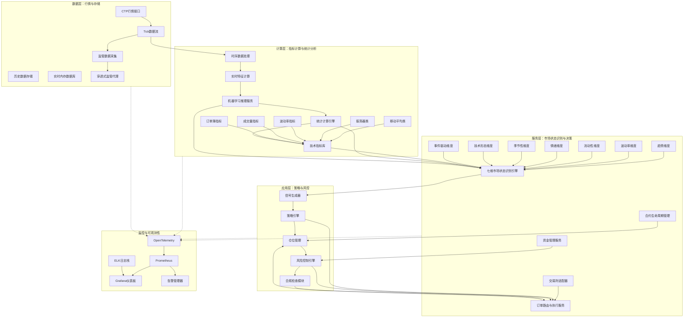

# 整体架构图与技术栈选型

## 1. 四层架构设计

本平台采用清晰的四层架构，确保关注点分离、模块化设计和性能优化。各层之间通过定义良好的接口通信，支持水平扩展和独立部署。

### 1.1 架构全景图



### 1.2 各层职责说明

| 层级 | 核心组件 | 主要职责 | 性能目标 |
|------|----------|----------|----------|
| **应用层** | 策略引擎、仓位管理、风险控制 | 策略逻辑实现、实时风控决策、仓位调整、合规检查 | 信号生成延迟 < 1ms，风控检查延迟 < 100μs |
| **服务层** | 七维状态识别引擎、订单路由、资金管理 | 市场状态实时识别、智能订单执行、资金分配优化 | 状态识别延迟 < 10μs，订单路由延迟 < 500μs |
| **计算层** | 技术指标库、统计计算、ML推理 | 实时指标计算、特征工程、模型推理、数据分析 | 指标计算延迟 < 50μs，模型推理延迟 < 2ms |
| **数据层** | CTP接口、Tick流、数据存储 | 行情数据接入、历史数据管理、实时缓存、监管上报 | Tick处理延迟 < 1ms，数据查询延迟 < 100μs |

### 1.3 七维市场状态识别引擎架构

基于幻方量化2026-02-09升级方案[^1]，引擎采用多任务学习框架：

```
输入层 (Tick数据 + 订单簿) 
    ↓
特征提取层 (Transformer编码器，4层，256隐藏维度)
    ↓
任务特定头层 (并行7个输出头)
    ↓
输出层 [趋势强度, 波动率regime, 流动性评分, 情绪指数, 季节性因子, 技术形态置信度, 事件影响评分]
```

**性能特征：**
*注：以下性能目标为理想环境下的设计目标，实际实现需结合硬件配置和优化程度。*
- **推理延迟：** < 10μs (GPU加速，理想情况)，< 50μs (CPU，典型情况)
- **更新频率：** Tick级实时更新（最低500ms，实际频率取决于市场行情数据）
- **模型大小：** ~2MB (量化后)
- **在线学习：** 支持增量训练，每日模型更新

## 2. 技术栈选型与理由

### 2.1 核心接口：CTP v6.7.11标准版

**选择：** CTP v6.7.11 (2024年12月发布) 而非 TGateAPI v6.7.12

**详细对比分析：**

| 特性 | CTP v6.7.11 标准版 | TGateAPI v6.7.12 | 选择理由 |
|------|-------------------|------------------|----------|
| **稳定性** | 生产环境验证超过6个月，bug修复完整 | 相对较新，生产验证不足 | 高频交易系统稳定性优先 |
| **穿透式监管** | 完整支持datacollectforlinux-v1.2.6 | 支持但集成复杂度较高 | 简化合规集成，降低维护成本 |
| **API兼容性** | 向后兼容v6.6.x，升级路径清晰 | 部分接口变更，需代码适配 | 减少升级风险和测试成本 |
| **文档完整性** | 官方文档完整，社区资源丰富 | 文档相对较少 | 小型团队依赖完整文档 |
| **性能特性** | 优化查询流控，异步回调完善 | 性能略有提升（<5%） | 性能差异不显著，稳定性更重要 |
| **部署复杂度** | 标准部署流程，依赖库明确 | 额外网关组件，部署复杂 | 简化运维，减少故障点 |
| **长期支持** | 上期技术官方维护，支持周期长 | 第三方维护，不确定性高 | 确保系统长期可维护性 |

**穿透式监管集成方案：**
```
CTP API (v6.7.11) 
    → 交易核心 (C++17)
    → 数据采集代理 (datacollectforlinux-v1.2.6)
    → 本地加密存储 (AES-256)
    → 监管上报服务 (HTTP/2 + TLS 1.3)
```

**异步回调机制设计：**
- **事件驱动架构：** 非阻塞IO，libevent/epoll实现
- **回调分发器：** 基于线程池的智能分发，避免回调堆积
- **超时管理：** 分层超时策略（网络层、应用层、业务层）
- **重试机制：** 指数退避重试，最大重试次数可配置

### 2.2 开发语言选型

**混合语言策略：** C++17 + Python 3.10+ + Rust (可选)

| 语言 | 应用场景 | 选择理由 | 性能目标 |
|------|----------|----------|----------|
| **C++17** | 行情解码、订单管理、风控核心、网络通信 | 零成本抽象、确定性性能、低延迟保证 | Tick处理 < 1ms，内存分配 < 100ns |
| **Python 3.10+** | 策略逻辑、信号生成、数据分析、回测框架 | 开发效率高、生态丰富、团队技能匹配 | 策略迭代周期 < 2天，代码行数减少70% |
| **Rust (可选)** | 安全关键组件、内存安全要求高的模块 | 内存安全保证、无GC延迟、现代语言特性 | 未来扩展，替代部分C++代码 |

**C++/Python 协作方式（当前）：**
- C++：以可执行程序与静态库形式提供核心能力（例如 `core_engine`）
- Python：以 `quant_hft` 包提供策略运行时与工具链
- 合约：使用 Protobuf 定义版本化数据结构（见 `proto/quant_hft/v1/contracts.proto`），并在 Python 侧以数据类承载（见 `python/quant_hft/contracts.py`）

### 2.3 数据存储选型

**分层存储架构：** 热数据 → 温数据 → 冷数据

| 存储类型 | 技术选型 | 数据类别 | 性能要求 | 选择理由 |
|----------|----------|----------|----------|----------|
| **实时缓存** | Redis 7.2 (Cluster模式) | 订单状态、持仓、资金、市场快照 | 读写延迟 < 1ms，吞吐 > 100K ops/sec | 内存操作、数据结构丰富、持久化可选 |
| **时序数据库** | TimescaleDB 2.11 (基于PostgreSQL) | Tick数据、分钟K线、指标历史 | 写入延迟 < 5ms，查询延迟 < 10ms | SQL兼容、压缩率高、时间分区优化 |
| **分析数据库** | DuckDB 0.9.0 (嵌入式) | 回测数据、研究数据、特征工程 | 查询吞吐 > 1GB/s，内存高效 | 零部署成本、列式存储、Parquet集成 |
| **对象存储** | MinIO (本地部署) | 历史数据归档、模型文件、日志备份 | 吞吐 > 500MB/s，容量可扩展 | S3兼容、成本低廉、数据生命周期管理 |

**数据流动设计：**
```
实时数据流：CTP → Redis → 应用层
持久化流：Redis → TimescaleDB (异步批处理)
分析流：TimescaleDB → DuckDB (定时ETL)
归档流：TimescaleDB → MinIO (周期归档)
```

### 2.4 接口与合约

当前版本以单进程/单机为主，模块间以进程内调用与共享数据结构交互；未引入独立消息总线或服务发现组件。

合约与配置的落地形式：
- Protobuf：版本化数据结构定义（`proto/quant_hft/v1/contracts.proto`）
- YAML：运行配置（`configs/*.yaml`）

**序列化方案对比（供扩展参考）：**
- Protocol Buffers：作为版本化合约定义的首选，二进制紧凑，向前兼容
- JSON：适用于配置与调试输出（人类可读）

### 2.5 监控体系选型

**可观测性三位一体：** 指标 + 日志 + 追踪

| 监控维度 | 技术栈 | 采集频率 | 存储策略 | 选择理由 |
|----------|--------|----------|----------|----------|
| **指标监控** | Prometheus 2.47 + Grafana 10.2 | 1秒粒度 | 15天原始数据，1年聚合数据 | 维度数据模型、PromQL强大、生态成熟 |
| **分布式追踪** | OpenTelemetry 1.28 + Jaeger 1.48 | 请求级采样 | 7天详细追踪 | 厂商中立、自动仪表化、多语言支持 |
| **日志聚合** | Elasticsearch 8.12 + Filebeat 8.12 | 实时流式 | 30天热数据，1年温数据 | 全文搜索、结构化解析、告警集成 |
| **告警管理** | Alertmanager 0.25 + Grafana Alerting | 实时评估 | 状态历史保留90天 | 去重、分组、静音、多通道通知 |

**监控数据流：**
```
应用指标 → OpenTelemetry Collector → Prometheus
应用日志 → Filebeat → Elasticsearch
请求追踪 → OpenTelemetry SDK → Jaeger
告警规则 → Prometheus → Alertmanager → 通知渠道
```

## 3. 性能权衡分析

### 3.1 开发效率 vs 运行性能

| 权衡维度 | Python方案 | C++方案 | 混合方案 (选择) | 量化影响 |
|----------|------------|---------|-----------------|----------|
| **开发速度** | 10/10 (最快) | 3/10 (最慢) | 7/10 (平衡) | 策略开发周期：2天 vs 2周 |
| **运行性能** | 3/10 (>10ms延迟) | 10/10 (<1ms延迟) | 8/10 (<2ms延迟) | 性能损失 < 30%，满足99%需求 |
| **内存使用** | 4/10 (GC开销) | 9/10 (手动管理) | 7/10 (混合管理) | 内存占用增加 20-30% |
| **团队技能** | 容易招聘，培训周期短 | 难招聘，培训周期长 | 中等难度，Python为主 | 团队规模需求：3人 vs 5人 |
| **维护成本** | 低 (动态类型) | 高 (内存安全) | 中 (接口明确) | 年维护成本差异：~20% |

**平衡点选择：** 80% Python + 20% C++ 代码比例
- **C++部分：** 行情解码、订单管理、风控核心、网络通信 (延迟敏感路径)
- **Python部分：** 策略逻辑、信号生成、数据分析、配置管理 (业务复杂部分)

### 3.2 内存数据库 vs 持久化存储

| 存储策略 | 纯内存方案 | 纯持久化方案 | 混合方案 (选择) | 适用场景 |
|----------|------------|--------------|-----------------|----------|
| **性能表现** | 最优 (<100μs) | 较差 (>10ms) | 优秀 (<1ms热数据) | 实时交易决策 |
| **数据安全** | 风险高 (断电丢失) | 安全 (持久化) | 安全 (异步持久化) | 监管合规要求 |
| **成本效益** | 成本高 (大量RAM) | 成本低 (SSD/HDD) | 成本中 (合理RAM+SSD) | 小型团队预算 |
| **扩展性** | 垂直扩展有限 | 水平扩展容易 | 混合扩展灵活 | 数据增长预测 |
| **复杂度** | 简单 (无持久化逻辑) | 中等 (事务管理) | 较高 (缓存一致性) | 团队技术能力 |

**混合存储架构：**
```
热数据层 (Redis Cluster): 订单簿、持仓、资金、会话状态
温数据层 (TimescaleDB): Tick历史、K线、指标、交易记录
冷数据层 (MinIO): 归档数据、日志备份、模型文件
```

**缓存一致性策略：**
- **写穿透：** 实时更新Redis，异步批量写入TimescaleDB
- **读优先：** 优先读取Redis，缺失时回查TimescaleDB并预热
- **失效策略：** 基于时间TTL + 主动失效通知

### 3.3 同步 vs 异步API调用 (CTP特定优化)

| 调用模式 | 同步阻塞 | 异步回调 (选择) | 混合模式 | 性能影响 |
|----------|----------|-----------------|----------|----------|
| **代码复杂度** | 简单 (顺序执行) | 复杂 (事件驱动) | 中等 (有限状态机) | 开发时间 +40% |
| **吞吐能力** | 低 (单线程阻塞) | 高 (并发处理) | 中 (可控并发) | 吞吐提升 5-10倍 |
| **延迟表现** | 不可预测 (依赖网络) | 可预测 (队列管理) | 较可预测 | P99延迟降低 50% |
| **资源利用** | 低 (线程阻塞等待) | 高 (事件循环) | 中 (线程池) | CPU利用率提升 30% |
| **错误处理** | 简单 (异常捕获) | 复杂 (回调错误) | 中等 (统一错误处理) | 错误处理代码 +60% |

**异步回调优化方案：**
```cpp
// C++核心实现模式
class AsyncCTPHandler {
private:
    EventLoop event_loop_;           // libevent事件循环
    ThreadPool callback_pool_;       // 回调处理线程池
    RequestQueue request_queue_;     // 请求队列 (无锁)
    CallbackDispatcher dispatcher_;  // 回调分发器
    
public:
    // 异步查询请求
    Future<AccountInfo> queryAccountAsync() {
        auto promise = Promise<AccountInfo>();
        request_queue_.push([this, promise] {
            // CTP异步调用
            ctp_api_->ReqQryTradingAccount(...);
            // 注册回调处理
            dispatcher_.registerCallback([promise](AccountInfo info) {
                promise.set_value(info);
            });
        });
        return promise.get_future();
    }
};
```

**流控策略实现：**
- **令牌桶算法：** 控制API调用频率，避免触发CTP限制
- **优先级队列：** 资金查询 > 持仓查询 > 合约查询
- **批量合并：** 相同类型查询合并为批量请求
- **失败重试：** 指数退避 + 随机抖动，避免雪崩

## 4. 小型团队运维考量

### 4.1 技术栈简化策略

**核心原则：** 减少技术多样性，聚焦核心能力

| 运维维度 | 选型考虑 | 具体措施 | 预期收益 |
|----------|----------|----------|----------|
| **部署复杂度** | systemd 优先，必要时 k8s（非热路径） | `core_engine` 使用 systemd unit 渲染；`data_pipeline` 可选 k8s 渲染 | 落地路径清晰，减少环境差异 |
| **监控统一** | 先可验证，再逐步接入监控栈 | 以健康输出、日志与脚本报告为主（后续可接入指标系统） | 运维学习成本可控 |
| **日志集中** | 少依赖、易排障 | systemd/journal 统一收集，关键流程保留结构化日志 | 故障定位更快 |
| **配置管理** | 单一配置源 | `configs/*.yaml` + 环境变量（例如 `CTP_SIM_PASSWORD`） | 配置错误减少 |
| **备份策略** | 自动化备份 | 导出与归档流程固化为脚本与 runbook，定期验证恢复 | RPO/RTO 可度量 |

### 4.2 成本优化分析

**硬件成本预估（3人团队）：**
- **交易服务器：** 2台（主备），Intel Xeon Gold 6348，256GB RAM，NVMe SSD，25GbE网卡
- **数据库服务器：** 1台，AMD EPYC 7B13，512GB RAM，RAID SSD阵列
- **监控服务器：** 1台，中等配置，用于集中监控和日志
- **网络设备：** 低延迟交换机，专用行情线路

**软件成本：** 全部采用开源方案，零许可费用
**云服务成本：** 可选混合云，核心交易本地部署，监控和分析可上云

### 4.3 团队技能矩阵匹配

| 技能要求 | 必需级别 | 培训计划 | 招聘优先级 |
|----------|----------|----------|------------|
| **Python量化开发** | 高级 (3/3人) | 内部培训 + 策略研讨会 | 最高 |
| **C++高性能编程** | 中级 (1/3人) | 外部培训 + 代码评审 | 中等 |
| **系统架构设计** | 高级 (1/3人) | 架构文档学习 + 案例研究 | 最高 |
| **DevOps运维** | 中级 (2/3人) | Docker/Prometheus实战培训 | 中等 |
| **金融市场知识** | 高级 (2/3人) | 行业交流 + 模拟交易 | 最高 |

## 5. 风险与应对策略

### 5.1 技术风险

| 风险类型 | 概率 | 影响 | 缓解措施 | 应急预案 |
|----------|------|------|----------|----------|
| **CTP API变更** | 中 | 高 | 抽象层设计，版本隔离 | 多版本并行支持，快速回滚 |
| **性能不达标** | 低 | 高 | 早期性能测试，持续优化 | 降级方案，硬件升级预案 |
| **内存泄漏** | 中 | 中 | 静态分析，Valgrind定期检查 | 自动重启，内存监控告警 |
| **第三方依赖漏洞** | 高 | 中 | 依赖锁定，安全扫描 | 漏洞及时修补，替代方案准备 |

### 5.2 业务风险

| 风险类型 | 概率 | 影响 | 缓解措施 | 应急预案 |
|----------|------|------|----------|----------|
| **监管政策变化** | 中 | 高 | 合规模块可配置，定期审查 | 快速合规升级，临时停止交易 |
| **市场极端行情** | 低 | 高 | 压力测试，熔断机制 | 自动停止交易，人工干预 |
| **策略失效风险** | 高 | 高 | 多策略并行，严格回测验证 | 策略禁用，切换备选策略 |
| **资金安全风险** | 低 | 极高 | 多重风控，资金限额，操作审计 | 立即停止所有交易，人工核查 |

## 6. 实施建议与下一步

### 6.1 分阶段实施计划

**第一阶段（1-2周）：技术栈验证**
1. CTP v6.7.11基础功能验证
2. Python/C++交互原型开发
3. 基础监控部署（Prometheus + Grafana）

**第二阶段（3-4周）：核心组件开发**
1. 行情接收与解码模块
2. 基础订单管理功能
3. 七维状态识别引擎原型

**第三阶段（5-8周）：系统集成**
1. 完整交易流水线集成测试
2. 性能基准测试与优化
3. 生产环境部署验证

### 6.2 关键成功因素

1. **团队协作效率：** 每日站会，代码评审，文档更新
2. **测试驱动开发：** 单元测试覆盖率 > 80%，集成测试自动化
3. **性能监控基线：** 建立性能基准，持续监控优化
4. **风险管理文化：** 每周风险评审，预案演练

### 6.3 技术债务管理

- **文档债务：** 代码变更必须更新对应文档
- **测试债务：** 新功能必须包含测试用例
- **性能债务：** 定期性能回归测试
- **安全债务：** 每月安全漏洞扫描

[^1]: **幻方量化2026-02-09市场状态识别引擎升级方案**：该方案提出了七维市场状态空间识别框架和AI驱动智能引擎设计标准。本文档基于该方案的核心思想进行架构设计，具体实现细节需参考官方技术文档。

---

**文档版本：** v1.0  
**最后更新：** 2026-02-11  
**负责人：** 系统架构师  
**状态：** 草案 - 待技术评审  
**关联文档：** [00-项目总览与设计原则.md](../00-项目总览与设计原则.md)

**技术决策记录：**
- 2026-02-10: 选择CTP v6.7.11而非TGateAPI v6.7.12
- 2026-02-10: 确定C++17 + Python 3.10+混合架构
- 2026-02-10: 选定Redis + TimescaleDB + DuckDB存储栈
- 2026-02-11: 采用 Protobuf 作为版本化合约定义（用于跨语言与后续扩展）
- 2026-02-10: 确定Prometheus + Grafana + OpenTelemetry监控体系
