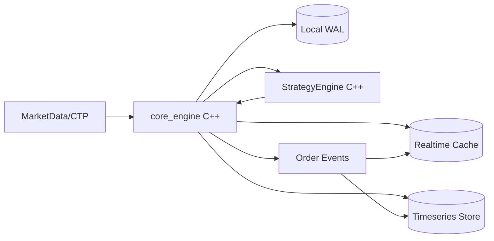
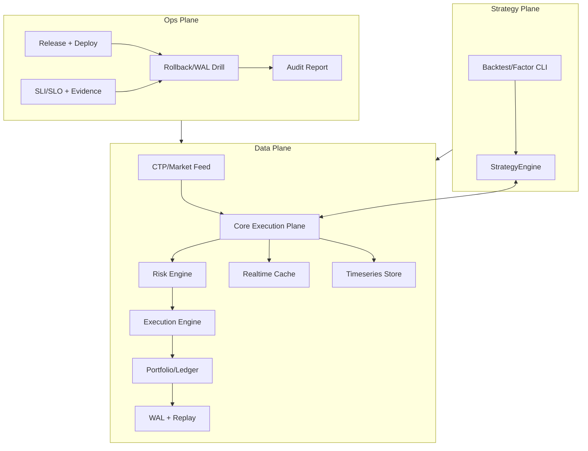

# 整体架构图与技术栈选型

## 对齐信息

- 对齐基线：main@f1f98c884be1538c06acff265f2904745175be96
- 实现状态：已落地
- 证据路径：`src/apps/core_engine_main.cpp`、`src/strategy/strategy_engine.cpp`、`include/quant_hft/`、`.github/workflows/ci.yml`
- 最后更新：2026-02-17

## 文档目标

定义当前纯 C++ 量化平台的整体架构与选型依据，保证“文档口径 = 仓库事实”。

## 1. 当前架构（As-Is）

已落地特征：
- 交易主链路全部在 `core_engine` 进程内执行。
- 策略由 `ILiveStrategy + StrategyEngine` 统一调度。
- 存储支持 in-memory 与 external 模式。
- 运维证据链由 C++ CLI 与 Shell 入口组成。

## 2. 目标态架构（仓库可演进）

## 3. 技术栈选型

| 领域 | 当前选型（已落地） | 选型理由 |
|---|---|---|
| 交易核心 | C++17 + CMake | 延迟可控、性能可预测、测试链完整 |
| 策略运行时 | `ILiveStrategy` + `StrategyEngine` | 统一生命周期管理，减少跨进程复杂度 |
| 合约定义 | Protobuf + `contracts/types.h` | 契约可追溯、版本演进清晰 |
| 缓存与桥接 | Redis 协议 + `IRealtimeCache` | 部署简单、可观测性可补齐 |
| 时序存储 | Timescale 抽象接口 | 与事件存储语义匹配 |
| CI/CD | GitHub Actions + Shell 门禁 | 构建、纯度、验收链一体化 |

## 4. 非功能目标

- 可恢复性：故障后可通过 runbook 与 CLI 恢复。
- 可回溯性：关键链路都有证据文件。
- 可演进性：接口变更可版本化与回归验证。
- 可观测性：关键流程具备健康指标与告警输出。
