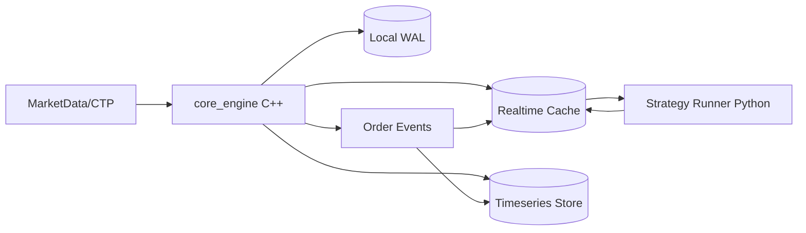
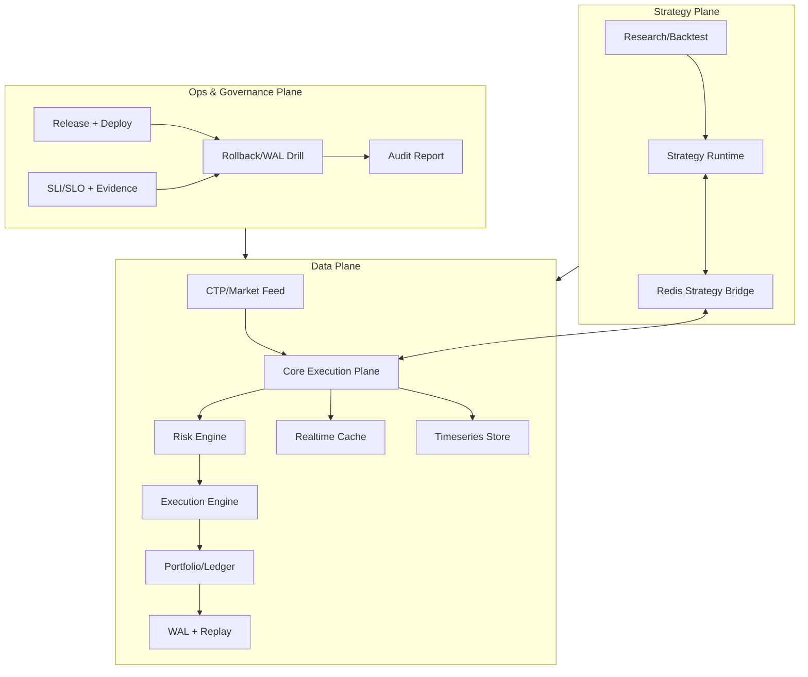

# 整体架构图与技术栈选型

## 对齐信息

- 对齐基线：main@17f0f8c957a4c0f95ebb054725f04b21e0e6861b
- 实现状态：已落地（仓库范围）
- 证据路径：`src/apps/core_engine_main.cpp`、`include/quant_hft/`、`python/quant_hft/`、`scripts/`、`.github/workflows/ci.yml`
- 最后更新：2026-02-11

## 文档目标

本文件用于定义量化平台的目标态整体架构与技术选型决策。  
说明规则：
1. `当前已落地` 仅描述仓库中可运行能力。  
2. `目标态` 描述后续演进方向，不代表已上线。  
3. 任何目标态能力进入实现前，必须先在 `develop/00-未完成能力补齐路线图.md` 建立对应 Epic 与验收标准。

## 1. 当前已落地架构（As-Is）

已落地特征：
- 交易主链路：`core_engine` 承担行情接入、状态计算、风险校验、下单与回报处理。
- 策略桥：Python `strategy_runner` 通过 Redis bridge 与 C++ 交互。
- 存储层：提供 in-memory 与 external 适配模式（Redis/Timescale 接口抽象）。
- 合规与恢复：WAL 写入与回放工具可运行。
- 发布与运维：release package + 验包 + 审计摘要/索引校验链路已落地。

## 2. 目标态整体架构（To-Be）

目标态原则：
- 数据面、策略面、运维治理面解耦。
- 热路径与非热路径隔离，避免研究/运维任务干扰交易主链路。
- 所有关键运维流程必须证据化、可脚本校验。

## 3. 技术栈选型

| 领域 | 当前选型（已落地） | 目标态补充（已落地（仓库范围）） | 选型理由 |
|---|---|---|---|
| 交易核心 | C++17 + CMake | 继续沿用 | 延迟敏感路径可控，已有测试基础完善 |
| Python 能力层 | Python 3.12 + pytest/ruff/black/mypy | 继续沿用 | 研究与策略开发效率高，CI 已稳定 |
| 合约定义 | Protobuf + `contracts` 映射 | 继续沿用 | 跨语言契约一致性较好 |
| 缓存与桥接 | Redis hash 协议 | 保持 bridge 协议并扩展可观测字段 | 低复杂度、可运维、便于回放 |
| 时序存储 | Timescale 抽象接口 | 完善生产拓扑与容量策略 | 已有接口，可逐步外部化 |
| 合规恢复 | Local WAL + replay tool | 增加生产级演练频次与自动报告 | 当前路径已可演练 |
| CI/CD | GitHub Actions + bootstrap gate | 增加更细粒度演练 gate | 已形成统一质量门禁 |

明确不采用（当前）：
- 将“系统多 Agent”作为平台运行架构（仅允许文档协作语境）。
- 在未验证收益前引入重型消息总线替代当前 bridge。

## 4. 非功能目标（目标态约束）

- 可恢复性：关键链路故障需具备可验证恢复路径。
- 可回溯性：交易、风险、回滚、恢复都要有证据文件与脚本校验。
- 可演进性：接口变更必须可版本化、可兼容。
- 可观测性：每个关键流程至少有 1 个自动化健康指标与 1 条验收命令。

## 5. 分阶段落地路线（与路线图对齐）

1. P0 文档真实性收敛：对齐“已落地/已落地（仓库范围）”语义。
2. P1 核心闭环增强：研究回测、风控执行能力按 Epic A/B 推进。
3. P2 运维治理闭环：部署回滚、WAL 恢复、审计链路按 Epic C/D 推进。
4. P3 生产级扩展：在 P2 稳定后再推进集群级控制面和容量治理。

## 6. 风险与前置依赖

- 目标态能力过多会导致“文档先行、实现滞后”偏差，必须持续回填状态矩阵。
- 生产级能力依赖外部中间件 SLA 与凭据托管策略。
- 扩展架构前需先冻结核心合约字段，避免多方向并发演进造成断裂。

## 7. 进入实现阶段触发条件

- 有明确代码触点与 owner。
- 有自动化验收命令与失败回滚路径。
- 有对应文档状态更新（`00-实现对齐矩阵与缺口总览` + 专项章节）。
