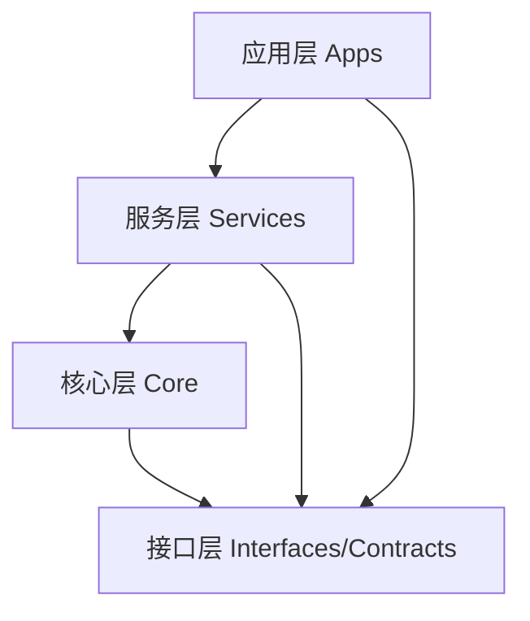

# 核心模块划分与职责

## 对齐信息

- 对齐基线：main@17f0f8c957a4c0f95ebb054725f04b21e0e6861b
- 实现状态：部分落地
- 证据路径：`include/quant_hft/interfaces/`、`src/core/`、`src/services/`、`src/apps/core_engine_main.cpp`、`python/quant_hft/`
- 最后更新：2026-02-11

## 文档目标

本文件定义模块边界、职责和依赖方向，作为后续实现拆分依据。  
说明规则：
- `已落地`：仓库中已有代码与测试可验证。
- `规划中`：目标模块已定义，但尚未进入实现阶段。

## 1. 模块分层

依赖约束：
- 上层可依赖下层，下层不得反向依赖上层。
- 跨层共享对象必须走 `contracts/types.h` 或 `proto` 合约。
- Python 侧只通过明确桥接契约与 C++ 交互，不直接侵入 C++ 内部实现。

## 2. 已落地模块职责

| 模块 | 主要职责 | 关键接口/对象 | 当前状态 | 代码路径 |
|---|---|---|---|---|
| 接口与合约层 | 定义跨模块对象与抽象接口 | `contracts/types.h`、`interfaces/*` | 已落地 | `include/quant_hft/` |
| CTP 接入模块 | 配置加载、连接、查询调度 | `CtpConfigLoader`、`CtpGatewayAdapter`、`QueryScheduler` | 已落地 | `src/core/ctp/` |
| 存储适配模块 | realtime/timeseries 抽象与外部驱动桥接 | `IRealtimeCache`、`ITimeseriesStore`、`StorageClientFactory` | 已落地 | `src/core/storage/` |
| 合规模块 | WAL 写入与回放恢复 | `LocalWalRegulatorySink`、`WalReplayLoader` | 已落地 | `src/core/regulatory/` |
| 策略桥模块 | 策略意图编解码与收件箱轮询 | `StrategyIntentCodec`、`StrategyIntentInbox` | 已落地 | `src/core/common/` |
| 风控服务模块 | 订单前置风险判断 | `BasicRiskEngine` | 已落地 | `src/services/risk/` |
| 订单执行服务模块 | 订单状态迁移与执行模式 | `OrderStateMachine` | 已落地 | `src/services/order/` |
| 市场状态服务模块 | 行情状态聚合与 7D 快照 | `RuleMarketStateEngine` | 已落地 | `src/services/market_state/` |
| 账本服务模块 | 仓位与事件回放一致性 | `InMemoryPortfolioLedger` | 已落地 | `src/services/portfolio/` |
| 应用编排模块 | 串联主链路生命周期 | `core_engine_main` | 已落地 | `src/apps/` |
| Python 策略运行模块 | 策略运行时、回放、bridge runner | `StrategyRuntime`、`StrategyRunner` | 已落地 | `python/quant_hft/` |

## 3. 目标态模块（规划中）

| 模块 | 目标职责 | 触发条件 | 当前状态 |
|---|---|---|---|
| 高级风险规则引擎 | 支持多规则组、可解释决策和策略化配置 | 风险规则模型冻结 + 回放验收基线稳定 | 规划中 |
| 高级执行算法层 | TWAP/VWAP/自适应切片等执行策略 | 订单事件字段与回放模型冻结 | 规划中 |
| 统一观测控制面 | 指标、日志、告警、演练证据统一视图 | 指标命名与SLO口径统一 | 规划中 |
| 集群级部署控制面 | 多环境发布编排、灰度与自动回滚 | 非热路径部署链路稳定、环境托管策略明确 | 规划中 |

## 4. 模块协作关键约束

1. 单一职责：每个模块只能做一类核心决策，避免混合职责。
2. 输入输出显式：每个模块必须定义输入契约与输出副作用。
3. 错误可追踪：任何失败路径都需带可检索字段（trace_id、reason、rule metadata）。
4. 可回放：关键状态迁移必须可由 WAL/事件流重建。

## 5. 模块进入实现阶段验收清单

- 模块接口签名已冻结并有版本策略。
- 有最小单测集合与 1 条端到端演示命令。
- 失败场景有明确回滚方案与证据文件格式。
- `develop/00-实现对齐矩阵与缺口总览.md` 已同步状态。
