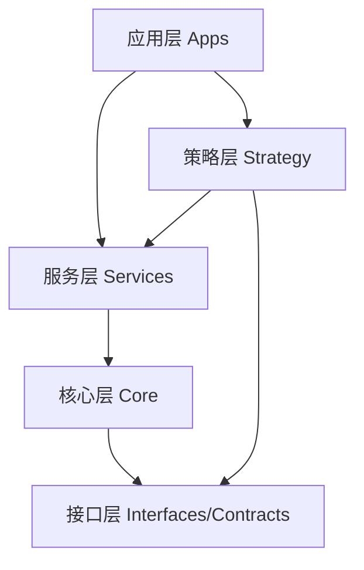

# 核心模块划分与职责

## 对齐信息

- 对齐基线：main@f1f98c884be1538c06acff265f2904745175be96
- 实现状态：已落地
- 证据路径：`include/quant_hft/interfaces/`、`include/quant_hft/strategy/`、`src/core/`、`src/services/`、`src/strategy/`
- 最后更新：2026-02-17

## 文档目标

定义模块边界、职责与依赖方向，作为实现与扩展的统一约束。

## 1. 模块分层

依赖约束：
- 上层可依赖下层；下层禁止反向依赖。
- 跨层共享对象走 `contracts/types.h` 或 proto 合约。
- 策略与交易链路在同一进程内通过接口协作，不走跨语言桥接。

## 2. 已落地模块职责

| 模块 | 主要职责 | 关键接口/对象 | 代码路径 |
|---|---|---|---|
| 接口与合约层 | 定义跨模块对象与抽象 | `contracts/types.h`、`interfaces/*` | `include/quant_hft/` |
| 策略层 | 策略生命周期、注册与调度 | `ILiveStrategy`、`StrategyRegistry`、`StrategyEngine` | `include/quant_hft/strategy/`、`src/strategy/` |
| CTP 接入模块 | 配置加载、连接、查询调度 | `CtpConfigLoader`、`CtpGatewayAdapter`、`QueryScheduler` | `src/core/ctp/` |
| 存储适配模块 | realtime/timeseries 抽象与客户端创建 | `IRealtimeCache`、`ITimeseriesStore`、`StorageClientFactory` | `src/core/storage/` |
| 合规模块 | WAL 写入与回放恢复 | `LocalWalRegulatorySink`、`WalReplayLoader` | `src/core/regulatory/` |
| 风控服务模块 | 订单前置风险判断 | `RiskPolicyEngine` | `src/services/risk/` |
| 订单执行服务模块 | 执行规划与状态迁移 | `ExecutionPlanner`、`OrderStateMachine` | `src/services/order/` |
| 账本服务模块 | 仓位与事件一致性 | `InMemoryPortfolioLedger` | `src/services/portfolio/` |
| 应用编排模块 | 串联主链路生命周期 | `core_engine_main` | `src/apps/` |

## 3. 模块协作关键约束

1. 单一职责：模块只承担一类核心决策。
2. 输入输出显式：副作用必须可追踪。
3. 错误可定位：关键异常包含 trace 与原因字段。
4. 可回放：关键状态迁移可由 WAL 重建。
