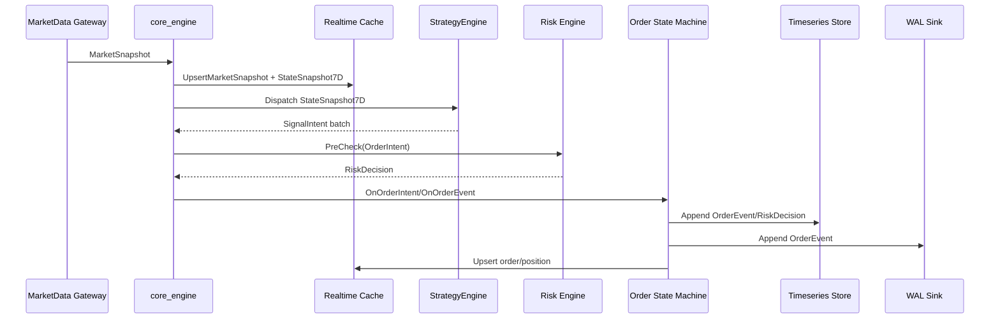

# 关键数据流与接口设计

## 对齐信息

- 对齐基线：main@f1f98c884be1538c06acff265f2904745175be96
- 实现状态：已落地
- 证据路径：`src/apps/core_engine_main.cpp`、`src/strategy/strategy_engine.cpp`、`include/quant_hft/contracts/types.h`、`docs/STRATEGY_BRIDGE_REDIS_PROTOCOL.md`
- 最后更新：2026-02-17

## 文档目标

定义关键数据流、接口契约和失败处理规则，保证回测与实盘链路一致。

## 1. 合约对象总览

| 对象 | 作用 | 关键字段 | 当前状态 |
|---|---|---|---|
| `MarketSnapshot` | 行情快照输入 | `instrument_id`、`last_price`、`ts_ns` | 已落地 |
| `StateSnapshot7D` | 状态引擎输出 | `*_score`、`*_confidence`、`ts_ns` | 已落地 |
| `SignalIntent` | 策略意图 | `instrument_id`、`side`、`offset`、`volume`、`trace_id` | 已落地 |
| `OrderIntent` | 下单意图 | `account_id`、`client_order_id`、`instrument_id` | 已落地 |
| `RiskDecision` | 风控结果 | `allow`、`reason`、`rule_group`、`rule_version` | 已落地 |
| `OrderEvent` | 订单回报 | `status`、`filled_volume`、`reason`、`trace_id` | 已落地 |

## 2. 已落地主链路（As-Is）

已落地约束：
- `trace_id` 作为链路关联主键。
- 订单状态迁移必须通过状态机。
- 合约字段变更必须同步代码、文档与测试。

## 3. 失败处理与幂等策略

- 去重：订单事件通过状态机与事件键去重。
- 重试：外部存储写入由适配层执行重试。
- 回放：WAL 回放需满足错误计数为零才视为成功。
- 补偿：使用 `trace_id` 与最新状态覆盖语义进行修复。
