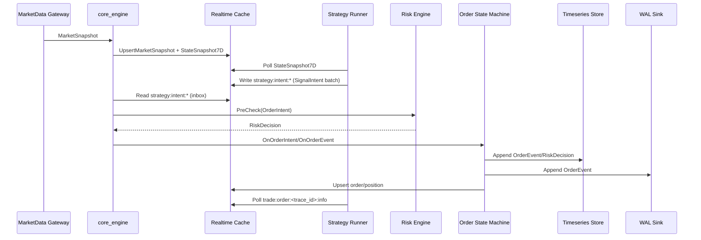

# 关键数据流与接口设计

## 对齐信息

- 对齐基线：main@17f0f8c957a4c0f95ebb054725f04b21e0e6861b
- 实现状态：部分落地
- 证据路径：`src/apps/core_engine_main.cpp`、`src/core/common/strategy_intent_*`、`include/quant_hft/interfaces/`、`python/quant_hft/runtime/strategy_runner.py`、`docs/STRATEGY_BRIDGE_REDIS_PROTOCOL.md`
- 最后更新：2026-02-11

## 文档目标

本文件定义关键数据流、接口契约和失败处理规则。  
说明规则：
- 标注 `已落地` 的链路必须有代码与命令证据。
- 标注 `目标态` 的链路仅用于后续实施设计，不代表当前已上线。

## 1. 合约对象总览

| 对象 | 作用 | 关键字段 | 当前状态 |
|---|---|---|---|
| `MarketSnapshot` | 行情快照输入 | `instrument_id`、`last_price`、`ts_ns` | 已落地 |
| `StateSnapshot7D` | 状态引擎输出 | `*_score`、`*_confidence`、`ts_ns` | 已落地 |
| `SignalIntent` | 策略意图 | `instrument_id`、`side`、`offset`、`volume`、`trace_id` | 已落地 |
| `OrderIntent` | 下单意图 | `account_id`、`client_order_id`、`instrument_id` | 已落地 |
| `RiskDecision` | 风控结果 | `allow`、`reason`、`rule_group`、`rule_version` | 已落地 |
| `OrderEvent` | 订单回报 | `status`、`filled_volume`、`reason`、`trace_id` | 已落地 |
| WAL 记录 | 合规与回放 | `seq`、`kind`、`status`、`trace_id` 等 | 已落地 |

## 2. 已落地主链路（As-Is）

已落地约束：
- `trace_id` 作为跨进程链路关联主键。
- Redis bridge 使用固定 key/schema，见 `docs/STRATEGY_BRIDGE_REDIS_PROTOCOL.md`。
- 订单状态迁移必须通过状态机，防止非法状态跳转。

## 3. 目标态关键数据流（To-Be）

### 3.1 研究到实盘迁移流（规划中）

目标：统一回测输出与实盘输入，减少手工映射。  
规划要求：
- 回测报告输出字段与 `SignalIntent/OrderEvent` 合约保持一致。
- 策略模板升级时不破坏既有运行时接口。

### 3.2 集群级部署与回滚证据流（规划中）

目标：形成“发布包 -> 部署 -> 故障 -> 回滚 -> 证据验收”闭环。  
规划要求：
- 每次演练产出 `env + raw log + summary report`。
- 证据必须可被脚本校验，不依赖人工解释。

### 3.3 可观测事件汇聚流（规划中）

目标：把健康指标、故障注入、恢复结果统一归档并形成最小治理报表。  
规划要求：
- 指标口径统一（延迟、丢失、恢复时间）。
- 报警阈值与验收阈值一致，不允许“双标准”。

## 4. 失败处理与幂等策略

- 去重：订单事件通过状态机和事件键去重，避免重复应用。
- 重试：外部存储写入通过适配层重试策略处理瞬时失败。
- 回放：WAL 回放必须满足 `parse_errors=0` 与 `state_rejected=0` 才可判定成功。
- 补偿：跨进程事件回收优先依赖 `trace_id` 与最新状态覆盖语义。

## 5. 接口演进规则

1. 合约字段扩展优先新增、避免破坏性删除。
2. 新增字段必须提供默认行为与兼容说明。
3. 任何跨语言字段变更必须同步 C++、Python、文档与测试。
4. 在 `develop` 标注“已落地”前，必须给出命令级证据。

## 6. 进入实现阶段触发条件

- 已提供对应 sequence diagram 与失败分支处理。
- 有至少 1 条端到端验证命令（可脚本执行）。
- 文档、测试、实现三者同时更新并通过门禁。
