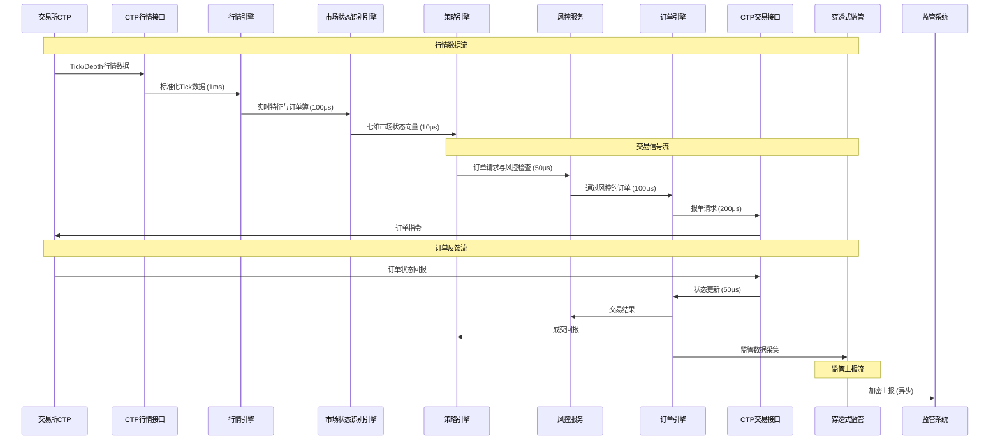
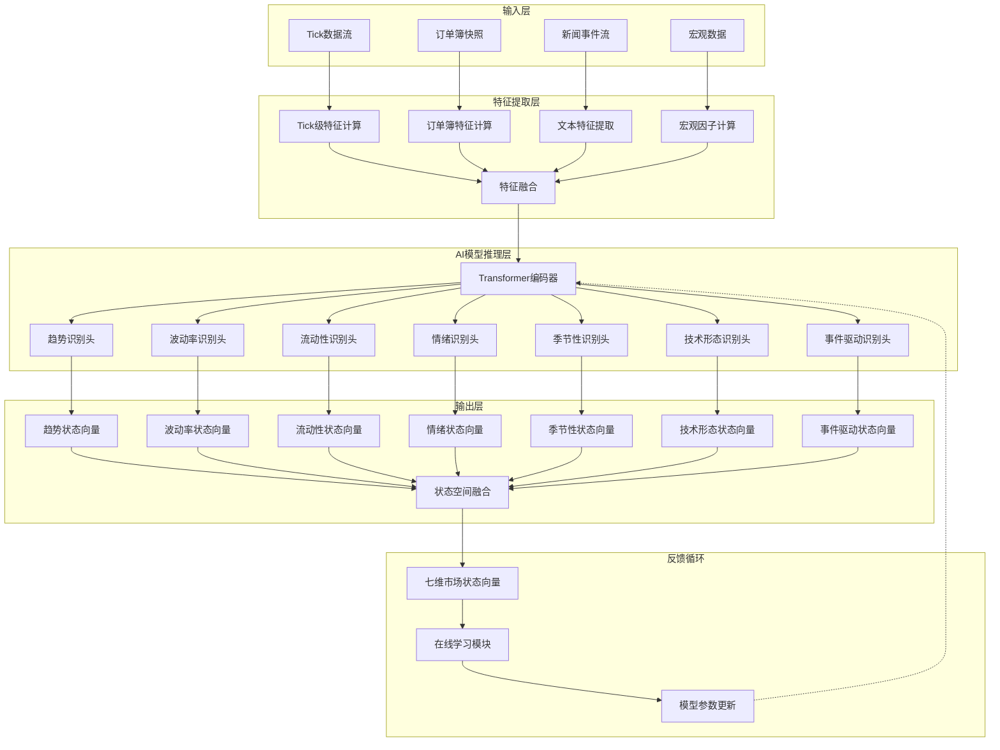
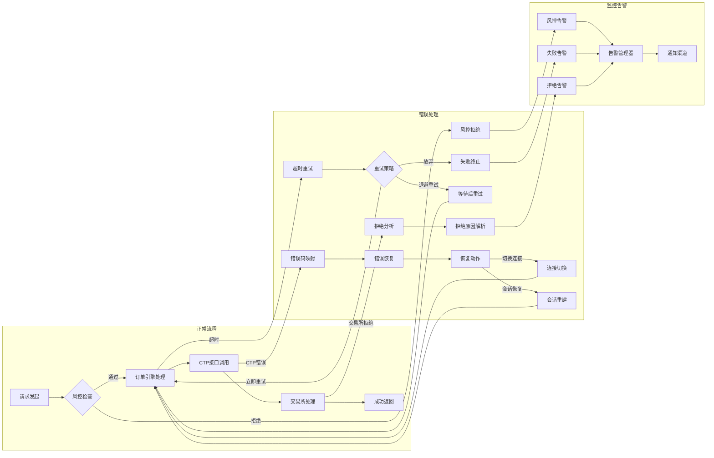

# 关键数据流与接口设计

## 1. 概述

本文档详细描述国内期货商品高频量化交易平台的关键数据流、接口设计和CTP API抽象层。作为系统架构设计部分的第三份文档，重点定义从行情接收到订单执行的完整数据流、核心业务接口、数据格式以及序列化协议。

**设计目标：**
- 明确数据流动路径和各组件交互关系
- 提供具体可实现的接口定义（C++/Python双语言支持）
- 建立统一的CTP API抽象层，隔离底层变化
- 定义标准化的数据格式和序列化协议
- 支持幻方量化七维市场状态识别引擎的高标准要求

**文档结构：**
1. 数据流图 - 使用Mermaid语法展示完整交易流水线
2. 关键接口定义 - 市场状态、订单执行、风控检查等核心接口
3. CTP API抽象层设计 - 统一错误处理、异步回调、流控机制
4. 数据格式定义 - Tick数据、订单、状态等数据结构
5. 序列化协议设计 - Protobuf消息定义和优化方案
6. 性能指标与监控 - 关键路径性能目标和监控点

## 2. 数据流图

### 2.1 完整交易流水线



### 2.2 七维状态识别引擎数据流



### 2.3 错误处理与重试机制



## 3. 关键接口定义

### 3.1 市场状态接口

#### C++接口定义
```cpp
// 七维市场状态提供器 - 核心接口
class MarketStateProvider {
public:
    virtual ~MarketStateProvider() = default;
    
    // 获取当前市场状态
    virtual std::optional<MultiDimensionalMarketState> 
    get_current_state(const std::string& instrument_id) const = 0;
    
    // 获取历史状态序列
    virtual std::vector<MarketStateSnapshot>
    get_state_history(const std::string& instrument_id,
                     const TimeRange& range,
                     Resolution resolution = Resolution::TICK) const = 0;
    
    // 订阅状态更新
    virtual SubscriptionHandle
    subscribe_state(const std::string& instrument_id,
                   StateCallback callback,
                   UpdateFrequency frequency = UpdateFrequency::TICK) = 0;
    
    // 取消订阅
    virtual void unsubscribe(SubscriptionHandle handle) = 0;
    
    // 批量查询
    virtual std::unordered_map<std::string, MultiDimensionalMarketState>
    batch_get_states(const std::vector<std::string>& instrument_ids) const = 0;
    
    // 状态预测
    virtual MarketStateForecast
    forecast_state(const std::string& instrument_id,
                  TimeDelta lookahead,
                  ConfidenceLevel confidence = ConfidenceLevel::MEDIUM) const = 0;
    
    // 获取原始特征（用于调试和监控）
    virtual std::optional<FeatureVector>
    get_raw_features(const std::string& instrument_id) const = 0;
    
    // 引擎状态查询
    virtual EngineStatus get_engine_status() const = 0;
    
    // 模型信息
    virtual ModelInfo get_model_info() const = 0;
};

// 七维市场状态数据结构
struct MultiDimensionalMarketState {
    // 趋势维度
    struct TrendDimension {
        double direction;           // 趋势方向: -1.0(下跌) ~ 1.0(上涨)
        double strength;            // 趋势强度: 0.0(无趋势) ~ 1.0(强趋势)
        double confidence;          // 置信度: 0.0 ~ 1.0
        std::map<std::string, double> sub_trends;  // 子时间尺度趋势
        TimePoint trend_start;      // 趋势开始时间
        int32_t trend_duration_seconds; // 趋势持续时间(秒)
    } trend;
    
    // 波动率维度
    struct VolatilityDimension {
        double level;               // 波动率水平: 0.0(极低) ~ 1.0(极高)
        VolatilityRegime regime;    // 波动率状态
        double regime_confidence;   // 状态置信度
        double garch_sigma;         // GARCH模型sigma估计
        double realized_volatility; // 已实现波动率
        double implied_volatility;  // 隐含波动率(期权)
    } volatility;
    
    // 流动性维度
    struct LiquidityDimension {
        double score;               // 流动性综合评分: 0.0(极差) ~ 1.0(极好)
        double bid_ask_spread;      // 买卖价差(基点)
        double order_book_depth;    // 订单簿深度评分
        double trade_activity;      // 成交活跃度
        double large_order_impact;  // 大单冲击成本
        double immediacy_cost;      // 即时交易成本
        std::vector<double> depth_profile; // 深度剖面
    } liquidity;
    
    // 情绪维度
    struct SentimentDimension {
        double market_sentiment;    // 市场情绪: -1.0(悲观) ~ 1.0(乐观)
        double news_sentiment;      // 新闻情绪得分
        double social_sentiment;    // 社交媒体情绪
        double fear_greed_index;    // 恐惧贪婪指数
        double positioning_sentiment; // 持仓情绪
        std::vector<NewsEvent> recent_news; // 近期新闻事件
    } sentiment;
    
    // 季节性维度
    struct SeasonalityDimension {
        double intraday_factor;     // 日内因子
        double day_of_week_factor;  // 周内因子
        double seasonal_factor;     // 季节性因子
        double time_of_day_effect;  // 日内时段效应
        std::map<std::string, double> pattern_strengths; // 特定模式强度
        SeasonalityPattern dominant_pattern; // 主导模式
    } seasonality;
    
    // 技术形态维度
    struct TechnicalPatternDimension {
        std::map<std::string, double> pattern_confidences; // 形态置信度
        std::string dominant_pattern;    // 主导形态
        double pattern_strength;         // 形态强度
        TimePoint pattern_start;         // 形态开始时间
        TimePoint expected_end;          // 预期结束时间
        double target_price;             // 目标价格
        double stop_loss_price;          // 止损价格
        std::vector<PatternComponent> components; // 形态构成
    } technical_pattern;
    
    // 事件驱动维度
    struct EventDrivenDimension {
        double overall_impact;      // 综合影响: -1.0(负面) ~ 1.0(正面)
        std::map<std::string, double> specific_impacts; // 具体事件影响
        std::vector<MarketEvent> active_events; // 活跃事件列表
        TimePoint next_scheduled_event; // 下一个计划事件
        double event_volatility_adjustment; // 事件波动率调整
        double event_liquidity_adjustment;  // 事件流动性调整
    } event_driven;
    
    // 元数据
    TimePoint timestamp;
    std::string instrument_id;
    std::string exchange_id;
    double overall_confidence;      // 整体状态置信度
    StateQuality quality;           // 数据质量标记
    uint32_t version;               // 状态版本号
    
    // 序列化支持
    std::vector<uint8_t> serialize() const;
    static MultiDimensionalMarketState deserialize(const std::vector<uint8_t>& data);
};
```

#### Python接口定义
```python
from typing import Optional, Dict, List, Union
from dataclasses import dataclass
from datetime import datetime
from enum import Enum

class MarketStateProvider:
    """Python市场状态接口"""
    
    def get_current_state(self, instrument_id: str) -> Optional['MultiDimensionalMarketState']:
        """获取当前市场状态"""
        pass
    
    def get_state_history(self, instrument_id: str, 
                         start_time: datetime,
                         end_time: datetime,
                         resolution: str = 'tick') -> List['MarketStateSnapshot']:
        """获取历史状态序列"""
        pass
    
    def subscribe_state(self, instrument_id: str,
                       callback: callable,
                       frequency: str = 'tick') -> str:
        """订阅状态更新，返回订阅ID"""
        pass
    
    def unsubscribe(self, subscription_id: str):
        """取消订阅"""
        pass
    
    def batch_get_states(self, instrument_ids: List[str]) -> Dict[str, 'MultiDimensionalMarketState']:
        """批量查询状态"""
        pass
    
    def forecast_state(self, instrument_id: str,
                      lookahead_seconds: int,
                      confidence_level: str = 'medium') -> 'MarketStateForecast':
        """状态预测"""
        pass
    
    def get_engine_status(self) -> Dict:
        """获取引擎状态"""
        pass

@dataclass
class TrendDimension:
    """趋势维度"""
    direction: float  # -1.0 to 1.0
    strength: float   # 0.0 to 1.0
    confidence: float # 0.0 to 1.0
    sub_trends: Dict[str, float]
    trend_start: datetime
    trend_duration_seconds: int

@dataclass
class MultiDimensionalMarketState:
    """七维市场状态（Python版本）"""
    # 各维度数据
    trend: TrendDimension
    volatility: 'VolatilityDimension'
    liquidity: 'LiquidityDimension'
    sentiment: 'SentimentDimension'
    seasonality: 'SeasonalityDimension'
    technical_pattern: 'TechnicalPatternDimension'
    event_driven: 'EventDrivenDimension'
    
    # 元数据
    timestamp: datetime
    instrument_id: str
    exchange_id: str
    overall_confidence: float
    quality: str
    version: int
    
    def to_dict(self) -> Dict:
        """转换为字典"""
        pass
    
    @classmethod
    def from_dict(cls, data: Dict) -> 'MultiDimensionalMarketState':
        """从字典创建"""
        pass
```

### 3.2 订单执行接口

#### C++接口定义
```cpp
// 订单执行器 - 核心接口
class OrderExecutor {
public:
    virtual ~OrderExecutor() = default;
    
    // 提交订单（异步）
    virtual Future<OrderResponse> 
    submit_order(const OrderRequest& request) = 0;
    
    // 撤单（异步）
    virtual Future<CancelResponse>
    cancel_order(const std::string& order_id,
                const CancelRequest& request = {}) = 0;
    
    // 批量撤单
    virtual Future<BatchCancelResponse>
    cancel_orders(const std::vector<std::string>& order_ids,
                 const std::string& reason = "") = 0;
    
    // 查询订单状态
    virtual std::optional<OrderStatus>
    get_order_status(const std::string& order_id) const = 0;
    
    // 查询活跃订单
    virtual std::vector<OrderStatus>
    get_active_orders(const OrderFilter& filter = {}) const = 0;
    
    // 查询成交记录
    virtual std::vector<TradeRecord>
    get_trade_records(const TradeFilter& filter = {}) const = 0;
    
    // 订阅订单事件
    virtual SubscriptionHandle
    subscribe_order_events(OrderEventCallback callback) = 0;
    
    // 订阅成交事件
    virtual SubscriptionHandle
    subscribe_trade_events(TradeEventCallback callback) = 0;
    
    // 获取执行统计
    virtual ExecutionStatistics
    get_execution_stats(const TimeRange& range = {}) const = 0;
    
    // 紧急控制
    virtual void emergency_stop() = 0;
    virtual void pause_new_orders() = 0;
    virtual void resume_new_orders() = 0;
    
    // 连接状态
    virtual ConnectionStatus get_connection_status() const = 0;
    
    // 同步状态
    virtual Future<void> sync_with_exchange() = 0;
};

// 订单请求数据结构
struct OrderRequest {
    std::string order_id;           // 订单ID（系统生成）
    std::string client_order_id;    // 客户端订单ID
    std::string instrument_id;      // 合约代码
    std::string exchange_id;        // 交易所代码
    
    OrderType order_type;           // 订单类型：限价、市价等
    Direction direction;            // 买卖方向
    OffsetFlag offset_flag;         // 开平标志
    HedgeFlag hedge_flag;           // 投机套保标志
    
    double price;                   // 价格（市价单为0）
    int32_t volume;                 // 数量
    TimeInForce time_in_force;      // 订单有效时间
    
    std::string strategy_id;        // 策略ID
    std::string account_id;         // 账户ID
    std::string portfolio_id;       // 组合ID
    
    // 高级订单参数
    double stop_price;              // 止损价格
    double trailing_stop_distance;  // 追踪止损距离
    bool iceberg_order;             // 冰山订单标志
    int32_t display_volume;         // 显示数量（冰山订单）
    
    // 算法订单参数
    AlgoOrderParams algo_params;    // 算法订单参数
    std::map<std::string, std::string> custom_params; // 自定义参数
    
    TimePoint timestamp;            // 请求时间戳
    uint32_t version;               // 请求版本
    
    // 验证方法
    bool validate() const;
    std::vector<ValidationError> get_validation_errors() const;
};

// 订单响应数据结构
struct OrderResponse {
    std::string order_id;           // 订单ID
    std::string client_order_id;    // 客户端订单ID
    std::string exchange_order_id;  // 交易所订单ID
    
    OrderStatus status;             // 订单状态
    OrderSubmitStatus submit_status; // 报单状态
    
    double price;                   // 成交均价
    int32_t filled_volume;          // 已成交数量
    int32_t remaining_volume;       // 剩余数量
    int32_t cancelled_volume;       // 已撤单数量
    
    std::vector<TradeReport> trades; // 成交明细
    std::vector<OrderEvent> events;  // 订单事件
    
    TimePoint submit_time;          // 报单时间
    TimePoint update_time;          // 最后更新时间
    
    ErrorCode error_code;           // 错误码
    std::string error_msg;          // 错误信息
    
    // 性能指标
    microseconds processing_latency;   // 处理延迟
    microseconds exchange_latency;     // 交易所延迟
    
    bool is_success() const { return error_code == ErrorCode::SUCCESS; }
};
```

#### Python接口定义
```python
from typing import Optional, List, Dict, Any
from dataclasses import dataclass
from datetime import datetime
from enum import Enum
import asyncio

class OrderExecutor:
    """Python订单执行接口"""
    
    async def submit_order(self, request: 'OrderRequest') -> 'OrderResponse':
        """提交订单（异步）"""
        pass
    
    async def cancel_order(self, order_id: str, **kwargs) -> 'CancelResponse':
        """撤单（异步）"""
        pass
    
    async def cancel_orders(self, order_ids: List[str], reason: str = "") -> 'BatchCancelResponse':
        """批量撤单"""
        pass
    
    def get_order_status(self, order_id: str) -> Optional['OrderStatus']:
        """查询订单状态"""
        pass
    
    def get_active_orders(self, **filters) -> List['OrderStatus']:
        """查询活跃订单"""
        pass
    
    def get_trade_records(self, **filters) -> List['TradeRecord']:
        """查询成交记录"""
        pass
    
    def subscribe_order_events(self, callback: callable) -> str:
        """订阅订单事件"""
        pass
    
    def subscribe_trade_events(self, callback: callable) -> str:
        """订阅成交事件"""
        pass
    
    def get_execution_stats(self, start_time: Optional[datetime] = None,
                           end_time: Optional[datetime] = None) -> Dict:
        """获取执行统计"""
        pass
    
    def emergency_stop(self):
        """紧急停止"""
        pass
    
    def get_connection_status(self) -> Dict:
        """获取连接状态"""
        pass

@dataclass
class OrderRequest:
    """订单请求"""
    instrument_id: str
    exchange_id: str
    order_type: str  # 'LIMIT', 'MARKET', etc.
    direction: str   # 'BUY', 'SELL'
    offset_flag: str = 'OPEN'  # 'OPEN', 'CLOSE', 'CLOSETODAY'
    hedge_flag: str = 'SPECULATION'  # 'SPECULATION', 'ARBITRAGE', 'HEDGE'
    
    price: float = 0.0  # 0 for market orders
    volume: int = 1
    time_in_force: str = 'DAY'  # 'DAY', 'GTC', 'IOC', 'FOK'
    
    strategy_id: Optional[str] = None
    account_id: Optional[str] = None
    portfolio_id: Optional[str] = None
    
    # 高级参数
    stop_price: Optional[float] = None
    trailing_stop_distance: Optional[float] = None
    iceberg_order: bool = False
    display_volume: Optional[int] = None
    
    # 自定义参数
    custom_params: Dict[str, Any] = None
    
    def validate(self) -> bool:
        """验证订单"""
        pass
```

### 3.3 风控检查接口

#### C++接口定义
```cpp
// 风控检查器 - 核心接口
class RiskChecker {
public:
    virtual ~RiskChecker() = default;
    
    // 事前风控检查（订单提交前）
    virtual RiskResult 
    pre_check(const OrderRequest& request,
              const RiskContext& context = {}) = 0;
    
    // 事中风控检查（交易过程中）
    virtual RiskResult
    intra_check(const TradingSession& session,
                const RiskContext& context = {}) = 0;
    
    // 事后风控检查（交易完成后）
    virtual RiskResult
    post_check(const TradeRecord& record,
               const RiskContext& context = {}) = 0;
    
    // 批量风控检查
    virtual std::vector<RiskResult>
    batch_pre_check(const std::vector<OrderRequest>& requests,
                   const RiskContext& context = {}) = 0;
    
    // 实时风险指标获取
    virtual RiskMetrics
    get_current_metrics(const std::string& account_id = "") const = 0;
    
    // 风险限额查询
    virtual RiskLimits
    get_risk_limits(const std::string& account_id = "") const = 0;
    
    // 规则管理
    virtual void add_rule(std::shared_ptr<RiskRule> rule) = 0;
    virtual void remove_rule(const std::string& rule_id) = 0;
    virtual void update_rule(const std::string& rule_id,
                            const RuleConfig& config) = 0;
    
    // 规则状态查询
    virtual std::vector<RuleStatus>
    get_rule_status() const = 0;
    
    // 告警管理
    virtual std::vector<RiskAlert>
    get_active_alerts() const = 0;
    virtual void acknowledge_alert(const std::string& alert_id,
                                  const std::string& operator_id) = 0;
    
    // 紧急控制
    virtual void block_account(const std::string& account_id,
                              const std::string& reason) = 0;
    virtual void unblock_account(const std::string& account_id) = 0;
    virtual void block_strategy(const std::string& strategy_id,
                               const std::string& reason) = 0;
    
    // 风险报告生成
    virtual RiskReport generate_report(const TimeRange& range = {}) const = 0;
};

// 风控检查结果
struct RiskResult {
    bool passed;                    // 是否通过
    RiskLevel level;                // 风险级别
    std::string rule_id;            // 触发规则ID
    std::string rule_name;          // 规则名称
    std::string message;            // 检查结果消息
    std::vector<std::string> warnings; // 警告信息
    std::vector<std::string> violations; // 违规项
    
    // 详细检查结果
    struct CheckDetail {
        std::string check_name;
        bool passed;
        double actual_value;
        double limit_value;
        double utilization;         // 使用率（百分比）
        std::string unit;
    };
    std::vector<CheckDetail> details;
    
    // 建议动作
    enum class SuggestedAction {
        ALLOW,                      // 允许交易
        ALLOW_WITH_WARNING,         // 允许但警告
        REDUCE_QUANTITY,            // 减少数量
        DELAY_EXECUTION,            // 延迟执行
        BLOCK_ORDER,                // 阻止订单
        BLOCK_ACCOUNT,              // 阻止账户
        EMERGENCY_STOP              // 紧急停止
    } suggested_action;
    
    // 修正参数（如果不通过）
    std::optional<double> adjusted_price;
    std::optional<int32_t> adjusted_volume;
    std::optional<OrderType> adjusted_order_type;
    
    TimePoint check_time;
    microseconds check_duration;    // 检查耗时
    
    // 序列化支持
    std::vector<uint8_t> serialize() const;
    static RiskResult deserialize(const std::vector<uint8_t>& data);
};

// 风险规则基类
class RiskRule {
public:
    virtual ~RiskRule() = default;
    
    virtual std::string get_rule_id() const = 0;
    virtual std::string get_rule_name() const = 0;
    virtual RiskRuleType get_rule_type() const = 0;
    virtual RiskLevel get_risk_level() const = 0;
    virtual std::string get_description() const = 0;
    
    // 规则检查
    virtual RiskResult check(const RiskCheckContext& context) = 0;
    
    // 规则配置
    virtual void configure(const RuleConfig& config) = 0;
    virtual RuleConfig get_config() const = 0;
    
    // 规则状态
    virtual bool is_enabled() const = 0;
    virtual void enable() = 0;
    virtual void disable() = 0;
    
    // 统计信息
    virtual RuleStatistics get_statistics() const = 0;
    virtual void reset_statistics() = 0;
};

// 具体规则示例：资金使用率规则
class CapitalUtilizationRule : public RiskRule {
public:
    CapitalUtilizationRule(double warning_threshold = 0.7,
                          double block_threshold = 0.9);
    
    std::string get_rule_id() const override { return "capital_utilization"; }
    std::string get_rule_name() const override { return "资金使用率规则"; }
    RiskRuleType get_rule_type() const override { return RiskRuleType::CAPITAL; }
    RiskLevel get_risk_level() const override { return RiskLevel::HIGH; }
    
    RiskResult check(const RiskCheckContext& context) override {
        double capital_utilization = context.get_capital_utilization();
        
        if (capital_utilization > block_threshold_) {
            return RiskResult{
                .passed = false,
                .level = RiskLevel::CRITICAL,
                .rule_id = get_rule_id(),
                .rule_name = get_rule_name(),
                .message = fmt::format("资金使用率超过阻断阈值: {:.1%} > {:.1%}",
                                      capital_utilization, block_threshold_),
                .suggested_action = RiskResult::SuggestedAction::BLOCK_ORDER
            };
        } else if (capital_utilization > warning_threshold_) {
            return RiskResult{
                .passed = true,
                .level = RiskLevel::WARNING,
                .rule_id = get_rule_id(),
                .rule_name = get_rule_name(),
                .message = fmt::format("资金使用率超过警告阈值: {:.1%} > {:.1%}",
                                      capital_utilization, warning_threshold_),
                .suggested_action = RiskResult::SuggestedAction::ALLOW_WITH_WARNING
            };
        }
        
        return RiskResult{
            .passed = true,
            .level = RiskLevel::LOW,
            .rule_id = get_rule_id(),
            .rule_name = get_rule_name(),
            .message = "资金使用率正常",
            .suggested_action = RiskResult::SuggestedAction::ALLOW
        };
    }
    
private:
    double warning_threshold_;
    double block_threshold_;
};
```

#### Python接口定义
```python
from typing import Optional, List, Dict, Any
from dataclasses import dataclass
from datetime import datetime
from enum import Enum

class RiskChecker:
    """Python风控检查接口"""
    
    def pre_check(self, order_request: Dict, context: Optional[Dict] = None) -> 'RiskResult':
        """事前风控检查"""
        pass
    
    def intra_check(self, session: Dict, context: Optional[Dict] = None) -> 'RiskResult':
        """事中风控检查"""
        pass
    
    def post_check(self, trade_record: Dict, context: Optional[Dict] = None) -> 'RiskResult':
        """事后风控检查"""
        pass
    
    def batch_pre_check(self, order_requests: List[Dict], 
                       context: Optional[Dict] = None) -> List['RiskResult']:
        """批量风控检查"""
        pass
    
    def get_current_metrics(self, account_id: Optional[str] = None) -> Dict:
        """获取实时风险指标"""
        pass
    
    def get_risk_limits(self, account_id: Optional[str] = None) -> Dict:
        """获取风险限额"""
        pass
    
    def add_rule(self, rule: 'RiskRule'):
        """添加风控规则"""
        pass
    
    def get_active_alerts(self) -> List[Dict]:
        """获取活跃告警"""
        pass
    
    def block_account(self, account_id: str, reason: str):
        """阻断账户"""
        pass
    
    def generate_report(self, start_time: Optional[datetime] = None,
                       end_time: Optional[datetime] = None) -> Dict:
        """生成风险报告"""
        pass

@dataclass
class RiskResult:
    """风控检查结果"""
    passed: bool
    level: str  # 'LOW', 'MEDIUM', 'HIGH', 'CRITICAL'
    rule_id: Optional[str] = None
    rule_name: Optional[str] = None
    message: Optional[str] = None
    warnings: List[str] = None
    violations: List[str] = None
    
    # 建议动作
    suggested_action: str = 'ALLOW'  # 'ALLOW', 'WARN', 'REDUCE', 'BLOCK', 'STOP'
    
    # 修正参数
    adjusted_price: Optional[float] = None
    adjusted_volume: Optional[int] = None
    adjusted_order_type: Optional[str] = None
    
    check_time: datetime = None
    check_duration_ms: float = 0.0
    
    def to_dict(self) -> Dict:
        """转换为字典"""
        pass
```

## 4. CTP API抽象层设计

### 4.1 统一错误码映射

```cpp
// CTP错误码统一映射
class CTPErrorMapper {
public:
    // CTP原生错误码到系统错误码映射
    static ErrorCode map_ctp_error(int ctp_error_code, 
                                  const std::string& ctp_error_msg = "");
    
    // 系统错误码到CTP错误码映射（反向映射）
    static std::pair<int, std::string> 
    map_to_ctp_error(ErrorCode system_error_code);
    
    // 错误严重性分类
    enum class Severity {
        INFO,       // 信息性错误，不影响功能
        WARNING,    // 警告，功能可能受限
        ERROR,      // 错误，当前操作失败
        CRITICAL,   // 严重错误，需要立即处理
        FATAL       // 致命错误，系统无法继续运行
    };
    
    static Severity get_error_severity(ErrorCode error_code);
    
    // 错误恢复建议
    struct RecoveryAdvice {
        bool can_retry;             // 是否可重试
        int max_retries;            // 最大重试次数
        milliseconds retry_delay;   // 重试延迟
        std::string action;         // 建议操作
        bool require_human_intervention; // 需要人工干预
    };
    
    static RecoveryAdvice get_recovery_advice(ErrorCode error_code);
    
    // 错误码分类表
    static const std::unordered_map<int, ErrorCode> ctp_to_system_map;
    static const std::unordered_map<ErrorCode, std::pair<int, std::string>> system_to_ctp_map;
    
private:
    // 常见CTP错误码映射
    static void initialize_mappings();
};

// 统一错误码定义
enum class ErrorCode {
    // 成功
    SUCCESS = 0,
    
    // 连接相关错误 (1000-1999)
    CONNECTION_FAILED = 1001,
    CONNECTION_TIMEOUT = 1002,
    CONNECTION_LOST = 1003,
    LOGIN_FAILED = 1004,
    LOGIN_TIMEOUT = 1005,
    HEARTBEAT_TIMEOUT = 1006,
    
    // 行情相关错误 (2000-2999)
    MARKET_DATA_SUBSCRIBE_FAILED = 2001,
    MARKET_DATA_UNSUBSCRIBE_FAILED = 2002,
    MARKET_DATA_DISCONNECTED = 2003,
    INVALID_MARKET_DATA = 2004,
    
    // 交易相关错误 (3000-3999)
    ORDER_SUBMIT_FAILED = 3001,
    ORDER_CANCEL_FAILED = 3002,
    ORDER_REJECTED = 3003,
    ORDER_TIMEOUT = 3004,
    INSUFFICIENT_BALANCE = 3005,
    POSITION_LIMIT_EXCEEDED = 3006,
    DAILY_TRADING_LIMIT_EXCEEDED = 3007,
    
    // 查询相关错误 (4000-4999)
    QUERY_FAILED = 4001,
    QUERY_TIMEOUT = 4002,
    INVALID_QUERY_PARAMS = 4003,
    
    // 系统错误 (5000-5999)
    INTERNAL_ERROR = 5001,
    CONFIGURATION_ERROR = 5002,
    RESOURCE_EXHAUSTED = 5003,
    UNSUPPORTED_OPERATION = 5004,
    
    // 监管相关错误 (6000-6999)
    REGULATORY_REPORT_FAILED = 6001,
    DATA_INTEGRITY_ERROR = 6002,
    COMPLIANCE_VIOLATION = 6003,
    
    // 网络错误 (7000-7999)
    NETWORK_ERROR = 7001,
    SSL_ERROR = 7002,
    PROTOCOL_ERROR = 7003,
    
    // 未知错误
    UNKNOWN_ERROR = 9999
};

// 错误上下文信息
struct ErrorContext {
    ErrorCode error_code;
    std::string error_message;
    std::string component;          // 发生错误的组件
    std::string operation;          // 正在执行的操作
    std::map<std::string, std::string> context_data; // 上下文数据
    TimePoint timestamp;
    std::string stack_trace;        // 堆栈跟踪（调试用）
    
    // CTP特定信息
    int ctp_error_code = 0;
    std::string ctp_error_msg;
    std::string ctp_api_name;       // CTP API函数名
    
    // 转换为字符串
    std::string to_string() const;
    std::string to_json() const;
    
    // 序列化支持
    std::vector<uint8_t> serialize() const;
    static ErrorContext deserialize(const std::vector<uint8_t>& data);
};
```

### 4.2 异步回调标准化

```cpp
// 异步回调管理器
class AsyncCallbackManager {
public:
    using CallbackID = uint64_t;
    
    // 注册回调（模板化支持任意类型）
    template<typename ResultType>
    CallbackID register_callback(std::function<void(const ResultType&)> callback,
                                milliseconds timeout = 30000ms) {
        auto wrapper = [callback](const std::any& result) {
            try {
                callback(std::any_cast<ResultType>(result));
            } catch (const std::bad_any_cast&) {
                // 记录错误
            }
        };
        
        return register_callback_impl(wrapper, timeout);
    }
    
    // 触发回调
    bool trigger_callback(CallbackID id, const std::any& result);
    
    // 超时检查
    void check_timeouts();
    
    // 清理已完成的回调
    void cleanup();
    
    // 统计信息
    struct Stats {
        size_t total_callbacks;
        size_t pending_callbacks;
        size_t completed_callbacks;
        size_t timed_out_callbacks;
        size_t failed_callbacks;
    };
    
    Stats get_stats() const;
    
private:
    CallbackID register_callback_impl(std::function<void(const std::any&)> callback,
                                     milliseconds timeout);
    
    struct CallbackEntry {
        std::function<void(const std::any&)> callback;
        TimePoint register_time;
        milliseconds timeout;
        bool completed = false;
    };
    
    std::atomic<CallbackID> next_id_{1};
    std::unordered_map<CallbackID, CallbackEntry> callbacks_;
    mutable std::mutex mutex_;
};

// 标准化的CTP回调接口
class StandardizedCTPCallbacks {
public:
    // 连接状态回调
    struct OnConnectionStatus {
        ConnectionStatus status;
        std::string message;
        TimePoint timestamp;
    };
    using ConnectionCallback = std::function<void(const OnConnectionStatus&)>;
    
    // 行情数据回调
    struct OnMarketData {
        std::string instrument_id;
        DepthMarketData market_data;
        TimePoint receive_time;
    };
    using MarketDataCallback = std::function<void(const OnMarketData&)>;
    
    // 订单回报回调
    struct OnOrderReturn {
        std::string order_id;
        OrderStatus status;
        std::string status_msg;
        int filled_volume;
        int remaining_volume;
        double price;
        TimePoint update_time;
    };
    using OrderReturnCallback = std::function<void(const OnOrderReturn&)>;
    
    // 成交回报回调
    struct OnTradeReturn {
        std::string trade_id;
        std::string order_id;
        std::string instrument_id;
        Direction direction;
        double price;
        int volume;
        TimePoint trade_time;
    };
    using TradeReturnCallback = std::function<void(const OnTradeReturn&)>;
    
    // 错误回调
    struct OnError {
        ErrorCode error_code;
        std::string error_msg;
        std::string api_name;
        TimePoint timestamp;
    };
    using ErrorCallback = std::function<void(const OnError&)>;
    
    // 查询结果回调
    template<typename QueryResultType>
    struct OnQueryResult {
        bool success;
        QueryResultType result;
        ErrorCode error_code;
        std::string error_msg;
        TimePoint query_time;
    };
    
    // 注册回调
    void register_connection_callback(ConnectionCallback cb);
    void register_market_data_callback(MarketDataCallback cb);
    void register_order_return_callback(OrderReturnCallback cb);
    void register_trade_return_callback(TradeReturnCallback cb);
    void register_error_callback(ErrorCallback cb);
    
    // 触发回调（线程安全）
    void trigger_connection_callback(const OnConnectionStatus& status);
    void trigger_market_data_callback(const OnMarketData& data);
    void trigger_order_return_callback(const OnOrderReturn& order);
    void trigger_trade_return_callback(const OnTradeReturn& trade);
    void trigger_error_callback(const OnError& error);
    
    // 回调统计
    struct CallbackStats {
        size_t connection_callbacks_triggered;
        size_t market_data_callbacks_triggered;
        size_t order_return_callbacks_triggered;
        size_t trade_return_callbacks_triggered;
        size_t error_callbacks_triggered;
        size_t total_callbacks_triggered;
    };
    
    CallbackStats get_stats() const;
    
private:
    // 回调列表（支持多个回调）
    std::vector<ConnectionCallback> connection_callbacks_;
    std::vector<MarketDataCallback> market_data_callbacks_;
    std::vector<OrderReturnCallback> order_return_callbacks_;
    std::vector<TradeReturnCallback> trade_return_callbacks_;
    std::vector<ErrorCallback> error_callbacks_;
    
    mutable std::mutex callbacks_mutex_;
    
    // 统计信息
    CallbackStats stats_;
    mutable std::mutex stats_mutex_;
};

// 异步操作包装器
template<typename ResultType>
class AsyncOperation {
public:
    using Callback = std::function<void(const ResultType&)>;
    
    AsyncOperation() : completed_(false), cancelled_(false) {}
    
    // 设置回调
    void set_callback(Callback cb) {
        std::lock_guard<std::mutex> lock(mutex_);
        callback_ = std::move(cb);
        
        // 如果已经完成，立即触发回调
        if (completed_ && result_.has_value()) {
            trigger_callback();
        }
    }
    
    // 完成操作
    void complete(ResultType result) {
        std::lock_guard<std::mutex> lock(mutex_);
        if (completed_ || cancelled_) {
            return;
        }
        
        result_ = std::move(result);
        completed_ = true;
        completion_time_ = std::chrono::steady_clock::now();
        
        trigger_callback();
    }
    
    // 取消操作
    void cancel() {
        std::lock_guard<std::mutex> lock(mutex_);
        cancelled_ = true;
    }
    
    // 等待完成
    std::optional<ResultType> wait(milliseconds timeout = 30000ms) {
        std::unique_lock<std::mutex> lock(mutex_);
        
        if (completed_) {
            return result_;
        }
        
        if (timeout.count() > 0) {
            cv_.wait_for(lock, timeout, [this]() { return completed_ || cancelled_; });
        } else {
            cv_.wait(lock, [this]() { return completed_ || cancelled_; });
        }
        
        if (completed_) {
            return result_;
        }
        
        return std::nullopt;
    }
    
    // 状态查询
    bool is_completed() const {
        std::lock_guard<std::mutex> lock(mutex_);
        return completed_;
    }
    
    bool is_cancelled() const {
        std::lock_guard<std::mutex> lock(mutex_);
        return cancelled_;
    }
    
private:
    void trigger_callback() {
        if (callback_ && result_.has_value()) {
            // 在单独线程中执行回调，避免阻塞
            std::thread([cb = std::move(callback_), result = *result_]() mutable {
                cb(result);
            }).detach();
        }
        cv_.notify_all();
    }
    
    mutable std::mutex mutex_;
    std::condition_variable cv_;
    
    std::optional<ResultType> result_;
    Callback callback_;
    bool completed_;
    bool cancelled_;
    std::chrono::steady_clock::time_point completion_time_;
};
```

### 4.3 查询类API流控机制

```cpp
// API流控管理器
class APIRateLimiter {
public:
    // 流控规则定义
    struct RateLimitRule {
        std::string api_name;           // API名称
        int max_requests_per_second;    // 每秒最大请求数
        int max_burst_size;             // 最大突发请求数
        milliseconds window_size;       // 时间窗口大小
        
        // 优先级（数值越小优先级越高）
        int priority = 5;
        
        // 惩罚规则
        struct Penalty {
            int violation_threshold;    // 违规阈值
            milliseconds penalty_duration; // 惩罚时长
            bool escalate_on_repeat;    // 重复违规是否升级惩罚
        } penalty;
        
        bool enabled = true;
    };
    
    // 请求令牌
    struct RequestToken {
        bool granted;                   // 是否批准
        milliseconds wait_time;         // 需要等待的时间
        std::string rule_id;            // 应用的规则ID
        TimePoint expected_time;        // 预期可执行时间
    };
    
    APIRateLimiter();
    ~APIRateLimiter();
    
    // 添加流控规则
    void add_rule(const RateLimitRule& rule);
    void update_rule(const std::string& rule_id, const RateLimitRule& rule);
    void remove_rule(const std::string& rule_id);
    
    // 请求执行许可
    RequestToken acquire(const std::string& api_name, 
                        int weight = 1,
                        int priority = 5);
    
    // 执行请求（自动申请许可）
    template<typename Func, typename... Args>
    auto execute(const std::string& api_name,
                Func&& func,
                Args&&... args) {
        auto token = acquire(api_name);
        
        if (!token.granted) {
            if (token.wait_time > 0ms) {
                std::this_thread::sleep_for(token.wait_time);
            }
            // 重试一次
            token = acquire(api_name);
        }
        
        if (token.granted) {
            record_request(api_name, token);
            return std::forward<Func>(func)(std::forward<Args>(args)...);
        } else {
            throw RateLimitExceededError(api_name, token.wait_time);
        }
    }
    
    // 批量请求处理
    std::vector<RequestToken> 
    batch_acquire(const std::vector<std::pair<std::string, int>>& requests);
    
    // 统计信息
    struct Stats {
        size_t total_requests;
        size_t granted_requests;
        size_t rejected_requests;
        size_t throttled_requests;
        std::map<std::string, size_t> api_stats;
        std::map<int, size_t> priority_stats;
    };
    
    Stats get_stats() const;
    
    // 动态调整
    void adjust_limits_based_on_load(double system_load); // 0.0-1.0
    void emergency_throttle(double factor = 0.5); // 紧急限流
    
private:
    // 令牌桶实现
    class TokenBucket {
    public:
        TokenBucket(int capacity, int refill_rate_per_second);
        
        bool try_acquire(int tokens = 1);
        int get_available_tokens() const;
        void refill();
        
    private:
        const int capacity_;
        const int refill_rate_per_token_ms_; // 每令牌补充所需毫秒数
        int available_tokens_;
        TimePoint last_refill_time_;
        mutable std::mutex mutex_;
    };
    
    // 请求记录
    void record_request(const std::string& api_name, const RequestToken& token);
    
    std::unordered_map<std::string, std::unique_ptr<TokenBucket>> buckets_;
    std::unordered_map<std::string, RateLimitRule> rules_;
    
    // 统计信息
    mutable std::mutex stats_mutex_;
    Stats stats_;
    
    // 优先级队列
    struct PriorityQueue {
        std::multimap<int, std::string> queue; // priority -> api_name
        mutable std::mutex mutex;
    } priority_queue_;
};

// CTP查询API流控策略
class CTPQueryRateLimiter : public APIRateLimiter {
public:
    CTPQueryRateLimiter() {
        // CTP标准流控规则
        add_rule({
            .api_name = "ReqQryTradingAccount",
            .max_requests_per_second = 1,      // 资金查询：1次/秒
            .max_burst_size = 3,
            .window_size = 1000ms,
            .priority = 1,                     // 最高优先级
            .penalty = { .violation_threshold = 3, .penalty_duration = 5000ms }
        });
        
        add_rule({
            .api_name = "ReqQryInvestorPosition",
            .max_requests_per_second = 2,      // 持仓查询：2次/秒
            .max_burst_size = 5,
            .window_size = 1000ms,
            .priority = 2,
            .penalty = { .violation_threshold = 5, .penalty_duration = 3000ms }
        });
        
        add_rule({
            .api_name = "ReqQryInstrument",
            .max_requests_per_second = 5,      // 合约查询：5次/秒
            .max_burst_size = 10,
            .window_size = 1000ms,
            .priority = 5,
            .penalty = { .violation_threshold = 10, .penalty_duration = 1000ms }
        });
        
        add_rule({
            .api_name = "ReqQryDepthMarketData",
            .max_requests_per_second = 10,     // 深度行情查询：10次/秒
            .max_burst_size = 20,
            .window_size = 1000ms,
            .priority = 3,
            .penalty = { .violation_threshold = 20, .penalty_duration = 2000ms }
        });
    }
    
    // CTP特定查询方法
    template<typename QueryFunc, typename... Args>
    auto execute_ctp_query(const std::string& api_name,
                          QueryFunc&& query_func,
                          Args&&... args) {
        return execute(api_name, 
                      std::forward<QueryFunc>(query_func),
                      std::forward<Args>(args)...);
    }
    
    // 批量查询优化
    template<typename QueryFunc, typename QueryParams>
    std::vector<typename std::invoke_result<QueryFunc, QueryParams>::type>
    batch_ctp_query(const std::string& api_name,
                   QueryFunc&& query_func,
                   const std::vector<QueryParams>& params_list) {
        std::vector<RequestToken> tokens;
        tokens.reserve(params_list.size());
        
        // 为所有请求申请令牌
        for (const auto& params : params_list) {
            tokens.push_back(acquire(api_name));
        }
        
        // 执行请求（按批准顺序）
        std::vector<typename std::invoke_result<QueryFunc, QueryParams>::type> results;
        results.reserve(params_list.size());
        
        for (size_t i = 0; i < params_list.size(); ++i) {
            if (tokens[i].granted) {
                record_request(api_name, tokens[i]);
                results.push_back(query_func(params_list[i]));
            } else {
                // 对于被拒绝的请求，可以重试或记录错误
                if (tokens[i].wait_time > 0ms) {
                    std::this_thread::sleep_for(tokens[i].wait_time);
                    auto retry_token = acquire(api_name);
                    if (retry_token.granted) {
                        record_request(api_name, retry_token);
                        results.push_back(query_func(params_list[i]));
                    } else {
                        // 仍然失败，添加空结果或抛出异常
                        throw RateLimitExceededError(api_name, retry_token.wait_time);
                    }
                }
            }
        }
        
        return results;
    }
};
```

## 5. 数据格式定义

### 5.1 Tick数据格式

```cpp
// 标准Tick数据结构
struct TickData {
    // 基本信息
    std::string instrument_id;      // 合约代码
    std::string exchange_id;        // 交易所代码
    TimePoint timestamp;            // 时间戳（交易所时间）
    TimePoint receive_time;         // 接收时间（本地时间）
    uint64_t sequence;              // 序列号
    
    // 价格信息
    double last_price;              // 最新价
    double pre_close_price;         // 昨收盘
    double pre_settlement_price;    // 昨结算
    double pre_open_interest;       // 昨持仓量
    
    // 买卖盘信息（五档）
    struct PriceLevel {
        double price;
        int volume;
        int order_count;
    };
    
    std::array<PriceLevel, 5> bid_levels;  // 买盘
    std::array<PriceLevel, 5> ask_levels;  // 卖盘
    
    // 成交信息
    double volume;                  // 成交量
    double turnover;                // 成交额
    double open_interest;           // 持仓量
    
    // 日内统计
    double open_price;              // 今开盘
    double high_price;              // 最高价
    double low_price;               // 最低价
    double upper_limit_price;       // 涨停价
    double lower_limit_price;       // 跌停价
    double average_price;           // 均价
    
    // 交易所状态
    TradingPhase trading_phase;     // 交易阶段
    ProductClass product_class;     // 产品类型
    
    // 衍生字段
    double bid_ask_spread() const {
        if (bid_levels[0].price > 0 && ask_levels[0].price > 0) {
            return ask_levels[0].price - bid_levels[0].price;
        }
        return 0.0;
    }
    
    double mid_price() const {
        if (bid_levels[0].price > 0 && ask_levels[0].price > 0) {
            return (bid_levels[0].price + ask_levels[0].price) / 2.0;
        }
        return last_price;
    }
    
    // 序列化支持
    std::vector<uint8_t> serialize() const;
    static TickData deserialize(const std::vector<uint8_t>& data);
    
    // 验证
    bool is_valid() const;
    std::vector<std::string> validate() const;
};
```

### 5.2 订单数据结构

```cpp
// 订单状态枚举
enum class OrderStatus {
    UNKNOWN,                // 未知状态
    PENDING_NEW,            // 待报单
    NEW,                    // 已报单
    PARTIALLY_FILLED,       // 部分成交
    FILLED,                 // 完全成交
    PENDING_CANCEL,         // 待撤单
    CANCELLED,              // 已撤单
    REJECTED,               // 已拒绝
    EXPIRED,                // 已过期
    SUSPENDED,              // 已挂起
    CALCULATED,             // 已计算（期权）
    
    // 转换为字符串
    std::string to_string() const;
    static OrderStatus from_string(const std::string& str);
};

// 订单详细结构
struct OrderDetail {
    // 订单标识
    std::string order_id;           // 系统订单ID
    std::string client_order_id;    // 客户端订单ID
    std::string exchange_order_id;  // 交易所订单ID
    std::string order_sys_id;       // 交易所系统编号
    
    // 合约信息
    std::string instrument_id;
    std::string exchange_id;
    
    // 订单参数
    OrderType order_type;
    Direction direction;
    OffsetFlag offset_flag;
    HedgeFlag hedge_flag;
    
    double price;                   // 委托价格
    int volume_total_original;      // 原始委托数量
    int volume_traded;              // 已成交数量
    int volume_remaining;           // 剩余数量
    
    TimeInForce time_in_force;
    TimePoint insert_time;          // 报单时间
    TimePoint update_time;          // 最后更新时间
    
    // 状态信息
    OrderStatus status;
    OrderSubmitStatus submit_status;
    std::string status_msg;         // 状态信息
    
    // 成交汇总
    double traded_amount;           // 成交金额
    double average_price;           // 成交均价
    int trade_count;                // 成交次数
    
    // 费用信息
    double commission;              // 手续费
    double tax;                     // 税费
    double other_fees;              // 其他费用
    
    // 高级功能
    double stop_price;              // 止损价格
    double trailing_amount;         // 追踪金额
    bool iceberg_order;             // 冰山订单
    int display_volume;             // 显示数量
    
    // 策略信息
    std::string strategy_id;
    std::string account_id;
    std::string portfolio_id;
    
    // 错误信息
    ErrorCode error_code;
    std::string error_msg;
    
    // 序列化支持
    std::vector<uint8_t> serialize() const;
    static OrderDetail deserialize(const std::vector<uint8_t>& data);
    
    // 查询方法
    bool is_active() const {
        return status == OrderStatus::NEW || 
               status == OrderStatus::PARTIALLY_FILLED ||
               status == OrderStatus::PENDING_CANCEL;
    }
    
    bool is_final() const {
        return status == OrderStatus::FILLED ||
               status == OrderStatus::CANCELLED ||
               status == OrderStatus::REJECTED ||
               status == OrderStatus::EXPIRED;
    }
    
    double filled_ratio() const {
        if (volume_total_original > 0) {
            return static_cast<double>(volume_traded) / volume_total_original;
        }
        return 0.0;
    }
};
```

### 5.3 状态数据结构

```cpp
// 市场状态快照
struct MarketStateSnapshot {
    MultiDimensionalMarketState state;  // 七维状态
    MarketCondition condition;          // 市场状况
    TrendDirection trend;               // 趋势方向
    VolatilityLevel volatility;         // 波动率水平
    LiquidityLevel liquidity;           // 流动性水平
    
    // 技术指标
    struct TechnicalIndicators {
        double rsi;                     // 相对强弱指数
        double macd;                    // MACD
        double macd_signal;             // MACD信号线
        double macd_histogram;          // MACD柱状图
        double bollinger_upper;         // 布林线上轨
        double bollinger_middle;        // 布林线中轨
        double bollinger_lower;         // 布林线下轨
        double atr;                     // 平均真实波幅
        double adx;                     // 平均趋向指数
    } indicators;
    
    // 订单簿指标
    struct OrderBookMetrics {
        double bid_ask_spread;          // 买卖价差
        double order_book_imbalance;    // 订单簿不平衡度
        double micro_price;             // 微观价格
        double weighted_mid_price;      // 加权中间价
        std::vector<double> depth_profile; // 深度剖面
    } order_book;
    
    // 成交量指标
    struct VolumeMetrics {
        double volume;                  // 成交量
        double turnover;                // 成交额
        double volume_ratio;            // 量比
        double money_flow;              // 资金流向
        std::vector<double> volume_profile; // 成交量剖面
    } volume;
    
    TimePoint timestamp;
    std::string instrument_id;
    
    // 序列化支持
    std::vector<uint8_t> serialize() const;
    static MarketStateSnapshot deserialize(const std::vector<uint8_t>& data);
};

// 状态历史记录
struct MarketStateHistory {
    std::string instrument_id;
    std::vector<MarketStateSnapshot> snapshots;
    Resolution resolution;
    TimeRange time_range;
    
    // 统计信息
    struct Statistics {
        size_t total_snapshots;
        TimePoint start_time;
        TimePoint end_time;
        double average_update_interval_ms;
        std::map<MarketCondition, size_t> condition_distribution;
    } stats;
    
    // 查询方法
    std::optional<MarketStateSnapshot> get_at_time(TimePoint time) const;
    std::vector<MarketStateSnapshot> get_in_range(TimeRange range) const;
    
    // 分析工具
    std::vector<TrendSegment> extract_trends() const;
    std::vector<VolatilityRegime> extract_volatility_regimes() const;
    std::vector<LiquidityEvent> extract_liquidity_events() const;
    
    // 序列化支持
    std::vector<uint8_t> serialize() const;
    static MarketStateHistory deserialize(const std::vector<uint8_t>& data);
};
```

## 6. 序列化协议设计

### 6.1 Protobuf消息定义

```protobuf
// protobuf/quant_platform.proto

syntax = "proto3";

package quant_platform;

import "google/protobuf/timestamp.proto";

// 基础类型定义
message InstrumentID {
    string symbol = 1;
    string exchange = 2;
    string product_class = 3;
}

// Tick数据消息
message TickDataProto {
    InstrumentID instrument = 1;
    google.protobuf.Timestamp timestamp = 2;
    google.protobuf.Timestamp receive_time = 3;
    uint64 sequence = 4;
    
    // 价格信息
    double last_price = 5;
    double pre_close_price = 6;
    double pre_settlement_price = 7;
    double pre_open_interest = 8;
    
    // 买卖盘
    message PriceLevelProto {
        double price = 1;
        int32 volume = 2;
        int32 order_count = 3;
    }
    
    repeated PriceLevelProto bid_levels = 9;
    repeated PriceLevelProto ask_levels = 10;
    
    // 成交信息
    double volume = 11;
    double turnover = 12;
    double open_interest = 13;
    
    // 日内统计
    double open_price = 14;
    double high_price = 15;
    double low_price = 16;
    double upper_limit_price = 17;
    double lower_limit_price = 18;
    double average_price = 19;
    
    // 状态
    string trading_phase = 20;
    string product_class = 21;
}

// 订单消息
message OrderRequestProto {
    string order_id = 1;
    string client_order_id = 2;
    InstrumentID instrument = 3;
    
    string order_type = 4;
    string direction = 5;
    string offset_flag = 6;
    string hedge_flag = 7;
    
    double price = 8;
    int32 volume = 9;
    string time_in_force = 10;
    
    string strategy_id = 11;
    string account_id = 12;
    string portfolio_id = 13;
    
    google.protobuf.Timestamp timestamp = 14;
    uint32 version = 15;
    
    // 高级参数
    double stop_price = 16;
    double trailing_stop_distance = 17;
    bool iceberg_order = 18;
    int32 display_volume = 19;
    
    // 算法参数
    message AlgoParamsProto {
        string algo_type = 1;
        map<string, string> params = 2;
    }
    AlgoParamsProto algo_params = 20;
    
    map<string, string> custom_params = 21;
}

// 订单响应消息
message OrderResponseProto {
    string order_id = 1;
    string client_order_id = 2;
    string exchange_order_id = 3;
    
    string status = 4;
    string submit_status = 5;
    
    double price = 6;
    int32 filled_volume = 7;
    int32 remaining_volume = 8;
    int32 cancelled_volume = 9;
    
    message TradeReportProto {
        string trade_id = 1;
        double price = 2;
        int32 volume = 3;
        google.protobuf.Timestamp trade_time = 4;
        string direction = 5;
        string offset_flag = 6;
    }
    repeated TradeReportProto trades = 10;
    
    google.protobuf.Timestamp submit_time = 11;
    google.protobuf.Timestamp update_time = 12;
    
    int32 error_code = 13;
    string error_msg = 14;
    
    int64 processing_latency_us = 15;
    int64 exchange_latency_us = 16;
}

// 七维市场状态消息
message MultiDimensionalMarketStateProto {
    InstrumentID instrument = 1;
    google.protobuf.Timestamp timestamp = 2;
    double overall_confidence = 3;
    string quality = 4;
    uint32 version = 5;
    
    // 趋势维度
    message TrendDimensionProto {
        double direction = 1;
        double strength = 2;
        double confidence = 3;
        map<string, double> sub_trends = 4;
        google.protobuf.Timestamp trend_start = 5;
        int32 trend_duration_seconds = 6;
    }
    TrendDimensionProto trend = 6;
    
    // 波动率维度
    message VolatilityDimensionProto {
        double level = 1;
        string regime = 2;
        double regime_confidence = 3;
        double garch_sigma = 4;
        double realized_volatility = 5;
        double implied_volatility = 6;
    }
    VolatilityDimensionProto volatility = 7;
    
    // 流动性维度
    message LiquidityDimensionProto {
        double score = 1;
        double bid_ask_spread = 2;
        double order_book_depth = 3;
        double trade_activity = 4;
        double large_order_impact = 5;
        double immediacy_cost = 6;
        repeated double depth_profile = 7;
    }
    LiquidityDimensionProto liquidity = 8;
    
    // 情绪维度
    message SentimentDimensionProto {
        double market_sentiment = 1;
        double news_sentiment = 2;
        double social_sentiment = 3;
        double fear_greed_index = 4;
        double positioning_sentiment = 5;
        
        message NewsEventProto {
            string id = 1;
            string title = 2;
            string source = 3;
            google.protobuf.Timestamp publish_time = 4;
            double sentiment_score = 5;
            repeated string categories = 6;
        }
        repeated NewsEventProto recent_news = 6;
    }
    SentimentDimensionProto sentiment = 9;
    
    // 季节性维度
    message SeasonalityDimensionProto {
        double intraday_factor = 1;
        double day_of_week_factor = 2;
        double seasonal_factor = 3;
        double time_of_day_effect = 4;
        map<string, double> pattern_strengths = 5;
        string dominant_pattern = 6;
    }
    SeasonalityDimensionProto seasonality = 10;
    
    // 技术形态维度
    message TechnicalPatternDimensionProto {
        map<string, double> pattern_confidences = 1;
        string dominant_pattern = 2;
        double pattern_strength = 3;
        google.protobuf.Timestamp pattern_start = 4;
        google.protobuf.Timestamp expected_end = 5;
        double target_price = 6;
        double stop_loss_price = 7;
        
        message PatternComponentProto {
            string type = 1;
            double value = 2;
            double confidence = 3;
        }
        repeated PatternComponentProto components = 8;
    }
    TechnicalPatternDimensionProto technical_pattern = 11;
    
    // 事件驱动维度
    message EventDrivenDimensionProto {
        double overall_impact = 1;
        map<string, double> specific_impacts = 2;
        
        message MarketEventProto {
            string id = 1;
            string type = 2;
            string description = 3;
            google.protobuf.Timestamp event_time = 4;
            double impact_score = 5;
            string impact_direction = 6;
        }
        repeated MarketEventProto active_events = 3;
        
        google.protobuf.Timestamp next_scheduled_event = 4;
        double event_volatility_adjustment = 5;
        double event_liquidity_adjustment = 6;
    }
    EventDrivenDimensionProto event_driven = 12;
}

// 风控检查结果消息
message RiskResultProto {
    bool passed = 1;
    string level = 2;
    string rule_id = 3;
    string rule_name = 4;
    string message = 5;
    repeated string warnings = 6;
    repeated string violations = 7;
    
    message CheckDetailProto {
        string check_name = 1;
        bool passed = 2;
        double actual_value = 3;
        double limit_value = 4;
        double utilization = 5;
        string unit = 6;
    }
    repeated CheckDetailProto details = 8;
    
    string suggested_action = 9;
    
    double adjusted_price = 10;
    int32 adjusted_volume = 11;
    string adjusted_order_type = 12;
    
    google.protobuf.Timestamp check_time = 13;
    int64 check_duration_us = 14;
}

// 错误上下文消息
message ErrorContextProto {
    int32 error_code = 1;
    string error_message = 2;
    string component = 3;
    string operation = 4;
    map<string, string> context_data = 5;
    google.protobuf.Timestamp timestamp = 6;
    string stack_trace = 7;
    
    int32 ctp_error_code = 8;
    string ctp_error_msg = 9;
    string ctp_api_name = 10;
}
```

### 6.2 序列化优化方案

```cpp
// 零拷贝序列化包装器
template<typename ProtoType>
class ZeroCopySerializer {
public:
    // 序列化（零拷贝优化）
    static std::vector<uint8_t> serialize(const ProtoType& proto) {
        size_t size = proto.ByteSizeLong();
        std::vector<uint8_t> buffer(size);
        
        if (proto.SerializeToArray(buffer.data(), static_cast<int>(size))) {
            return buffer;
        }
        
        throw SerializationError("Failed to serialize proto message");
    }
    
    // 反序列化（零拷贝优化）
    static ProtoType deserialize(const uint8_t* data, size_t size) {
        ProtoType proto;
        if (proto.ParseFromArray(data, static_cast<int>(size))) {
            return proto;
        }
        
        throw DeserializationError("Failed to deserialize proto message");
    }
    
    // 流式序列化
    class StreamingSerializer {
    public:
        StreamingSerializer() : total_size_(0) {}
        
        template<typename T>
        void append(const T& proto) {
            size_t size = proto.ByteSizeLong();
            size_buf_.resize(sizeof(uint32_t));
            *reinterpret_cast<uint32_t*>(size_buf_.data()) = 
                static_cast<uint32_t>(size);
            
            data_buf_.insert(data_buf_.end(), size_buf_.begin(), size_buf_.end());
            
            std::vector<uint8_t> proto_buf(size);
            proto.SerializeToArray(proto_buf.data(), static_cast<int>(size));
            data_buf_.insert(data_buf_.end(), proto_buf.begin(), proto_buf.end());
            
            total_size_ += sizeof(uint32_t) + size;
        }
        
        const std::vector<uint8_t>& data() const { return data_buf_; }
        size_t total_size() const { return total_size_; }
        
    private:
        std::vector<uint8_t> data_buf_;
        std::vector<uint8_t> size_buf_;
        size_t total_size_;
    };
    
    // 流式反序列化
    class StreamingDeserializer {
    public:
        StreamingDeserializer(const uint8_t* data, size_t size) 
            : data_(data), size_(size), offset_(0) {}
        
        template<typename T>
        bool try_read(T& proto) {
            if (offset_ + sizeof(uint32_t) > size_) {
                return false;
            }
            
            uint32_t proto_size = *reinterpret_cast<const uint32_t*>(data_ + offset_);
            offset_ += sizeof(uint32_t);
            
            if (offset_ + proto_size > size_) {
                return false;
            }
            
            if (proto.ParseFromArray(data_ + offset_, static_cast<int>(proto_size))) {
                offset_ += proto_size;
                return true;
            }
            
            return false;
        }
        
        size_t remaining() const { return size_ - offset_; }
        size_t offset() const { return offset_; }
        
    private:
        const uint8_t* data_;
        size_t size_;
        size_t offset_;
    };
};

// 压缩序列化（用于网络传输）
template<typename ProtoType>
class CompressedSerializer {
public:
    static std::vector<uint8_t> serialize(const ProtoType& proto, 
                                         CompressionLevel level = CompressionLevel::BALANCED) {
        auto uncompressed = ZeroCopySerializer<ProtoType>::serialize(proto);
        
        // 使用Zstd压缩
        size_t max_compressed_size = ZSTD_compressBound(uncompressed.size());
        std::vector<uint8_t> compressed(max_compressed_size);
        
        size_t compressed_size = ZSTD_compress(
            compressed.data(), compressed.size(),
            uncompressed.data(), uncompressed.size(),
            static_cast<int>(level)
        );
        
        if (ZSTD_isError(compressed_size)) {
            throw CompressionError("Failed to compress data");
        }
        
        compressed.resize(compressed_size);
        return compressed;
    }
    
    static ProtoType deserialize(const uint8_t* data, size_t size) {
        // 解压
        size_t decompressed_size = ZSTD_getFrameContentSize(data, size);
        if (decompressed_size == ZSTD_CONTENTSIZE_ERROR ||
            decompressed_size == ZSTD_CONTENTSIZE_UNKNOWN) {
            throw DecompressionError("Invalid compressed data");
        }
        
        std::vector<uint8_t> decompressed(decompressed_size);
        size_t actual_size = ZSTD_decompress(
            decompressed.data(), decompressed.size(),
            data, size
        );
        
        if (ZSTD_isError(actual_size)) {
            throw DecompressionError("Failed to decompress data");
        }
        
        return ZeroCopySerializer<ProtoType>::deserialize(decompressed.data(), actual_size);
    }
};

// 序列化工厂（支持多种格式）
class SerializationFactory {
public:
    enum class Format {
        PROTOBUF,      // Protobuf二进制格式
        PROTOBUF_JSON, // Protobuf JSON格式（调试用）
        MESSAGEPACK,   // MessagePack格式（更紧凑）
        JSON,          // JSON格式（兼容性）
        CSV            // CSV格式（导出用）
    };
    
    template<typename T>
    static std::vector<uint8_t> serialize(const T& obj, Format format = Format::PROTOBUF) {
        switch (format) {
            case Format::PROTOBUF:
                return serialize_protobuf(obj);
            case Format::PROTOBUF_JSON:
                return serialize_protobuf_json(obj);
            case Format::MESSAGEPACK:
                return serialize_messagepack(obj);
            case Format::JSON:
                return serialize_json(obj);
            case Format::CSV:
                return serialize_csv(obj);
            default:
                throw UnsupportedFormatError("Unsupported serialization format");
        }
    }
    
    template<typename T>
    static T deserialize(const uint8_t* data, size_t size, Format format = Format::PROTOBUF) {
        switch (format) {
            case Format::PROTOBUF:
                return deserialize_protobuf<T>(data, size);
            case Format::PROTOBUF_JSON:
                return deserialize_protobuf_json<T>(data, size);
            case Format::MESSAGEPACK:
                return deserialize_messagepack<T>(data, size);
            case Format::JSON:
                return deserialize_json<T>(data, size);
            default:
                throw UnsupportedFormatError("Unsupported deserialization format");
        }
    }
    
private:
    // 各种格式的具体实现
    template<typename T>
    static std::vector<uint8_t> serialize_protobuf(const T& obj) {
        // 转换为Protobuf消息并序列化
        auto proto = to_protobuf(obj);
        return ZeroCopySerializer<decltype(proto)>::serialize(proto);
    }
    
    template<typename T>
    static T deserialize_protobuf(const uint8_t* data, size_t size) {
        auto proto = ZeroCopySerializer<ProtoTypeFor<T>>::deserialize(data, size);
        return from_protobuf(proto);
    }
    
    // 其他格式的实现...
};
```

## 7. 性能指标与监控

### 7.1 关键路径性能目标

| 数据路径 | 关键组件 | 目标延迟(P99) | 测量点 | 告警阈值 |
|---------|---------|--------------|--------|----------|
| 行情接收 | CTP行情接口 | < 1ms | 数据接收时间戳 | > 2ms |
| 行情处理 | 行情引擎 | < 100μs | 处理完成时间戳 | > 200μs |
| 状态识别 | 市场状态引擎 | < 10μs | 状态生成时间戳 | > 20μs |
| 策略信号 | 策略引擎 | < 1ms | 信号生成时间戳 | > 2ms |
| 风控检查 | 风控服务 | < 50μs | 检查完成时间戳 | > 100μs |
| 订单执行 | 订单引擎 | < 200μs | 发送到CTP时间戳 | > 500μs |
| 订单反馈 | CTP交易接口 | < 50μs | 回调处理时间戳 | > 100μs |
| 监管上报 | 穿透式监管 | < 1ms | 上报完成时间戳 | > 2ms |

### 7.2 监控指标定义

```cpp
// 监控指标定义
class MonitoringMetrics {
public:
    // 行情相关指标
    struct MarketDataMetrics {
        Counter tick_received;           // 接收的Tick数量
        Counter tick_processed;          // 处理的Tick数量
        Histogram tick_processing_latency; // Tick处理延迟
        Gauge active_subscriptions;      // 活跃订阅数
        Counter data_gaps;               // 数据缺口数
        Counter invalid_ticks;           // 无效Tick数
    } market_data;
    
    // 订单相关指标
    struct OrderExecutionMetrics {
        Counter orders_submitted;        // 提交的订单数
        Counter orders_filled;           // 成交的订单数
        Counter orders_cancelled;        // 撤单的订单数
        Counter orders_rejected;         // 被拒的订单数
        Histogram order_latency;         // 订单延迟（提交到成交）
        Histogram order_processing_latency; // 订单处理延迟
        Gauge active_orders;             // 活跃订单数
        Counter execution_errors;        // 执行错误数
    } order_execution;
    
    // 风控相关指标
    struct RiskControlMetrics {
        Counter risk_checks_passed;      // 通过的风控检查数
        Counter risk_checks_failed;      // 失败的风控检查数
        Counter risk_checks_warning;     // 警告的风控检查数
        Histogram risk_check_latency;    // 风控检查延迟
        Gauge current_risk_score;        // 当前风险评分
        Counter risk_alerts_triggered;   // 触发的风险告警数
        Counter emergency_stops;         // 紧急停止次数
    } risk_control;
    
    // 状态识别相关指标
    struct MarketStateMetrics {
        Counter state_updates;           // 状态更新次数
        Histogram state_update_latency;  // 状态更新延迟
        Gauge state_confidence;          // 状态置信度
        Counter model_inferences;        // 模型推理次数
        Histogram inference_latency;     // 推理延迟
        Counter inference_errors;        // 推理错误数
        Gauge model_accuracy;            // 模型准确率
    } market_state;
    
    // 系统资源指标
    struct SystemResourceMetrics {
        Gauge memory_usage_mb;           // 内存使用量(MB)
        Gauge cpu_usage_percent;         // CPU使用率(%)
        Gauge disk_usage_percent;        // 磁盘使用率(%)
        Gauge network_bandwidth_mbps;    // 网络带宽(Mbps)
        Counter gc_collections;          // GC回收次数
        Histogram gc_pause_time;         // GC暂停时间
        Gauge thread_count;              // 线程数
        Gauge connection_count;          // 连接数
    } system_resources;
    
    // CTP连接指标
    struct CTPConnectionMetrics {
        Gauge connection_status;         // 连接状态
        Counter connection_attempts;     // 连接尝试次数
        Counter disconnections;          // 断开连接次数
        Histogram reconnection_time;     // 重连时间
        Counter heartbeat_missed;        // 心跳丢失次数
        Gauge api_queue_length;          // API队列长度
        Counter rate_limit_hits;         // 流控触发次数
    } ctp_connection;
    
    // 监管上报指标
    struct RegulatoryMetrics {
        Counter records_collected;       // 采集的记录数
        Counter records_reported;        // 上报的记录数
        Counter report_failures;         // 上报失败次数
        Histogram report_latency;        // 上报延迟
        Gauge pending_records;           // 待上报记录数
        Counter data_integrity_errors;   // 数据完整性错误数
    } regulatory;
    
    // 初始化所有指标
    void initialize_metrics();
    
    // 更新指标
    void update_market_data_metrics(const MarketDataMetrics& update);
    void update_order_execution_metrics(const OrderExecutionMetrics& update);
    void update_risk_control_metrics(const RiskControlMetrics& update);
    void update_market_state_metrics(const MarketStateMetrics& update);
    void update_system_resource_metrics(const SystemResourceMetrics& update);
    void update_ctp_connection_metrics(const CTPConnectionMetrics& update);
    void update_regulatory_metrics(const RegulatoryMetrics& update);
    
    // 获取当前指标值
    std::map<std::string, double> get_all_metrics() const;
    
    // 生成Prometheus格式输出
    std::string export_prometheus_format() const;
    
    // 生成健康检查报告
    HealthCheckReport generate_health_check_report() const;
    
private:
    // 指标注册表
    std::unordered_map<std::string, std::shared_ptr<Metric>> metrics_registry_;
    
    // 线程安全更新
    mutable std::mutex metrics_mutex_;
};
```

### 7.3 告警规则配置

```yaml
# monitoring/alerts.yaml

alert_rules:
  # 延迟告警
  - name: "tick_processing_high_latency"
    description: "Tick处理延迟超过阈值"
    condition: "market_data_tick_processing_latency_p99 > 200"
    duration: "1m"
    severity: "WARNING"
    labels:
      component: "market_data"
      metric: "processing_latency"
    annotations:
      summary: "Tick处理延迟过高"
      description: "P99处理延迟 {{ $value }}μs 超过阈值 200μs"
  
  - name: "order_execution_high_latency"
    description: "订单执行延迟超过阈值"
    condition: "order_execution_order_latency_p99 > 500"
    duration: "30s"
    severity: "CRITICAL"
    labels:
      component: "order_execution"
      metric: "execution_latency"
    annotations:
      summary: "订单执行延迟过高"
      description: "P99执行延迟 {{ $value }}μs 超过阈值 500μs"
  
  # 错误率告警
  - name: "high_order_rejection_rate"
    description: "订单拒绝率过高"
    condition: "rate(order_execution_orders_rejected[5m]) / rate(order_execution_orders_submitted[5m]) > 0.05"
    duration: "5m"
    severity: "WARNING"
    labels:
      component: "order_execution"
      metric: "rejection_rate"
    annotations:
      summary: "订单拒绝率过高"
      description: "过去5分钟拒绝率 {{ $value }} 超过阈值 5%"
  
  - name: "high_risk_check_failure_rate"
    description: "风控检查失败率过高"
    condition: "rate(risk_control_risk_checks_failed[5m]) / rate(risk_control_risk_checks_total[5m]) > 0.01"
    duration: "5m"
    severity: "CRITICAL"
    labels:
      component: "risk_control"
      metric: "failure_rate"
    annotations:
      summary: "风控检查失败率过高"
      description: "过去5分钟失败率 {{ $value }} 超过阈值 1%"
  
  # 连接状态告警
  - name: "ctp_connection_lost"
    description: "CTP连接丢失"
    condition: "ctp_connection_connection_status == 0"
    duration: "10s"
    severity: "CRITICAL"
    labels:
      component: "ctp_connection"
      metric: "connection_status"
    annotations:
      summary: "CTP连接丢失"
      description: "CTP连接状态为断开"
  
  - name: "high_reconnection_rate"
    description: "CTP重连频率过高"
    condition: "rate(ctp_connection_reconnection_attempts[10m]) > 3"
    duration: "10m"
    severity: "WARNING"
    labels:
      component: "ctp_connection"
      metric: "reconnection_rate"
    annotations:
      summary: "CTP重连频率过高"
      description: "过去10分钟重连次数 {{ $value }} 超过阈值 3次"
  
  # 资源使用告警
  - name: "high_memory_usage"
    description: "内存使用率过高"
    condition: "system_resources_memory_usage_percent > 80"
    duration: "5m"
    severity: "WARNING"
    labels:
      component: "system_resources"
      metric: "memory_usage"
    annotations:
      summary: "内存使用率过高"
      description: "内存使用率 {{ $value }}% 超过阈值 80%"
  
  - name: "high_cpu_usage"
    description: "CPU使用率过高"
    condition: "system_resources_cpu_usage_percent > 90"
    duration: "2m"
    severity: "CRITICAL"
    labels:
      component: "system_resources"
      metric: "cpu_usage"
    annotations:
      summary: "CPU使用率过高"
      description: "CPU使用率 {{ $value }}% 超过阈值 90%"
  
  # 数据质量告警
  - name: "high_invalid_tick_rate"
    description: "无效Tick率过高"
    condition: "rate(market_data_invalid_ticks[5m]) / rate(market_data_tick_received[5m]) > 0.001"
    duration: "5m"
    severity: "WARNING"
    labels:
      component: "market_data"
      metric: "data_quality"
    annotations:
      summary: "无效Tick率过高"
      description: "过去5分钟无效Tick率 {{ $value }} 超过阈值 0.1%"
  
  - name: "data_gap_detected"
    description: "检测到数据缺口"
    condition: "market_data_data_gaps > 0"
    duration: "0s"
    severity: "WARNING"
    labels:
      component: "market_data"
      metric: "data_gap"
    annotations:
      summary: "检测到数据缺口"
      description: "检测到 {{ $value }} 个数据缺口"

# 通知配置
notifications:
  email:
    enabled: true
    recipients:
      - "trading-team@company.com"
      - "devops@company.com"
    subject_template: "[{{ .Severity }}] {{ .GroupLabels.alertname }}"
  
  slack:
    enabled: true
    webhook_url: "https://hooks.slack.com/services/XXX/YYY/ZZZ"
    channel: "#trading-alerts"
    username: "TradingAlertBot"
  
  dingtalk:
    enabled: true
    webhook_url: "https://oapi.dingtalk.com/robot/send?access_token=XXX"
    at_mobiles:
      - "13800138000"
      - "13900139000"
  
  # 紧急联系人（电话/SMS）
  emergency:
    enabled: true
    contacts:
      - name: "TradingLead"
        phone: "+8613800138000"
        escalation_level: "CRITICAL"
      - name: "DevOpsLead"
        phone: "+8613900139000"
        escalation_level: "WARNING"
```

## 8. 总结与下一步

### 8.1 设计要点总结

1. **完整的数据流定义**：明确了从行情接收到订单执行的完整路径，包含七维状态识别引擎的核心位置。
2. **双语言接口支持**：提供了C++和Python的完整接口定义，支持混合架构开发。
3. **CTP抽象层设计**：统一错误处理、异步回调标准化、查询流控机制，隔离底层API变化。
4. **标准化数据格式**：定义了Tick数据、订单、状态等核心数据结构，支持高效序列化。
5. **性能监控体系**：建立了全面的性能指标和告警规则，确保系统稳定运行。

### 8.2 实施优先级建议

**第一阶段（高优先级）：**
1. 实现CTP API抽象层的基础功能（连接管理、错误映射）
2. 开发核心数据格式定义和Protobuf消息
3. 实现基础的市场状态接口和订单执行接口

**第二阶段（中优先级）：**
1. 完善异步回调管理和流控机制
2. 开发序列化优化和零拷贝支持
3. 实现基础的风控检查接口

**第三阶段（低优先级）：**
1. 完善监控指标体系和告警规则
2. 开发高级功能（批量操作、预测接口等）
3. 性能优化和压力测试

### 8.3 技术风险与缓解措施

| 风险 | 影响 | 缓解措施 |
|------|------|----------|
| CTP API变更 | 高 | 抽象层设计、版本隔离、多版本支持 |
| 性能不达标 | 高 | 早期性能测试、持续优化、硬件升级预案 |
| 内存泄漏 | 中 | 静态分析、Valgrind检查、内存监控 |
| 序列化性能 | 中 | 零拷贝优化、压缩算法、性能基准测试 |
| 监控数据丢失 | 低 | 冗余存储、数据验证、自动恢复机制 |

### 8.4 关联文档

- [00-项目总览与设计原则.md](../00-项目总览与设计原则.md) - 项目愿景和设计原则
- [01-01-整体架构图与技术栈选型.md](01-01-整体架构图与技术栈选型.md) - 四层架构和技术栈
- [01-02-核心模块划分与职责.md](01-02-核心模块划分与职责.md) - 模块划分和职责

---

**文档版本：** v1.0  
**最后更新：** 2026-02-10  
**负责人：** 系统架构师 + 数据工程师  
**状态：** 草案 - 待技术评审  
**关联任务：** Task 5 - 关键数据流与接口设计  

**技术决策记录：**
- 2026-02-10: 确定七维市场状态接口的双语言定义
- 2026-02-10: 设计CTP API抽象层的统一错误处理和流控机制
- 2026-02-10: 定义Protobuf消息格式和序列化优化方案
- 2026-02-10: 建立完整的性能监控指标和告警规则体系