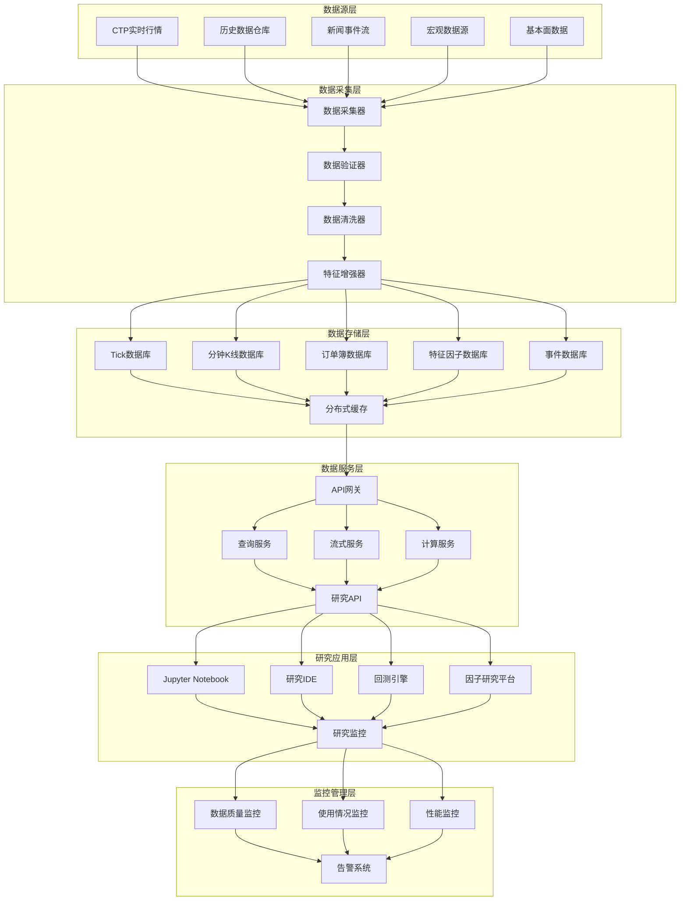

# 研究环境与数据接口规范

## 1. 概述

本文档定义国内期货商品高频量化交易平台的研究环境架构、数据接口规范和数据质量保证体系。作为策略研究平台设计部分的第一份文档，重点描述从数据采集到研究使用的完整数据流、接口标准化、数据质量控制以及研究环境部署方案。

**设计目标：**
- 建立统一、标准化的研究数据接口，支持多种数据源接入
- 提供高质量、清洗完整的历史和实时数据
- 支持大规模数据的高效访问和计算
- 确保研究环境与生产环境的数据一致性
- 提供完善的数据质量监控和问题追溯机制

**核心原则：**
1. **数据一致性原则：** 研究环境与生产环境使用相同的数据源和处理逻辑
2. **接口标准化原则：** 所有数据访问通过统一接口，隔离底层存储差异
3. **质量优先原则：** 数据质量监控贯穿采集、清洗、存储、访问全流程
4. **性能可扩展原则：** 支持TB级历史数据的高效查询和计算

## 2. 研究环境架构

### 2.1 整体架构图



### 2.2 各层职责说明

| 层级 | 核心组件 | 主要职责 | 性能目标 |
|------|----------|----------|----------|
| **数据源层** | CTP、历史仓库、新闻流、宏观数据 | 提供原始数据源，支持实时和历史数据接入 | 数据延迟 < 100ms，数据完整性 > 99.9% |
| **数据采集层** | 采集器、验证器、清洗器、增强器 | 数据采集、验证、清洗、特征增强 | 处理吞吐 > 100万Tick/秒，清洗延迟 < 10ms |
| **数据存储层** | Tick库、K线库、订单簿库、特征库 | 分层数据存储，支持冷热数据分离 | 查询延迟 < 100ms，写入吞吐 > 10万条/秒 |
| **数据服务层** | API网关、查询服务、流式服务、计算服务 | 提供统一数据访问接口，支持复杂查询和计算 | API响应延迟 < 50ms，并发支持 > 1000连接 |
| **研究应用层** | Jupyter、研究IDE、回测引擎、因子平台 | 提供研究工具和界面，支持策略开发和分析 | 数据加载速度 > 1GB/秒，计算性能 > 100万行/秒 |
| **监控管理层** | 质量监控、使用监控、性能监控、告警 | 监控数据质量、系统性能和使用情况 | 监控数据延迟 < 1秒，告警触发延迟 < 5秒 |

## 3. 数据接口规范

### 3.1 统一数据访问接口

#### C++接口定义
```cpp
// 统一数据访问接口
class UnifiedDataAccess {
public:
    virtual ~UnifiedDataAccess() = default;
    
    // 历史数据查询
    virtual std::vector<TickData> 
    query_ticks(const std::string& instrument_id,
               const TimeRange& range,
               const QueryOptions& options = {}) const = 0;
    
    virtual std::vector<MinuteBar>
    query_bars(const std::string& instrument_id,
              BarPeriod period,
              const TimeRange& range,
              const QueryOptions& options = {}) const = 0;
    
    virtual std::vector<OrderBookSnapshot>
    query_orderbook(const std::string& instrument_id,
                   const TimeRange& range,
                   const QueryOptions& options = {}) const = 0;
    
    // 实时数据订阅
    virtual SubscriptionHandle
    subscribe_ticks(const std::string& instrument_id,
                   TickCallback callback,
                   const SubscribeOptions& options = {}) = 0;
    
    virtual SubscriptionHandle
    subscribe_bars(const std::string& instrument_id,
                  BarPeriod period,
                  BarCallback callback,
                  const SubscribeOptions& options = {}) = 0;
    
    // 特征数据访问
    virtual std::vector<FeatureValue>
    query_features(const std::string& instrument_id,
                  const std::vector<std::string>& feature_names,
                  const TimeRange& range,
                  const QueryOptions& options = {}) const = 0;
    
    // 事件数据查询
    virtual std::vector<MarketEvent>
    query_events(const EventFilter& filter,
                const TimeRange& range,
                const QueryOptions& options = {}) const = 0;
    
    // 批量查询优化
    virtual BatchQueryResult
    batch_query(const BatchQueryRequest& request) const = 0;
    
    // 元数据查询
    virtual std::vector<InstrumentInfo>
    query_instruments(const InstrumentFilter& filter = {}) const = 0;
    
    virtual std::vector<CalendarDate>
    query_calendar(const std::string& exchange_id,
                  const TimeRange& range) const = 0;
    
    // 性能统计
    virtual QueryStatistics get_statistics() const = 0;
    
    // 缓存管理
    virtual void clear_cache(const CacheKey& key = {}) = 0;
    virtual CacheInfo get_cache_info() const = 0;
};

// 查询选项
struct QueryOptions {
    // 分页控制
    int32_t limit = 0;                 // 限制返回数量（0表示无限制）
    int32_t offset = 0;                // 偏移量
    
    // 字段过滤
    std::set<std::string> fields;      // 指定返回字段
    
    // 排序
    std::string order_by;              // 排序字段
    bool ascending = true;             // 升序/降序
    
    // 数据质量过滤
    DataQuality min_quality = DataQuality::VALID; // 最低数据质量要求
    
    // 缓存控制
    bool use_cache = true;             // 是否使用缓存
    CacheStrategy cache_strategy = CacheStrategy::SMART; // 缓存策略
    
    // 性能优化
    bool parallel_query = false;       // 是否并行查询
    int32_t batch_size = 1000;         // 批量大小
    
    // 自定义参数
    std::map<std::string, std::string> custom_params;
};

// 批量查询请求
struct BatchQueryRequest {
    struct QueryItem {
        QueryType type;                // 查询类型
        std::string instrument_id;     // 合约代码
        TimeRange range;               // 时间范围
        QueryOptions options;          // 查询选项
    };
    
    std::vector<QueryItem> queries;
    bool parallel_execution = true;    // 是否并行执行
    int32_t max_concurrent = 10;       // 最大并发数
    
    // 结果合并选项
    bool merge_results = false;        // 是否合并结果
    std::string merge_key;             // 合并键
};
```

#### Python接口定义
```python
from typing import Optional, List, Dict, Any, Union
from dataclasses import dataclass
from datetime import datetime
import pandas as pd

class UnifiedDataAccess:
    """统一数据访问接口（Python版本）"""
    
    def query_ticks(self, instrument_id: str,
                   start_time: datetime,
                   end_time: datetime,
                   **kwargs) -> pd.DataFrame:
        """查询Tick数据"""
        pass
    
    def query_bars(self, instrument_id: str,
                  period: str,
                  start_time: datetime,
                  end_time: datetime,
                  **kwargs) -> pd.DataFrame:
        """查询K线数据"""
        pass
    
    def query_orderbook(self, instrument_id: str,
                       start_time: datetime,
                       end_time: datetime,
                       **kwargs) -> pd.DataFrame:
        """查询订单簿数据"""
        pass
    
    def subscribe_ticks(self, instrument_id: str,
                       callback: callable,
                       **kwargs) -> str:
        """订阅Tick数据"""
        pass
    
    def query_features(self, instrument_id: str,
                      feature_names: List[str],
                      start_time: datetime,
                      end_time: datetime,
                      **kwargs) -> pd.DataFrame:
        """查询特征数据"""
        pass
    
    def query_events(self, event_type: Optional[str] = None,
                    start_time: Optional[datetime] = None,
                    end_time: Optional[datetime] = None,
                    **filters) -> pd.DataFrame:
        """查询事件数据"""
        pass
    
    def batch_query(self, queries: List[Dict]) -> Dict[str, Any]:
        """批量查询"""
        pass
    
    def get_instruments(self, **filters) -> pd.DataFrame:
        """获取合约信息"""
        pass
    
    def get_calendar(self, exchange_id: str,
                    start_date: datetime,
                    end_date: datetime) -> List[datetime]:
        """获取交易日历"""
        pass

@dataclass
class QueryOptions:
    """查询选项"""
    limit: int = 0
    offset: int = 0
    fields: Optional[List[str]] = None
    order_by: Optional[str] = None
    ascending: bool = True
    min_quality: str = "VALID"
    use_cache: bool = True
    parallel: bool = False
    batch_size: int = 1000
```

### 3.2 数据格式标准化

#### Tick数据标准格式
```cpp
// 标准化Tick数据结构
struct StandardTick {
    // 标识信息
    std::string instrument_id;          // 合约代码（如：rb2410）
    std::string exchange_id;            // 交易所代码（如：SHFE）
    uint64_t sequence;                  // 序列号（全局递增）
    
    // 时间信息
    TimePoint exchange_time;            // 交易所时间（纳秒精度）
    TimePoint receive_time;             // 接收时间（本地时间）
    TimePoint process_time;             // 处理时间
    
    // 价格信息
    double last_price;                  // 最新价
    double last_volume;                 // 最新成交量
    double last_turnover;               // 最新成交额
    
    // 买卖盘口（五档）
    struct Quote {
        double price;
        double volume;
        int32_t order_count;
        QuoteType type;                 // 买盘/卖盘
    };
    
    std::vector<Quote> bids;            // 买盘（价格从高到低）
    std::vector<Quote> asks;            // 卖盘（价格从低到高）
    
    // 日内统计
    double open_price;                  // 今开盘
    double high_price;                  // 最高价
    double low_price;                   // 最低价
    double pre_close_price;             // 昨收盘
    double pre_settlement_price;        // 昨结算
    double pre_open_interest;           // 昨持仓
    
    // 累计统计
    double volume;                      // 成交量
    double turnover;                    // 成交额
    double open_interest;               // 持仓量
    double average_price;               // 均价
    
    // 状态信息
    TradingPhase trading_phase;         // 交易阶段
    ProductClass product_class;         // 产品类型
    double upper_limit_price;           // 涨停价
    double lower_limit_price;           // 跌停价
    
    // 数据质量标记
    DataQuality quality;                // 数据质量
    std::vector<DataIssue> issues;      // 数据问题列表
    
    // 衍生字段
    double bid_ask_spread;              // 买卖价差
    double mid_price;                   // 中间价
    double weighted_mid_price;          // 加权中间价
    double order_book_imbalance;        // 订单簿不平衡度
    
    // 验证方法
    bool validate() const;
    std::vector<ValidationError> get_validation_errors() const;
    
    // 序列化支持
    std::vector<uint8_t> serialize() const;
    static StandardTick deserialize(const std::vector<uint8_t>& data);
};
```

#### 分钟K线标准格式
```cpp
// 标准化分钟K线结构
struct StandardMinuteBar {
    // 标识信息
    std::string instrument_id;
    std::string exchange_id;
    BarPeriod period;                   // K线周期（1min, 5min等）
    
    // 时间信息
    TimePoint start_time;               // K线开始时间
    TimePoint end_time;                 // K线结束时间
    
    // OHLCV数据
    double open;                        // 开盘价
    double high;                        // 最高价
    double low;                         // 最低价
    double close;                       // 收盘价
    double volume;                      // 成交量
    double turnover;                    // 成交额
    double open_interest;               // 持仓量
    
    // 成交明细
    int32_t trade_count;                // 成交笔数
    double vwap;                        // 成交量加权平均价
    std::vector<double> price_levels;   // 价格分布
    
    // 买卖盘信息
    double bid_volume;                  // 买盘成交量
    double ask_volume;                  // 卖盘成交量
    double bid_ask_ratio;               // 买卖比例
    
    // 数据质量
    DataQuality quality;
    bool is_complete;                   // 是否完整K线
    std::vector<DataIssue> issues;
    
    // 统计字段
    double returns;                     // 收益率
    double volatility;                  // 波动率
    double amplitude;                   // 振幅
    
    // 验证方法
    bool validate() const;
    
    // 转换为DataFrame格式
    std::map<std::string, double> to_dict() const;
};
```

### 3.3 数据质量保证体系

#### 数据质量监控框架
```cpp
// 数据质量监控器
class DataQualityMonitor {
public:
    // 质量检查规则
    struct QualityRule {
        std::string rule_id;
        std::string rule_name;
        QualityRuleType type;
        
        // 检查条件
        std::function<bool(const MarketData&)> condition;
        
        // 严重程度
        QualitySeverity severity;
        
        // 修复建议
        std::vector<std::string> repair_suggestions;
        
        // 统计信息
        mutable std::atomic<int64_t> check_count{0};
        mutable std::atomic<int64_t> violation_count{0};
    };
    
    // 添加质量规则
    void add_rule(const QualityRule& rule);
    void remove_rule(const std::string& rule_id);
    
    // 数据质量检查
    QualityReport check_quality(const MarketData& data);
    BatchQualityReport batch_check(const std::vector<MarketData>& data);
    
    // 实时监控
    void start_real_time_monitoring(const std::string& instrument_id);
    void stop_real_time_monitoring(const std::string& instrument_id);
    
    // 质量问题统计
    QualityStatistics get_statistics(const TimeRange& range = {}) const;
    std::vector<QualityIssue> get_active_issues() const;
    
    // 自动修复
    RepairResult auto_repair(const MarketData& data, 
                           const std::vector<std::string>& rule_ids = {});
    
    // 质量报告生成
    QualityReport generate_report(const TimeRange& range,
                                 ReportFormat format = ReportFormat::HTML);
    
private:
    // 常见质量规则
    void initialize_default_rules();
    
    // 规则集合
    std::unordered_map<std::string, QualityRule> rules_;
    
    // 监控状态
    std::set<std::string> monitoring_instruments_;
    
    // 统计信息
    mutable std::mutex stats_mutex_;
    QualityStatistics stats_;
};
```

#### 数据质量规则定义
```cpp
// 常见数据质量规则示例
class DataQualityRules {
public:
    // 价格合理性检查
    static QualityRule price_sanity_check() {
        return {
            .rule_id = "price_sanity",
            .rule_name = "价格合理性检查",
            .type = QualityRuleType::PRICE_VALIDATION,
            .condition = [](const MarketData& data) {
                // 检查价格是否在合理范围内
                if (data.last_price <= 0) return false;
                if (data.last_price > data.upper_limit_price * 1.1) return false;
                if (data.last_price < data.lower_limit_price * 0.9) return false;
                return true;
            },
            .severity = QualitySeverity::CRITICAL,
            .repair_suggestions = {"丢弃异常数据", "使用前一个有效值替换"}
        };
    }
    
    // 时间连续性检查
    static QualityRule time_continuity_check() {
        return {
            .rule_id = "time_continuity",
            .rule_name = "时间连续性检查",
            .type = QualityRuleType::TIME_VALIDATION,
            .condition = [](const MarketData& data) {
                // 检查时间戳是否连续
                // 实现略
                return true;
            },
            .severity = QualitySeverity::HIGH,
            .repair_suggestions = {"时间戳修正", "插值处理"}
        };
    }
    
    // 买卖盘口完整性检查
    static QualityRule orderbook_integrity_check() {
        return {
            .rule_id = "orderbook_integrity",
            .rule_name = "订单簿完整性检查",
            .type = QualityRuleType::ORDERBOOK_VALIDATION,
            .condition = [](const MarketData& data) {
                // 检查买卖盘口是否完整
                if (data.bids.empty() || data.asks.empty()) return false;
                if (data.bids[0].price >= data.asks[0].price) return false;
                return true;
            },
            .severity = QualitySeverity::MEDIUM,
            .repair_suggestions = {"使用合成订单簿", "丢弃不完整数据"}
        };
    }
    
    // 成交量异常检测
    static QualityRule volume_anomaly_check() {
        return {
            .rule_id = "volume_anomaly",
            .rule_name = "成交量异常检测",
            .type = QualityRuleType::VOLUME_VALIDATION,
            .condition = [](const MarketData& data) {
                // 检查成交量是否异常
                // 实现略
                return true;
            },
            .severity = QualitySeverity::LOW,
            .repair_suggestions = {"统计过滤", "滑窗检测"}
        };
    }
};
```

## 4. 研究环境部署方案

### 4.1 环境配置规范

#### 开发环境配置
```yaml
# research-environment.yaml
version: "1.0"
environment: "development"

# 数据源配置
data_sources:
  ctp_realtime:
    enabled: true
    mode: "simnow"  # simnow, production
    servers:
      - addr: "tcp://180.168.146.187:10130"
      - addr: "tcp://180.168.146.187:10131"
    
  historical_data:
    enabled: true
    storage_type: "timescaledb"
    connection:
      host: "localhost"
      port: 5432
      database: "quant_research"
      username: "researcher"
    
  news_events:
    enabled: false
    sources:
      - type: "rss"
        url: "https://news.example.com/feed"
      - type: "api"
        endpoint: "https://api.news.com/v1/events"

# 计算资源配置
compute_resources:
  cpu:
    cores: 8
    threads_per_core: 2
    
  memory:
    total_gb: 64
    cache_gb: 32
    
  gpu:
    enabled: true
    count: 1
    memory_gb: 24
    cuda_version: "11.8"
    
  storage:
    data_dir: "/data/research"
    cache_dir: "/cache/research"
    temp_dir: "/tmp/research"

# 研究工具配置
research_tools:
  jupyter:
    enabled: true
    port: 8888
    token: "research_token"
    notebook_dir: "/notebooks"
    
  ide:
    enabled: true
    type: "vscode"
    extensions:
      - "python"
      - "jupyter"
      - "docker"
      
  package_manager:
    type: "conda"
    environment_file: "environment.yml"
    channels:
      - "conda-forge"
      - "defaults"
      
# 监控配置
monitoring:
  enabled: true
  prometheus:
    endpoint: "http://localhost:9090"
  grafana:
    endpoint: "http://localhost:3000"
  alerting:
    enabled: true
    channels:
      - type: "email"
        recipients: ["research-team@company.com"]
      - type: "slack"
        webhook: "https://hooks.slack.com/services/..."
```

#### 数据存储架构
```cpp
// 分层存储配置
struct StorageConfiguration {
    // 热数据层（内存）
    struct HotStorage {
        bool enabled = true;
        std::string type = "redis";     // redis, memcached, custom
        size_t max_size_gb = 100;       // 最大容量
        std::string eviction_policy = "lru"; // 淘汰策略
        
        // Redis特定配置
        struct RedisConfig {
            std::string mode = "cluster"; // standalone, cluster, sentinel
            std::vector<std::string> nodes;
            int database = 0;
            std::string password;
        } redis;
    } hot_storage;
    
    // 温数据层（SSD）
    struct WarmStorage {
        bool enabled = true;
        std::string type = "timescaledb"; // timescaledb, postgresql, duckdb
        size_t max_size_gb = 1000;       // 最大容量
        int retention_days = 365;        // 保留天数
        
        // TimescaleDB配置
        struct TimescaleConfig {
            std::string host = "localhost";
            int port = 5432;
            std::string database = "quant_data";
            std::string username;
            std::string password;
            
            // 分区配置
            struct Partitioning {
                std::string time_column = "timestamp";
                std::string interval = "1 day"; // 分区间隔
                bool enable_compression = true;
                int compression_segment_size = 1000000; // 压缩段大小
            } partitioning;
        } timescale;
    } warm_storage;
    
    // 冷数据层（HDD/对象存储）
    struct ColdStorage {
        bool enabled = true;
        std::string type = "minio";      // minio, s3, hdfs
        size_t max_size_gb = 10000;      // 最大容量
        int retention_days = 365 * 5;    // 保留5年
        
        // MinIO配置
        struct MinIOConfig {
            std::string endpoint = "localhost:9000";
            std::string access_key;
            std::string secret_key;
            bool use_ssl = false;
            std::string bucket = "quant-cold-data";
            
            // 生命周期策略
            struct Lifecycle {
                bool enable_transition = true;
                int transition_days = 30;      // 30天后转移到冷存储
                std::string storage_class = "GLACIER";
            } lifecycle;
        } minio;
    } cold_storage;
    
    // 缓存策略
    struct CachePolicy {
        // 数据热度判断
        struct HeatLevel {
            int hot_days = 7;            // 7天内数据为热数据
            int warm_days = 30;          // 30天内数据为温数据
            int cold_days = 365;         // 365天内数据为冷数据
        } heat_level;
        
        // 自动迁移策略
        bool auto_migration = true;
        std::string migration_schedule = "0 2 * * *"; // 每天凌晨2点
        
        // 预取策略
        bool prefetch_enabled = true;
        std::vector<std::string> prefetch_patterns = {
            "market_data.*.tick",
            "market_data.*.minute",
            "features.*.daily"
        };
    } cache_policy;
};
```

### 4.2 性能优化策略

#### 查询性能优化
```cpp
// 查询优化器
class QueryOptimizer {
public:
    // 查询计划
    struct QueryPlan {
        QueryType type;
        std::vector<std::string> instruments;
        TimeRange range;
        
        // 执行策略
        enum class ExecutionStrategy {
            SEQUENTIAL,      // 顺序执行
            PARALLEL,        // 并行执行
            DISTRIBUTED,     // 分布式执行
            STREAMING        // 流式执行
        } strategy;
        
        // 优化建议
        struct Optimization {
            bool use_cache = true;
            bool use_index = true;
            bool use_partition_pruning = true;
            bool use_column_pruning = true;
            bool use_predicate_pushdown = true;
            
            // 并行度
            int parallelism = 4;
            
            // 批量大小
            int batch_size = 1000;
            
            // 内存限制
            size_t memory_limit_mb = 1024;
        } optimization;
        
        // 成本估算
        struct CostEstimate {
            size_t estimated_rows;
            size_t estimated_size_mb;
            milliseconds estimated_duration;
            double cpu_cost;
            double io_cost;
            double memory_cost;
        } cost;
        
        // 执行计划
        std::vector<std::string> execution_steps;
    };
    
    // 生成优化查询计划
    QueryPlan optimize_query(const QueryRequest& request,
                            const SystemContext& context);
    
    // 批量查询优化
    std::vector<QueryPlan> optimize_batch_query(
        const std::vector<QueryRequest>& requests,
        const SystemContext& context);
    
    // 缓存优化建议
    struct CacheOptimization {
        std::vector<std::string> tables_to_cache;
        std::vector<std::string> indexes_to_create;
        std::vector<std::string> partitions_to_create;
        std::vector<std::string> materialized_views;
    };
    
    CacheOptimization suggest_cache_optimization(
        const WorkloadAnalysis& analysis);
    
    // 性能监控
    struct PerformanceMetrics {
        size_t total_queries;
        size_t optimized_queries;
        double avg_optimization_ratio;  // 优化比例
        std::map<std::string, double> query_times;
        std::map<std::string, size_t> cache_hit_rates;
    };
    
    PerformanceMetrics get_performance_metrics() const;
    
private:
    // 查询重写规则
    std::vector<QueryRewriteRule> rewrite_rules_;
    
    // 成本模型
    CostModel cost_model_;
    
    // 统计信息
    QueryStatistics statistics_;
    
    // 性能监控
    mutable std::mutex metrics_mutex_;
    PerformanceMetrics metrics_;
};
```

## 5. 数据接口性能指标

### 5.1 性能目标

| 接口类型 | 目标延迟（P99） | 吞吐量目标 | 并发连接 | 数据一致性 |
|----------|----------------|------------|----------|------------|
| **Tick查询** | < 100ms | > 100万条/秒 | > 1000 | 最终一致性 |
| **K线查询** | < 50ms | > 10万条/秒 | > 500 | 强一致性 |
| **订单簿查询** | < 200ms | > 1万次/秒 | > 200 | 强一致性 |
| **特征查询** | < 300ms | > 5万次/秒 | > 300 | 最终一致性 |
| **实时订阅** | < 10ms | > 1000连接 | > 1000 | 实时一致性 |
| **批量查询** | < 1秒 | > 100查询/秒 | > 100 | 最终一致性 |

### 5.2 监控指标

#### Prometheus监控指标
```yaml
# 数据接口监控指标
metrics:
  # 查询性能指标
  query_duration_seconds:
    type: histogram
    help: "查询耗时分布"
    buckets: [0.001, 0.005, 0.01, 0.05, 0.1, 0.5, 1, 5]
    labels: ["api", "instrument", "result_size"]
    
  query_throughput:
    type: counter
    help: "查询吞吐量"
    labels: ["api", "status"]
    
  # 缓存性能指标
  cache_hit_rate:
    type: gauge
    help: "缓存命中率"
    labels: ["cache_layer", "data_type"]
    
  cache_size_bytes:
    type: gauge
    help: "缓存大小"
    labels: ["cache_layer"]
    
  # 数据质量指标
  data_quality_score:
    type: gauge
    help: "数据质量评分"
    labels: ["instrument", "data_type"]
    range: [0, 1]
    
  data_completeness:
    type: gauge
    help: "数据完整度"
    labels: ["instrument", "data_type"]
    range: [0, 1]
    
  # 系统资源指标
  memory_usage_bytes:
    type: gauge
    help: "内存使用量"
    labels: ["component"]
    
  cpu_usage_percent:
    type: gauge
    help: "CPU使用率"
    labels: ["component"]
    
  disk_io_bytes:
    type: counter
    help: "磁盘IO"
    labels: ["component", "direction"]
```

#### Grafana监控面板配置
```json
{
  "dashboard": {
    "title": "研究环境数据接口监控",
    "panels": [
      {
        "title": "查询性能",
        "type": "graph",
        "targets": [
          {
            "expr": "rate(query_duration_seconds_sum[5m]) / rate(query_duration_seconds_count[5m])",
            "legendFormat": "平均查询延迟"
          },
          {
            "expr": "histogram_quantile(0.99, rate(query_duration_seconds_bucket[5m]))",
            "legendFormat": "P99查询延迟"
          }
        ],
        "thresholds": [
          {
            "value": 0.1,
            "color": "green"
          },
          {
            "value": 0.5,
            "color": "yellow"
          },
          {
            "value": 1.0,
            "color": "red"
          }
        ]
      },
      {
        "title": "数据质量",
        "type": "stat",
        "targets": [
          {
            "expr": "avg(data_quality_score) * 100",
            "legendFormat": "平均数据质量"
          },
          {
            "expr": "avg(data_completeness) * 100",
            "legendFormat": "平均数据完整度"
          }
        ],
        "thresholds": [
          {
            "value": 95,
            "color": "green"
          },
          {
            "value": 90,
            "color": "yellow"
          },
          {
            "value": 85,
            "color": "red"
          }
        ]
      }
    ]
  }
}
```

## 6. 安全与权限控制

### 6.1 访问控制模型

```cpp
// 基于角色的访问控制（RBAC）
class ResearchAccessControl {
public:
    // 用户角色
    enum class UserRole {
        GUEST,           // 访客（只读）
        RESEARCHER,      // 研究员（读+研究）
        DEVELOPER,       // 开发者（读+写代码）
        DATA_SCIENTIST,  // 数据科学家（读+数据操作）
        ADMIN,           // 管理员（全部权限）
        SYSTEM           // 系统账户
    };
    
    // 数据权限级别
    enum class DataPermission {
        NONE,            // 无权限
        READ_ONLY,       // 只读
        READ_WRITE,      // 读写
        FULL_CONTROL     // 完全控制
    };
    
    // 权限检查
    bool check_permission(UserRole role, 
                         const std::string& resource,
                         DataPermission required_permission);
    
    // 资源访问控制
    struct ResourceACL {
        std::string resource_path;
        std::map<UserRole, DataPermission> role_permissions;
        std::vector<std::string> allowed_users;
        std::vector<std::string> denied_users;
        
        // 时间限制
        TimeRange allowed_time;
        
        // 数据量限制
        size_t max_data_size_mb;
        int max_query_frequency_per_minute;
    };
    
    // 添加资源ACL
    void add_resource_acl(const ResourceACL& acl);
    
    // 审计日志
    struct AuditLog {
        std::string user_id;
        UserRole user_role;
        std::string resource;
        std::string operation;
        TimePoint timestamp;
        bool allowed;
        std::string reason;
        
        // 上下文信息
        std::string client_ip;
        std::string user_agent;
        std::map<std::string, std::string> context;
    };
    
    void log_access(const AuditLog& log);
    std::vector<AuditLog> query_audit_logs(const AuditQuery& query);
    
private:
    // 权限矩阵
    std::map<std::pair<UserRole, std::string>, DataPermission> permission_matrix_;
    
    // 资源ACL列表
    std::vector<ResourceACL> resource_acls_;
    
    // 审计日志存储
    std::vector<AuditLog> audit_logs_;
    mutable std::mutex audit_mutex_;
};
```

### 6.2 数据脱敏与加密

```cpp
// 数据脱敏处理器
class DataMaskingProcessor {
public:
    // 脱敏规则
    struct MaskingRule {
        std::string field_name;
        enum class MaskingType {
            FULL_MASK,          // 完全脱敏
            PARTIAL_MASK,       // 部分脱敏
            ENCRYPTION,         // 加密
            HASHING,            // 哈希
            TOKENIZATION,       // 令牌化
            PSEUDONYMIZATION    // 伪名化
        } type;
        
        // 脱敏参数
        std::map<std::string, std::string> parameters;
        
        // 适用角色
        std::vector<UserRole> applicable_roles;
    };
    
    // 添加脱敏规则
    void add_masking_rule(const MaskingRule& rule);
    
    // 数据脱敏处理
    std::string mask_data(const std::string& data,
                         const MaskingRule& rule,
                         UserRole user_role);
    
    // 批量脱敏
    std::vector<std::string> batch_mask_data(
        const std::vector<std::string>& data_list,
        const std::string& field_name,
        UserRole user_role);
    
    // 加密管理
    class DataEncryptor {
    public:
        // 加密算法
        enum class EncryptionAlgorithm {
            AES_256_GCM,
            AES_256_CBC,
            CHACHA20_POLY1305,
            RSA_OAEP
        };
        
        // 加密数据
        std::vector<uint8_t> encrypt(const std::vector<uint8_t>& data,
                                   EncryptionAlgorithm algo);
        
        // 解密数据
        std::vector<uint8_t> decrypt(const std::vector<uint8_t>& ciphertext,
                                   EncryptionAlgorithm algo);
        
        // 密钥管理
        void rotate_key(const std::string& key_id);
        bool validate_key(const std::string& key_id);
        
    private:
        // 密钥存储（安全硬件模块）
        class KeyStore {
            // 实现略
        };
        
        std::unique_ptr<KeyStore> key_store_;
    };
    
private:
    std::vector<MaskingRule> masking_rules_;
    std::unique_ptr<DataEncryptor> encryptor_;
};
```

## 7. 实施与迁移指南

### 7.1 数据迁移策略

```yaml
# 数据迁移配置
data_migration:
  # 源数据源
  source:
    type: "legacy_database"
    connection:
      host: "legacy-db.example.com"
      port: 5432
      database: "old_quant_data"
      username: "migration_user"
    
  # 目标数据源
  target:
    type: "new_research_db"
    connection:
      host: "new-db.example.com"
      port: 5432
      database: "quant_research"
      username: "research_user"
    
  # 迁移策略
  strategy:
    type: "incremental"  # full, incremental, delta
    batch_size: 10000
    parallel_workers: 8
    throttle_mbps: 100   # 限流100Mbps
    
  # 数据验证
  validation:
    enabled: true
    sampling_rate: 0.01  # 1%抽样验证
    tolerance_percent: 0.1  # 0.1%误差容忍
    
  # 回滚计划
  rollback:
    enabled: true
    checkpoint_interval: "1 hour"
    retention_days: 7
    
  # 监控告警
  monitoring:
    enabled: true
    alert_on_failure: true
    alert_on_slow_progress: true
    slow_threshold_percent: 10  # 进度慢于计划10%告警
```

### 7.2 研究环境升级流程

```cpp
// 研究环境升级管理器
class ResearchEnvironmentUpgrader {
public:
    // 升级步骤
    struct UpgradeStep {
        std::string step_id;
        std::string description;
        std::function<bool()> execute;
        std::function<bool()> verify;
        std::function<void()> rollback;
        
        // 超时设置
        milliseconds timeout = 300000ms;  // 5分钟
        
        // 依赖关系
        std::vector<std::string> dependencies;
        
        // 重试策略
        int max_retries = 3;
        milliseconds retry_delay = 5000ms;
    };
    
    // 添加升级步骤
    void add_upgrade_step(const UpgradeStep& step);
    
    // 执行升级
    UpgradeResult execute_upgrade(const std::string& version);
    
    // 升级验证
    VerificationResult verify_upgrade(const std::string& version);
    
    // 升级回滚
    RollbackResult rollback_upgrade(const std::string& version);
    
    // 升级历史
    struct UpgradeHistory {
        std::string version;
        TimePoint start_time;
        TimePoint end_time;
        bool success;
        std::vector<std::string> executed_steps;
        std::vector<std::string> failed_steps;
        std::string error_message;
    };
    
    std::vector<UpgradeHistory> get_upgrade_history() const;
    
private:
    // 升级步骤列表
    std::vector<UpgradeStep> upgrade_steps_;
    
    // 升级状态
    std::atomic<bool> is_upgrading_{false};
    
    // 升级历史
    mutable std::mutex history_mutex_;
    std::vector<UpgradeHistory> upgrade_history_;
};
```

---

**文档版本：** v1.0  
**最后更新：** 2026-02-10  
**负责人：** 数据架构师  
**状态：** 草案 - 待技术评审  
**关联文档：** 
- [00-项目总览与设计原则.md](../00-项目总览与设计原则.md)
- [01-01-整体架构图与技术栈选型.md](../01-系统架构设计/01-01-整体架构图与技术栈选型.md)
- [01-02-核心模块划分与职责.md](../01-系统架构设计/01-02-核心模块划分与职责.md)

**技术决策记录：**
- 2026-02-10: 确定统一数据访问接口设计，支持历史数据和实时数据统一访问
- 2026-02-10: 建立分层数据存储架构，支持热数据、温数据、冷数据分离
- 2026-02-10: 定义数据质量监控框架，包含价格、时间、订单簿完整性等检查规则
- 2026-02-10: 制定研究环境部署规范，支持开发、测试、生产环境一致性
- 2026-02-10: 建立基于角色的访问控制模型，确保数据安全性和权限管理