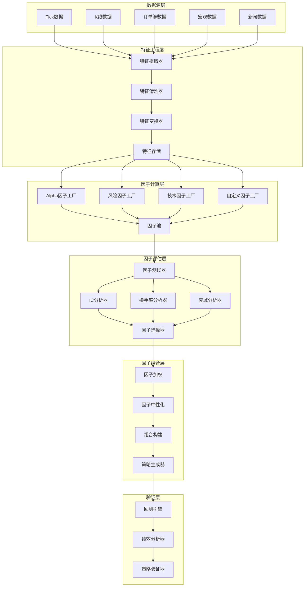
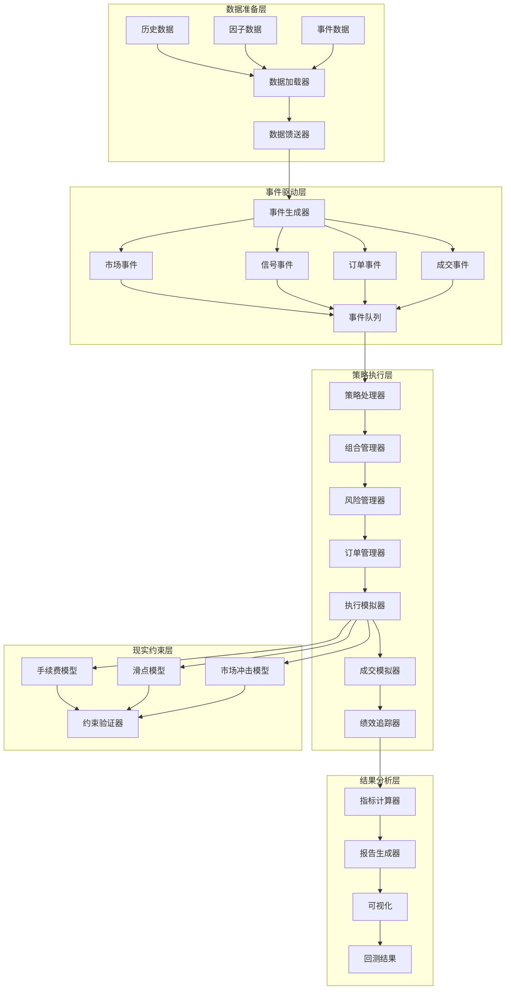

# 因子研究与回测引擎设计

## 1. 概述

本文档详细设计国内期货商品高频量化交易平台的因子研究框架和回测引擎系统。作为策略研究平台设计部分的第二份文档，重点描述因子挖掘、特征工程、回测验证全流程的技术实现方案。

**设计目标：**
- 建立工业化因子研究流水线，支持大规模因子挖掘和验证
- 实现高性能回测引擎，支持分钟级K线回测和复杂策略验证
- 提供完整的因子评估和筛选工具链
- 确保研究环境与生产环境的策略逻辑一致性
- 支持多频率、多品种的策略开发和验证

**核心原则：**
1. **因子正交性原则：** 确保因子库中因子具有低相关性，避免多重共线性
2. **回测真实性原则：** 回测包含完整交易成本、滑点、市场冲击等现实约束
3. **策略一致性原则：** 研究环境与生产环境使用相同的策略逻辑和接口
4. **性能可扩展原则：** 支持TB级历史数据的高性能回测和因子计算

## 2. 因子研究框架

### 2.1 因子流水线架构



### 2.2 因子分类体系

#### 因子类型定义
```cpp
// 因子分类体系
enum class FactorCategory {
    // 价格动量类
    PRICE_MOMENTUM,          // 价格动量因子
    VOLUME_MOMENTUM,         // 成交量动量因子
    REVERSAL,                // 反转因子
    
    // 技术指标类
    TREND_FOLLOWING,         // 趋势跟随因子
    OSCILLATOR,              // 振荡器因子
    VOLATILITY,              // 波动率因子
    VOLUME,                  // 成交量因子
    
    // 订单簿类
    ORDERBOOK_IMMBALANCE,    // 订单簿不平衡度
    ORDERBOOK_DEPTH,         // 订单簿深度
    ORDERBOOK_MICROSTRUCTURE, // 订单簿微结构
    
    // 统计套利类
    PAIR_TRADING,            // 配对交易因子
    STATISTICAL_ARBITRAGE,   // 统计套利因子
    MEAN_REVERSION,          // 均值回复因子
    
    // 基本面类
    FUNDAMENTAL,             // 基本面因子
    MACROECONOMIC,           // 宏观经济因子
    SENTIMENT,               // 情绪因子
    
    // 另类数据类
    ALTERNATIVE_DATA,        // 另类数据因子
    NEWS_SENTIMENT,          // 新闻情绪因子
    SOCIAL_MEDIA,            // 社交媒体因子
    
    // 复合因子
    COMPOSITE,               // 复合因子
    ENSEMBLE,                // 集成因子
    MACHINE_LEARNING         // 机器学习因子
};

// 因子时间频率
enum class FactorFrequency {
    TICK,                    // Tick级（毫秒）
    SECOND,                  // 秒级
    MINUTE,                  // 分钟级
    DAILY,                   // 日度
    WEEKLY,                  // 周度
    MONTHLY                  // 月度
};

// 因子计算范围
enum class FactorScope {
    CROSS_SECTIONAL,         // 横截面因子
    TIME_SERIES,             // 时间序列因子
    PANEL                    // 面板因子
};
```

### 2.3 因子计算引擎

#### C++接口定义
```cpp
// 因子计算引擎
class FactorCalculationEngine {
public:
    virtual ~FactorCalculationEngine() = default;
    
    // 因子注册
    virtual bool register_factor(const std::string& factor_id,
                                std::shared_ptr<FactorCalculator> calculator) = 0;
    
    virtual bool unregister_factor(const std::string& factor_id) = 0;
    
    // 因子计算
    virtual FactorResult calculate_factor(
        const std::string& factor_id,
        const std::string& instrument_id,
        const TimeRange& range,
        const CalculationOptions& options = {}) = 0;
    
    virtual std::map<std::string, FactorResult>
    calculate_factors_batch(
        const std::vector<std::string>& factor_ids,
        const std::string& instrument_id,
        const TimeRange& range,
        const CalculationOptions& options = {}) = 0;
    
    virtual PanelFactorResult
    calculate_cross_sectional_factor(
        const std::string& factor_id,
        const std::vector<std::string>& instrument_ids,
        TimePoint timestamp,
        const CalculationOptions& options = {}) = 0;
    
    // 实时因子计算
    virtual SubscriptionHandle
    subscribe_factor_updates(
        const std::string& factor_id,
        const std::string& instrument_id,
        FactorUpdateCallback callback,
        const SubscribeOptions& options = {}) = 0;
    
    // 因子元数据
    virtual std::optional<FactorMetadata>
    get_factor_metadata(const std::string& factor_id) const = 0;
    
    virtual std::vector<std::string>
    list_registered_factors(const FactorFilter& filter = {}) const = 0;
    
    // 性能统计
    virtual CalculationStatistics
    get_statistics(const TimeRange& range = {}) const = 0;
    
    // 缓存管理
    virtual void clear_factor_cache(const std::string& factor_id = "") = 0;
};

// 因子计算器基类
class FactorCalculator {
public:
    virtual ~FactorCalculator() = default;
    
    // 因子元数据
    virtual FactorMetadata get_metadata() const = 0;
    
    // 因子计算
    virtual FactorResult calculate(
        const CalculationContext& context) = 0;
    
    // 依赖关系
    virtual std::vector<FactorDependency>
    get_dependencies() const = 0;
    
    // 参数验证
    virtual ValidationResult
    validate_parameters(const ParameterSet& params) const = 0;
    
    // 序列化支持
    virtual std::vector<uint8_t> serialize() const = 0;
    virtual bool deserialize(const std::vector<uint8_t>& data) = 0;
};

// 因子元数据
struct FactorMetadata {
    std::string factor_id;              // 因子ID
    std::string factor_name;            // 因子名称
    std::string description;            // 因子描述
    
    FactorCategory category;            // 因子类别
    FactorFrequency frequency;          // 计算频率
    FactorScope scope;                  // 计算范围
    
    // 参数定义
    struct Parameter {
        std::string name;
        std::string type;               // int, double, string, etc.
        std::string default_value;
        std::string description;
        std::optional<std::string> validator; // 验证函数
    };
    std::vector<Parameter> parameters;
    
    // 依赖数据
    struct DataRequirement {
        std::string data_type;          // tick, bar, orderbook, etc.
        std::optional<TimeDelta> lookback; // 回看期
        std::vector<std::string> required_fields;
    };
    std::vector<DataRequirement> data_requirements;
    
    // 性能特征
    struct PerformanceProfile {
        double avg_calculation_time_ms; // 平均计算时间
        double memory_footprint_mb;     // 内存占用
        bool parallelizable;            // 是否可并行
        int recommended_batch_size;     // 推荐批量大小
    } performance_profile;
    
    // 验证信息
    std::string author;
    std::string version;
    TimePoint created_time;
    TimePoint last_modified;
    
    // 质量指标
    std::optional<double> ic_mean;      // 信息系数均值
    std::optional<double> ic_ir;        // 信息比率
    std::optional<double> turnover_rate;// 换手率
    std::optional<int> decay_horizon;   // 衰减周期
};
```

#### Python接口定义
```python
from typing import Optional, List, Dict, Any, Union
from dataclasses import dataclass, field
from datetime import datetime
import pandas as pd
import numpy as np

class FactorCalculator:
    """因子计算器基类（Python版本）"""
    
    def __init__(self, factor_id: str, **params):
        self.factor_id = factor_id
        self.params = params
        
    def get_metadata(self) -> Dict[str, Any]:
        """获取因子元数据"""
        pass
    
    def calculate(self, data: Dict[str, pd.DataFrame]) -> pd.Series:
        """计算因子值"""
        pass
    
    def get_dependencies(self) -> List[Dict[str, Any]]:
        """获取依赖数据"""
        pass

class FactorCalculationEngine:
    """因子计算引擎（Python版本）"""
    
    def register_factor(self, calculator: FactorCalculator) -> bool:
        """注册因子计算器"""
        pass
    
    def calculate_factor(self, factor_id: str,
                        instrument_id: str,
                        start_time: datetime,
                        end_time: datetime,
                        **options) -> pd.Series:
        """计算因子值"""
        pass
    
    def calculate_factors_batch(self, factor_ids: List[str],
                               instrument_ids: List[str],
                               start_time: datetime,
                               end_time: datetime,
                               **options) -> pd.DataFrame:
        """批量计算因子"""
        pass
    
    def subscribe_factor_updates(self, factor_id: str,
                                instrument_id: str,
                                callback: callable,
                                **options) -> str:
        """订阅因子更新"""
        pass
```

### 2.4 常见因子实现示例

#### 价格动量因子
```cpp
// 简单价格动量因子
class PriceMomentumFactor : public FactorCalculator {
public:
    PriceMomentumFactor(int lookback_period = 20)
        : lookback_period_(lookback_period) {}
    
    FactorMetadata get_metadata() const override {
        return {
            .factor_id = "price_momentum",
            .factor_name = "价格动量因子",
            .description = fmt::format("{}-期价格动量", lookback_period_),
            .category = FactorCategory::PRICE_MOMENTUM,
            .frequency = FactorFrequency::DAILY,
            .scope = FactorScope::TIME_SERIES,
            .parameters = {
                {.name = "lookback_period", .type = "int", 
                 .default_value = "20", .description = "回看周期"}
            },
            .data_requirements = {
                {.data_type = "bar", .lookback = std::chrono::days(lookback_period_),
                 .required_fields = {"close"}}
            },
            .author = "System",
            .version = "1.0"
        };
    }
    
    FactorResult calculate(const CalculationContext& context) override {
        const auto& bars = context.get_bars("close");
        if (bars.size() < static_cast<size_t>(lookback_period_)) {
            return FactorResult::error("Insufficient data");
        }
        
        std::vector<double> factor_values;
        factor_values.reserve(bars.size() - lookback_period_ + 1);
        
        for (size_t i = lookback_period_ - 1; i < bars.size(); ++i) {
            double current_price = bars[i];
            double past_price = bars[i - lookback_period_ + 1];
            double momentum = (current_price - past_price) / past_price;
            factor_values.push_back(momentum);
        }
        
        TimeRange time_range = {
            .start = context.timestamp_range().start + 
                    std::chrono::days(lookback_period_ - 1),
            .end = context.timestamp_range().end
        };
        
        return FactorResult::success(factor_values, time_range);
    }
    
private:
    int lookback_period_;
};
```

#### 订单簿不平衡度因子
```cpp
// 订单簿不平衡度因子
class OrderBookImbalanceFactor : public FactorCalculator {
public:
    OrderBookImbalanceFactor(int depth_levels = 5)
        : depth_levels_(depth_levels) {}
    
    FactorResult calculate(const CalculationContext& context) override {
        const auto& orderbook_snapshots = context.get_orderbook_snapshots();
        
        std::vector<double> imbalance_values;
        std::vector<TimePoint> timestamps;
        
        for (const auto& snapshot : orderbook_snapshots) {
            double total_bid_volume = 0.0;
            double total_ask_volume = 0.0;
            
            for (int i = 0; i < depth_levels_ && i < snapshot.bids.size(); ++i) {
                total_bid_volume += snapshot.bids[i].volume;
            }
            
            for (int i = 0; i < depth_levels_ && i < snapshot.asks.size(); ++i) {
                total_ask_volume += snapshot.asks[i].volume;
            }
            
            if (total_bid_volume + total_ask_volume > 0) {
                double imbalance = (total_bid_volume - total_ask_volume) / 
                                  (total_bid_volume + total_ask_volume);
                imbalance_values.push_back(imbalance);
                timestamps.push_back(snapshot.timestamp);
            }
        }
        
        return FactorResult::success(imbalance_values, timestamps);
    }
    
private:
    int depth_levels_;
};
```

## 3. 回测引擎设计

### 3.1 回测引擎架构



### 3.2 回测引擎接口

#### C++接口定义
```cpp
// 回测引擎
class BacktestEngine {
public:
    virtual ~BacktestEngine() = default;
    
    // 回测配置
    struct Configuration {
        TimeRange backtest_range;       // 回测时间范围
        std::string frequency;          // 回测频率（tick, minute, daily）
        
        // 初始资本
        double initial_capital = 1000000.0;
        std::string base_currency = "CNY";
        
        // 手续费设置
        CommissionConfig commission;
        
        // 滑点设置
        SlippageConfig slippage;
        
        // 现实约束
        RealisticConstraints constraints;
        
        // 性能优化
        OptimizationOptions optimization;
    };
    
    // 运行回测
    virtual BacktestResult run_backtest(
        std::shared_ptr<Strategy> strategy,
        const Configuration& config) = 0;
    
    // 参数优化
    virtual OptimizationResult optimize_parameters(
        std::shared_ptr<ParameterizedStrategy> strategy,
        const ParameterSpace& parameter_space,
        const Configuration& config,
        const OptimizationCriteria& criteria) = 0;
    
    // Walk-Forward分析
    virtual WalkForwardResult walk_forward_analysis(
        std::shared_ptr<Strategy> strategy,
        const std::vector<TimeRange>& windows,
        const Configuration& config) = 0;
    
    // 蒙特卡洛模拟
    virtual MonteCarloResult monte_carlo_simulation(
        std::shared_ptr<Strategy> strategy,
        const Configuration& config,
        int num_simulations = 1000) = 0;
    
    // 敏感度分析
    virtual SensitivityAnalysisResult sensitivity_analysis(
        std::shared_ptr<ParameterizedStrategy> strategy,
        const std::vector<std::string>& parameters,
        const Configuration& config) = 0;
    
    // 回测状态查询
    virtual BacktestStatus get_status() const = 0;
    virtual ProgressInfo get_progress() const = 0;
    
    // 回测控制
    virtual void pause() = 0;
    virtual void resume() = 0;
    virtual void stop() = 0;
    
    // 性能统计
    virtual PerformanceStatistics get_statistics() const = 0;
};

// 策略基类
class Strategy {
public:
    virtual ~Strategy() = default;
    
    // 策略初始化
    virtual void initialize(const StrategyContext& context) = 0;
    
    // 事件处理
    virtual void on_market_data(const MarketData& data) = 0;
    virtual void on_signal(const Signal& signal) = 0;
    virtual void on_order_status(const OrderStatus& status) = 0;
    virtual void on_fill(const Fill& fill) = 0;
    
    // 定时事件
    virtual void on_bar_open(const Bar& bar) = 0;
    virtual void on_bar_close(const Bar& bar) = 0;
    virtual void on_daily_open() = 0;
    virtual void on_daily_close() = 0;
    
    // 策略状态
    virtual StrategyState get_state() const = 0;
    virtual std::vector<Position> get_positions() const = 0;
    virtual std::vector<Order> get_active_orders() const = 0;
    
    // 序列化支持
    virtual std::vector<uint8_t> serialize() const = 0;
    virtual bool deserialize(const std::vector<uint8_t>& data) = 0;
};

// 参数化策略
class ParameterizedStrategy : public Strategy {
public:
    // 参数定义
    struct Parameter {
        std::string name;
        std::string type;
        std::string default_value;
        std::pair<double, double> range; // 参数范围
        std::string description;
    };
    
    virtual std::vector<Parameter> get_parameters() const = 0;
    virtual void set_parameters(const std::map<std::string, std::string>& params) = 0;
    virtual std::map<std::string, std::string> get_current_parameters() const = 0;
};
```

#### Python接口定义
```python
from typing import Optional, List, Dict, Any, Callable
from dataclasses import dataclass, field
from datetime import datetime
import pandas as pd
import numpy as np

class Strategy:
    """策略基类（Python版本）"""
    
    def __init__(self, **params):
        self.params = params
        self.context = None
        
    def initialize(self, context: 'Context'):
        """策略初始化"""
        self.context = context
        
    def handle_data(self, data: Dict[str, Any]):
        """处理市场数据"""
        pass
    
    def before_trading_start(self):
        """盘前处理"""
        pass
    
    def after_trading_end(self):
        """盘后处理"""
        pass
    
    # 交易接口
    def order(self, asset: str, amount: float):
        """下单"""
        pass
    
    def order_target(self, asset: str, target: float):
        """目标仓位下单"""
        pass
    
    def order_percent(self, asset: str, percent: float):
        """百分比下单"""
        pass
    
    def cancel_order(self, order_id: str):
        """撤单"""
        pass

class BacktestEngine:
    """回测引擎（Python版本）"""
    
    def __init__(self, data_feed: 'DataFeed', **config):
        self.data_feed = data_feed
        self.config = config
        
    def run(self, strategy: Strategy,
           start_date: datetime,
           end_date: datetime) -> 'BacktestResult':
        """运行回测"""
        pass
    
    def optimize_parameters(self, strategy_class: type,
                          param_space: Dict[str, List[Any]],
                          start_date: datetime,
                          end_date: datetime,
                          criteria: str = 'sharpe_ratio') -> 'OptimizationResult':
        """参数优化"""
        pass
    
    def walk_forward_analysis(self, strategy: Strategy,
                             windows: List[tuple],
                             **config) -> 'WalkForwardResult':
        """Walk-Forward分析"""
        pass
```

### 3.3 现实约束模型

#### 手续费模型
```cpp
// 手续费模型
class CommissionModel {
public:
    virtual ~CommissionModel() = default;
    
    // 计算手续费
    virtual CommissionResult calculate_commission(
        const Order& order,
        const Fill& fill,
        const MarketData& market_data) = 0;
    
    // 模型配置
    virtual CommissionConfig get_config() const = 0;
    virtual void set_config(const CommissionConfig& config) = 0;
    
    // 模型验证
    virtual bool validate() const = 0;
};

// 国内期货手续费模型
class ChinaFuturesCommission : public CommissionModel {
public:
    struct Config {
        // 开仓手续费
        double open_commission_rate = 0.0003;  // 万分之三
        double open_commission_fixed = 0.0;    // 固定费用
        
        // 平今手续费（较高）
        double close_today_commission_rate = 0.00045;  // 万分之四点五
        double close_today_commission_fixed = 0.0;
        
        // 平昨手续费
        double close_yesterday_commission_rate = 0.0003;  // 万分之三
        double close_yesterday_commission_fixed = 0.0;
        
        // 交易所附加费
        double exchange_fee_rate = 0.00002;  // 万分之零点二
        double exchange_fee_fixed = 0.0;
        
        // 最低手续费
        double min_commission = 0.01;  // 最低1分钱
        
        // 其他参数
        bool round_to_min_tick = true;  // 舍入到最小变动价位
    };
    
    CommissionResult calculate_commission(
        const Order& order,
        const Fill& fill,
        const MarketData& market_data) override {
        
        double commission = 0.0;
        
        // 根据开平标志计算手续费率
        double rate = 0.0;
        double fixed = 0.0;
        
        if (order.offset_flag == OffsetFlag::OPEN) {
            rate = config_.open_commission_rate;
            fixed = config_.open_commission_fixed;
        } else if (order.offset_flag == OffsetFlag::CLOSE_TODAY) {
            rate = config_.close_today_commission_rate;
            fixed = config_.close_today_commission_fixed;
        } else if (order.offset_flag == OffsetFlag::CLOSE_YESTERDAY) {
            rate = config_.close_yesterday_commission_rate;
            fixed = config_.close_yesterday_commission_fixed;
        }
        
        // 计算基础手续费
        double trade_value = fill.price * fill.volume * 
                           market_data.contract_multiplier;
        commission = trade_value * rate + fixed;
        
        // 添加交易所费用
        commission += trade_value * config_.exchange_fee_rate + 
                     config_.exchange_fee_fixed;
        
        // 应用最低手续费限制
        commission = std::max(commission, config_.min_commission);
        
        // 舍入到最小变动价位
        if (config_.round_to_min_tick) {
            double min_tick = market_data.price_tick;
            commission = std::round(commission / min_tick) * min_tick;
        }
        
        return CommissionResult{
            .total_commission = commission,
            .breakdown = {
                {"base_commission", trade_value * rate},
                {"exchange_fee", trade_value * config_.exchange_fee_rate},
                {"fixed_fee", fixed + config_.exchange_fee_fixed}
            }
        };
    }
    
private:
    Config config_;
};
```

#### 滑点模型
```cpp
// 滑点模型
class SlippageModel {
public:
    virtual ~SlippageModel() = default;
    
    // 计算滑点
    virtual SlippageResult calculate_slippage(
        const Order& order,
        const MarketData& market_data,
        double order_size) = 0;
    
    // 模型类型
    enum class ModelType {
        FIXED,              // 固定滑点
        PERCENTAGE,         // 百分比滑点
        VOLUME_ADAPTIVE,    // 成交量自适应滑点
        ORDERBOOK_BASED     // 订单簿基础滑点
    };
    
    virtual ModelType get_type() const = 0;
};

// 订单簿基础滑点模型
class OrderBookSlippage : public SlippageModel {
public:
    struct Config {
        // 滑点计算方法
        enum class CalculationMethod {
            MIDPOINT,        // 中间价滑点
            VWAP,            // VWAP滑点
            IMPACT_COST      // 冲击成本
        } method = CalculationMethod::IMPACT_COST;
        
        // 冲击成本参数
        double liquidity_parameter = 0.001;  // 流动性参数
        double market_impact_exponent = 0.5; // 市场冲击指数
        
        // 最大滑点限制
        double max_slippage_percent = 0.01;  // 最大1%滑点
        double max_slippage_ticks = 10;      // 最大10个tick
    };
    
    SlippageResult calculate_slippage(
        const Order& order,
        const MarketData& market_data,
        double order_size) override {
        
        if (market_data.order_book.bids.empty() || 
            market_data.order_book.asks.empty()) {
            return SlippageResult{.slippage = 0.0, .effective_price = order.price};
        }
        
        double slippage = 0.0;
        double effective_price = order.price;
        
        switch (config_.method) {
            case Config::CalculationMethod::MIDPOINT: {
                double mid_price = (market_data.order_book.bids[0].price + 
                                  market_data.order_book.asks[0].price) / 2.0;
                if (order.direction == Direction::BUY) {
                    slippage = market_data.order_book.asks[0].price - mid_price;
                    effective_price = market_data.order_book.asks[0].price;
                } else {
                    slippage = mid_price - market_data.order_book.bids[0].price;
                    effective_price = market_data.order_book.bids[0].price;
                }
                break;
            }
                
            case Config::CalculationMethod::IMPACT_COST: {
                // 计算市场冲击成本
                double total_volume = 0.0;
                double weighted_price = 0.0;
                
                const auto& levels = (order.direction == Direction::BUY) ? 
                                   market_data.order_book.asks : 
                                   market_data.order_book.bids;
                
                for (const auto& level : levels) {
                    if (total_volume >= order_size) break;
                    
                    double volume_to_take = std::min(
                        level.volume, 
                        order_size - total_volume
                    );
                    
                    weighted_price += level.price * volume_to_take;
                    total_volume += volume_to_take;
                }
                
                if (total_volume > 0) {
                    effective_price = weighted_price / total_volume;
                    double reference_price = (order.direction == Direction::BUY) ?
                                           market_data.order_book.asks[0].price :
                                           market_data.order_book.bids[0].price;
                    slippage = std::abs(effective_price - reference_price);
                }
                break;
            }
        }
        
        // 应用最大滑点限制
        double max_slippage_price = order.price * (1 + config_.max_slippage_percent);
        double max_slippage_ticks_price = order.price + 
                                         config_.max_slippage_ticks * 
                                         market_data.price_tick;
        
        effective_price = std::min(effective_price, max_slippage_price);
        effective_price = std::min(effective_price, max_slippage_ticks_price);
        
        slippage = std::abs(effective_price - order.price);
        
        return SlippageResult{
            .slippage = slippage,
            .effective_price = effective_price,
            .order_filled_ratio = (order_size > 0) ? 1.0 : 0.0
        };
    }
    
private:
    Config config_;
};
```

### 3.4 高性能回测优化

#### 并行回测引擎
```cpp
// 并行回测引擎
class ParallelBacktestEngine : public BacktestEngine {
public:
    ParallelBacktestEngine(int num_workers = 4)
        : num_workers_(num_workers) {
        initialize_workers();
    }
    
    BacktestResult run_backtest(
        std::shared_ptr<Strategy> strategy,
        const Configuration& config) override {
        
        // 分割时间范围
        auto time_ranges = split_time_range(config.backtest_range, num_workers_);
        
        // 准备任务
        std::vector<std::future<BacktestResult>> futures;
        for (int i = 0; i < num_workers_; ++i) {
            auto task = [this, strategy, config, range=time_ranges[i]]() {
                Configuration worker_config = config;
                worker_config.backtest_range = range;
                
                // 克隆策略实例
                auto worker_strategy = clone_strategy(strategy);
                
                return run_single_backtest(worker_strategy, worker_config);
            };
            
            futures.push_back(std::async(std::launch::async, task));
        }
        
        // 收集结果
        std::vector<BacktestResult> partial_results;
        for (auto& future : futures) {
            partial_results.push_back(future.get());
        }
        
        // 合并结果
        return merge_results(partial_results);
    }
    
    OptimizationResult optimize_parameters(
        std::shared_ptr<ParameterizedStrategy> strategy,
        const ParameterSpace& parameter_space,
        const Configuration& config,
        const OptimizationCriteria& criteria) override {
        
        // 生成参数组合
        auto parameter_combinations = generate_parameter_combinations(
            parameter_space, strategy->get_parameters());
        
        // 并行执行参数优化
        auto results = parallel_parameter_evaluation(
            strategy, parameter_combinations, config, criteria);
        
        // 选择最优参数
        return select_best_parameters(results, criteria);
    }
    
private:
    // 工作线程管理
    void initialize_workers() {
        workers_.reserve(num_workers_);
        for (int i = 0; i < num_workers_; ++i) {
            workers_.emplace_back([this, i]() {
                worker_loop(i);
            });
        }
    }
    
    // 时间范围分割
    std::vector<TimeRange> split_time_range(
        const TimeRange& range, int num_parts) {
        
        std::vector<TimeRange> ranges;
        ranges.reserve(num_parts);
        
        auto duration = range.end - range.start;
        auto part_duration = duration / num_parts;
        
        for (int i = 0; i < num_parts; ++i) {
            TimeRange part_range = {
                .start = range.start + part_duration * i,
                .end = (i == num_parts - 1) ? range.end : 
                       range.start + part_duration * (i + 1)
            };
            ranges.push_back(part_range);
        }
        
        return ranges;
    }
    
    int num_workers_;
    std::vector<std::thread> workers_;
    std::vector<std::unique_ptr<BacktestWorker>> worker_instances_;
};
```

## 4. 性能指标与优化

### 4.1 回测性能指标

#### 性能目标
| 指标类型 | 目标值 | 测量方法 | 备注 |
|----------|--------|----------|------|
| **回测速度** | > 100倍实时 | 1年数据回测时间 < 3天 | 并行优化后 |
| **内存使用** | < 8GB | 大型回测场景峰值内存 | 支持TB级数据 |
| **数据加载** | < 30秒 | 加载1年分钟线数据 | 预热缓存后 |
| **因子计算** | < 100μs | 单因子计算延迟 | 批量优化 |
| **并发回测** | > 10任务 | 同时运行的回测任务数 | 资源隔离 |

#### 监控指标
```cpp
// 回测性能监控
class BacktestPerformanceMonitor {
public:
    // 性能指标
    struct PerformanceMetrics {
        // 时间指标
        std::chrono::milliseconds total_duration;
        std::chrono::milliseconds data_loading_time;
        std::chrono::milliseconds strategy_execution_time;
        std::chrono::milliseconds order_processing_time;
        
        // 资源指标
        size_t peak_memory_usage_mb;
        double average_cpu_usage_percent;
        size_t disk_io_bytes;
        
        // 计算指标
        size_t events_processed;
        size_t orders_generated;
        size_t fills_simulated;
        size_t factor_calculations;
        
        // 吞吐量指标
        double events_per_second;
        double orders_per_second;
        double fills_per_second;
        
        // 缓存效率
        double cache_hit_rate;
        size_t cache_misses;
    };
    
    // 开始监控
    void start_monitoring(const std::string& backtest_id);
    
    // 记录事件
    void record_event(EventType type, std::chrono::microseconds duration);
    void record_order_processed(const Order& order);
    void record_fill_simulated(const Fill& fill);
    void record_factor_calculated(const std::string& factor_id);
    
    // 资源监控
    void record_memory_usage(size_t bytes);
    void record_cpu_usage(double percent);
    void record_disk_io(size_t bytes);
    
    // 获取性能报告
    PerformanceMetrics get_metrics() const;
    PerformanceReport generate_report() const;
    
    // 性能分析
    struct BottleneckAnalysis {
        std::vector<std::pair<std::string, double>> time_consumption;
        std::vector<std::pair<std::string, double>> resource_consumption;
        std::vector<std::string> optimization_suggestions;
    };
    
    BottleneckAnalysis analyze_bottlenecks() const;
    
private:
    // 时间追踪
    class TimeTracker {
        std::map<EventType, std::chrono::microseconds> event_times_;
        std::chrono::steady_clock::time_point start_time_;
        
    public:
        void start() { start_time_ = std::chrono::steady_clock::now(); }
        void record(EventType type, std::chrono::microseconds duration) {
            event_times_[type] += duration;
        }
    };
    
    // 资源监控
    class ResourceMonitor {
        size_t peak_memory_ = 0;
        double avg_cpu_ = 0.0;
        size_t total_disk_io_ = 0;
        int samples_ = 0;
        
    public:
        void sample_memory(size_t bytes) {
            peak_memory_ = std::max(peak_memory_, bytes);
        }
        
        void sample_cpu(double percent) {
            avg_cpu_ = (avg_cpu_ * samples_ + percent) / (samples_ + 1);
            samples_++;
        }
    };
    
    TimeTracker time_tracker_;
    ResourceMonitor resource_monitor_;
    std::atomic<size_t> events_processed_{0};
    std::atomic<size_t> orders_generated_{0};
    std::atomic<size_t> fills_simulated_{0};
};
```

### 4.2 内存优化策略

```cpp
// 内存优化管理器
class MemoryOptimizationManager {
public:
    // 内存池配置
    struct MemoryPoolConfig {
        size_t block_size = 4096;           // 块大小
        size_t max_blocks_per_pool = 10000; // 每池最大块数
        size_t num_pools = 16;              // 池数量
        bool enable_reuse = true;           // 启用重用
    };
    
    // 初始化内存池
    void initialize_pools(const MemoryPoolConfig& config);
    
    // 分配内存
    void* allocate(size_t size, const std::string& tag = "");
    void deallocate(void* ptr, size_t size);
    
    // 批量分配
    std::vector<void*> allocate_batch(size_t count, size_t size);
    void deallocate_batch(const std::vector<void*>& ptrs, size_t size);
    
    // 内存统计
    struct MemoryStats {
        size_t total_allocated;
        size_t total_freed;
        size_t current_usage;
        size_t peak_usage;
        std::map<std::string, size_t> usage_by_tag;
        double fragmentation_ratio;
    };
    
    MemoryStats get_stats() const;
    
    // 内存压缩
    void compact_memory();
    
    // 内存泄漏检测
    struct LeakDetectionResult {
        size_t suspected_leaks;
        std::vector<std::pair<void*, size_t>> leaked_blocks;
        std::map<std::string, size_t> leaks_by_tag;
    };
    
    LeakDetectionResult detect_leaks() const;
    
private:
    // 内存池实现
    class MemoryPool {
    public:
        MemoryPool(size_t block_size, size_t max_blocks);
        
        void* allocate();
        void deallocate(void* ptr);
        
        size_t get_usage() const;
        size_t get_capacity() const;
        size_t get_available() const;
        
    private:
        size_t block_size_;
        size_t max_blocks_;
        std::vector<void*> free_blocks_;
        std::vector<void*> allocated_blocks_;
    };
    
    std::vector<std::unique_ptr<MemoryPool>> pools_;
    std::map<size_t, size_t> size_to_pool_index_;
    
    // 内存追踪
    class AllocationTracker {
        struct AllocationInfo {
            void* ptr;
            size_t size;
            std::string tag;
            TimePoint allocation_time;
            std::string stack_trace;
        };
        
        std::map<void*, AllocationInfo> allocations_;
        
    public:
        void track_allocation(void* ptr, size_t size, const std::string& tag);
        void track_deallocation(void* ptr);
        AllocationInfo* find_allocation(void* ptr);
    };
    
    AllocationTracker tracker_;
};
```

## 5. 质量保证与验证

### 5.1 回测验证框架

```cpp
// 回测验证器
class BacktestValidator {
public:
    // 验证规则
    struct ValidationRule {
        std::string rule_id;
        std::string rule_name;
        std::function<bool(const BacktestResult&)> validator;
        ValidationSeverity severity;
        std::string description;
    };
    
    // 添加验证规则
    void add_rule(const ValidationRule& rule);
    
    // 执行验证
    ValidationResult validate(const BacktestResult& result);
    
    // 批量验证
    std::vector<ValidationResult> validate_batch(
        const std::vector<BacktestResult>& results);
    
    // 常见验证规则
    static ValidationRule create_overfitting_check_rule() {
        return {
            .rule_id = "overfitting_check",
            .rule_name = "过拟合检查",
            .validator = [](const BacktestResult& result) {
                // 检查样本内外表现一致性
                double in_sample_sharpe = result.in_sample_metrics.sharpe_ratio;
                double out_of_sample_sharpe = result.out_of_sample_metrics.sharpe_ratio;
                
                // 样本内外夏普比率差异不应超过30%
                return std::abs(in_sample_sharpe - out_of_sample_sharpe) / 
                       std::abs(in_sample_sharpe) < 0.3;
            },
            .severity = ValidationSeverity::CRITICAL,
            .description = "检查策略是否过拟合"
        };
    }
    
    static ValidationRule create_transaction_cost_check_rule() {
        return {
            .rule_id = "transaction_cost_check",
            .rule_name = "交易成本检查",
            .validator = [](const BacktestResult& result) {
                // 检查交易成本是否合理
                double total_commission = result.performance.commission_paid;
                double total_slippage = result.performance.slippage_cost;
                double total_pnl = result.performance.total_pnl;
                
                // 交易成本不应超过总收益的50%
                double total_cost = total_commission + total_slippage;
                return total_cost / std::abs(total_pnl) < 0.5;
            },
            .severity = ValidationSeverity::HIGH,
            .description = "检查交易成本是否合理"
        };
    }
    
private:
    std::vector<ValidationRule> rules_;
};
```

### 5.2 策略一致性验证

```cpp
// 策略一致性验证器
class StrategyConsistencyValidator {
public:
    // 验证研究环境与生产环境策略一致性
    ConsistencyResult validate_consistency(
        const std::shared_ptr<Strategy>& research_strategy,
        const std::shared_ptr<Strategy>& production_strategy,
        const ValidationContext& context);
    
    // 验证项
    struct ValidationItem {
        enum class ItemType {
            CODE_STRUCTURE,      // 代码结构
            PARAMETERS,          // 参数设置
            LOGIC_FLOW,          // 逻辑流程
            DATA_DEPENDENCIES,   // 数据依赖
            PERFORMANCE          // 性能表现
        } type;
        
        std::string description;
        std::function<bool()> validator;
        double weight;  // 权重
    };
    
    // 添加验证项
    void add_validation_item(const ValidationItem& item);
    
    // 执行全面验证
    ComprehensiveValidationResult comprehensive_validate(
        const std::shared_ptr<Strategy>& strategy);
    
private:
    // 代码比较
    class CodeComparator {
    public:
        struct ComparisonResult {
            double similarity_score;  // 相似度分数
            std::vector<std::string> differences;
            std::vector<std::string> warnings;
        };
        
        ComparisonResult compare(
            const std::string& code1,
            const std::string& code2);
    };
    
    // 性能回归测试
    class PerformanceRegressionTester {
    public:
        struct RegressionResult {
            bool has_regression;
            double performance_delta;
            std::map<std::string, double> metric_deltas;
        };
        
        RegressionResult test_regression(
            const BacktestResult& baseline,
            const BacktestResult& current);
    };
    
    std::vector<ValidationItem> validation_items_;
    std::unique_ptr<CodeComparator> code_comparator_;
    std::unique_ptr<PerformanceRegressionTester> regression_tester_;
};
```

---

**文档版本：** v1.0  
**最后更新：** 2026-02-10  
**负责人：** 策略研究架构师  
**状态：** 草案 - 待技术评审  
**关联文档：** 
- [00-项目总览与设计原则.md](../00-项目总览与设计原则.md)
- [02-01-研究环境与数据接口规范.md](02-01-研究环境与数据接口规范.md)
- [01-02-核心模块划分与职责.md](../01-系统架构设计/01-02-核心模块划分与职责.md)

**技术决策记录：**
- 2026-02-10: 定义因子分类体系和计算引擎架构，支持大规模因子挖掘
- 2026-02-10: 设计事件驱动回测引擎，包含完整的现实约束模型
- 2026-02-10: 实现国内期货特有的手续费模型（区分平今/平昨）
- 2026-02-10: 建立并行回测框架，支持高性能参数优化
- 2026-02-10: 制定回测验证框架，防止过拟合和策略不一致问题
- 2026-02-10: 设计内存优化管理器，支持TB级数据回测