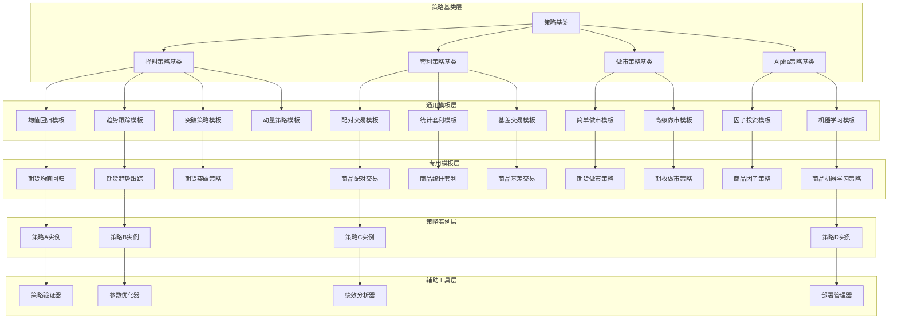
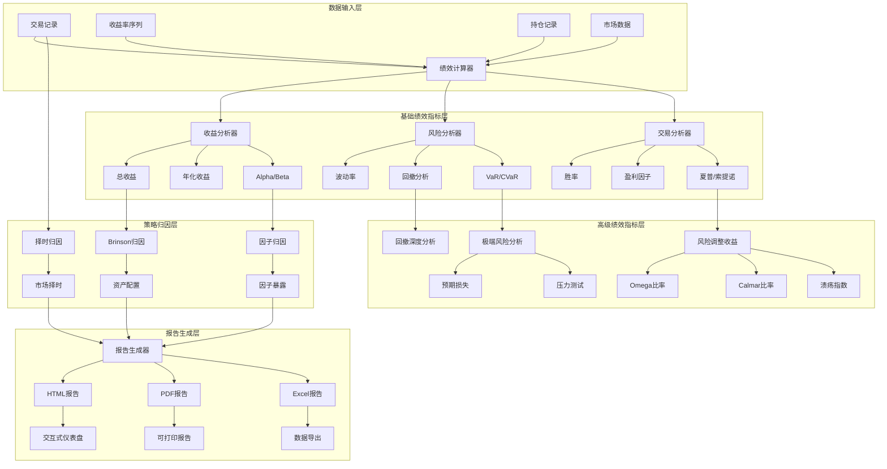

# 策略模版与绩效分析体系

## 1. 概述

本文档详细设计国内期货商品高频量化交易平台的策略模板体系和绩效分析框架。作为策略研究平台设计部分的第三份文档，重点描述策略开发标准化模板、全面绩效评估指标、风险度量方法和策略管理流程。

**设计目标：**
- 建立标准化的策略模板库，提高策略开发效率和质量
- 提供全面的绩效分析指标体系，支持多维度策略评估
- 实现专业的风险度量方法，符合机构投资标准
- 建立策略生命周期管理系统，支持策略从研究到生产的全流程管理
- 提供策略归因分析工具，深入理解策略收益来源

**核心原则：**
1. **模板标准化原则：** 所有策略基于标准化模板开发，确保代码质量和可维护性
2. **评估全面性原则：** 绩效评估包含收益、风险、稳定性等多个维度
3. **风险真实性原则：** 风险度量反映真实市场风险和极端情况
4. **管理流程化原则：** 策略管理遵循标准化的生命周期流程

## 2. 策略模板体系

### 2.1 策略模板架构



### 2.2 策略基类设计

#### C++策略基类
```cpp
// 策略基类
class StrategyBase {
public:
    virtual ~StrategyBase() = default;
    
    // 策略生命周期管理
    virtual void initialize(const StrategyContext& context) = 0;
    virtual void start() = 0;
    virtual void stop() = 0;
    virtual void pause() = 0;
    virtual void resume() = 0;
    
    // 事件处理接口
    virtual void on_market_data(const MarketData& data) = 0;
    virtual void on_order_status(const OrderStatus& status) = 0;
    virtual void on_trade(const Trade& trade) = 0;
    virtual void on_position_update(const PositionUpdate& update) = 0;
    virtual void on_account_update(const AccountUpdate& update) = 0;
    
    // 定时事件
    virtual void on_bar_open(const Bar& bar) = 0;
    virtual void on_bar_close(const Bar& bar) = 0;
    virtual void on_daily_open() = 0;
    virtual void on_daily_close() = 0;
    virtual void on_weekly_close() = 0;
    virtual void on_monthly_close() = 0;
    
    // 策略状态查询
    virtual StrategyState get_state() const = 0;
    virtual std::vector<Position> get_positions() const = 0;
    virtual std::vector<ActiveOrder> get_active_orders() const = 0;
    virtual AccountInfo get_account_info() const = 0;
    
    // 策略元数据
    virtual StrategyMetadata get_metadata() const = 0;
    
    // 参数管理
    virtual void set_parameters(const ParameterMap& params) = 0;
    virtual ParameterMap get_parameters() const = 0;
    virtual ParameterRanges get_parameter_ranges() const = 0;
    
    // 性能统计
    virtual PerformanceStats get_performance_stats() const = 0;
    virtual RiskMetrics get_risk_metrics() const = 0;
    
    // 序列化支持
    virtual std::vector<uint8_t> serialize() const = 0;
    virtual bool deserialize(const std::vector<uint8_t>& data) = 0;
    
protected:
    // 受保护的交易接口（子类使用）
    virtual OrderResult place_order(const OrderRequest& request) = 0;
    virtual CancelResult cancel_order(const std::string& order_id) = 0;
    virtual CancelAllResult cancel_all_orders() = 0;
    
    // 数据访问接口
    virtual std::optional<MarketData> get_market_data(
        const std::string& instrument_id) const = 0;
    virtual std::vector<Bar> get_bars(
        const std::string& instrument_id,
        BarPeriod period,
        int count) const = 0;
    
    // 日志接口
    virtual void log_info(const std::string& message) = 0;
    virtual void log_warning(const std::string& message) = 0;
    virtual void log_error(const std::string& message) = 0;
    virtual void log_debug(const std::string& message) = 0;
};

// 策略元数据
struct StrategyMetadata {
    std::string strategy_id;            // 策略ID
    std::string strategy_name;          // 策略名称
    std::string description;            // 策略描述
    
    // 策略分类
    enum class StrategyCategory {
        TIMING,                // 择时策略
        ARBITRAGE,             // 套利策略
        MARKET_MAKING,         // 做市策略
        ALPHA,                 // Alpha策略
        HEDGING,               // 对冲策略
        PORTFOLIO              // 组合策略
    } category;
    
    enum class TimeHorizon {
        HIGH_FREQUENCY,        // 高频（秒级）
        SHORT_TERM,            // 短期（分钟-小时）
        MEDIUM_TERM,           // 中期（日-周）
        LONG_TERM              // 长期（月-年）
    } time_horizon;
    
    // 适用市场
    std::vector<std::string> applicable_markets;  // 适用市场
    std::vector<std::string> applicable_instruments; // 适用合约
    
    // 性能特征
    struct PerformanceProfile {
        double expected_sharpe_ratio;   // 预期夏普比率
        double expected_annual_return;  // 预期年化收益
        double expected_max_drawdown;   // 预期最大回撤
        double expected_turnover;       // 预期换手率
        double expected_win_rate;       // 预期胜率
    } performance_profile;
    
    // 风险特征
    struct RiskProfile {
        double market_risk_exposure;    // 市场风险暴露
        double liquidity_risk;          // 流动性风险
        double counterparty_risk;       // 对手方风险
        double operational_risk;        // 操作风险
        std::vector<std::string> risk_factors; // 风险因子
    } risk_profile;
    
    // 开发信息
    std::string author;
    std::string version;
    TimePoint created_time;
    TimePoint last_modified;
    std::vector<std::string> dependencies; // 依赖库
    
    // 合规信息
    bool regulatory_compliant;          // 是否符合监管要求
    std::vector<std::string> compliance_notes; // 合规说明
};
```

#### Python策略基类
```python
from typing import Optional, List, Dict, Any, Callable
from dataclasses import dataclass, field
from datetime import datetime
from enum import Enum
import pandas as pd

class StrategyCategory(Enum):
    """策略分类"""
    TIMING = "timing"                # 择时策略
    ARBITRAGE = "arbitrage"          # 套利策略
    MARKET_MAKING = "market_making"  # 做市策略
    ALPHA = "alpha"                  # Alpha策略
    HEDGING = "hedging"              # 对冲策略
    PORTFOLIO = "portfolio"          # 组合策略

class StrategyBase:
    """策略基类（Python版本）"""
    
    def __init__(self, strategy_id: str, **params):
        self.strategy_id = strategy_id
        self.params = params
        self.context = None
        self.positions = {}
        self.orders = {}
        
    def initialize(self, context: 'Context'):
        """策略初始化"""
        self.context = context
        
    def before_trading_start(self):
        """盘前处理"""
        pass
    
    def handle_data(self, data: Dict[str, Any]):
        """处理市场数据"""
        pass
    
    def after_trading_end(self):
        """盘后处理"""
        pass
    
    def on_order_status(self, order: 'Order'):
        """订单状态更新"""
        pass
    
    def on_trade(self, trade: 'Trade'):
        """成交回报"""
        pass
    
    # 交易接口
    def order(self, asset: str, amount: float):
        """下单"""
        pass
    
    def order_target(self, asset: str, target: float):
        """目标仓位下单"""
        pass
    
    def order_percent(self, asset: str, percent: float):
        """百分比下单"""
        pass
    
    def cancel_order(self, order_id: str):
        """撤单"""
        pass
    
    # 策略状态
    def get_positions(self) -> Dict[str, float]:
        """获取持仓"""
        return self.positions.copy()
    
    def get_active_orders(self) -> List['Order']:
        """获取活跃订单"""
        return list(self.orders.values())
    
    def get_metadata(self) -> Dict[str, Any]:
        """获取策略元数据"""
        return {
            'strategy_id': self.strategy_id,
            'strategy_name': self.__class__.__name__,
            'category': self.get_category().value,
            'author': 'Unknown',
            'version': '1.0',
            'created_time': datetime.now()
        }
    
    @classmethod
    def get_category(cls) -> StrategyCategory:
        """获取策略分类"""
        return StrategyCategory.TIMING
```

### 2.3 常用策略模板实现

#### 均值回归策略模板
```cpp
// 均值回归策略模板
class MeanReversionStrategy : public StrategyBase {
public:
    struct Parameters {
        double lookback_period = 20;      // 回看周期
        double entry_zscore = 2.0;        // 入场Z-score阈值
        double exit_zscore = 0.5;         // 出场Z-score阈值
        double position_size = 0.1;       // 仓位大小（占总资金比例）
        double stop_loss = 0.05;          // 止损比例
        int max_holding_period = 10;      // 最大持有周期
        
        // 验证参数
        bool validate() const {
            return lookback_period > 0 && 
                   entry_zscore > exit_zscore &&
                   position_size > 0 && position_size <= 1.0 &&
                   stop_loss > 0 && stop_loss < 1.0 &&
                   max_holding_period > 0;
        }
    };
    
    MeanReversionStrategy(const std::string& strategy_id,
                         const Parameters& params)
        : strategy_id_(strategy_id), params_(params) {}
    
    void initialize(const StrategyContext& context) override {
        context_ = context;
        position_manager_.initialize(context);
        risk_manager_.initialize(context);
        
        // 初始化统计窗口
        for (const auto& instrument : context.config().instruments) {
            price_windows_[instrument] = RollingWindow<double>(
                params_.lookback_period);
            zscore_calculators_[instrument] = ZScoreCalculator(
                params_.lookback_period);
        }
        
        log_info(fmt::format("MeanReversionStrategy {} initialized", 
                            strategy_id_));
    }
    
    void on_bar_close(const Bar& bar) override {
        const auto& instrument_id = bar.instrument_id;
        
        // 更新价格窗口
        price_windows_[instrument_id].push(bar.close);
        
        if (!price_windows_[instrument_id].full()) {
            return;  // 数据不足，不交易
        }
        
        // 计算Z-score
        double zscore = zscore_calculators_[instrument_id].calculate(
            bar.close, price_windows_[instrument_id]);
        
        // 检查现有仓位
        auto position = position_manager_.get_position(instrument_id);
        bool has_position = std::abs(position) > 1e-6;
        
        if (!has_position) {
            // 无仓位，检查入场信号
            if (std::abs(zscore) > params_.entry_zscore) {
                generate_entry_signal(instrument_id, bar, zscore);
            }
        } else {
            // 有仓位，检查出场信号
            bool exit_signal = false;
            
            // Z-score回归出场
            if (std::abs(zscore) < params_.exit_zscore) {
                exit_signal = true;
            }
            
            // 止损出场
            double unrealized_pnl = position_manager_.get_unrealized_pnl(
                instrument_id);
            double entry_value = position_manager_.get_entry_value(
                instrument_id);
            
            if (entry_value > 0 && 
                std::abs(unrealized_pnl / entry_value) > params_.stop_loss) {
                exit_signal = true;
                log_warning(fmt::format("Stop loss triggered for {}", 
                                       instrument_id));
            }
            
            // 时间出场
            auto holding_period = position_manager_.get_holding_period(
                instrument_id);
            if (holding_period >= params_.max_holding_period) {
                exit_signal = true;
                log_info(fmt::format("Max holding period reached for {}", 
                                    instrument_id));
            }
            
            if (exit_signal) {
                generate_exit_signal(instrument_id, bar);
            }
        }
    }
    
private:
    void generate_entry_signal(const std::string& instrument_id,
                              const Bar& bar, double zscore) {
        // 确定交易方向
        Direction direction = (zscore > 0) ? Direction::SELL : Direction::BUY;
        
        // 计算仓位大小
        double account_value = context_.get_account_info().total_asset;
        double position_value = account_value * params_.position_size;
        double contract_size = context_.get_instrument_info(instrument_id)
                                     .contract_multiplier;
        int volume = static_cast<int>(position_value / (bar.close * contract_size));
        
        if (volume == 0) {
            log_warning("Position size too small");
            return;
        }
        
        // 创建订单
        OrderRequest request{
            .instrument_id = instrument_id,
            .direction = direction,
            .offset_flag = OffsetFlag::OPEN,
            .price = bar.close,
            .volume = volume,
            .order_type = OrderType::LIMIT,
            .time_in_force = TimeInForce::DAY
        };
        
        // 风控检查
        auto risk_check = risk_manager_.check_order(request);
        if (!risk_check.passed) {
            log_error(fmt::format("Risk check failed: {}", 
                                 risk_check.message));
            return;
        }
        
        // 提交订单
        auto result = place_order(request);
        if (result.success) {
            log_info(fmt::format("Entry order placed: {} {} {} @ {}",
                                instrument_id,
                                direction_to_string(direction),
                                volume, bar.close));
        }
    }
    
    void generate_exit_signal(const std::string& instrument_id,
                             const Bar& bar) {
        auto position = position_manager_.get_position(instrument_id);
        if (std::abs(position) < 1e-6) return;
        
        Direction direction = (position > 0) ? Direction::SELL : Direction::BUY;
        
        OrderRequest request{
            .instrument_id = instrument_id,
            .direction = direction,
            .offset_flag = OffsetFlag::CLOSE,
            .price = bar.close,
            .volume = static_cast<int>(std::abs(position)),
            .order_type = OrderType::LIMIT,
            .time_in_force = TimeInForce::DAY
        };
        
        auto result = place_order(request);
        if (result.success) {
            log_info(fmt::format("Exit order placed: {} {} {} @ {}",
                                instrument_id,
                                direction_to_string(direction),
                                request.volume, bar.close));
        }
    }
    
    std::string strategy_id_;
    Parameters params_;
    StrategyContext context_;
    
    // 组件
    PositionManager position_manager_;
    RiskManager risk_manager_;
    
    // 数据存储
    std::unordered_map<std::string, RollingWindow<double>> price_windows_;
    std::unordered_map<std::string, ZScoreCalculator> zscore_calculators_;
};
```

#### 配对交易策略模板
```cpp
// 配对交易策略模板
class PairTradingStrategy : public StrategyBase {
public:
    struct Parameters {
        std::string asset_a;              // 资产A
        std::string asset_b;              // 资产B
        
        double hedge_ratio = 1.0;         // 对冲比率
        int lookback_period = 60;         // 回看周期（天）
        double entry_threshold = 2.0;     // 入场阈值（标准差）
        double exit_threshold = 0.5;      // 出场阈值（标准差）
        double stop_loss = 0.1;           // 止损比例
        double max_position = 0.2;        // 最大仓位比例
        
        // 协整检验参数
        double cointegration_pvalue = 0.05; // 协整检验p值阈值
        int adf_lags = 1;                 // ADF检验滞后阶数
    };
    
    PairTradingStrategy(const std::string& strategy_id,
                       const Parameters& params)
        : strategy_id_(strategy_id), params_(params) {}
    
    void initialize(const StrategyContext& context) override {
        context_ = context;
        
        // 初始化协整检验器
        cointegration_tester_.initialize(params_.lookback_period,
                                        params_.cointegration_pvalue,
                                        params_.adf_lags);
        
        // 初始化价差跟踪
        spread_calculator_.initialize(params_.hedge_ratio);
        
        // 初始化统计模型
        spread_model_.initialize(params_.lookback_period);
        
        log_info(fmt::format("PairTradingStrategy {} initialized for {} vs {}",
                            strategy_id_, params_.asset_a, params_.asset_b));
    }
    
    void on_daily_close() override {
        // 获取历史价格
        auto prices_a = get_historical_prices(params_.asset_a, 
                                             params_.lookback_period);
        auto prices_b = get_historical_prices(params_.asset_b,
                                             params_.lookback_period);
        
        if (prices_a.empty() || prices_b.empty()) {
            return;
        }
        
        // 检查协整关系
        auto coint_result = cointegration_tester_.test(prices_a, prices_b);
        
        if (!coint_result.cointegrated) {
            log_warning("Pair is not cointegrated, waiting...");
            
            // 如果没有协整关系，平掉现有仓位
            close_all_positions();
            return;
        }
        
        // 计算价差
        double current_spread = spread_calculator_.calculate(
            get_current_price(params_.asset_a),
            get_current_price(params_.asset_b));
        
        // 更新价差模型
        spread_model_.update(current_spread);
        
        // 计算Z-score
        double zscore = spread_model_.get_zscore(current_spread);
        
        // 检查交易信号
        check_trading_signals(zscore, coint_result.hedge_ratio);
    }
    
private:
    void check_trading_signals(double zscore, double optimal_hedge_ratio) {
        // 更新对冲比率（如果需要）
        if (std::abs(optimal_hedge_ratio - params_.hedge_ratio) > 0.1) {
            params_.hedge_ratio = optimal_hedge_ratio;
            spread_calculator_.update_hedge_ratio(optimal_hedge_ratio);
            log_info(fmt::format("Hedge ratio updated to {:.4f}", 
                                optimal_hedge_ratio));
        }
        
        // 获取现有仓位
        double position_a = position_manager_.get_position(params_.asset_a);
        double position_b = position_manager_.get_position(params_.asset_b);
        bool has_position = std::abs(position_a) > 1e-6 || 
                           std::abs(position_b) > 1e-6;
        
        if (!has_position) {
            // 无仓位，检查入场信号
            if (std::abs(zscore) > params_.entry_threshold) {
                generate_entry_signal(zscore);
            }
        } else {
            // 有仓位，检查出场信号
            bool exit_signal = false;
            
            // Z-score回归出场
            if (std::abs(zscore) < params_.exit_threshold) {
                exit_signal = true;
            }
            
            // 止损出场
            double total_pnl = position_manager_.get_total_unrealized_pnl();
            double total_value = position_manager_.get_total_position_value();
            
            if (total_value > 0 && 
                std::abs(total_pnl / total_value) > params_.stop_loss) {
                exit_signal = true;
                log_warning("Pair trading stop loss triggered");
            }
            
            // 协整关系失效出场
            if (!cointegration_tester_.is_currently_cointegrated()) {
                exit_signal = true;
                log_warning("Cointegration relationship broken");
            }
            
            if (exit_signal) {
                generate_exit_signal();
            }
        }
    }
    
    void generate_entry_signal(double zscore) {
        // 确定交易方向
        // zscore > 0: 价差偏高，卖A买B
        // zscore < 0: 价差偏低，买A卖B
        
        double account_value = context_.get_account_info().total_asset;
        double position_value = account_value * params_.max_position;
        
        // 计算合约数量
        double price_a = get_current_price(params_.asset_a);
        double price_b = get_current_price(params_.asset_b);
        
        double contract_size_a = context_.get_instrument_info(params_.asset_a)
                                      .contract_multiplier;
        double contract_size_b = context_.get_instrument_info(params_.asset_b)
                                      .contract_multiplier;
        
        if (zscore > 0) {
            // 卖A买B
            int volume_a = static_cast<int>(
                position_value / (price_a * contract_size_a));
            int volume_b = static_cast<int>(
                position_value * params_.hedge_ratio / 
                (price_b * contract_size_b));
            
            place_pair_order(params_.asset_a, Direction::SELL, volume_a,
                           params_.asset_b, Direction::BUY, volume_b);
        } else {
            // 买A卖B
            int volume_a = static_cast<int>(
                position_value / (price_a * contract_size_a));
            int volume_b = static_cast<int>(
                position_value * params_.hedge_ratio / 
                (price_b * contract_size_b));
            
            place_pair_order(params_.asset_a, Direction::BUY, volume_a,
                           params_.asset_b, Direction::SELL, volume_b);
        }
    }
    
    void place_pair_order(const std::string& asset_a, Direction dir_a, int vol_a,
                         const std::string& asset_b, Direction dir_b, int vol_b) {
        // 实现配对订单逻辑
        // 注意：实际实现需要考虑订单执行风险和同步问题
    }
    
    std::string strategy_id_;
    Parameters params_;
    StrategyContext context_;
    
    // 统计分析组件
    CointegrationTester cointegration_tester_;
    SpreadCalculator spread_calculator_;
    SpreadModel spread_model_;
    PositionManager position_manager_;
};
```

## 3. 绩效分析体系

### 3.1 绩效分析框架



### 3.2 绩效分析引擎

#### C++接口定义
```cpp
// 绩效分析引擎
class PerformanceAnalyzer {
public:
    virtual ~PerformanceAnalyzer() = default;
    
    // 绩效数据输入
    virtual void set_returns(const ReturnSeries& returns) = 0;
    virtual void set_benchmark_returns(const ReturnSeries& benchmark) = 0;
    virtual void set_trades(const std::vector<Trade>& trades) = 0;
    virtual void set_positions(const std::vector<PositionRecord>& positions) = 0;
    
    // 基础绩效指标计算
    virtual BasicMetrics calculate_basic_metrics() const = 0;
    virtual RiskMetrics calculate_risk_metrics() const = 0;
    virtual TradeMetrics calculate_trade_metrics() const = 0;
    
    // 高级绩效指标计算
    virtual AdvancedMetrics calculate_advanced_metrics() const = 0;
    virtual DrawdownAnalysis analyze_drawdowns() const = 0;
    virtual ExtremeRiskMetrics calculate_extreme_risk() const = 0;
    
    // 策略归因分析
    virtual FactorAttribution perform_factor_attribution(
        const std::vector<FactorSeries>& factors) const = 0;
    
    virtual BrinsonAttribution perform_brinson_attribution(
        const PortfolioSnapshot& portfolio,
        const BenchmarkSnapshot& benchmark) const = 0;
    
    virtual TimingAttribution perform_timing_attribution() const = 0;
    
    // 绩效报告生成
    virtual PerformanceReport generate_report(
        ReportFormat format = ReportFormat::HTML) const = 0;
    
    virtual std::string generate_summary() const = 0;
    
    // 可视化数据
    virtual VisualizationData get_visualization_data() const = 0;
    
    // 绩效比较
    virtual ComparisonResult compare_with(
        const PerformanceAnalyzer& other,
        const ComparisonCriteria& criteria) const = 0;
};

// 基础绩效指标
struct BasicMetrics {
    // 收益指标
    double total_return;                 // 总收益
    double annual_return;                // 年化收益
    double cumulative_return;            // 累计收益
    
    // 相对收益指标
    double excess_return;                // 超额收益
    double information_ratio;            // 信息比率
    double tracking_error;               // 跟踪误差
    
    // 基准比较
    double alpha;                       // Alpha
    double beta;                        // Beta
    double r_squared;                   // R平方
    
    // 时间维度
    TimePoint start_date;
    TimePoint end_date;
    int trading_days;                   // 交易日数
    double years;                       // 年数
};

// 风险指标
struct RiskMetrics {
    // 波动性指标
    double volatility;                  // 波动率（年化）
    double downside_volatility;         // 下行波动率
    double upside_volatility;           // 上行波动率
    
    // 回撤指标
    double max_drawdown;                // 最大回撤
    double max_drawdown_duration;       // 最大回撤持续时间（天）
    double average_drawdown;            // 平均回撤
    double drawdown_frequency;          // 回撤频率
    
    // 风险价值
    double var_95;                      // 95% VaR
    double cvar_95;                     // 95% CVaR
    double expected_shortfall;          // 预期损失
    
    // 分布特征
    double skewness;                    // 偏度
    double kurtosis;                    // 峰度
    double jarque_bera_stat;           // Jarque-Bera统计量
    double jarque_bera_pvalue;         // JB检验p值
};

// 交易指标
struct TradeMetrics {
    // 交易统计
    int total_trades;                   // 总交易次数
    int winning_trades;                 // 盈利交易次数
    int losing_trades;                  // 亏损交易次数
    
    // 胜率相关
    double win_rate;                    // 胜率
    double profit_factor;               // 盈利因子
    double average_win;                 // 平均盈利
    double average_loss;                // 平均亏损
    double average_trade;               // 平均交易
    
    // 连续统计
    int max_consecutive_wins;           // 最大连续盈利
    int max_consecutive_losses;         // 最大连续亏损
    double avg_consecutive_wins;        // 平均连续盈利
    double avg_consecutive_losses;      // 平均连续亏损
    
    // 持仓时间
    double avg_holding_period;          // 平均持仓时间（天）
    double median_holding_period;       // 中位持仓时间
    double max_holding_period;          // 最大持仓时间
};

// 高级绩效指标
struct AdvancedMetrics {
    // 风险调整收益
    double sharpe_ratio;                // 夏普比率
    double sortino_ratio;               // 索提诺比率
    double calmar_ratio;                // Calmar比率
    double treynor_ratio;               // 特雷诺比率
    
    // 其他比率
    double omega_ratio;                 // Omega比率
    double gain_to_pain_ratio;          // 收益痛苦比
    double ulcer_index;                 // 溃疡指数
    double martin_ratio;                // 马丁比率
    
    // 统计检验
    double t_statistic;                 // t统计量
    double p_value;                     // p值
    double confidence_interval_lower;   // 置信区间下限
    double confidence_interval_upper;   // 置信区间上限
};
```

#### Python接口定义
```python
from typing import Optional, List, Dict, Any, Tuple
from dataclasses import dataclass, field
from datetime import datetime
import pandas as pd
import numpy as np

class PerformanceAnalyzer:
    """绩效分析引擎（Python版本）"""
    
    def __init__(self, returns: pd.Series, 
                benchmark: Optional[pd.Series] = None,
                trades: Optional[pd.DataFrame] = None):
        self.returns = returns
        self.benchmark = benchmark
        self.trades = trades
        
    def calculate_basic_metrics(self) -> Dict[str, float]:
        """计算基础绩效指标"""
        metrics = {}
        
        # 收益指标
        metrics['total_return'] = self._calculate_total_return()
        metrics['annual_return'] = self._calculate_annual_return()
        metrics['cumulative_return'] = self._calculate_cumulative_return()
        
        # 相对收益指标
        if self.benchmark is not None:
            metrics['excess_return'] = self._calculate_excess_return()
            metrics['information_ratio'] = self._calculate_information_ratio()
            metrics['tracking_error'] = self._calculate_tracking_error()
            
            # 回归分析
            alpha, beta, r2 = self._calculate_regression_metrics()
            metrics['alpha'] = alpha
            metrics['beta'] = beta
            metrics['r_squared'] = r2
        
        return metrics
    
    def calculate_risk_metrics(self) -> Dict[str, float]:
        """计算风险指标"""
        metrics = {}
        
        # 波动性
        metrics['volatility'] = self._calculate_volatility()
        metrics['downside_volatility'] = self._calculate_downside_volatility()
        
        # 回撤分析
        drawdown_analysis = self._analyze_drawdowns()
        metrics['max_drawdown'] = drawdown_analysis['max_drawdown']
        metrics['max_drawdown_duration'] = drawdown_analysis['max_duration_days']
        
        # 风险价值
        metrics['var_95'] = self._calculate_var(0.95)
        metrics['cvar_95'] = self._calculate_cvar(0.95)
        
        # 分布特征
        metrics['skewness'] = self.returns.skew()
        metrics['kurtosis'] = self.returns.kurtosis()
        
        return metrics
    
    def calculate_trade_metrics(self) -> Dict[str, Any]:
        """计算交易指标"""
        if self.trades is None or self.trades.empty:
            return {}
        
        metrics = {}
        
        # 交易统计
        metrics['total_trades'] = len(self.trades)
        winning_trades = self.trades[self.trades['pnl'] > 0]
        losing_trades = self.trades[self.trades['pnl'] <= 0]
        
        metrics['winning_trades'] = len(winning_trades)
        metrics['losing_trades'] = len(losing_trades)
        metrics['win_rate'] = len(winning_trades) / len(self.trades) if len(self.trades) > 0 else 0
        
        # 盈利因子
        total_profit = winning_trades['pnl'].sum() if not winning_trades.empty else 0
        total_loss = abs(losing_trades['pnl'].sum()) if not losing_trades.empty else 0
        metrics['profit_factor'] = total_profit / total_loss if total_loss > 0 else float('inf')
        
        return metrics
    
    def generate_report(self, format: str = 'html') -> Any:
        """生成绩效报告"""
        # 收集所有指标
        basic = self.calculate_basic_metrics()
        risk = self.calculate_risk_metrics()
        trade = self.calculate_trade_metrics()
        
        # 组合报告
        report = {
            'basic_metrics': basic,
            'risk_metrics': risk,
            'trade_metrics': trade,
            'metadata': {
                'analysis_date': datetime.now(),
                'period': f"{self.returns.index[0]} to {self.returns.index[-1]}",
                'data_points': len(self.returns)
            }
        }
        
        if format == 'html':
            return self._generate_html_report(report)
        elif format == 'dataframe':
            return pd.DataFrame([{**basic, **risk, **trade}])
        else:
            return report
```

### 3.3 风险度量与压力测试

#### 风险度量框架
```cpp
// 风险度量引擎
class RiskMeasurementEngine {
public:
    // 风险度量方法
    enum class RiskMethod {
        HISTORICAL_SIMULATION,   // 历史模拟法
        PARAMETRIC,              // 参数法
        MONTE_CARLO,             // 蒙特卡洛模拟
        EXTREME_VALUE_THEORY     // 极值理论
    };
    
    // 计算风险指标
    virtual RiskMetrics calculate_risk_metrics(
        const ReturnSeries& returns,
        const RiskCalculationConfig& config) = 0;
    
    // 压力测试
    virtual StressTestResult perform_stress_test(
        const Portfolio& portfolio,
        const std::vector<StressScenario>& scenarios) = 0;
    
    // 情景分析
    virtual ScenarioAnalysisResult perform_scenario_analysis(
        const Portfolio& portfolio,
        const std::vector<MarketScenario>& scenarios) = 0;
    
    // 回溯测试
    virtual BacktestResult backtest_risk_models(
        const ReturnSeries& returns,
        const RiskModel& model) = 0;
    
    // 风险模型验证
    virtual ValidationResult validate_risk_model(
        const RiskModel& model,
        const ValidationData& data) = 0;
};

// 风险度量实现
class HistoricalVaRCalculator : public RiskMeasurementEngine {
public:
    RiskMetrics calculate_risk_metrics(
        const ReturnSeries& returns,
        const RiskCalculationConfig& config) override {
        
        RiskMetrics metrics;
        
        // 计算VaR（历史模拟法）
        std::vector<double> sorted_returns = returns.values();
        std::sort(sorted_returns.begin(), sorted_returns.end());
        
        // 计算不同置信水平的VaR
        for (double confidence : config.confidence_levels) {
            size_t index = static_cast<size_t>(
                sorted_returns.size() * (1 - confidence));
            
            if (index < sorted_returns.size()) {
                double var = sorted_returns[index];
                metrics.var_values[confidence] = var;
                
                // 计算CVaR（条件VaR）
                double cvar_sum = 0.0;
                size_t cvar_count = 0;
                
                for (size_t i = 0; i <= index && i < sorted_returns.size(); ++i) {
                    cvar_sum += sorted_returns[i];
                    cvar_count++;
                }
                
                if (cvar_count > 0) {
                    metrics.cvar_values[confidence] = cvar_sum / cvar_count;
                }
            }
        }
        
        // 计算预期损失
        metrics.expected_shortfall = calculate_expected_shortfall(returns);
        
        // 计算最大可能损失
        metrics.maximum_loss = *std::min_element(
            sorted_returns.begin(), sorted_returns.end());
        
        return metrics;
    }
    
private:
    double calculate_expected_shortfall(const ReturnSeries& returns) {
        // 计算预期损失（超过VaR的平均损失）
        if (returns.empty()) return 0.0;
        
        std::vector<double> sorted_returns = returns.values();
        std::sort(sorted_returns.begin(), sorted_returns.end());
        
        // 使用95%置信水平
        size_t var_index = static_cast<size_t>(sorted_returns.size() * 0.05);
        double var_95 = sorted_returns[var_index];
        
        double es_sum = 0.0;
        size_t es_count = 0;
        
        for (const auto& ret : sorted_returns) {
            if (ret <= var_95) {
                es_sum += ret;
                es_count++;
            }
        }
        
        return (es_count > 0) ? es_sum / es_count : 0.0;
    }
};
```

#### 压力测试实现
```cpp
// 压力测试引擎
class StressTestingEngine {
public:
    struct StressScenario {
        std::string scenario_id;
        std::string scenario_name;
        std::string description;
        
        // 市场冲击
        struct MarketShock {
            std::string instrument_id;
            double price_shock_percent;    // 价格冲击百分比
            double volatility_shock;       // 波动率冲击
            double correlation_shock;      // 相关性冲击
            double liquidity_shock;        // 流动性冲击
        };
        std::vector<MarketShock> market_shocks;
        
        // 时间参数
        TimePoint shock_time;
        TimeDelta shock_duration;
        
        // 严重程度
        enum class Severity {
            MILD,       // 轻度压力
            MODERATE,   // 中度压力
            SEVERE,     // 重度压力
            EXTREME     // 极端压力
        } severity;
    };
    
    // 执行压力测试
    StressTestResult perform_stress_test(
        const Portfolio& portfolio,
        const StressScenario& scenario) {
        
        StressTestResult result;
        result.scenario_id = scenario.scenario_id;
        result.scenario_name = scenario.scenario_name;
        result.severity = scenario.severity;
        
        // 复制组合用于压力测试
        Portfolio stressed_portfolio = portfolio;
        
        // 应用市场冲击
        for (const auto& shock : scenario.market_shocks) {
            apply_market_shock(stressed_portfolio, shock);
        }
        
        // 计算压力测试结果
        result.initial_portfolio_value = portfolio.get_total_value();
        result.stressed_portfolio_value = stressed_portfolio.get_total_value();
        result.loss_amount = result.initial_portfolio_value - 
                            result.stressed_portfolio_value;
        result.loss_percent = (result.loss_amount / 
                              result.initial_portfolio_value) * 100.0;
        
        // 计算风险指标变化
        result.var_change = calculate_var_change(portfolio, stressed_portfolio);
        result.expected_shortfall_change = calculate_es_change(
            portfolio, stressed_portfolio);
        
        // 识别脆弱点
        result.vulnerabilities = identify_vulnerabilities(
            portfolio, stressed_portfolio);
        
        // 生成缓解建议
        result.mitigation_suggestions = generate_mitigation_suggestions(
            result.vulnerabilities);
        
        return result;
    }
    
private:
    void apply_market_shock(Portfolio& portfolio, 
                           const StressScenario::MarketShock& shock) {
        // 应用价格冲击
        for (auto& position : portfolio.positions) {
            if (position.instrument_id == shock.instrument_id) {
                double original_price = position.market_price;
                double shocked_price = original_price * 
                                     (1 + shock.price_shock_percent / 100.0);
                
                position.market_price = shocked_price;
                
                // 更新头寸价值
                position.market_value = position.quantity * shocked_price * 
                                      position.contract_multiplier;
            }
        }
        
        // 应用波动率冲击（影响期权等衍生品）
        // 实现略...
        
        // 应用相关性冲击（影响组合风险）
        // 实现略...
        
        // 应用流动性冲击（影响交易成本）
        // 实现略...
    }
    
    std::vector<Vulnerability> identify_vulnerabilities(
        const Portfolio& original,
        const Portfolio& stressed) {
        
        std::vector<Vulnerability> vulnerabilities;
        
        // 识别最大损失头寸
        for (size_t i = 0; i < original.positions.size(); ++i) {
            const auto& orig_pos = original.positions[i];
            const auto& stressed_pos = stressed.positions[i];
            
            double loss = orig_pos.market_value - stressed_pos.market_value;
            double loss_percent = (loss / orig_pos.market_value) * 100.0;
            
            if (loss_percent > 10.0) {  // 损失超过10%视为脆弱点
                vulnerabilities.push_back({
                    .instrument_id = orig_pos.instrument_id,
                    .position_size = orig_pos.quantity,
                    .loss_amount = loss,
                    .loss_percent = loss_percent,
                    .vulnerability_type = "Price Sensitivity"
                });
            }
        }
        
        // 识别集中度风险
        double total_value = original.get_total_value();
        for (const auto& pos : original.positions) {
            double concentration = pos.market_value / total_value;
            
            if (concentration > 0.2) {  // 单一头寸超过20%视为集中风险
                vulnerabilities.push_back({
                    .instrument_id = pos.instrument_id,
                    .position_size = pos.quantity,
                    .loss_amount = 0,
                    .loss_percent = concentration * 100,
                    .vulnerability_type = "Concentration Risk"
                });
            }
        }
        
        return vulnerabilities;
    }
};
```

## 4. 策略生命周期管理

### 4.1 策略管理框架

```cpp
// 策略管理器
class StrategyManager {
public:
    // 策略状态
    enum class StrategyStatus {
        RESEARCH,          // 研究阶段
        PAPER_TRADING,     // 模拟交易
        LIVE_TESTING,      // 实盘测试
        PRODUCTION,        // 生产运行
        SUSPENDED,         // 暂停
        DEACTIVATED        // 停用
    };
    
    // 策略记录
    struct StrategyRecord {
        std::string strategy_id;
        std::string strategy_name;
        StrategyStatus status;
        
        // 版本信息
        std::string version;
        TimePoint created_time;
        TimePoint last_modified;
        TimePoint last_status_change;
        
        // 绩效信息
        std::optional<PerformanceMetrics> performance;
        std::optional<RiskMetrics> risk_metrics;
        
        // 配置信息
        ParameterMap parameters;
        std::vector<std::string> instruments;
        std::vector<std::string> accounts;
        
        // 运行信息
        TimePoint last_start_time;
        TimePoint last_stop_time;
        std::vector<std::string> dependencies;
    };
    
    // 策略操作
    virtual bool register_strategy(
        std::shared_ptr<StrategyBase> strategy,
        const RegistrationConfig& config) = 0;
    
    virtual bool unregister_strategy(const std::string& strategy_id) = 0;
    
    virtual bool start_strategy(const std::string& strategy_id) = 0;
    virtual bool stop_strategy(const std::string& strategy_id) = 0;
    virtual bool pause_strategy(const std::string& strategy_id) = 0;
    virtual bool resume_strategy(const std::string& strategy_id) = 0;
    
    virtual bool update_strategy_parameters(
        const std::string& strategy_id,
        const ParameterMap& params) = 0;
    
    // 策略查询
    virtual std::optional<StrategyRecord> 
    get_strategy_record(const std::string& strategy_id) const = 0;
    
    virtual std::vector<StrategyRecord> 
    list_strategies(const StrategyFilter& filter = {}) const = 0;
    
    virtual StrategyStatus 
    get_strategy_status(const std::string& strategy_id) const = 0;
    
    // 策略监控
    virtual MonitoringData 
    get_strategy_monitoring_data(const std::string& strategy_id) const = 0;
    
    virtual std::vector<Alert> 
    get_strategy_alerts(const std::string& strategy_id) const = 0;
    
    // 策略分析
    virtual AnalysisResult 
    analyze_strategy_performance(const std::string& strategy_id) const = 0;
    
    virtual ComparisonResult 
    compare_strategies(const std::vector<std::string>& strategy_ids) const = 0;
    
    // 策略生命周期管理
    virtual PromotionResult 
    promote_strategy(const std::string& strategy_id,
                    StrategyStatus target_status) = 0;
    
    virtual DemotionResult 
    demote_strategy(const std::string& strategy_id,
                   StrategyStatus target_status) = 0;
    
    virtual RetirementResult 
    retire_strategy(const std::string& strategy_id,
                   const std::string& reason) = 0;
    
    // 备份与恢复
    virtual BackupResult 
    backup_strategy(const std::string& strategy_id) = 0;
    
    virtual RestoreResult 
    restore_strategy(const std::string& backup_id) = 0;
};
```

### 4.2 策略审核流程

```cpp
// 策略审核系统
class StrategyReviewSystem {
public:
    // 审核阶段
    enum class ReviewStage {
        INITIAL_REVIEW,      // 初步审核
        RISK_ASSESSMENT,     // 风险评估
        PERFORMANCE_VALIDATION, // 绩效验证
        CODE_REVIEW,         // 代码审核
        COMPLIANCE_CHECK,    // 合规检查
        FINAL_APPROVAL       // 最终批准
    };
    
    // 审核结果
    enum class ReviewResult {
        APPROVED,           // 批准
        CONDITIONAL_APPROVAL, // 有条件批准
        REJECTED,           // 拒绝
        NEEDS_REVISION      // 需要修改
    };
    
    // 审核项目
    struct ReviewItem {
        std::string item_id;
        std::string description;
        ReviewStage stage;
        
        struct Checklist {
            std::string requirement;
            bool satisfied;
            std::string evidence;
            std::string comments;
        };
        std::vector<Checklist> checklists;
        
        ReviewResult result;
        std::string reviewer;
        TimePoint review_time;
        std::string comments;
    };
    
    // 提交审核
    virtual std::string submit_for_review(
        const std::string& strategy_id,
        const ReviewSubmission& submission) = 0;
    
    // 执行审核
    virtual bool perform_review(
        const std::string& review_id,
        ReviewStage stage,
        const ReviewEvaluation& evaluation) = 0;
    
    // 获取审核状态
    virtual ReviewStatus get_review_status(
        const std::string& review_id) const = 0;
    
    virtual std::vector<ReviewItem> get_review_items(
        const std::string& review_id) const = 0;
    
    // 审核决策
    virtual ReviewDecision make_decision(
        const std::string& review_id,
        ReviewResult result,
        const std::string& comments) = 0;
    
    // 审核历史
    virtual std::vector<ReviewHistory> get_review_history(
        const std::string& strategy_id) const = 0;
    
private:
    // 审核规则引擎
    class ReviewRuleEngine {
    public:
        struct ReviewRule {
            std::string rule_id;
            ReviewStage applicable_stage;
            std::function<bool(const StrategyRecord&)> condition;
            std::string requirement;
            std::string failure_message;
        };
        
        std::vector<ReviewRule> rules_;
        
        ReviewEvaluation evaluate_strategy(
            const StrategyRecord& strategy,
            ReviewStage stage) {
            
            ReviewEvaluation evaluation;
            
            for (const auto& rule : rules_) {
                if (rule.applicable_stage == stage) {
                    bool satisfied = rule.condition(strategy);
                    
                    evaluation.check_results.push_back({
                        .rule_id = rule.rule_id,
                        .requirement = rule.requirement,
                        .satisfied = satisfied,
                        .message = satisfied ? "" : rule.failure_message
                    });
                }
            }
            
            return evaluation;
        }
    };
    
    ReviewRuleEngine rule_engine_;
};
```

---

**文档版本：** v1.0  
**最后更新：** 2026-02-10  
**负责人：** 策略研究架构师  
**状态：** 草案 - 待技术评审  
**关联文档：** 
- [00-项目总览与设计原则.md](../00-项目总览与设计原则.md)
- [02-01-研究环境与数据接口规范.md](02-01-研究环境与数据接口规范.md)
- [02-02-因子研究与回测引擎设计.md](02-02-因子研究与回测引擎设计.md)

**技术决策记录：**
- 2026-02-10: 建立策略模板体系，包含均值回归、配对交易等常用模板
- 2026-02-10: 设计全面的绩效分析框架，包含基础指标、风险指标、交易指标
- 2026-02-10: 实现专业的风险度量方法，支持VaR、CVaR、压力测试等
- 2026-02-10: 制定策略生命周期管理系统，支持策略从研究到生产的全流程管理
- 2026-02-10: 建立策略审核流程，确保策略质量和合规性
- 2026-02-10: 设计策略归因分析工具，支持因子归因、Brinson归因等方法