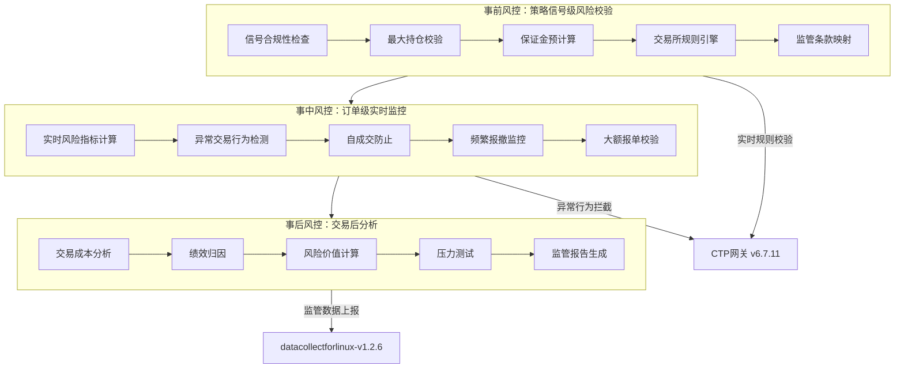

# 实时风控体系设计

## 1. 风控体系架构全景

本平台采用**三层立体风控体系**，将监管合规要求深度内嵌于交易核心流程，实现从策略信号生成到订单执行的全链路风险控制。风控体系遵循"事前预防、事中监控、事后分析"的原则，确保在满足《期货和衍生品法》及交易所特有规则的前提下，实现高频交易的低延迟风控处理。

### 1.1 风控体系层次结构



### 1.2 风控性能目标

| 风控环节 | 延迟要求（P99） | 吞吐量要求 | 准确性要求 | 适用场景 |
|---------|---------------|-----------|-----------|----------|
| 事前风控 | < 100μs | > 50,000 req/s | 100% | 策略信号生成时 |
| 事中风控 | < 50μs | > 100,000 req/s | 99.999% | 订单提交前 |
| 监管规则检查 | < 200μs | > 10,000 req/s | 100% | 实时风控决策 |
| 异常行为检测 | < 1ms | > 5,000 req/s | 99.9% | 订单流监控 |
| 风控指标计算 | < 5ms | > 1,000 req/s | 99.99% | 定时批量计算 |

## 2. 事前风控：策略信号级合规检查

### 2.1 合规规则引擎架构

事前风控的核心是**合规规则引擎**，它将《期货和衍生品法》、各交易所交易规则、公司内部风控制度转化为可执行的决策规则。

```cpp
// C++ 规则引擎核心接口定义
class ComplianceRuleEngine {
public:
    // 构造函数：加载规则配置
    explicit ComplianceRuleEngine(const std::string& rule_config_path);
    
    // 检查交易信号合规性
    struct SignalCheckResult {
        bool is_allowed;              // 是否允许交易
        std::string rule_id;          // 触发的规则ID
        std::string rejection_reason; // 拒绝原因（如允许则为空）
        double max_volume_allowed;    // 最大允许交易量
        RiskLevel risk_level;         // 风险等级评估
    };
    
    SignalCheckResult check_signal_compliance(
        const TradingSignal& signal,      // 交易信号
        const PortfolioState& portfolio,  // 当前持仓状态
        const MarketData& market_data     // 当前市场数据
    );
    
    // 动态规则更新（热加载）
    void update_rules(const RuleUpdate& update);
    
private:
    // 规则执行引擎
    class RuleExecutorImpl;
    std::unique_ptr<RuleExecutorImpl> executor_;
    
    // 规则缓存（LRU缓存最近检查结果）
    RuleCache cache_;
};
```

### 2.2 中国期货市场特有规则实现

#### 2.2.1 持仓限额规则

```python
# Python 持仓限额规则实现
class PositionLimitRule:
    """期货市场持仓限额规则"""
    
    def __init__(self, exchange: str, product_type: str):
        self.exchange = exchange
        self.product_type = product_type
        self.load_exchange_rules()
    
    def load_exchange_rules(self):
        """加载交易所特有持仓限额规则"""
        # 各交易所持仓限额规则（示例）
        self.limits = {
            # 上期所：不同品种不同限仓
            "SHFE": {
                "rb": {"general_limit": 3000, "hedge_limit": 6000},  # 螺纹钢
                "au": {"general_limit": 500, "hedge_limit": 1000},   # 黄金
                "cu": {"general_limit": 2000, "hedge_limit": 4000},  # 铜
            },
            # 大商所：按合约月份区分
            "DCE": {
                "i": {"single_month": 3000, "all_months": 10000},    # 铁矿石
                "m": {"single_month": 2000, "all_months": 8000},     # 豆粕
                "p": {"single_month": 1000, "all_months": 5000},     # 棕榈油
            },
            # 郑商所：按持仓类型区分
            "CZCE": {
                "CF": {"speculator": 2000, "hedger": 4000},          # 棉花
                "SR": {"speculator": 3000, "hedger": 6000},          # 白糖
                "TA": {"speculator": 4000, "hedger": 8000},          # PTA
            },
            # 中金所：金融期货特殊规则
            "CFFEX": {
                "IF": {"daily_limit": 1200, "total_limit": 5000},    # 股指期货
                "TF": {"daily_limit": 2000, "total_limit": 10000},   # 国债期货
            }
        }
    
    def check_position_limit(
        self, 
        current_position: int, 
        pending_order_volume: int,
        account_type: str = "speculator"
    ) -> Tuple[bool, int]:
        """检查持仓是否超过限额
        
        Args:
            current_position: 当前持仓手数
            pending_order_volume: 待成交订单手数
            account_type: 账户类型（speculator/hedger）
            
        Returns:
            (是否允许, 最大允许交易量)
        """
        # 获取该品种限额
        limits = self.limits[self.exchange][self.product_type]
        
        # 根据账户类型确定限额
        if "limit" in limits:
            # 简单限额
            max_position = limits["limit"]
        elif account_type in limits:
            # 投机/套保区分
            max_position = limits[account_type]
        else:
            # 通用限额
            max_position = limits.get("general_limit", 1000)
        
        # 计算最大可交易量
        max_tradable = max_position - current_position
        
        if max_tradable <= 0:
            return False, 0
        
        # 检查待成交订单是否超限
        total_after_order = current_position + pending_order_volume
        if total_after_order > max_position:
            # 部分允许
            allowed_volume = max_tradable
            return True, allowed_volume
        
        return True, pending_order_volume
```

#### 2.2.2 涨跌停板检查

```cpp
// C++ 涨跌停板实时检查
class PriceLimitChecker {
public:
    struct PriceLimitInfo {
        double upper_limit;   // 涨停板价格
        double lower_limit;   // 跌停板价格
        bool is_expanded;     // 是否处于扩板状态
        int expanded_days;    // 连续涨跌停天数
    };
    
    // 获取合约涨跌停价格（考虑扩板规则）
    PriceLimitInfo get_price_limit(
        const std::string& instrument_id,
        double previous_settlement,  // 昨日结算价
        double current_price,        // 当前价格
        int direction                // 方向：1=涨停检查，-1=跌停检查
    ) {
        PriceLimitInfo info;
        
        // 基础涨跌停幅度（交易所规定）
        double base_limit_rate = get_base_limit_rate(instrument_id);
        
        // 检查是否处于扩板状态
        int consecutive_limit_days = get_consecutive_limit_days(instrument_id);
        
        // 计算实际涨跌停幅度（考虑扩板规则）
        double actual_limit_rate = base_limit_rate;
        if (consecutive_limit_days >= 1) {
            // 连续涨跌停扩板规则
            actual_limit_rate *= (1.0 + 0.5 * consecutive_limit_days);
            info.is_expanded = true;
            info.expanded_days = consecutive_limit_days;
        }
        
        // 计算涨跌停价格
        info.upper_limit = previous_settlement * (1.0 + actual_limit_rate);
        info.lower_limit = previous_settlement * (1.0 - actual_limit_rate);
        
        // 四舍五入到最小变动价位
        info.upper_limit = round_to_tick_size(info.upper_limit, instrument_id);
        info.lower_limit = round_to_tick_size(info.lower_limit, instrument_id);
        
        return info;
    }
    
    // 检查订单价格是否触及涨跌停
    bool is_price_valid(
        const std::string& instrument_id,
        double order_price,
        OrderDirection direction
    ) {
        auto limits = get_price_limit(instrument_id);
        
        if (direction == OrderDirection::BUY) {
            // 买入订单：价格不能高于涨停板
            return order_price <= limits.upper_limit;
        } else {
            // 卖出订单：价格不能低于跌停板
            return order_price >= limits.lower_limit;
        }
    }
};
```

### 2.3 保证金动态管理

#### 2.3.1 实时保证金计算引擎

```python
# Python 保证金计算引擎
class MarginCalculator:
    """实时保证金计算引擎（支持组合保证金优化）"""
    
    def __init__(self):
        self.risk_models = self.load_risk_models()
        self.exchange_margin_rates = self.load_exchange_margin_rates()
        
    def calculate_initial_margin(
        self,
        positions: Dict[str, Position],
        market_data: Dict[str, MarketData]
    ) -> Dict[str, float]:
        """计算初始保证金
        
        支持两种模式：
        1. 传统模式：按持仓逐笔计算
        2. 组合保证金模式：考虑持仓间风险对冲
        """
        if self.use_portfolio_margin():
            return self.calculate_portfolio_margin(positions, market_data)
        else:
            return self.calculate_simple_margin(positions, market_data)
    
    def calculate_portfolio_margin(
        self,
        positions: Dict[str, Position],
        market_data: Dict[str, MarketData]
    ) -> Dict[str, float]:
        """组合保证金计算（SPAN-like算法）"""
        margin_results = {}
        
        # 1. 识别风险阵列（Risk Arrays）
        risk_arrays = self.build_risk_arrays(positions, market_data)
        
        # 2. 扫描风险场景（16个标准场景 + 极端场景）
        scenario_losses = self.scan_risk_scenarios(risk_arrays)
        
        # 3. 计算跨商品价差抵扣
        inter_commodity_spreads = self.calculate_spread_benefits(positions)
        
        # 4. 汇总计算总保证金
        total_margin = max(scenario_losses) - inter_commodity_spreads
        
        # 5. 分配保证金到各持仓
        margin_results = self.allocate_margin_to_positions(
            positions, total_margin, scenario_losses
        )
        
        return margin_results
    
    def calculate_maintenance_margin(
        self,
        positions: Dict[str, Position],
        unrealized_pnl: float
    ) -> Tuple[float, bool]:
        """计算维持保证金，检查是否触发强平"""
        total_margin = sum(
            self.calculate_initial_margin(positions).values()
        )
        
        # 维持保证金率（通常为初始保证金的75%-80%）
        maintenance_rate = self.get_maintenance_rate()
        maintenance_margin = total_margin * maintenance_rate
        
        # 检查保证金充足率
        available_margin = self.calculate_available_margin()
        margin_ratio = available_margin / maintenance_margin
        
        # 预警和强平阈值
        if margin_ratio < 1.0:
            # 触发强平
            return maintenance_margin, True
        elif margin_ratio < 1.2:
            # 预警级别
            return maintenance_margin, False
        
        return maintenance_margin, False
```

## 3. 事中风控：订单级实时监控

### 3.1 异常交易行为检测系统

#### 3.1.1 自成交防止（Self-Trade Prevention）

```cpp
// C++ 自成交防止引擎
class SelfTradePreventionEngine {
public:
    struct OrderInfo {
        std::string order_id;
        std::string instrument_id;
        OrderDirection direction;
        double price;
        int volume;
        int64_t timestamp_ns;
        std::string account_id;
        std::string strategy_id;
    };
    
    // 检查是否可能自成交
    SelfTradeCheckResult check_self_trade(
        const OrderInfo& new_order,
        const std::vector<OrderInfo>& pending_orders
    ) {
        SelfTradeCheckResult result;
        result.is_self_trade = false;
        
        // 快速过滤：方向相同不会自成交
        for (const auto& pending : pending_orders) {
            if (pending.instrument_id != new_order.instrument_id) {
                continue;
            }
            
            // 检查是否同一账户但不同策略
            if (pending.account_id == new_order.account_id) {
                // 相同账户内部交易检查
                if (is_opposite_direction(pending.direction, new_order.direction)) {
                    // 价格匹配检查
                    if (is_price_match(pending.price, new_order.price)) {
                        // 时间窗口检查（避免策略间正常对冲被误判）
                        int64_t time_diff = new_order.timestamp_ns - pending.timestamp_ns;
                        if (time_diff < SELF_TRADE_TIME_WINDOW_NS) {
                            result.is_self_trade = true;
                            result.matched_order_id = pending.order_id;
                            result.match_price = pending.price;
                            break;
                        }
                    }
                }
            }
        }
        
        return result;
    }
    
    // 自成交处理策略
    enum class SelfTradeAction {
        REJECT,         // 拒绝新订单
        CANCEL_OLD,     // 撤销旧订单
        REDUCE_VOLUME,  // 减少成交量
        DELAY_EXECUTION // 延迟执行
    };
    
    SelfTradeAction decide_self_trade_action(
        const SelfTradeCheckResult& check_result,
        const OrderPriority& priority
    ) {
        // 根据业务规则决定处理方式
        if (priority.is_high_frequency) {
            // 高频策略：优先拒绝新订单
            return SelfTradeAction::REJECT;
        } else if (priority.is_market_making) {
            // 做市策略：撤销旧订单，保持报价连续性
            return SelfTradeAction::CANCEL_OLD;
        } else {
            // 普通策略：减少成交量
            return SelfTradeAction::REDUCE_VOLUME;
        }
    }
};
```

#### 3.1.2 频繁报撤监控（Quote Stuffing Detection）

```python
# Python 频繁报撤监控
class QuoteStuffingMonitor:
    """频繁报撤单异常行为监控"""
    
    def __init__(self, window_size_ms: int = 1000, threshold: int = 50):
        self.window_size_ms = window_size_ms
        self.threshold = threshold  # 时间窗口内最大允许报撤次数
        self.order_history = []     # (timestamp_ms, order_id, action)
        
    def record_order_action(self, order_id: str, action: str):
        """记录订单行为（报单、撤单）"""
        timestamp_ms = time.time_ns() // 1_000_000
        self.order_history.append((timestamp_ms, order_id, action))
        
        # 清理过期记录
        self._cleanup_old_records()
        
        # 检查是否触发频繁报撤
        return self._check_quote_stuffing()
    
    def _cleanup_old_records(self):
        """清理时间窗口外的记录"""
        current_ms = time.time_ns() // 1_000_000
        cutoff_ms = current_ms - self.window_size_ms
        
        # 保留窗口内的记录
        self.order_history = [
            (ts, order_id, action) 
            for ts, order_id, action in self.order_history 
            if ts >= cutoff_ms
        ]
    
    def _check_quote_stuffing(self) -> Tuple[bool, Dict]:
        """检查是否触发频繁报撤规则"""
        if len(self.order_history) < self.threshold:
            return False, {}
        
        # 按时间窗口统计
        current_ms = time.time_ns() // 1_000_000
        start_ms = current_ms - self.window_size_ms
        
        # 统计窗口内的报撤行为
        actions_in_window = [
            (ts, order_id, action) 
            for ts, order_id, action in self.order_history 
            if ts >= start_ms
        ]
        
        if len(actions_in_window) >= self.threshold:
            # 触发频繁报撤检测
            stats = self._calculate_quote_stuffing_stats(actions_in_window)
            return True, stats
        
        return False, {}
    
    def _calculate_quote_stuffing_stats(self, actions: List) -> Dict:
        """计算频繁报撤统计信息"""
        # 按订单统计
        order_stats = {}
        for _, order_id, action in actions:
            if order_id not in order_stats:
                order_stats[order_id] = {"submits": 0, "cancels": 0}
            
            if action == "submit":
                order_stats[order_id]["submits"] += 1
            elif action == "cancel":
                order_stats[order_id]["cancels"] += 1
        
        # 计算报撤比
        total_submits = sum(stats["submits"] for stats in order_stats.values())
        total_cancels = sum(stats["cancels"] for stats in order_stats.values())
        cancel_ratio = total_cancels / total_submits if total_submits > 0 else 0
        
        return {
            "total_actions": len(actions),
            "unique_orders": len(order_stats),
            "total_submits": total_submits,
            "total_cancels": total_cancels,
            "cancel_ratio": cancel_ratio,
            "violation_level": self._calculate_violation_level(len(actions))
        }
    
    def _calculate_violation_level(self, action_count: int) -> str:
        """计算违规等级"""
        if action_count >= self.threshold * 3:
            return "SEVERE"
        elif action_count >= self.threshold * 2:
            return "HIGH"
        elif action_count >= self.threshold:
            return "MEDIUM"
        else:
            return "LOW"
```

### 3.2 实时风险指标计算

#### 3.2.1 风险指标监控面板

```cpp
// C++ 实时风险指标计算引擎
class RealTimeRiskMetrics {
public:
    struct RiskMetrics {
        // 市场风险指标
        double var_95;           // 95% VaR（1日）
        double expected_shortfall_95; // 95% ES
        double max_drawdown;     // 最大回撤
        double volatility_1min;  // 1分钟波动率
        
        // 流动性风险指标
        double bid_ask_spread;   // 买卖价差
        double market_depth;     // 市场深度（前5档）
        double volume_imbalance; // 成交量失衡
        
        // 信用风险指标
        double margin_utilization; // 保证金使用率
        double exposure_at_default; // 违约敞口
        
        // 操作风险指标
        int order_reject_rate;   // 订单拒绝率（每万笔）
        int system_latency_p99;  // 系统延迟P99（微秒）
    };
    
    // 实时计算风险指标
    RiskMetrics calculate_metrics(
        const PortfolioSnapshot& portfolio,
        const MarketDataSnapshot& market_data,
        const OrderFlow& order_flow
    ) {
        RiskMetrics metrics;
        
        // 使用滑动窗口计算VaR和ES
        metrics.var_95 = this->calculate_var_95(portfolio, market_data);
        metrics.expected_shortfall_95 = this->calculate_es_95(portfolio, market_data);
        
        // 实时波动率计算（EWMA模型）
        metrics.volatility_1min = this->calculate_ewma_volatility(
            market_data.price_returns, 0.94, 60
        );
        
        // 流动性指标
        metrics.bid_ask_spread = this->calculate_spread(market_data.order_book);
        metrics.market_depth = this->calculate_market_depth(
            market_data.order_book, 5
        );
        
        // 保证金使用率
        metrics.margin_utilization = this->calculate_margin_ratio(portfolio);
        
        // 系统性能指标
        metrics.order_reject_rate = this->calculate_reject_rate(order_flow);
        metrics.system_latency_p99 = this->get_system_latency_p99();
        
        return metrics;
    }
    
private:
    // VaR计算（历史模拟法）
    double calculate_var_95(const PortfolioSnapshot& portfolio,
                           const MarketDataSnapshot& market_data) {
        // 收集历史损益数据（最近1000个观测值）
        std::vector<double> pnl_changes = this->get_recent_pnl_changes(1000);
        
        if (pnl_changes.empty()) {
            return 0.0;
        }
        
        // 排序并找到95%分位数
        std::sort(pnl_changes.begin(), pnl_changes.end());
        size_t index = static_cast<size_t>(pnl_changes.size() * 0.05);
        
        return -pnl_changes[index];  // VaR为正数
    }
    
    // 期望损失计算
    double calculate_es_95(const PortfolioSnapshot& portfolio,
                          const MarketDataSnapshot& market_data) {
        std::vector<double> pnl_changes = this->get_recent_pnl_changes(1000);
        
        if (pnl_changes.empty()) {
            return 0.0;
        }
        
        // 排序并找到最差的5%
        std::sort(pnl_changes.begin(), pnl_changes.end());
        size_t worst_5pct_count = static_cast<size_t>(pnl_changes.size() * 0.05);
        
        if (worst_5pct_count == 0) {
            return -pnl_changes[0];
        }
        
        // 计算最差5%的平均值
        double sum_worst = 0.0;
        for (size_t i = 0; i < worst_5pct_count; ++i) {
            sum_worst += pnl_changes[i];
        }
        
        return -sum_worst / worst_5pct_count;
    }
};
```

### 3.3 熔断机制与自动干预

#### 3.3.1 多层次熔断触发机制

```python
# Python 熔断机制实现
class CircuitBreakerSystem:
    """多层次熔断与自动干预系统"""
    
    def __init__(self):
        self.breakers = {
            "account_level": AccountLevelBreaker(),
            "strategy_level": StrategyLevelBreaker(),
            "portfolio_level": PortfolioLevelBreaker(),
            "system_level": SystemLevelBreaker()
        }
        
        # 熔断状态
        self.breaker_states = {}
        
    def check_and_trigger(self, risk_event: RiskEvent) -> List[BreakerAction]:
        """检查并触发熔断机制"""
        triggered_actions = []
        
        # 检查各层级熔断条件
        for level, breaker in self.breakers.items():
            if breaker.should_trigger(risk_event):
                action = breaker.trigger(risk_event)
                triggered_actions.append(action)
                
                # 记录熔断状态
                self.breaker_states[level] = {
                    "triggered_at": time.time(),
                    "reason": risk_event.reason,
                    "action": action.action_type
                }
        
        return triggered_actions
    
    def get_recovery_plan(self) -> Dict[str, RecoveryStep]:
        """获取熔断恢复计划"""
        recovery_plan = {}
        
        for level, state in self.breaker_states.items():
            if state:
                breaker = self.breakers[level]
                recovery_plan[level] = breaker.get_recovery_steps(state)
        
        return recovery_plan


class AccountLevelBreaker:
    """账户层级熔断器"""
    
    def should_trigger(self, risk_event: RiskEvent) -> bool:
        """检查是否触发账户级熔断"""
        if risk_event.event_type == "MARGIN_CALL":
            # 保证金追缴触发
            return risk_event.severity >= "HIGH"
        
        elif risk_event.event_type == "LARGE_LOSS":
            # 大额亏损触发
            loss_ratio = risk_event.data.get("loss_ratio", 0)
            return loss_ratio >= 0.05  # 单日亏损超过5%
        
        elif risk_event.event_type == "HIGH_TURNOVER":
            # 过高换手率触发
            turnover_ratio = risk_event.data.get("turnover_ratio", 0)
            return turnover_ratio >= 10.0  # 日换手率超过10倍
        
        return False
    
    def trigger(self, risk_event: RiskEvent) -> BreakerAction:
        """触发账户级熔断"""
        action = BreakerAction(
            action_type="ACCOUNT_LIMIT",
            parameters={
                "max_position_limit": 0.5,  # 仓位限制为50%
                "max_order_volume": 100,     # 单笔最大100手
                "cooling_period_minutes": 30  # 冷却期30分钟
            }
        )
        return action


class SystemLevelBreaker:
    """系统层级熔断器（最高级别）"""
    
    def should_trigger(self, risk_event: RiskEvent) -> bool:
        """检查是否触发系统级熔断"""
        if risk_event.event_type == "MARKET_CRASH":
            # 市场暴跌触发
            market_drop = risk_event.data.get("market_drop_pct", 0)
            return market_drop >= 7.0  # 市场暴跌超过7%
        
        elif risk_event.event_type == "SYSTEM_FAILURE":
            # 系统故障触发
            return True
        
        elif risk_event.event_type == "REGULATORY_ALERT":
            # 监管警报触发
            return risk_event.severity == "CRITICAL"
        
        return False
    
    def trigger(self, risk_event: RiskEvent) -> BreakerAction:
        """触发系统级熔断"""
        action = BreakerAction(
            action_type="FULL_STOP",
            parameters={
                "stop_all_trading": True,
                "close_all_positions": False,  # 不立即平仓，等待人工决策
                "notify_risk_manager": True,
                "escalation_level": "EXECUTIVE"
            }
        )
        return action
```

## 4. 事后风控：交易后分析与监管合规

### 4.1 穿透式监管数据上报

#### 4.1.1 监管数据采集与上报引擎

```cpp
// C++ 监管数据采集引擎（datacollectforlinux-v1.2.6适配）
class RegulatoryDataCollector {
public:
    // 初始化监管数据采集
    bool initialize(const std::string& config_path) {
        // 加载监管配置
        regulatory_config_ = load_config(config_path);
        
        // 初始化数据采集器
        if (!init_data_collector()) {
            LOG_ERROR("Failed to initialize regulatory data collector");
            return false;
        }
        
        // 启动上报线程
        reporting_thread_ = std::thread(&RegulatoryDataCollector::reporting_loop, this);
        
        return true;
    }
    
    // 记录交易数据（满足穿透式监管要求）
    void record_trade_data(const TradeRecord& trade) {
        std::lock_guard<std::mutex> lock(data_mutex_);
        
        // 记录完整交易信息
        RegulatoryTradeRecord reg_record = convert_to_regulatory_format(trade);
        
        // 添加监管要求字段
        reg_record.timestamp_ns = get_current_timestamp_ns();
        reg_record.machine_id = get_machine_id();
        reg_record.process_id = get_process_id();
        reg_record.thread_id = get_thread_id();
        
        // 存储到缓冲区
        trade_buffer_.push_back(reg_record);
        
        // 检查是否达到批量上报阈值
        if (trade_buffer_.size() >= BATCH_REPORT_SIZE) {
            trigger_batch_report();
        }
    }
    
    // 记录订单数据
    void record_order_data(const OrderRecord& order) {
        RegulatoryOrderRecord reg_order = convert_order_to_regulatory(order);
        
        // 添加订单生命周期追踪
        reg_order.order_sequence = generate_order_sequence();
        reg_order.system_timestamp = get_system_timestamp();
        
        order_buffer_.push_back(reg_order);
    }
    
private:
    // 监管数据上报循环
    void reporting_loop() {
        while (!stop_requested_) {
            // 定时上报（即使未达到批量阈值）
            std::this_thread::sleep_for(std::chrono::seconds(REPORT_INTERVAL_SEC));
            
            // 上报交易数据
            if (!trade_buffer_.empty()) {
                report_trade_data();
            }
            
            // 上报订单数据
            if (!order_buffer_.empty()) {
                report_order_data();
            }
            
            // 上报终端信息（每分钟）
            if (should_report_terminal_info()) {
                report_terminal_info();
            }
        }
    }
    
    // 批量上报交易数据
    void report_trade_data() {
        std::lock_guard<std::mutex> lock(data_mutex_);
        
        if (trade_buffer_.empty()) {
            return;
        }
        
        // 准备上报数据
        RegulatoryReport report;
        report.report_type = "TRADE_DATA";
        report.timestamp = get_current_timestamp();
        report.records = std::move(trade_buffer_);
        
        // 清空缓冲区
        trade_buffer_.clear();
        
        // 发送到监管数据采集系统
        send_to_regulatory_system(report);
    }
    
    // 转换交易记录为监管格式
    RegulatoryTradeRecord convert_to_regulatory_format(const TradeRecord& trade) {
        RegulatoryTradeRecord reg;
        
        // 基础交易信息
        reg.instrument_id = trade.instrument_id;
        reg.exchange_id = trade.exchange_id;
        reg.trade_price = trade.price;
        reg.trade_volume = trade.volume;
        reg.trade_direction = trade.direction;
        reg.trade_time = trade.trade_time;
        
        // 监管要求字段
        reg.investor_id = get_investor_id();
        reg.broker_id = get_broker_id();
        reg.branch_id = get_branch_id();
        
        // 订单关联信息
        reg.order_sys_id = trade.order_sys_id;
        reg.order_ref = trade.order_ref;
        
        // 系统追踪信息
        reg.front_id = trade.front_id;
        reg.session_id = trade.session_id;
        
        return reg;
    }
};
```

### 4.2 风险报告与合规审计

#### 4.2.1 自动化风险报告生成

```python
# Python 风险报告生成系统
class RiskReportGenerator:
    """自动化风险报告与合规审计系统"""
    
    def generate_daily_risk_report(self, date: str) -> RiskReport:
        """生成每日风险报告"""
        report = RiskReport(
            report_date=date,
            report_type="DAILY_RISK_SUMMARY"
        )
        
        # 收集风险数据
        risk_data = self.collect_risk_data(date)
        
        # 生成报告章节
        report.sections = [
            self._generate_executive_summary(risk_data),
            self._generate_market_risk_section(risk_data),
            self._generate_credit_risk_section(risk_data),
            self._generate_liquidity_risk_section(risk_data),
            self._generate_operational_risk_section(risk_data),
            self._generate_regulatory_compliance_section(risk_data),
            self._generate_recommendations(risk_data)
        ]
        
        # 计算关键风险指标
        report.key_metrics = self._calculate_key_risk_metrics(risk_data)
        
        # 添加附件
        report.attachments = [
            self._generate_var_report(risk_data),
            self._generate_stress_test_results(risk_data),
            self._generate_breach_logs(risk_data)
        ]
        
        return report
    
    def _generate_regulatory_compliance_section(self, risk_data: Dict) -> ReportSection:
        """生成监管合规章节"""
        section = ReportSection(title="监管合规状态")
        
        # 检查各项监管要求
        compliance_checks = [
            self._check_position_limits(risk_data),
            self._check_margin_requirements(risk_data),
            self._check_abnormal_trading(risk_data),
            self._check_reporting_compliance(risk_data),
            self._check_internal_controls(risk_data)
        ]
        
        # 汇总合规状态
        passed_checks = [c for c in compliance_checks if c.passed]
        failed_checks = [c for c in compliance_checks if not c.passed]
        
        section.content = {
            "summary": {
                "total_checks": len(compliance_checks),
                "passed": len(passed_checks),
                "failed": len(failed_checks),
                "compliance_rate": len(passed_checks) / len(compliance_checks)
            },
            "passed_checks": passed_checks,
            "failed_checks": failed_checks,
            "corrective_actions": self._generate_corrective_actions(failed_checks)
        }
        
        return section
    
    def _check_abnormal_trading(self, risk_data: Dict) -> ComplianceCheck:
        """检查异常交易行为"""
        check = ComplianceCheck(
            check_name="异常交易行为监控",
            regulation="《期货和衍生品法》第四十二条"
        )
        
        # 获取异常交易统计
        abnormal_stats = risk_data.get("abnormal_trading_stats", {})
        
        violations = []
        
        # 检查自成交
        if abnormal_stats.get("self_trades", 0) > 0:
            violations.append(f"自成交 {abnormal_stats['self_trades']} 次")
        
        # 检查频繁报撤
        if abnormal_stats.get("quote_stuffing_violations", 0) > 0:
            violations.append(f"频繁报撤违规 {abnormal_stats['quote_stuffing_violations']} 次")
        
        # 检查大额报单
        if abnormal_stats.get("large_order_violations", 0) > 0:
            violations.append(f"大额报单违规 {abnormal_stats['large_order_violations']} 次")
        
        if violations:
            check.passed = False
            check.violations = violations
            check.severity = "MEDIUM"
        else:
            check.passed = True
            check.notes = "未检测到异常交易行为"
        
        return check
    
    def _generate_corrective_actions(self, failed_checks: List) -> List[Dict]:
        """生成纠正措施"""
        actions = []
        
        for check in failed_checks:
            action = {
                "issue": check.check_name,
                "violations": check.violations,
                "required_action": self._get_required_action(check),
                "deadline": self._calculate_deadline(check.severity),
                "responsible_party": "风险控制部"
            }
            actions.append(action)
        
        return actions
    
    def _get_required_action(self, check: ComplianceCheck) -> str:
        """根据检查失败类型获取纠正措施"""
        if "自成交" in str(check.violations):
            return "1. 立即检查自成交防止逻辑\n2. 调整策略订单时间戳\n3. 增加账户间交易隔离"
        elif "频繁报撤" in str(check.violations):
            return "1. 降低报单频率\n2. 调整报价策略\n3. 增加报撤监控阈值"
        elif "大额报单" in str(check.violations):
            return "1. 拆分大额订单\n2. 使用算法交易执行\n3. 调整仓位管理策略"
        else:
            return "请风险控制部调查具体原因并制定纠正措施"
```

## 5. 性能优化与实现考量

### 5.1 低延迟风控设计

#### 5.1.1 内存计算与无锁数据结构

```cpp
// C++ 低延迟风控核心数据结构
class LowLatencyRiskCache {
private:
    // 无锁环形缓冲区存储实时风险数据
    alignas(64) std::atomic<int64_t> write_index_{0};
    alignas(64) std::atomic<int64_t> read_index_{0};
    
    struct RiskCacheEntry {
        std::atomic<int64_t> timestamp_ns;
        std::atomic<double> risk_value;
        std::atomic<uint32_t> version;
    };
    
    // 缓存行对齐的条目数组
    static constexpr size_t CACHE_SIZE = 1024;
    alignas(64) RiskCacheEntry entries_[CACHE_SIZE];
    
public:
    // 无锁写入风险数据
    void write_risk_value(double risk_value) {
        int64_t index = write_index_.fetch_add(1, std::memory_order_relaxed);
        int64_t slot = index % CACHE_SIZE;
        
        entries_[slot].risk_value.store(risk_value, std::memory_order_relaxed);
        entries_[slot].timestamp_ns.store(get_timestamp_ns(), std::memory_order_relaxed);
        entries_[slot].version.fetch_add(1, std::memory_order_release);
    }
    
    // 无锁读取最新风险数据
    std::pair<double, int64_t> read_latest_risk() {
        int64_t current_write = write_index_.load(std::memory_order_acquire);
        
        if (current_write == 0) {
            return {0.0, 0};
        }
        
        // 读取最新条目
        int64_t latest_slot = (current_write - 1) % CACHE_SIZE;
        uint32_t version = entries_[latest_slot].version.load(std::memory_order_acquire);
        
        double risk_value = entries_[latest_slot].risk_value.load(std::memory_order_relaxed);
        int64_t timestamp = entries_[latest_slot].timestamp_ns.load(std::memory_order_relaxed);
        
        // 一致性检查
        uint32_t new_version = entries_[latest_slot].version.load(std::memory_order_acquire);
        if (version != new_version) {
            // 读取期间数据被更新，重试
            return read_latest_risk();
        }
        
        return {risk_value, timestamp};
    }
};

// SIMD加速的风险计算
class SIMDRiskCalculator {
public:
    // 使用AVX-512进行批量风险计算
    __m512d calculate_var_batch(const double* returns, size_t count) {
        constexpr size_t SIMD_WIDTH = 8;  // AVX-512: 8个double
        
        __m512d var_results = _mm512_setzero_pd();
        
        for (size_t i = 0; i < count; i += SIMD_WIDTH) {
            // 加载收益率数据
            __m512d ret_chunk = _mm512_loadu_pd(&returns[i]);
            
            // 计算风险值（向量化操作）
            __m512d risk_chunk = calculate_risk_vector(ret_chunk);
            
            // 合并结果
            var_results = _mm512_max_pd(var_results, risk_chunk);
        }
        
        return var_results;
    }
    
private:
    __m512d calculate_risk_vector(__m512d returns) {
        // 向量化风险计算
        __m512d squared = _mm512_mul_pd(returns, returns);
        __m512d weighted = _mm512_mul_pd(squared, _mm512_set1_pd(0.94));
        
        return weighted;
    }
};
```

### 5.2 配置管理与规则热更新

#### 5.2.1 动态规则配置系统

```yaml
# 风控规则配置文件示例（YAML格式）
risk_rules:
  version: "1.0"
  last_updated: "2025-02-10T09:00:00Z"
  
  # 持仓限额规则
  position_limits:
    - exchange: "SHFE"
      product: "rb"
      limit_type: "general"
      max_position: 3000
      hedge_multiplier: 2.0
      effective_date: "2025-01-01"
      expiration_date: "2025-12-31"
    
    - exchange: "DCE"
      product: "i"
      limit_type: "monthly"
      single_month_limit: 3000
      all_months_limit: 10000
      effective_date: "2025-01-01"
  
  # 异常交易监控规则
  abnormal_trading:
    self_trade_prevention:
      enabled: true
      time_window_ns: 1000000  # 1毫秒
      action: "reject_new"
      whitelist_strategies: ["market_making"]
    
    quote_stuffing:
      enabled: true
      window_size_ms: 1000
      threshold_count: 50
      severity_levels:
        - level: "LOW"
          threshold: 50
          action: "warning"
        - level: "MEDIUM"
          threshold: 100
          action: "limit_orders"
        - level: "HIGH"
          threshold: 200
          action: "suspend_account"
    
    large_order_monitoring:
      enabled: true
      threshold_percentages:
        - product: "*"
          percentage: 0.1  # 单笔订单不超过市场10%
        - product: "rb"
          percentage: 0.05 # 螺纹钢更严格
  
  # 熔断规则
  circuit_breakers:
    account_level:
      - trigger: "margin_call"
        threshold_ratio: 0.8
        action: "reduce_position_limit"
        reduction_percent: 50
      
      - trigger: "daily_loss"
        threshold_percent: 5.0
        action: "suspend_trading"
        duration_minutes: 60
    
    system_level:
      - trigger: "market_crash"
        drop_percent: 7.0
        action: "full_stop"
        manual_reset_required: true
      
      - trigger: "system_latency"
        threshold_ms: 10
        action: "degrade_mode"
        degraded_capacity_percent: 50
  
  # 监管合规规则
  regulatory_compliance:
    reporting:
      trade_report_interval_sec: 1
      order_report_interval_sec: 5
      terminal_report_interval_min: 1
      max_buffer_size: 10000
    
    data_retention:
      trade_data_days: 365
      order_data_days: 180
      risk_data_days: 90
      audit_log_days: 1095  # 3年
```

```python
# Python 规则热更新管理器
class RuleHotUpdateManager:
    """风控规则热更新管理器"""
    
    def __init__(self, rule_config_path: str):
        self.rule_config_path = rule_config_path
        self.current_rules = self.load_rules()
        self.rule_versions = {}
        self.update_callbacks = []
        
        # 启动文件监控
        self.start_file_watcher()
    
    def load_rules(self) -> Dict:
        """加载规则配置"""
        with open(self.rule_config_path, 'r') as f:
            rules = yaml.safe_load(f)
        
        # 验证规则格式
        self.validate_rules(rules)
        
        # 编译规则为可执行格式
        compiled_rules = self.compile_rules(rules)
        
        return compiled_rules
    
    def start_file_watcher(self):
        """启动配置文件监控"""
        import watchdog.observers
        
        event_handler = RuleFileEventHandler(self)
        observer = watchdog.observers.Observer()
        observer.schedule(event_handler, path=self.rule_config_path, recursive=False)
        observer.start()
    
    def hot_update_rules(self, new_rules: Dict):
        """热更新规则（无需重启系统）"""
        # 1. 验证新规则
        validation_result = self.validate_new_rules(new_rules)
        if not validation_result.valid:
            raise ValueError(f"规则验证失败: {validation_result.errors}")
        
        # 2. 创建规则快照（用于回滚）
        snapshot = self.create_rule_snapshot()
        
        try:
            # 3. 分阶段更新
            self.update_rule_phase1(new_rules)  # 更新只读规则
            self.update_rule_phase2(new_rules)  # 更新状态相关规则
            
            # 4. 触发更新回调
            for callback in self.update_callbacks:
                callback(new_rules)
            
            # 5. 更新版本信息
            self.rule_versions[new_rules['version']] = {
                'timestamp': time.time(),
                'rules': new_rules
            }
            
            LOG_INFO(f"规则热更新成功，版本: {new_rules['version']}")
            
        except Exception as e:
            # 6. 回滚到快照
            self.rollback_to_snapshot(snapshot)
            LOG_ERROR(f"规则热更新失败，已回滚: {e}")
            raise
    
    def validate_new_rules(self, new_rules: Dict) -> ValidationResult:
        """验证新规则的有效性和安全性"""
        result = ValidationResult(valid=True)
        
        # 检查版本号
        if 'version' not in new_rules:
            result.valid = False
            result.errors.append("缺少版本号")
        
        # 检查必填字段
        required_sections = ['position_limits', 'abnormal_trading', 'circuit_breakers']
        for section in required_sections:
            if section not in new_rules:
                result.valid = False
                result.errors.append(f"缺少必要章节: {section}")
        
        # 检查规则逻辑安全性
        if 'circuit_breakers' in new_rules:
            for breaker in new_rules['circuit_breakers'].get('system_level', []):
                if breaker.get('action') == 'full_stop':
                    # 全系统停止需要特别授权
                    if not breaker.get('requires_executive_approval', False):
                        result.valid = False
                        result.errors.append("全系统停止规则需要高管授权")
        
        return result
```

## 6. 总结与实施建议

### 6.1 关键设计决策总结

1. **三层风控体系**：
   - **事前风控**：策略信号级合规检查，100%拦截违规交易
   - **事中风控**：订单级实时监控，<50μs延迟完成风险检查
   - **事后风控**：交易后分析与监管报告，满足穿透式监管要求

2. **中国市场特有关注**：
   - 深度集成《期货和衍生品法》及交易所特有规则
   - 支持datacollectforlinux-v1.2.6穿透式监管数据上报
   - 实现涨跌停板、持仓限额、异常交易行为等中国特色风控

3. **性能优化设计**：
   - 无锁数据结构确保高并发下的低延迟
   - SIMD指令集加速批量风险计算
   - 内存计算避免I/O延迟影响风控决策

4. **可维护性与热更新**：
   - YAML配置驱动的规则管理系统
   - 支持规则热更新，无需重启交易系统
   - 完整的规则版本控制和回滚机制

### 6.2 实施优先级建议

| 优先级 | 模块 | 预计工作量 | 业务价值 | 依赖关系 |
|--------|------|-----------|----------|----------|
| P0（关键路径） | 事前合规规则引擎 | 2周 | 高风险，避免违规交易 | 无 |
| P0（关键路径） | 实时风险指标计算 | 3周 | 中风险，实时监控必需 | 需要市场数据接入 |
| P1（高优先级） | 异常交易行为检测 | 2周 | 高风险，满足监管要求 | 需要订单流数据 |
| P1（高优先级） | 保证金动态管理 | 2周 | 高风险，避免穿仓风险 | 需要持仓和价格数据 |
| P2（中优先级） | 熔断机制 | 1周 | 中风险，极端情况保护 | 依赖风险指标 |
| P2（中优先级） | 监管数据上报 | 2周 | 合规必需 | 依赖交易数据采集 |
| P3（低优先级） | 高级风险报告 | 3周 | 低风险，管理决策支持 | 依赖所有风控数据 |

### 6.3 性能验证指标

在实施过程中，建议持续监控以下关键性能指标：

1. **风控决策延迟**：
   - 目标：事前风控<100μs，事中风控<50μs（P99）
   - 测量方法：在订单路径中注入高精度时间戳，统计从订单生成到风控决策完成的时间

2. **系统吞吐量**：
   - 目标：>100,000次风控检查/秒
   - 测量方法：使用压力测试工具模拟高频订单流，监控风控引擎处理能力

3. **规则覆盖度**：
   - 目标：100%覆盖《期货和衍生品法》及交易所规则
   - 测量方法：定期进行合规性测试，确保所有监管要求都有对应规则实现

4. **误报率与漏报率**：
   - 目标：误报率<0.1%，漏报率=0%
   - 测量方法：使用历史数据回测，统计风控系统的准确率

5. **系统可用性**：
   - 目标：>99.95%（年停机时间<4.38小时）
   - 测量方法：监控系统运行状态，统计MTBF和MTTR

### 6.4 团队技能要求

实施本风控体系需要以下技能组合：

1. **核心开发团队**：
   - C++高性能编程（3-4人）：无锁数据结构、SIMD优化、低延迟网络编程
   - Python量化开发（2-3人）：策略集成、数据分析、回测框架
   - 系统架构（1-2人）：分布式系统、容错设计、性能优化

2. **领域专家团队**：
   - 风险管理专家（1-2人）：期货市场风险模型、监管合规要求
   - 量化研究员（2-3人）：策略风险分析、绩效归因、压力测试
   - 合规官（1人）：监管规则解读、合规性验证

3. **运维与支持团队**：
   - DevOps工程师（1-2人）：监控部署、自动化测试、持续集成
   - 技术支持（1人）：生产环境问题排查、客户支持

### 6.5 后续演进方向

1. **AI增强风控**（6-12个月）：
   - 基于机器学习的异常交易检测
   - 强化学习优化的动态风控阈值
   - NLP自动解析监管规则更新

2. **实时压力测试**（3-6个月）：
   - 基于实时市场数据的连续压力测试
   - 极端情景的自动化生成与评估
   - 风险传染效应的模拟分析

3. **跨市场风险聚合**（12-18个月）：
   - 期货、期权、现货的跨市场风险视图
   - 跨境交易的风险监控
   - 多币种、多时区的统一风险管理

4. **监管科技集成**（持续）：
   - 与监管沙箱的实时数据共享
   - 自动化监管报告生成
   - 智能合规检查与预警

通过本风控体系的实施，平台将建立起符合中国期货市场特点、满足高频交易性能要求、深度嵌入监管合规的专业级风险管理能力，为策略的稳健运行提供坚实保障。