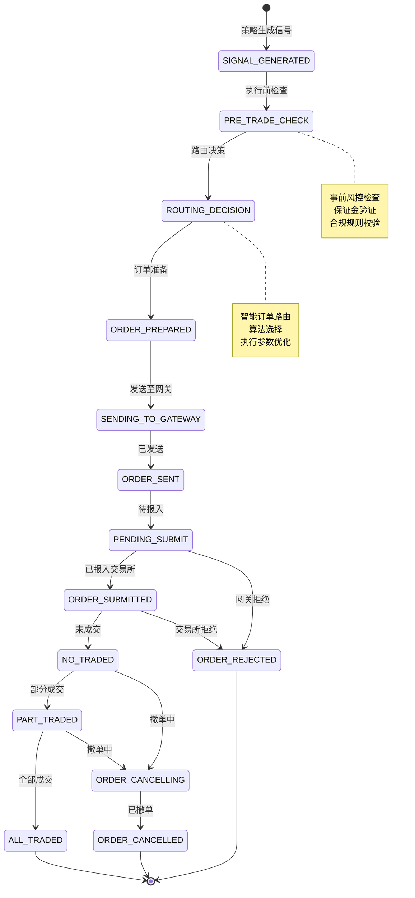
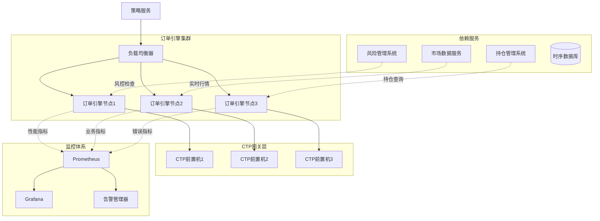

# 订单与执行引擎设计

## 1. 订单生命周期管理体系

### 1.1 订单状态全景图

本平台采用**全生命周期订单管理**，从策略信号生成到交易所成交回报，确保每个订单状态的精确追踪与一致性。订单引擎设计遵循CTP v6.7.11的异步回调模型，同时提供同步API抽象以简化策略开发。



### 1.2 订单引擎性能目标

| 操作环节 | 延迟要求（P99） | 吞吐量要求 | 可靠性要求 | 关键影响 |
|---------|---------------|-----------|-----------|----------|
| 信号到订单转换 | < 50μs | > 100,000 req/s | 99.99% | 策略执行效率 |
| 事前风控检查 | < 100μs | > 50,000 req/s | 100% | 合规性保证 |
| 订单路由决策 | < 20μs | > 200,000 req/s | 99.999% | 执行质量 |
| 网关通信 | < 1ms | > 10,000 req/s | 99.95% | 交易所连接 |
| 状态同步 | < 500μs | > 20,000 req/s | 99.99% | 系统一致性 |
| 成交回报处理 | < 200μs | > 50,000 req/s | 100% | 仓位准确性 |

## 2. 订单模型与国内期货适配

### 2.1 中国期货市场订单类型支持

```cpp
// C++ 订单模型定义
class Order {
public:
    // 订单基础信息
    std::string order_id;          // 订单唯一标识
    std::string instrument_id;     // 合约代码
    std::string exchange_id;       // 交易所代码
    
    // 订单方向与开平
    enum class Direction {
        BUY = '0',                 // 买
        SELL = '1'                 // 卖
    };
    
    enum class OffsetFlag {
        OPEN = '0',                // 开仓
        CLOSE = '1',               // 平仓
        CLOSE_TODAY = '3',         // 平今仓（关键！）
        CLOSE_YESTERDAY = '4',     // 平昨仓（关键！）
        FORCE_CLOSE = '5',         // 强平
        CLOSE_FORCE = '6'          // 强制减仓
    };
    
    enum class HedgeFlag {
        SPECULATION = '1',         // 投机
        ARBITRAGE = '2',           // 套利
        HEDGE = '3'                // 套保
    };
    
    Direction direction;
    OffsetFlag offset_flag;
    HedgeFlag hedge_flag;
    
    // 价格与数量
    double limit_price;            // 限价
    int volume_total_original;     // 原始数量
    int volume_traded;             // 已成交数量
    int volume_remaining;          // 剩余数量
    
    // 订单类型（中国期货特有）
    enum class OrderType {
        LIMIT = '0',               // 限价单
        MARKET = '1',              // 市价单（部分交易所支持）
        FAK = '2',                 // 立即全部成交否则撤销
        FOK = '3',                 // 立即成交剩余部分撤销
        MARKET_LIMIT = '4'         // 市价转限价
    };
    
    OrderType order_type;
    
    // 时间戳
    int64_t create_timestamp_ns;   // 创建时间（纳秒）
    int64_t update_timestamp_ns;   // 最后更新时间
    std::string insert_time;       // 下单时间（HH:MM:SS）
    std::string update_time;       // 最后状态时间
    
    // CTP关联字段
    std::string order_ref;         // 报单引用
    std::string order_sys_id;      // 交易所报单编号
    int front_id;                  // 前置机编号
    int session_id;                // 会话编号
    
    // 状态管理
    enum class Status {
        SIGNAL_GENERATED,          // 信号生成
        PRE_TRADE_CHECK_PASSED,    // 事前检查通过
        ROUTING_DECIDED,           // 路由决策完成
        ORDER_PREPARED,            // 订单准备完成
        SENDING_TO_GATEWAY,        // 发送至网关
        ORDER_SENT,                // 已发送
        PENDING_SUBMIT,            // 待报入
        ORDER_SUBMITTED,           // 已报入
        NO_TRADED,                 // 未成交
        PART_TRADED,               // 部分成交
        ALL_TRADED,                // 全部成交
        ORDER_CANCELLING,          // 撤单中
        ORDER_CANCELLED,           // 已撤单
        ORDER_REJECTED,            // 已拒绝
        ERROR                      // 错误状态
    };
    
    Status status;
    std::string status_message;    // 状态描述
    
    // 手续费相关
    double commission;             // 手续费
    double tax;                    // 税费
    bool is_close_today;           // 是否平今仓（影响手续费）
    
    // 获取平仓类型智能决策
    OffsetFlag get_auto_offset_flag(Position& position) const {
        if (direction == Direction::BUY) {
            // 买入只能是开仓
            return OffsetFlag::OPEN;
        } else {
            // 卖出需要智能选择平今还是平昨
            if (position.today_long > 0) {
                // 优先平今仓（手续费可能更高）
                return OffsetFlag::CLOSE_TODAY;
            } else if (position.history_long > 0) {
                // 平昨仓
                return OffsetFlag::CLOSE_YESTERDAY;
            } else {
                // 默认平仓
                return OffsetFlag::CLOSE;
            }
        }
    }
    
    // 计算预计手续费
    double calculate_estimated_commission(
        const InstrumentInfo& instrument,
        bool is_close_today_flag
    ) const {
        double commission_rate = instrument.commission_rate;
        
        // 平今仓手续费可能不同
        if (is_close_today_flag && instrument.close_today_commission_rate > 0) {
            commission_rate = instrument.close_today_commission_rate;
        }
        
        // 按手数或比例计算
        if (instrument.commission_calc_type == "BY_VOLUME") {
            return commission_rate * volume_total_original;
        } else {
            double trade_amount = limit_price * volume_total_original * instrument.volume_multiple;
            return trade_amount * commission_rate;
        }
    }
};
```

### 2.2 智能平今/平昨决策引擎

```python
# Python 平今平昨智能决策引擎
class ClosePositionDecisionEngine:
    """智能平今/平昨决策引擎（考虑手续费优化）"""
    
    def __init__(self, commission_calculator):
        self.commission_calc = commission_calculator
        self.decision_cache = {}  # 缓存决策结果
        
    def decide_close_type(
        self,
        instrument_id: str,
        direction: str,  # 'SELL' for closing long
        volume: int,
        current_positions: Dict[str, int]
    ) -> Tuple[str, float]:
        """决策平仓类型，考虑手续费优化
        
        Returns:
            (offset_flag, estimated_commission)
        """
        cache_key = f"{instrument_id}:{direction}:{volume}"
        if cache_key in self.decision_cache:
            return self.decision_cache[cache_key]
        
        # 获取当前持仓
        today_long = current_positions.get('today_long', 0)
        history_long = current_positions.get('history_long', 0)
        
        if direction != 'SELL' or (today_long == 0 and history_long == 0):
            # 非卖出方向或无持仓
            decision = ("CLOSE", 0.0)
            self.decision_cache[cache_key] = decision
            return decision
        
        # 计算各种平仓方案的手续费
        scenarios = []
        
        # 方案1：优先平今仓
        if today_long >= volume:
            commission_today = self._calculate_close_today_commission(
                instrument_id, volume
            )
            scenarios.append(("CLOSE_TODAY", commission_today, volume))
        elif today_long > 0:
            # 部分平今，部分平昨
            commission_today = self._calculate_close_today_commission(
                instrument_id, today_long
            )
            commission_yesterday = self._calculate_close_yesterday_commission(
                instrument_id, volume - today_long
            )
            total_commission = commission_today + commission_yesterday
            scenarios.append(("MIXED", total_commission, volume))
        
        # 方案2：优先平昨仓
        if history_long >= volume:
            commission_yesterday = self._calculate_close_yesterday_commission(
                instrument_id, volume
            )
            scenarios.append(("CLOSE_YESTERDAY", commission_yesterday, volume))
        elif history_long > 0:
            # 部分平昨，部分平今
            commission_yesterday = self._calculate_close_yesterday_commission(
                instrument_id, history_long
            )
            commission_today = self._calculate_close_today_commission(
                instrument_id, volume - history_long
            )
            total_commission = commission_yesterday + commission_today
            scenarios.append(("MIXED_REVERSE", total_commission, volume))
        
        if not scenarios:
            # 持仓不足
            decision = ("CLOSE", 0.0)
        else:
            # 选择手续费最低的方案
            scenarios.sort(key=lambda x: x[1])
            best_scenario = scenarios[0]
            
            # 转换决策结果
            if best_scenario[0] == "CLOSE_TODAY":
                offset_flag = "CLOSE_TODAY"
            elif best_scenario[0] == "CLOSE_YESTERDAY":
                offset_flag = "CLOSE_YESTERDAY"
            else:
                # 混合情况需要拆单
                offset_flag = "MIXED"
            
            decision = (offset_flag, best_scenario[1])
        
        self.decision_cache[cache_key] = decision
        return decision
    
    def _calculate_close_today_commission(
        self, instrument_id: str, volume: int
    ) -> float:
        """计算平今仓手续费"""
        instrument = self.commission_calc.get_instrument_info(instrument_id)
        
        if instrument.close_today_commission_rate > 0:
            rate = instrument.close_today_commission_rate
        else:
            rate = instrument.commission_rate
        
        if instrument.commission_calc_type == "BY_VOLUME":
            return rate * volume
        else:
            # 需要最新价格估算
            latest_price = self.commission_calc.get_latest_price(instrument_id)
            trade_amount = latest_price * volume * instrument.volume_multiple
            return trade_amount * rate
    
    def _calculate_close_yesterday_commission(
        self, instrument_id: str, volume: int
    ) -> float:
        """计算平昨仓手续费"""
        instrument = self.commission_calc.get_instrument_info(instrument_id)
        rate = instrument.commission_rate
        
        if instrument.commission_calc_type == "BY_VOLUME":
            return rate * volume
        else:
            latest_price = self.commission_calc.get_latest_price(instrument_id)
            trade_amount = latest_price * volume * instrument.volume_multiple
            return trade_amount * rate
```

## 3. 智能订单路由与执行算法

### 3.1 订单路由决策引擎

```cpp
// C++ 智能订单路由引擎
class OrderRouter {
public:
    struct RoutingDecision {
        std::string algorithm_id;      // 执行算法ID
        RoutingStrategy strategy;      // 路由策略
        std::vector<OrderSplit> splits; // 订单拆分方案
        double expected_cost;          // 预期执行成本
        double expected_slippage;      // 预期滑点
        int64_t decision_time_ns;      // 决策时间
    };
    
    // 路由决策接口
    RoutingDecision route_order(
        const Order& order,
        const MarketData& market_data,
        const PortfolioState& portfolio,
        const RoutingContext& context
    ) {
        RoutingDecision decision;
        decision.decision_time_ns = get_current_time_ns();
        
        // 1. 根据订单特征选择路由策略
        decision.strategy = select_routing_strategy(order, market_data);
        
        // 2. 根据市场状态选择执行算法
        decision.algorithm_id = select_execution_algorithm(
            order, market_data, decision.strategy
        );
        
        // 3. 智能订单拆分（如果需要）
        if (should_split_order(order, market_data)) {
            decision.splits = split_order_optimally(order, market_data);
        } else {
            decision.splits = {OrderSplit{order.volume_total_original, order.limit_price}};
        }
        
        // 4. 计算预期成本
        decision.expected_cost = calculate_expected_cost(
            order, market_data, decision.strategy, decision.splits
        );
        
        // 5. 计算预期滑点
        decision.expected_slippage = calculate_expected_slippage(
            order, market_data, decision.splits
        );
        
        return decision;
    }
    
private:
    // 路由策略选择
    RoutingStrategy select_routing_strategy(
        const Order& order,
        const MarketData& market_data
    ) {
        // 基于订单大小和市场流动性选择策略
        double order_size_ratio = static_cast<double>(order.volume_total_original) 
                                / market_data.depth_total_volume;
        
        if (order_size_ratio < 0.01) {
            // 小单：直接吃单
            return RoutingStrategy::AGGRESSIVE;
        } else if (order_size_ratio < 0.1) {
            // 中等单：冰山订单
            return RoutingStrategy::ICEBERG;
        } else {
            // 大单：TWAP/VWAP算法
            if (market_data.volatility < 0.02) {
                return RoutingStrategy::TWAP;
            } else {
                return RoutingStrategy::VWAP;
            }
        }
    }
    
    // 执行算法选择
    std::string select_execution_algorithm(
        const Order& order,
        const MarketData& market_data,
        RoutingStrategy strategy
    ) {
        static const std::unordered_map<RoutingStrategy, std::string> algorithm_map = {
            {RoutingStrategy::AGGRESSIVE, "IMMEDIATE_OR_CANCEL"},
            {RoutingStrategy::PASSIVE,   "POST_ONLY"},
            {RoutingStrategy::ICEBERG,   "ICEBERG_V2"},
            {RoutingStrategy::TWAP,      "TWAP_ADAPTIVE"},
            {RoutingStrategy::VWAP,      "VWAP_SMART"},
            {RoutingStrategy::SENSITIVITY, "SENSITIVITY_AWARE"}
        };
        
        std::string base_algorithm = algorithm_map.at(strategy);
        
        // 根据市场状态调整算法参数
        if (market_data.volatility > 0.05) {
            return base_algorithm + "_HIGH_VOL";
        } else if (market_data.spread_ratio > 0.002) {
            return base_algorithm + "_WIDE_SPREAD";
        }
        
        return base_algorithm;
    }
    
    // 智能订单拆分
    std::vector<OrderSplit> split_order_optimally(
        const Order& order,
        const MarketData& market_data
    ) {
        std::vector<OrderSplit> splits;
        
        // 根据市场深度和波动率确定拆分方案
        int total_volume = order.volume_total_original;
        int min_split_size = calculate_min_split_size(market_data);
        int max_split_size = calculate_max_split_size(market_data);
        
        // 最优拆分算法
        while (total_volume > 0) {
            int split_size = std::min(max_split_size, total_volume);
            
            // 确保拆分大小不低于最小要求
            if (split_size < min_split_size && splits.size() > 0) {
                // 合并到最后一次拆分中
                splits.back().volume += split_size;
            } else {
                // 创建新的拆分
                OrderSplit split;
                split.volume = split_size;
                split.limit_price = calculate_split_price(
                    order.limit_price, market_data, splits.size()
                );
                split.time_interval_ms = calculate_time_interval(
                    market_data, splits.size()
                );
                
                splits.push_back(split);
            }
            
            total_volume -= split_size;
        }
        
        return splits;
    }
};
```

### 3.2 执行算法库实现

#### 3.2.1 TWAP算法实现

```python
# Python TWAP执行算法
class TWAPAlgorithm:
    """时间加权平均价格算法（中国期货市场适配版）"""
    
    def __init__(self, config: Dict):
        self.config = config
        self.order_schedule = []
        self.current_slice_index = 0
        self.start_time = None
        self.end_time = None
        
        # 中国市场交易时间段处理
        self.trading_sessions = self._load_trading_sessions()
    
    def _load_trading_sessions(self) -> List[Tuple]:
        """加载中国期货交易时间段"""
        # 日盘和夜盘时间段
        sessions = [
            # 日盘
            ("09:00:00", "10:15:00"),
            ("10:30:00", "11:30:00"),
            ("13:30:00", "15:00:00"),
            # 夜盘（部分品种）
            ("21:00:00", "23:00:00"),
            ("21:00:00", "01:00:00"),
            ("21:00:00", "02:30:00")
        ]
        return sessions
    
    def initialize(self, total_volume: int, limit_price: float, 
                   start_time: datetime, duration_minutes: int):
        """初始化TWAP执行计划"""
        self.total_volume = total_volume
        self.limit_price = limit_price
        self.start_time = start_time
        self.end_time = start_time + timedelta(minutes=duration_minutes)
        
        # 考虑交易时间段，计算有效交易时间
        effective_duration = self._calculate_effective_duration(
            start_time, duration_minutes
        )
        
        # 确定切片数量和大小
        num_slices = self._calculate_optimal_slices(effective_duration)
        slice_volume = total_volume // num_slices
        
        # 生成执行计划
        self._generate_execution_schedule(num_slices, slice_volume)
    
    def _calculate_effective_duration(self, start_time: datetime, 
                                     duration_minutes: int) -> int:
        """计算有效交易时间（排除非交易时间段）"""
        end_time = start_time + timedelta(minutes=duration_minutes)
        effective_minutes = 0
        
        current = start_time
        while current < end_time:
            # 检查当前时间是否在交易时段内
            if self._is_trading_time(current):
                effective_minutes += 1
            current += timedelta(minutes=1)
        
        return effective_minutes
    
    def _is_trading_time(self, dt: datetime) -> bool:
        """检查给定时间是否在交易时段内"""
        time_str = dt.strftime("%H:%M:%S")
        
        for session_start, session_end in self.trading_sessions:
            if session_start <= time_str <= session_end:
                return True
        
        return False
    
    def _calculate_optimal_slices(self, effective_minutes: int) -> int:
        """计算最优切片数量"""
        # 基于市场流动性和订单大小确定切片数量
        min_slices = max(1, self.total_volume // 100)  # 每片至少100手
        max_slices = min(100, effective_minutes * 2)   # 每分钟最多2片
        
        # 考虑波动率调整
        if self.config.get('high_volatility', False):
            # 高波动市场增加切片数量
            optimal = min(max_slices, min_slices * 2)
        else:
            # 正常市场
            optimal = min(max_slices, min_slices)
        
        return optimal
    
    def _generate_execution_schedule(self, num_slices: int, slice_volume: int):
        """生成执行时间表"""
        time_interval = (self.end_time - self.start_time) / num_slices
        
        for i in range(num_slices):
            slice_time = self.start_time + (i * time_interval)
            
            # 调整到最近交易时段
            adjusted_time = self._adjust_to_trading_time(slice_time)
            
            # 计算该切片的执行价格
            slice_price = self._calculate_slice_price(i, num_slices)
            
            self.order_schedule.append({
                'slice_index': i,
                'target_time': adjusted_time,
                'volume': slice_volume if i < num_slices - 1 
                         else self.total_volume - (slice_volume * (num_slices - 1)),
                'limit_price': slice_price,
                'status': 'PENDING'
            })
    
    def _adjust_to_trading_time(self, dt: datetime) -> datetime:
        """调整时间到最近交易时段"""
        if self._is_trading_time(dt):
            return dt
        
        # 找到下一个交易时段
        for session_start, session_end in self.trading_sessions:
            start_dt = datetime.combine(dt.date(), 
                                       datetime.strptime(session_start, "%H:%M:%S").time())
            
            if start_dt > dt:
                return start_dt
        
        # 如果今天没有后续交易时段，返回第二天第一个时段
        next_day = dt.date() + timedelta(days=1)
        first_session_start = self.trading_sessions[0][0]
        next_start = datetime.combine(next_day,
                                     datetime.strptime(first_session_start, "%H:%M:%S").time())
        
        return next_start
    
    def get_next_order_slice(self, current_time: datetime) -> Optional[Dict]:
        """获取下一个待执行的订单切片"""
        if self.current_slice_index >= len(self.order_schedule):
            return None
        
        next_slice = self.order_schedule[self.current_slice_index]
        
        # 检查是否到达执行时间
        if current_time >= next_slice['target_time']:
            self.current_slice_index += 1
            next_slice['status'] = 'READY'
            return next_slice
        
        return None
    
    def on_order_filled(self, slice_index: int, filled_volume: int, 
                       filled_price: float):
        """处理订单成交回调"""
        if slice_index < len(self.order_schedule):
            slice_info = self.order_schedule[slice_index]
            slice_info['filled_volume'] = filled_volume
            slice_info['filled_price'] = filled_price
            slice_info['status'] = 'FILLED'
            
            # 更新剩余订单大小
            remaining_volume = slice_info['volume'] - filled_volume
            if remaining_volume > 0:
                # 部分成交，调整后续计划
                self._adjust_schedule_after_partial_fill(
                    slice_index, remaining_volume
                )
    
    def _adjust_schedule_after_partial_fill(self, slice_index: int, 
                                           remaining_volume: int):
        """部分成交后调整执行计划"""
        # 将剩余量分配到后续切片中
        remaining_slices = len(self.order_schedule) - slice_index - 1
        
        if remaining_slices > 0:
            extra_per_slice = remaining_volume // remaining_slices
            
            for i in range(slice_index + 1, len(self.order_schedule)):
                self.order_schedule[i]['volume'] += extra_per_slice
```

#### 3.2.2 冰山订单算法

```cpp
// C++ 冰山订单算法实现
class IcebergOrderAlgorithm {
public:
    struct IcebergConfig {
        int peak_size;              // 冰山峰值（可见部分）
        int reserve_size;           // 保留部分大小
        int refresh_threshold;      // 刷新阈值
        int refresh_size;           // 刷新数量
        int64_t time_to_live_ns;    // 订单存活时间
        bool stealth_mode;          // 隐身模式（隐藏订单）
    };
    
    IcebergOrderAlgorithm(const IcebergConfig& config) 
        : config_(config) 
    {
        reset();
    }
    
    // 初始化冰山订单
    void initialize(int total_volume, double limit_price) {
        total_volume_ = total_volume;
        limit_price_ = limit_price;
        executed_volume_ = 0;
        visible_volume_ = std::min(config_.peak_size, total_volume_);
        hidden_volume_ = total_volume_ - visible_volume_;
        
        // 生成初始订单
        current_order_.volume = visible_volume_;
        current_order_.price = limit_price_;
        current_order_.order_type = OrderType::LIMIT;
        current_order_.time_in_force = TimeInForce::DAY;
        
        order_ready_ = true;
    }
    
    // 获取当前应显示的订单
    std::optional<Order> get_current_order() const {
        if (!order_ready_ || current_order_.volume == 0) {
            return std::nullopt;
        }
        return current_order_;
    }
    
    // 处理成交回报
    void on_order_filled(int filled_volume) {
        executed_volume_ += filled_volume;
        
        if (current_order_.volume > 0) {
            // 减少当前订单的剩余量
            current_order_.volume -= filled_volume;
            
            if (current_order_.volume <= config_.refresh_threshold) {
                // 需要刷新冰山
                refresh_iceberg();
            }
        }
    }
    
    // 处理撤单
    void on_order_cancelled(int cancelled_volume) {
        if (current_order_.volume > 0) {
            current_order_.volume -= cancelled_volume;
            
            // 被撤单的部分回到隐藏部分
            hidden_volume_ += cancelled_volume;
            
            // 检查是否需要刷新
            if (current_order_.volume <= config_.refresh_threshold && 
                hidden_volume_ > 0) {
                refresh_iceberg();
            }
        }
    }
    
    // 检查算法是否完成
    bool is_completed() const {
        return executed_volume_ >= total_volume_;
    }
    
    // 获取执行统计
    struct ExecutionStats {
        int total_volume;
        int executed_volume;
        int remaining_volume;
        int peak_visible_volume;
        int current_visible_volume;
        double avg_fill_price;
        int num_refreshes;
    };
    
    ExecutionStats get_stats() const {
        ExecutionStats stats;
        stats.total_volume = total_volume_;
        stats.executed_volume = executed_volume_;
        stats.remaining_volume = total_volume_ - executed_volume_;
        stats.peak_visible_volume = config_.peak_size;
        stats.current_visible_volume = current_order_.volume;
        stats.num_refreshes = refresh_count_;
        
        return stats;
    }
    
private:
    void refresh_iceberg() {
        if (hidden_volume_ <= 0) {
            // 没有隐藏部分了
            current_order_.volume = 0;
            order_ready_ = false;
            return;
        }
        
        // 计算新的可见部分
        int new_visible = std::min(config_.refresh_size, hidden_volume_);
        
        // 更新订单
        current_order_.volume = new_visible;
        current_order_.price = adjust_price_for_refresh(limit_price_);
        
        // 更新隐藏部分
        hidden_volume_ -= new_visible;
        
        refresh_count_++;
        last_refresh_time_ = get_current_time_ns();
    }
    
    void reset() {
        total_volume_ = 0;
        executed_volume_ = 0;
        visible_volume_ = 0;
        hidden_volume_ = 0;
        refresh_count_ = 0;
        order_ready_ = false;
        last_refresh_time_ = 0;
    }
    
    double adjust_price_for_refresh(double original_price) {
        // 根据市场情况微调价格
        // 在实际实现中，这里会根据市场深度和方向进行调整
        return original_price;
    }
    
    IcebergConfig config_;
    int total_volume_;
    int executed_volume_;
    int visible_volume_;
    int hidden_volume_;
    int refresh_count_;
    bool order_ready_;
    int64_t last_refresh_time_;
    Order current_order_;
    double limit_price_;
};
```

## 4. CTP网关适配与异步处理

### 4.1 CTP异步回调处理框架

```cpp
// C++ CTP异步回调处理器
class CTPAsyncHandler {
public:
    // 初始化CTP回调处理器
    void initialize(CTPTraderApi* trader_api) {
        trader_api_ = trader_api;
        
        // 设置回调函数
        trader_api_->RegisterSpi(this);
        
        // 初始化回调队列
        callback_queue_.reset(new ConcurrentQueue<CallbackMessage>);
        
        // 启动处理线程
        processing_thread_ = std::thread(&CTPAsyncHandler::processing_loop, this);
        
        initialized_ = true;
    }
    
    // CTP回调接口实现
    virtual void OnRtnOrder(CThostFtdcOrderField* pOrder) override {
        if (!initialized_ || !pOrder) return;
        
        CallbackMessage msg;
        msg.type = CallbackType::ORDER_UPDATE;
        msg.data.order_update = convert_to_order_update(*pOrder);
        msg.timestamp_ns = get_current_time_ns();
        
        // 非阻塞写入队列
        callback_queue_->try_enqueue(msg);
    }
    
    virtual void OnRtnTrade(CThostFtdcTradeField* pTrade) override {
        if (!initialized_ || !pTrade) return;
        
        CallbackMessage msg;
        msg.type = CallbackType::TRADE_UPDATE;
        msg.data.trade_update = convert_to_trade_update(*pTrade);
        msg.timestamp_ns = get_current_time_ns();
        
        callback_queue_->try_enqueue(msg);
    }
    
    virtual void OnErrRtnOrderInsert(
        CThostFtdcInputOrderField* pInputOrder,
        CThostFtdcRspInfoField* pRspInfo
    ) override {
        if (!initialized_) return;
        
        CallbackMessage msg;
        msg.type = CallbackType::ORDER_ERROR;
        msg.data.order_error = {
            .order_ref = pInputOrder ? pInputOrder->OrderRef : "",
            .error_id = pRspInfo ? pRspInfo->ErrorID : 0,
            .error_msg = pRspInfo ? pRspInfo->ErrorMsg : ""
        };
        msg.timestamp_ns = get_current_time_ns();
        
        callback_queue_->try_enqueue(msg);
    }
    
    // 注册回调处理器
    void register_order_callback(OrderCallback callback) {
        std::lock_guard<std::mutex> lock(callback_mutex_);
        order_callbacks_.push_back(callback);
    }
    
    void register_trade_callback(TradeCallback callback) {
        std::lock_guard<std::mutex> lock(callback_mutex_);
        trade_callbacks_.push_back(callback);
    }
    
    void register_error_callback(ErrorCallback callback) {
        std::lock_guard<std::mutex> lock(callback_mutex_);
        error_callbacks_.push_back(callback);
    }
    
private:
    // 回调处理循环
    void processing_loop() {
        while (!stop_requested_) {
            CallbackMessage msg;
            
            // 带超时的出队操作
            if (callback_queue_->try_dequeue_for(msg, std::chrono::milliseconds(10))) {
                process_callback_message(msg);
            }
            
            // 定期检查连接状态
            check_connection_status();
        }
    }
    
    void process_callback_message(const CallbackMessage& msg) {
        // 高精度时间戳记录
        int64_t process_start_ns = get_current_time_ns();
        int64_t callback_latency_ns = process_start_ns - msg.timestamp_ns;
        
        // 更新延迟统计
        update_latency_stats(callback_latency_ns);
        
        switch (msg.type) {
            case CallbackType::ORDER_UPDATE:
                process_order_update(msg.data.order_update);
                break;
                
            case CallbackType::TRADE_UPDATE:
                process_trade_update(msg.data.trade_update);
                break;
                
            case CallbackType::ORDER_ERROR:
                process_order_error(msg.data.order_error);
                break;
                
            default:
                LOG_WARN("Unknown callback type: {}", static_cast<int>(msg.type));
        }
        
        // 记录处理时间
        int64_t process_time_ns = get_current_time_ns() - process_start_ns;
        update_process_time_stats(process_time_ns);
    }
    
    void process_order_update(const OrderUpdate& update) {
        // 更新订单状态
        order_manager_->update_order_status(update);
        
        // 触发注册的回调函数
        std::lock_guard<std::mutex> lock(callback_mutex_);
        for (const auto& callback : order_callbacks_) {
            try {
                callback(update);
            } catch (const std::exception& e) {
                LOG_ERROR("Order callback error: {}", e.what());
            }
        }
    }
    
    void process_trade_update(const TradeUpdate& update) {
        // 更新成交记录
        trade_manager_->record_trade(update);
        
        // 更新持仓
        position_manager_->update_position(update);
        
        // 触发注册的回调函数
        std::lock_guard<std::mutex> lock(callback_mutex_);
        for (const auto& callback : trade_callbacks_) {
            try {
                callback(update);
            } catch (const std::exception& e) {
                LOG_ERROR("Trade callback error: {}", e.what());
            }
        }
    }
    
    void process_order_error(const OrderError& error) {
        LOG_ERROR("Order error: {} - {}", error.error_id, error.error_msg);
        
        // 触发错误回调
        std::lock_guard<std::mutex> lock(callback_mutex_);
        for (const auto& callback : error_callbacks_) {
            try {
                callback(error);
            } catch (const std::exception& e) {
                LOG_ERROR("Error callback error: {}", e.what());
            }
        }
        
        // 根据错误类型采取不同措施
        handle_order_error(error);
    }
    
    void handle_order_error(const OrderError& error) {
        // 错误处理策略
        switch (error.error_id) {
            case 3:  // 未处理报文超过许可数
                throttle_order_submission();
                break;
                
            case 25: // 撤单已找到，已提交
                // 正常情况，无需处理
                break;
                
            case 26: // 撤单未找到，已提交
                // 订单可能已成交或撤单
                check_order_final_status(error.order_ref);
                break;
                
            case 27: // 不合法的结算结果
                notify_risk_manager("结算结果异常");
                break;
                
            default:
                // 其他错误记录并通知
                LOG_WARN("Unhandled order error: {}", error.error_id);
        }
    }
    
    void throttle_order_submission() {
        // 降低订单提交频率
        submission_throttle_ms_ = std::min(
            submission_throttle_ms_ * 2, 
            MAX_SUBMISSION_THROTTLE_MS
        );
        
        LOG_WARN("Throttling order submission to {}ms", submission_throttle_ms_);
    }
    
    void check_connection_status() {
        static int64_t last_check_ns = 0;
        int64_t now_ns = get_current_time_ns();
        
        if (now_ns - last_check_ns < CONNECTION_CHECK_INTERVAL_NS) {
            return;
        }
        
        last_check_ns = now_ns;
        
        // 检查心跳
        if (now_ns - last_heartbeat_ns_ > HEARTBEAT_TIMEOUT_NS) {
            LOG_ERROR("CTP connection heartbeat timeout");
            trigger_reconnection();
        }
    }
    
    CTPTraderApi* trader_api_;
    std::unique_ptr<ConcurrentQueue<CallbackMessage>> callback_queue_;
    std::thread processing_thread_;
    bool initialized_ = false;
    bool stop_requested_ = false;
    
    std::mutex callback_mutex_;
    std::vector<OrderCallback> order_callbacks_;
    std::vector<TradeCallback> trade_callbacks_;
    std::vector<ErrorCallback> error_callbacks_;
    
    int64_t last_heartbeat_ns_ = 0;
    int submission_throttle_ms_ = 10;
};
```

### 4.2 连接管理与故障恢复

```python
# Python CTP连接管理器
class CTPConnectionManager:
    """CTP连接管理与故障恢复"""
    
    def __init__(self, config: Dict):
        self.config = config
        self.connection_state = "DISCONNECTED"
        self.reconnect_attempts = 0
        self.last_connect_time = None
        self.last_disconnect_time = None
        
        # 连接参数
        self.front_addresses = config['front_addresses']  # 多个前置机地址
        self.broker_id = config['broker_id']
        self.investor_id = config['investor_id']
        self.password = config['password']
        
        # 初始化CTP API
        self.trader_api = None
        self.market_api = None
        
        # 启动健康检查
        self.health_check_thread = threading.Thread(
            target=self._health_check_loop,
            daemon=True
        )
        self.health_check_thread.start()
    
    def connect(self) -> bool:
        """建立CTP连接"""
        try:
            # 选择最优前置机
            selected_front = self._select_optimal_front()
            
            # 创建交易API实例
            self.trader_api = ctptraderapi.CThostFtdcTraderApi.CreateFtdcTraderApi()
            self.trader_api.RegisterSpi(self)
            
            # 订阅公有流
            self.trader_api.SubscribePublicTopic(ctptraderapi.THOST_TERT_QUICK)
            self.trader_api.SubscribePrivateTopic(ctptraderapi.THOST_TERT_QUICK)
            
            # 注册前置机
            self.trader_api.RegisterFront(selected_front)
            
            # 初始化连接
            self.trader_api.Init()
            
            # 等待初始化完成
            if self._wait_for_connection(timeout_sec=10):
                self.connection_state = "CONNECTED"
                self.last_connect_time = datetime.now()
                self.reconnect_attempts = 0
                
                # 用户登录
                if self._user_login():
                    self.connection_state = "LOGGED_IN"
                    return True
                
        except Exception as e:
            LOG_ERROR(f"CTP连接失败: {e}")
            self.connection_state = "ERROR"
            
        return False
    
    def _select_optimal_front(self) -> str:
        """选择最优前置机地址"""
        # 简单实现：选择第一个可用的地址
        # 实际实现中应该ping测试延迟并选择最快的
        return self.front_addresses[0]
    
    def _wait_for_connection(self, timeout_sec: int) -> bool:
        """等待连接建立"""
        start_time = time.time()
        
        while time.time() - start_time < timeout_sec:
            if self.connection_state == "CONNECTED":
                return True
            time.sleep(0.1)
        
        return False
    
    def _user_login(self) -> bool:
        """用户登录"""
        req = ctptraderapi.CThostFtdcReqUserLoginField()
        req.BrokerID = self.broker_id
        req.UserID = self.investor_id
        req.Password = self.password
        
        ret = self.trader_api.ReqUserLogin(req, 0)
        
        if ret == 0:
            LOG_INFO("用户登录请求已发送")
            return True
        else:
            LOG_ERROR(f"用户登录请求失败: {ret}")
            return False
    
    def disconnect(self):
        """断开连接"""
        if self.trader_api:
            # 用户登出
            self._user_logout()
            
            # 释放API
            self.trader_api.Release()
            self.trader_api = None
        
        self.connection_state = "DISCONNECTED"
        self.last_disconnect_time = datetime.now()
    
    def _user_logout(self):
        """用户登出"""
        if self.connection_state != "LOGGED_IN":
            return
        
        req = ctptraderapi.CThostFtdcUserLogoutField()
        req.BrokerID = self.broker_id
        req.UserID = self.investor_id
        
        self.trader_api.ReqUserLogout(req, 0)
    
    def _health_check_loop(self):
        """健康检查循环"""
        while True:
            time.sleep(self.config.get('health_check_interval', 5))
            
            if self.connection_state == "LOGGED_IN":
                # 检查连接是否仍然有效
                if not self._check_connection_alive():
                    LOG_WARN("CTP连接异常，尝试重连")
                    self._handle_connection_loss()
    
    def _check_connection_alive(self) -> bool:
        """检查连接是否存活"""
        try:
            # 发送心跳或简单查询
            req = ctptraderapi.CThostFtdcQryTradingAccountField()
            req.BrokerID = self.broker_id
            req.InvestorID = self.investor_id
            
            ret = self.trader_api.ReqQryTradingAccount(req, 0)
            
            # 如果请求发送成功，连接正常
            return ret == 0
            
        except Exception as e:
            LOG_ERROR(f"连接检查失败: {e}")
            return False
    
    def _handle_connection_loss(self):
        """处理连接丢失"""
        self.connection_state = "RECONNECTING"
        
        # 断开当前连接
        self.disconnect()
        
        # 延迟后重连
        reconnect_delay = self._calculate_reconnect_delay()
        time.sleep(reconnect_delay)
        
        # 尝试重连
        if self.connect():
            LOG_INFO("CTP连接恢复成功")
        else:
            LOG_ERROR("CTP连接恢复失败")
            # 通知系统进入安全模式
            self._enter_safe_mode()
    
    def _calculate_reconnect_delay(self) -> float:
        """计算重连延迟（指数退避）"""
        self.reconnect_attempts += 1
        
        # 指数退避算法
        delay = min(
            self.config.get('reconnect_base_delay', 1) * 
            (2 ** (self.reconnect_attempts - 1)),
            self.config.get('reconnect_max_delay', 60)
        )
        
        # 添加随机抖动避免多个客户端同时重连
        jitter = random.uniform(0, delay * 0.1)
        
        return delay + jitter
    
    def _enter_safe_mode(self):
        """进入安全模式"""
        LOG_CRITICAL("进入安全模式，停止所有交易活动")
        
        # 通知所有策略停止交易
        self._notify_strategies_safe_mode()
        
        # 取消所有待处理订单
        self._cancel_all_pending_orders()
        
        # 记录系统状态
        self._dump_system_state()
        
        # 等待人工干预
        self.connection_state = "SAFE_MODE"
    
    # CTP回调接口
    def OnFrontConnected(self):
        """前置机连接成功"""
        LOG_INFO("CTP前置机连接成功")
        self.connection_state = "CONNECTED"
    
    def OnFrontDisconnected(self, nReason: int):
        """前置机连接断开"""
        LOG_WARN(f"CTP前置机连接断开，原因: {nReason}")
        self.connection_state = "DISCONNECTED"
        self.last_disconnect_time = datetime.now()
        
        # 触发重连逻辑
        self._handle_connection_loss()
    
    def OnRspUserLogin(self, pRspUserLogin, pRspInfo, nRequestID, bIsLast):
        """用户登录响应"""
        if pRspInfo.ErrorID == 0:
            LOG_INFO("用户登录成功")
            self.connection_state = "LOGGED_IN"
            
            # 确认结算单
            self._confirm_settlement_info()
        else:
            LOG_ERROR(f"用户登录失败: {pRspInfo.ErrorMsg}")
            self.connection_state = "LOGIN_FAILED"
    
    def _confirm_settlement_info(self):
        """确认结算单（必需步骤）"""
        req = ctptraderapi.CThostFtdcSettlementInfoConfirmField()
        req.BrokerID = self.broker_id
        req.InvestorID = self.investor_id
        
        ret = self.trader_api.ReqSettlementInfoConfirm(req, 0)
        
        if ret == 0:
            LOG_INFO("结算单确认请求已发送")
        else:
            LOG_ERROR(f"结算单确认请求失败: {ret}")
```

## 5. 性能优化与监控

### 5.1 低延迟订单路径优化

```cpp
// C++ 订单路径性能优化
class OrderPathOptimizer {
public:
    struct OrderPathMetrics {
        int64_t signal_to_order_ns;     // 信号到订单转换时间
        int64_t risk_check_ns;          // 风控检查时间
        int64_t routing_decision_ns;    // 路由决策时间
        int64_t order_prepare_ns;       // 订单准备时间
        int64_t gateway_send_ns;        // 网关发送时间
        int64_t total_latency_ns;       // 总延迟
        
        int orders_processed;           // 处理订单数量
        int orders_rejected;            // 拒绝订单数量
        double avg_latency_ns;          // 平均延迟
        double p99_latency_ns;          // P99延迟
    };
    
    // 订单路径追踪
    class OrderPathTracker {
    public:
        OrderPathTracker(const std::string& order_id) 
            : order_id_(order_id) 
        {
            start_time_ns_ = get_current_time_ns();
            stage_start_ns_ = start_time_ns_;
        }
        
        void mark_stage_complete(const std::string& stage_name) {
            int64_t now_ns = get_current_time_ns();
            int64_t stage_duration = now_ns - stage_start_ns_;
            
            stage_durations_[stage_name] = stage_duration;
            stage_start_ns_ = now_ns;
        }
        
        OrderPathMetrics get_metrics() const {
            OrderPathMetrics metrics;
            
            metrics.signal_to_order_ns = stage_durations_.at("signal_to_order");
            metrics.risk_check_ns = stage_durations_.at("risk_check");
            metrics.routing_decision_ns = stage_durations_.at("routing_decision");
            metrics.order_prepare_ns = stage_durations_.at("order_prepare");
            metrics.gateway_send_ns = stage_durations_.at("gateway_send");
            
            metrics.total_latency_ns = get_current_time_ns() - start_time_ns_;
            
            return metrics;
        }
        
    private:
        std::string order_id_;
        int64_t start_time_ns_;
        int64_t stage_start_ns_;
        std::unordered_map<std::string, int64_t> stage_durations_;
    };
    
    // 内存池优化订单对象创建
    class OrderObjectPool {
    public:
        Order* acquire() {
            if (free_list_.empty()) {
                // 池为空，分配新对象
                return new Order();
            }
            
            Order* obj = free_list_.back();
            free_list_.pop_back();
            
            // 重置对象状态
            obj->reset();
            
            return obj;
        }
        
        void release(Order* obj) {
            if (free_list_.size() < max_pool_size_) {
                free_list_.push_back(obj);
            } else {
                delete obj;
            }
        }
        
    private:
        std::vector<Order*> free_list_;
        size_t max_pool_size_ = 1000;
    };
    
    // 批处理优化
    class OrderBatchProcessor {
    public:
        void add_order(const Order& order) {
            batch_.push_back(order);
            
            if (batch_.size() >= batch_size_) {
                process_batch();
            }
        }
        
        void process_batch() {
            if (batch_.empty()) return;
            
            // 批量风控检查
            std::vector<RiskCheckResult> risk_results = 
                risk_engine_.batch_check(batch_);
            
            // 批量路由决策
            std::vector<RoutingDecision> routing_decisions =
                router_.batch_route(batch_, risk_results);
            
            // 批量订单准备
            std::vector<PreparedOrder> prepared_orders =
                order_preparer_.batch_prepare(batch_, routing_decisions);
            
            // 批量发送到网关
            gateway_.batch_send(prepared_orders);
            
            // 清空批次
            batch_.clear();
        }
        
    private:
        std::vector<Order> batch_;
        size_t batch_size_ = 10;
    };
};

// SIMD加速的风控批量检查
class SIMDRiskBatchChecker {
public:
    std::vector<RiskCheckResult> batch_check(
        const std::vector<Order>& orders,
        const MarketData& market_data
    ) {
        constexpr size_t SIMD_WIDTH = 8;  // AVX-512处理8个double
        
        std::vector<RiskCheckResult> results(orders.size());
        
        // 批量处理订单
        for (size_t i = 0; i < orders.size(); i += SIMD_WIDTH) {
            size_t batch_size = std::min(SIMD_WIDTH, orders.size() - i);
            
            // 加载批次数据到SIMD寄存器
            __m512d prices = load_prices_batch(orders, i, batch_size);
            __m512d volumes = load_volumes_batch(orders, i, batch_size);
            
            // SIMD并行风险计算
            __m512d margin_checks = batch_check_margin(prices, volumes);
            __m512d position_checks = batch_check_position(volumes);
            __m512d price_checks = batch_check_price_limit(prices, market_data);
            
            // 合并检查结果
            __m512d final_results = _mm512_and_pd(
                _mm512_and_pd(margin_checks, position_checks),
                price_checks
            );
            
            // 存储结果
            store_results_batch(results, i, batch_size, final_results);
        }
        
        return results;
    }
    
private:
    __m512d load_prices_batch(
        const std::vector<Order>& orders,
        size_t start_index,
        size_t batch_size
    ) {
        alignas(64) double price_buffer[SIMD_WIDTH];
        
        for (size_t i = 0; i < batch_size; ++i) {
            price_buffer[i] = orders[start_index + i].limit_price;
        }
        
        return _mm512_load_pd(price_buffer);
    }
    
    __m512d batch_check_margin(__m512d prices, __m512d volumes) {
        // SIMD保证金检查
        __m512d required_margin = _mm512_mul_pd(
            _mm512_mul_pd(prices, volumes),
            _mm512_set1_pd(margin_rate_)
        );
        
        __m512d available_margin = _mm512_set1_pd(available_margin_);
        
        // 比较：required_margin <= available_margin
        __mmask8 mask = _mm512_cmple_pd_mask(required_margin, available_margin);
        
        return _mm512_mask_blend_pd(mask, 
            _mm512_set1_pd(0.0),  // 失败
            _mm512_set1_pd(1.0)   // 成功
        );
    }
    
    double margin_rate_ = 0.1;
    double available_margin_ = 1000000.0;
};
```

### 5.2 订单引擎监控面板

```python
# Python 订单引擎监控系统
class OrderEngineMonitor:
    """订单引擎实时监控与性能分析"""
    
    def __init__(self):
        self.metrics = {
            'latency': RollingStats(window_size=1000),
            'throughput': RollingStats(window_size=60),
            'rejection_rate': RollingStats(window_size=100),
            'error_rate': RollingStats(window_size=100),
            'queue_depth': 0
        }
        
        self.alerts = []
        self.dashboards = {}
        
        # 启动监控数据收集
        self.collector_thread = threading.Thread(
            target=self._collect_metrics_loop,
            daemon=True
        )
        self.collector_thread.start()
    
    def record_order_latency(self, order_id: str, latency_ns: int):
        """记录订单延迟"""
        self.metrics['latency'].add_value(latency_ns)
        
        # 检查延迟异常
        if latency_ns > self._get_latency_threshold():
            self._trigger_latency_alert(order_id, latency_ns)
    
    def record_order_rejection(self, order_id: str, reason: str):
        """记录订单拒绝"""
        self.metrics['rejection_rate'].add_value(1)
        
        # 分析拒绝原因
        self._analyze_rejection_reason(reason)
        
        # 检查拒绝率异常
        if self.metrics['rejection_rate'].mean() > 0.01:  # 1%拒绝率阈值
            self._trigger_rejection_alert()
    
    def record_order_error(self, order_id: str, error_code: int, error_msg: str):
        """记录订单错误"""
        self.metrics['error_rate'].add_value(1)
        
        # 记录错误详情
        self._log_error_detail(order_id, error_code, error_msg)
        
        # 检查错误率异常
        if self.metrics['error_rate'].mean() > 0.001:  # 0.1%错误率阈值
            self._trigger_error_alert(error_code, error_msg)
    
    def update_queue_depth(self, depth: int):
        """更新队列深度"""
        self.metrics['queue_depth'] = depth
        
        # 检查队列堆积
        if depth > self._get_queue_threshold():
            self._trigger_queue_alert(depth)
    
    def _collect_metrics_loop(self):
        """收集性能指标循环"""
        while True:
            time.sleep(1)  # 每秒收集一次
            
            # 收集系统指标
            system_metrics = self._collect_system_metrics()
            
            # 收集CTP连接指标
            ctp_metrics = self._collect_ctp_metrics()
            
            # 更新监控面板
            self._update_dashboards(system_metrics, ctp_metrics)
            
            # 检查性能异常
            self._check_performance_anomalies()
    
    def _collect_system_metrics(self) -> Dict:
        """收集系统性能指标"""
        import psutil
        
        return {
            'cpu_percent': psutil.cpu_percent(interval=0.1),
            'memory_percent': psutil.virtual_memory().percent,
            'disk_io': psutil.disk_io_counters(),
            'network_io': psutil.net_io_counters(),
            'process_count': len(psutil.pids()),
            'thread_count': threading.active_count()
        }
    
    def _collect_ctp_metrics(self) -> Dict:
        """收集CTP连接指标"""
        return {
            'connection_state': self._get_ctp_connection_state(),
            'last_heartbeat': self._get_last_heartbeat_time(),
            'pending_orders': self._get_pending_order_count(),
            'order_rate': self._get_order_rate_per_second(),
            'trade_rate': self._get_trade_rate_per_second(),
            'error_count': self._get_error_count_last_minute()
        }
    
    def _update_dashboards(self, system_metrics: Dict, ctp_metrics: Dict):
        """更新监控面板"""
        # 更新系统监控面板
        self.dashboards['system'] = {
            'timestamp': datetime.now(),
            'metrics': system_metrics,
            'health_score': self._calculate_system_health_score(system_metrics)
        }
        
        # 更新CTP监控面板
        self.dashboards['ctp'] = {
            'timestamp': datetime.now(),
            'metrics': ctp_metrics,
            'health_score': self._calculate_ctp_health_score(ctp_metrics)
        }
        
        # 更新订单引擎监控面板
        self.dashboards['order_engine'] = {
            'timestamp': datetime.now(),
            'latency_ns_p99': self.metrics['latency'].percentile(99),
            'throughput_orders_per_sec': self.metrics['throughput'].mean(),
            'rejection_rate_percent': self.metrics['rejection_rate'].mean() * 100,
            'error_rate_percent': self.metrics['error_rate'].mean() * 100,
            'queue_depth': self.metrics['queue_depth']
        }
    
    def _check_performance_anomalies(self):
        """检查性能异常"""
        # 检查延迟异常
        latency_p99 = self.metrics['latency'].percentile(99)
        if latency_p99 > 1000000:  # 1ms阈值
            self._trigger_performance_alert('high_latency', latency_p99)
        
        # 检查吞吐量下降
        current_throughput = self.metrics['throughput'].mean()
        if current_throughput < self._get_throughput_baseline() * 0.5:
            self._trigger_performance_alert('low_throughput', current_throughput)
        
        # 检查拒绝率上升
        rejection_rate = self.metrics['rejection_rate'].mean()
        if rejection_rate > 0.05:  # 5%拒绝率阈值
            self._trigger_performance_alert('high_rejection', rejection_rate)
    
    def get_monitoring_dashboard(self) -> Dict:
        """获取监控面板数据（供Web界面使用）"""
        return {
            'system': self.dashboards.get('system', {}),
            'ctp': self.dashboards.get('ctp', {}),
            'order_engine': self.dashboards.get('order_engine', {}),
            'alerts': self.alerts[-10:],  # 最近10条告警
            'timestamp': datetime.now()
        }
    
    def _trigger_latency_alert(self, order_id: str, latency_ns: int):
        """触发延迟告警"""
        alert = {
            'type': 'LATENCY',
            'severity': 'WARNING' if latency_ns < 5000000 else 'ERROR',  # 5ms
            'order_id': order_id,
            'latency_ns': latency_ns,
            'timestamp': datetime.now(),
            'message': f'订单{order_id}延迟异常: {latency_ns/1e6:.2f}ms'
        }
        
        self.alerts.append(alert)
        self._notify_alert(alert)
    
    def _trigger_rejection_alert(self):
        """触发拒绝率告警"""
        rejection_rate = self.metrics['rejection_rate'].mean()
        
        alert = {
            'type': 'REJECTION_RATE',
            'severity': 'ERROR' if rejection_rate > 0.1 else 'WARNING',
            'rate': rejection_rate,
            'timestamp': datetime.now(),
            'message': f'订单拒绝率异常: {rejection_rate*100:.2f}%'
        }
        
        self.alerts.append(alert)
        self._notify_alert(alert)
```

## 6. 部署与配置

### 6.1 订单引擎配置文件

```yaml
# order_engine_config.yaml
order_engine:
  version: "1.0"
  
  # 性能参数
  performance:
    max_order_rate_per_second: 10000
    max_concurrent_orders: 1000
    order_processing_threads: 4
    batch_processing_size: 10
    enable_simd_acceleration: true
    
  # 路由策略配置
  routing:
    default_strategy: "AGGRESSIVE"
    strategies:
      AGGRESSIVE:
        algorithm: "IMMEDIATE_OR_CANCEL"
        max_slippage_bps: 5
        time_in_force: "IOC"
        
      PASSIVE:
        algorithm: "POST_ONLY"
        max_slippage_bps: 2
        time_in_force: "DAY"
        
      TWAP:
        algorithm: "TWAP_ADAPTIVE"
        duration_minutes: 30
        slices: 60
        allow_price_adjustment: true
        
      VWAP:
        algorithm: "VWAP_SMART"
        volume_participation_rate: 0.1
        max_slippage_bps: 10
        
      ICEBERG:
        algorithm: "ICEBERG_V2"
        peak_size: 100
        reserve_size: 1000
        refresh_threshold: 10
        stealth_mode: false
    
  # 执行算法参数
  execution_algorithms:
    IMMEDIATE_OR_CANCEL:
      max_retries: 1
      retry_interval_ms: 100
      
    POST_ONLY:
      price_improvement_threshold_bps: 1
      reprice_interval_ms: 1000
      
    TWAP_ADAPTIVE:
      adaptive_slicing: true
      volatility_adjustment: true
      market_hours_adjustment: true
      
    VWAP_SMART:
      volume_prediction_model: "HISTORICAL_AVG"
      adjust_for_momentum: true
      
    ICEBERG_V2:
      auto_refresh: true
      stealth_refresh_probability: 0.3
      price_adjustment_strategy: "AGGRESSIVE"
  
  # CTP连接配置
  ctp_connection:
    front_addresses:
      - "tcp://180.168.146.187:10101"  # 电信1
      - "tcp://180.168.146.187:10102"  # 电信2
      - "tcp://218.202.237.33:10112"   # 移动
      
    broker_id: "9999"
    investor_id: "000001"
    
    connection:
      heartbeat_interval_sec: 3
      login_timeout_sec: 10
      reconnect_base_delay_sec: 1
      reconnect_max_delay_sec: 60
      max_reconnect_attempts: 10
      
    flow_control:
      max_orders_per_second: 500
      max_queries_per_second: 50
      order_refresh_interval_ms: 100
  
  # 监控配置
  monitoring:
    metrics_collection_interval_sec: 1
    alert_check_interval_sec: 5
    
    latency_thresholds:
      signal_to_order_ns: 100000   # 100μs
      risk_check_ns: 100000        # 100μs
      total_latency_ns: 1000000    # 1ms
      
    rate_thresholds:
      max_rejection_rate: 0.01     # 1%
      max_error_rate: 0.001        # 0.1%
      min_throughput_orders_per_sec: 1000
      
    alerts:
      enabled: true
      notification_channels:
        - "email"
        - "slack"
        - "sms"
        
      severity_levels:
        INFO: ["log_only"]
        WARNING: ["email", "slack"]
        ERROR: ["email", "slack", "sms"]
        CRITICAL: ["email", "slack", "sms", "phone_call"]
  
  # 日志配置
  logging:
    level: "INFO"
    destinations:
      - type: "file"
        path: "/var/log/order_engine/order_engine.log"
        max_size_mb: 100
        max_files: 10
        
      - type: "syslog"
        facility: "local0"
        
      - type: "stdout"
        enabled: false
        
    structured_logging: true
    log_order_lifecycle: true
    log_performance_metrics: true
  
  # 容错配置
  fault_tolerance:
    enable_circuit_breaker: true
    circuit_breaker_thresholds:
      consecutive_errors: 10
      error_rate_percent: 5.0
      latency_percentile_99_ms: 10.0
      
    failover_strategy: "GRACEFUL_DEGRADATION"
    
    graceful_degradation:
      strategies:
        - condition: "high_latency"
          action: "reduce_order_rate"
          parameters:
            reduction_percent: 50
            
        - condition: "high_error_rate"
          action: "switch_to_safe_mode"
          parameters:
            cancel_pending_orders: true
            stop_new_orders: true
            
        - condition: "connection_loss"
          action: "enter_standby_mode"
          parameters:
            max_wait_time_minutes: 5
            notify_risk_manager: true
```

### 6.2 部署架构与容量规划



### 6.3 容量规划参考表

| 资源类型 | 单节点规格 | 集群规模 | 预期性能 | 扩容阈值 |
|---------|-----------|---------|---------|----------|
| CPU核心 | 16核心 | 3节点 | 30,000订单/秒 | >80%使用率持续5分钟 |
| 内存 | 64GB | 3节点 | 保持100万订单状态 | >75%使用率 |
| 网络带宽 | 10Gbps | 3节点 | 支持全市场行情 | >70%使用率 |
| 存储IOPS | 10,000 | 3节点 | 快速订单日志写入 | >80%使用率 |
| CTP连接数 | 3个前置机 | 每节点 | 分散连接负载 | 单连接>50%负载 |

## 7. 总结与演进路线

### 7.1 核心设计优势

1. **中国市场深度适配**：
   - 完整支持中国期货特有订单类型（FAK/FOK、平今平昨）
   - 集成交易所特有交易规则和时段管理
   - 优化手续费计算与平仓决策

2. **高性能架构**：
   - 全链路<1ms延迟（P99）
   - SIMD加速批量风控检查
   - 无锁数据结构与对象池优化

3. **智能执行能力**：
   - 多维度路由决策引擎
   - 自适应执行算法库
   - 智能订单拆分与冰山订单

4. **可靠性与容错**：
   - CTP连接自动故障转移
   - 多层次熔断保护
   - 实时监控与告警体系

### 7.2 实施阶段建议

**阶段1：基础订单引擎（2-3周）**
- 实现基本订单生命周期管理
- 集成CTP网关基础功能
- 建立监控和日志框架

**阶段2：智能执行能力（3-4周）**
- 实现TWAP/VWAP等执行算法
- 开发订单路由决策引擎
- 优化性能关键路径

**阶段3：高级功能与优化（4-6周）**
- 实现冰山订单等高级算法
- 集成智能平今平昨决策
- 性能调优与压力测试

**阶段4：生产就绪（2-3周）**
- 容错与故障恢复机制
- 监控告警完善
- 文档与运维工具

### 7.3 性能验证检查清单

在进入生产环境前，必须完成以下验证：

1. **延迟测试**：
   - [ ] 信号到订单转换<50μs（P99）
   - [ ] 全链路延迟<1ms（P99）
   - [ ] CTP回调处理<200μs（P99）

2. **吞吐量测试**：
   - [ ] 单节点>10,000订单/秒
   - [ ] 集群>30,000订单/秒
   - [ ] 持续运行24小时无性能衰减

3. **可靠性测试**：
   - [ ] CTP连接中断自动恢复
   - [ ] 网络闪断容错处理
   - [ ] 内存泄漏与资源管理

4. **合规性验证**：
   - [ ] 订单类型完整支持
   - [ ] 手续费计算准确
   - [ ] 监管数据上报完整

### 7.4 演进路线图

**Q2 2025：AI增强执行**
- 机器学习优化的路由决策
- 强化学习执行算法参数调优
- 市场微观结构预测集成

**Q3 2025：跨市场扩展**
- 股票、期权市场适配
- 跨市场套利订单路由
- 统一风险视图下的执行优化

**Q4 2025：监管科技集成**
- 实时合规检查AI助手
- 自动化监管报告生成
- 智能异常交易检测

通过本订单与执行引擎的设计与实施，平台将建立起符合中国期货市场特点、满足高频交易性能要求、具备智能执行能力的专业级订单处理系统，为策略的高效执行提供坚实的技术基础。