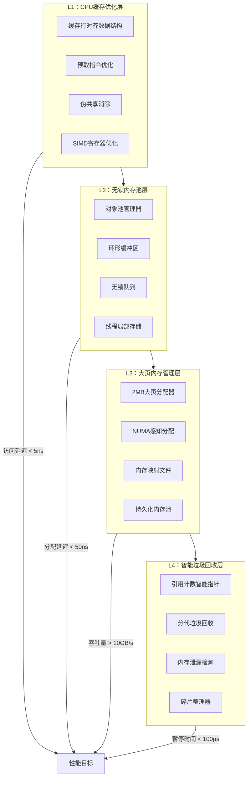
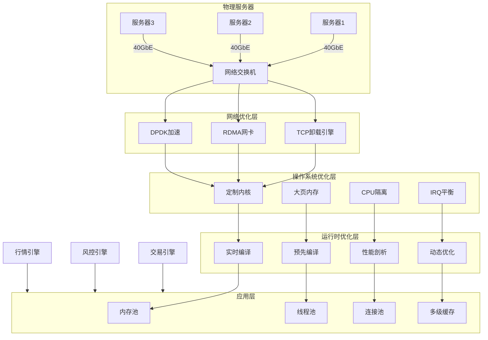

# 高性能基础组件设计（内存管理、网络等）

## 1. 内存管理体系设计

### 1.1 层次化内存架构

本平台采用**四层内存架构**，针对不同使用场景和性能需求进行优化，确保高频交易场景下的内存访问效率与稳定性。



### 1.2 内存性能目标

| 内存操作 | 延迟要求（P99） | 吞吐量要求 | 使用场景 | 关键技术 |
|---------|---------------|-----------|----------|----------|
| 小对象分配 | < 50ns | > 10M ops/s | 订单对象创建 | 无锁对象池 |
| 大对象分配 | < 200ns | > 1M ops/s | 市场数据结构 | 大页内存 |
| 缓存命中访问 | < 5ns | > 100M ops/s | 热点数据访问 | 缓存行对齐 |
| 内存复制 | < 100ns/GB | > 50GB/s | 数据序列化 | SIMD指令 |
| 垃圾回收 | < 100μs | 暂停时间可控 | 长周期对象 | 增量回收 |

## 2. 缓存优化与数据结构设计

### 2.1 缓存行对齐数据结构

```cpp
// C++ 缓存行对齐的基础数据结构
template<typename T>
class alignas(64) CacheAligned {  // 64字节对齐（主流CPU缓存行大小）
private:
    T data_;
    char padding_[64 - sizeof(T) % 64];  // 填充到缓存行大小
    
public:
    CacheAligned() = default;
    
    // 确保原子操作不会产生伪共享
    T load(std::memory_order order = std::memory_order_seq_cst) const {
        return data_.load(order);
    }
    
    void store(T value, std::memory_order order = std::memory_order_seq_cst) {
        data_.store(value, order);
    }
    
    T exchange(T value, std::memory_order order = std::memory_order_seq_cst) {
        return data_.exchange(value, order);
    }
};

// 高性能无锁环形缓冲区
template<typename T, size_t Capacity>
class alignas(64) LockFreeRingBuffer {
private:
    static_assert(Capacity > 0 && (Capacity & (Capacity - 1)) == 0,
                  "Capacity must be power of two for efficient modulo");
    
    // 缓存行分离的读写指针
    alignas(64) std::atomic<size_t> write_idx_{0};
    alignas(64) std::atomic<size_t> read_idx_{0};
    
    // 数据存储（确保缓存行对齐）
    alignas(64) std::array<T, Capacity> buffer_;
    
public:
    // 无锁写入
    bool try_push(const T& item) {
        size_t current_write = write_idx_.load(std::memory_order_relaxed);
        size_t next_write = (current_write + 1) & (Capacity - 1);
        
        // 检查缓冲区是否已满
        size_t current_read = read_idx_.load(std::memory_order_acquire);
        if (next_write == current_read) {
            return false;  // 缓冲区满
        }
        
        // 写入数据
        buffer_[current_write] = item;
        
        // 更新写指针（释放语义）
        write_idx_.store(next_write, std::memory_order_release);
        
        return true;
    }
    
    // 批量写入
    template<typename InputIt>
    size_t try_push_bulk(InputIt first, InputIt last) {
        size_t count = std::distance(first, last);
        if (count == 0) return 0;
        
        size_t current_write = write_idx_.load(std::memory_order_relaxed);
        size_t current_read = read_idx_.load(std::memory_order_acquire);
        
        // 计算可用空间
        size_t available = (current_read > current_write) 
            ? (current_read - current_write - 1)
            : (Capacity - current_write + current_read - 1);
        
        size_t to_write = std::min(count, available);
        
        // 批量复制（可能跨缓存行边界）
        if (current_write + to_write <= Capacity) {
            // 单次连续复制
            std::copy_n(first, to_write, buffer_.begin() + current_write);
        } else {
            // 分段复制
            size_t first_segment = Capacity - current_write;
            std::copy_n(first, first_segment, buffer_.begin() + current_write);
            std::copy_n(first + first_segment, to_write - first_segment, buffer_.begin());
        }
        
        // 更新写指针
        write_idx_.store((current_write + to_write) & (Capacity - 1), 
                        std::memory_order_release);
        
        return to_write;
    }
    
    // 无锁读取
    bool try_pop(T& item) {
        size_t current_read = read_idx_.load(std::memory_order_relaxed);
        size_t current_write = write_idx_.load(std::memory_order_acquire);
        
        if (current_read == current_write) {
            return false;  // 缓冲区空
        }
        
        // 读取数据
        item = buffer_[current_read];
        
        // 更新读指针
        read_idx_.store((current_read + 1) & (Capacity - 1), 
                       std::memory_order_release);
        
        return true;
    }
    
    // 预取优化
    void prefetch_for_write() const {
        size_t current_write = write_idx_.load(std::memory_order_relaxed);
        __builtin_prefetch(&buffer_[current_write], 1, 3);  // 写，高时间局部性
    }
    
    void prefetch_for_read() const {
        size_t current_read = read_idx_.load(std::memory_order_relaxed);
        __builtin_prefetch(&buffer_[current_read], 0, 3);  // 读，高时间局部性
    }
};
```

### 2.2 SIMD优化内存操作

```cpp
// C++ SIMD加速的内存操作
class SIMDMemoryOps {
public:
    // AVX-512加速的内存复制
    static void memcpy_avx512(void* dst, const void* src, size_t size) {
        constexpr size_t SIMD_WIDTH = 64;  // AVX-512: 64字节
        
        if (size < SIMD_WIDTH * 4) {
            // 小数据使用普通复制
            std::memcpy(dst, src, size);
            return;
        }
        
        // 对齐处理
        uintptr_t dst_addr = reinterpret_cast<uintptr_t>(dst);
        uintptr_t src_addr = reinterpret_cast<uintptr_t>(src);
        
        // 处理前导未对齐部分
        size_t prefix = (SIMD_WIDTH - (dst_addr & (SIMD_WIDTH - 1))) & (SIMD_WIDTH - 1);
        if (prefix > 0) {
            std::memcpy(dst, src, std::min(prefix, size));
            dst = reinterpret_cast<char*>(dst) + prefix;
            src = reinterpret_cast<const char*>(src) + prefix;
            size -= prefix;
        }
        
        // SIMD主循环
        size_t simd_chunks = size / SIMD_WIDTH;
        __m512i* simd_dst = reinterpret_cast<__m512i*>(dst);
        const __m512i* simd_src = reinterpret_cast<const __m512i*>(src);
        
        #pragma omp simd
        for (size_t i = 0; i < simd_chunks; ++i) {
            __m512i data = _mm512_loadu_si512(simd_src + i);
            _mm512_stream_si512(simd_dst + i, data);  // 非临时存储，避免污染缓存
        }
        
        // 处理尾部
        size_t remaining = size % SIMD_WIDTH;
        if (remaining > 0) {
            char* tail_dst = reinterpret_cast<char*>(simd_dst + simd_chunks);
            const char* tail_src = reinterpret_cast<const char*>(simd_src + simd_chunks);
            std::memcpy(tail_dst, tail_src, remaining);
        }
        
        _mm_sfence();  // 存储围栏，确保所有存储完成
    }
    
    // 批量浮点数操作（适用于Tick数据）
    static void process_ticks_avx512(const float* input, float* output, size_t count, 
                                    float multiplier, float adder) {
        constexpr size_t FLOATS_PER_SIMD = 16;  // AVX-512: 16个float
        
        __m512 simd_mult = _mm512_set1_ps(multiplier);
        __m512 simd_adder = _mm512_set1_ps(adder);
        
        size_t simd_chunks = count / FLOATS_PER_SIMD;
        
        #pragma omp simd
        for (size_t i = 0; i < simd_chunks; ++i) {
            // 加载16个float
            __m512 data = _mm512_loadu_ps(input + i * FLOATS_PER_SIMD);
            
            // 并行计算：data = data * multiplier + adder
            __m512 result = _mm512_fmadd_ps(data, simd_mult, simd_adder);
            
            // 存储结果
            _mm512_storeu_ps(output + i * FLOATS_PER_SIMD, result);
        }
        
        // 处理剩余元素
        for (size_t i = simd_chunks * FLOATS_PER_SIMD; i < count; ++i) {
            output[i] = input[i] * multiplier + adder;
        }
    }
    
    // 内存归零优化（快速清空缓冲区）
    static void fast_zero_memory(void* ptr, size_t size) {
        constexpr size_t CACHE_LINE = 64;
        
        if (size < CACHE_LINE * 4) {
            std::memset(ptr, 0, size);
            return;
        }
        
        // 使用非临时存储避免污染缓存
        __m512i zero = _mm512_setzero_si512();
        __m512i* simd_ptr = reinterpret_cast<__m512i*>(ptr);
        size_t simd_chunks = size / 64;
        
        #pragma omp simd
        for (size_t i = 0; i < simd_chunks; ++i) {
            _mm512_stream_si512(simd_ptr + i, zero);
        }
        
        // 处理尾部
        size_t remaining = size % 64;
        if (remaining > 0) {
            char* tail = reinterpret_cast<char*>(simd_ptr + simd_chunks);
            std::memset(tail, 0, remaining);
        }
        
        _mm_sfence();
    }
    
    // 内存比较优化
    static int memcmp_avx512(const void* ptr1, const void* ptr2, size_t size) {
        constexpr size_t SIMD_WIDTH = 64;
        
        if (size < SIMD_WIDTH) {
            return std::memcmp(ptr1, ptr2, size);
        }
        
        const __m512i* simd_ptr1 = reinterpret_cast<const __m512i*>(ptr1);
        const __m512i* simd_ptr2 = reinterpret_cast<const __m512i*>(ptr2);
        size_t simd_chunks = size / SIMD_WIDTH;
        
        for (size_t i = 0; i < simd_chunks; ++i) {
            __m512i data1 = _mm512_loadu_si512(simd_ptr1 + i);
            __m512i data2 = _mm512_loadu_si512(simd_ptr2 + i);
            
            // 比较是否相等
            __mmask64 cmp_mask = _mm512_cmpeq_epi8_mask(data1, data2);
            
            if (cmp_mask != 0xFFFFFFFFFFFFFFFF) {  // 不全相等
                // 找到第一个不等的字节
                int diff_pos = __builtin_ctzll(~cmp_mask);
                const char* char_ptr1 = reinterpret_cast<const char*>(ptr1);
                const char* char_ptr2 = reinterpret_cast<const char*>(ptr2);
                
                return char_ptr1[i * SIMD_WIDTH + diff_pos] - 
                       char_ptr2[i * SIMD_WIDTH + diff_pos];
            }
        }
        
        // 比较剩余部分
        size_t remaining = size % SIMD_WIDTH;
        if (remaining > 0) {
            const char* tail1 = reinterpret_cast<const char*>(simd_ptr1 + simd_chunks);
            const char* tail2 = reinterpret_cast<const char*>(simd_ptr2 + simd_chunks);
            
            int result = std::memcmp(tail1, tail2, remaining);
            if (result != 0) return result;
        }
        
        return 0;
    }
};
```

## 3. 无锁内存池设计

### 3.1 高性能对象池管理器

```cpp
// C++ 无锁对象池实现
template<typename T, size_t PoolSize = 1024>
class LockFreeObjectPool {
private:
    struct alignas(64) PoolNode {
        union {
            T object;
            PoolNode* next;  // 空闲时用作链表指针
        };
        
        std::atomic<bool> in_use{false};
        char padding[64 - sizeof(T) - sizeof(PoolNode*) - sizeof(std::atomic<bool>)];
    };
    
    // 内存块（确保缓存行对齐）
    alignas(64) std::array<PoolNode, PoolSize> memory_block_;
    
    // 无锁空闲链表
    alignas(64) std::atomic<PoolNode*> free_list_head_{nullptr};
    
    // 线程局部缓存
    static constexpr size_t THREAD_CACHE_SIZE = 16;
    thread_local static PoolNode* thread_cache_[THREAD_CACHE_SIZE];
    thread_local static size_t thread_cache_count_;
    
public:
    LockFreeObjectPool() {
        // 初始化空闲链表
        for (size_t i = 0; i < PoolSize; ++i) {
            memory_block_[i].next = (i > 0) ? &memory_block_[i - 1] : nullptr;
        }
        free_list_head_.store(&memory_block_[PoolSize - 1], std::memory_order_release);
    }
    
    ~LockFreeObjectPool() {
        // 确保所有对象都已归还
        for (auto& node : memory_block_) {
            if (node.in_use.load(std::memory_order_acquire)) {
                LOG_ERROR("Memory leak detected in object pool");
            }
        }
    }
    
    // 获取对象（无锁）
    template<typename... Args>
    T* acquire(Args&&... args) {
        // 首先检查线程局部缓存
        if (thread_cache_count_ > 0) {
            PoolNode* node = thread_cache_[--thread_cache_count_];
            node->in_use.store(true, std::memory_order_release);
            
            // 原位构造对象
            new (&node->object) T(std::forward<Args>(args)...);
            return &node->object;
        }
        
        // 从全局空闲链表获取
        PoolNode* node = pop_free_node();
        if (!node) {
            // 池用尽，动态分配（后备策略）
            return new T(std::forward<Args>(args)...);
        }
        
        node->in_use.store(true, std::memory_order_release);
        new (&node->object) T(std::forward<Args>(args)...);
        return &node->object;
    }
    
    // 归还对象（无锁）
    void release(T* obj) {
        if (!obj) return;
        
        // 计算节点地址
        PoolNode* node = reinterpret_cast<PoolNode*>(
            reinterpret_cast<char*>(obj) - offsetof(PoolNode, object)
        );
        
        // 检查是否来自本池
        if (node < &memory_block_[0] || node >= &memory_block_[PoolSize]) {
            // 动态分配的对象
            delete obj;
            return;
        }
        
        // 析构对象
        obj->~T();
        
        // 标记为未使用
        node->in_use.store(false, std::memory_order_release);
        
        // 尝试放入线程局部缓存
        if (thread_cache_count_ < THREAD_CACHE_SIZE) {
            thread_cache_[thread_cache_count_++] = node;
        } else {
            // 放回全局空闲链表
            push_free_node(node);
        }
    }
    
    // 批量获取对象
    template<size_t N, typename... Args>
    std::array<T*, N> acquire_bulk(Args&&... args) {
        static_assert(N <= PoolSize, "Bulk size exceeds pool capacity");
        
        std::array<T*, N> result;
        
        // 尝试从线程缓存获取
        size_t from_cache = std::min(N, thread_cache_count_);
        for (size_t i = 0; i < from_cache; ++i) {
            PoolNode* node = thread_cache_[--thread_cache_count_];
            node->in_use.store(true, std::memory_order_release);
            new (&node->object) T(std::forward<Args>(args)...);
            result[i] = &node->object;
        }
        
        // 从全局链表获取剩余部分
        for (size_t i = from_cache; i < N; ++i) {
            PoolNode* node = pop_free_node();
            if (!node) {
                // 处理不足情况
                for (size_t j = 0; j < i; ++j) {
                    release(result[j]);
                }
                throw std::bad_alloc();
            }
            
            node->in_use.store(true, std::memory_order_release);
            new (&node->object) T(std::forward<Args>(args)...);
            result[i] = &node->object;
        }
        
        return result;
    }
    
    // 批量归还对象
    template<size_t N>
    void release_bulk(std::array<T*, N>& objects) {
        for (size_t i = 0; i < N; ++i) {
            release(objects[i]);
        }
    }
    
    // 统计信息
    struct PoolStats {
        size_t total_capacity;
        size_t in_use_count;
        size_t free_count;
        size_t thread_cache_count;
        double utilization_rate;
    };
    
    PoolStats get_stats() const {
        PoolStats stats;
        stats.total_capacity = PoolSize;
        stats.in_use_count = 0;
        
        // 统计使用中的对象
        for (const auto& node : memory_block_) {
            if (node.in_use.load(std::memory_order_acquire)) {
                ++stats.in_use_count;
            }
        }
        
        // 估计空闲数量（近似值）
        PoolNode* head = free_list_head_.load(std::memory_order_acquire);
        stats.free_count = 0;
        while (head) {
            ++stats.free_count;
            head = head->next;
        }
        
        // 加上线程缓存中的
        stats.free_count += thread_cache_count_;
        stats.thread_cache_count = thread_cache_count_;
        
        stats.utilization_rate = static_cast<double>(stats.in_use_count) / PoolSize;
        
        return stats;
    }
    
private:
    // 从空闲链表弹出节点（无锁）
    PoolNode* pop_free_node() {
        PoolNode* head = free_list_head_.load(std::memory_order_acquire);
        
        do {
            if (!head) return nullptr;
        } while (!free_list_head_.compare_exchange_weak(
            head, head->next, 
            std::memory_order_acq_rel, std::memory_order_acquire
        ));
        
        return head;
    }
    
    // 压入节点到空闲链表（无锁）
    void push_free_node(PoolNode* node) {
        node->next = free_list_head_.load(std::memory_order_acquire);
        
        while (!free_list_head_.compare_exchange_weak(
            node->next, node,
            std::memory_order_acq_rel, std::memory_order_acquire
        ));
    }
};

// 线程局部变量定义
template<typename T, size_t PoolSize>
thread_local typename LockFreeObjectPool<T, PoolSize>::PoolNode* 
LockFreeObjectPool<T, PoolSize>::thread_cache_[THREAD_CACHE_SIZE];

template<typename T, size_t PoolSize>
thread_local size_t LockFreeObjectPool<T, PoolSize>::thread_cache_count_ = 0;
```

### 3.2 大页内存分配器

```cpp
// C++ 大页内存分配器（Linux THP支持）
class HugePageAllocator {
public:
    // 分配大页内存
    static void* allocate(size_t size, bool use_2mb = true) {
        size_t page_size = use_2mb ? (2 * 1024 * 1024) : (1 * 1024 * 1024);
        size_t aligned_size = (size + page_size - 1) & ~(page_size - 1);
        
        // 尝试使用大页分配
        void* ptr = allocate_huge_page(aligned_size, use_2mb);
        if (ptr) {
            LOG_DEBUG("Allocated {} bytes using {}MB huge pages", 
                     aligned_size, use_2mb ? 2 : 1);
            return ptr;
        }
        
        // 回退到普通页分配
        LOG_WARN("Huge page allocation failed, falling back to normal pages");
        return allocate_normal_page(aligned_size);
    }
    
    // 释放大页内存
    static void deallocate(void* ptr, size_t size) {
        if (is_huge_page(ptr)) {
            deallocate_huge_page(ptr, size);
        } else {
            deallocate_normal_page(ptr, size);
        }
    }
    
    // 获取大页使用统计
    struct HugePageStats {
        size_t total_huge_pages;
        size_t free_huge_pages;
        size_t reserved_huge_pages;
        size_t surplus_huge_pages;
        size_t default_huge_page_size_kb;
    };
    
    static HugePageStats get_stats() {
        HugePageStats stats;
        
        // 读取/proc/meminfo获取大页信息
        std::ifstream meminfo("/proc/meminfo");
        std::string line;
        
        while (std::getline(meminfo, line)) {
            if (line.find("HugePages_Total:") == 0) {
                sscanf(line.c_str(), "HugePages_Total: %lu", &stats.total_huge_pages);
            } else if (line.find("HugePages_Free:") == 0) {
                sscanf(line.c_str(), "HugePages_Free: %lu", &stats.free_huge_pages);
            } else if (line.find("HugePages_Rsvd:") == 0) {
                sscanf(line.c_str(), "HugePages_Rsvd: %lu", &stats.reserved_huge_pages);
            } else if (line.find("HugePages_Surp:") == 0) {
                sscanf(line.c_str(), "HugePages_Surp: %lu", &stats.surplus_huge_pages);
            } else if (line.find("Hugepagesize:") == 0) {
                sscanf(line.c_str(), "Hugepagesize: %lu kB", &stats.default_huge_page_size_kb);
            }
        }
        
        return stats;
    }
    
    // 预分配大页池
    static bool preallocate_pool(size_t num_2mb_pages) {
        // 检查系统大页配置
        auto stats = get_stats();
        
        if (stats.free_huge_pages >= num_2mb_pages) {
            LOG_INFO("Sufficient huge pages available: {}/{}", 
                    stats.free_huge_pages, num_2mb_pages);
            return true;
        }
        
        // 尝试增加大页数量
        LOG_WARN("Insufficient huge pages, attempting to allocate more");
        
        // 修改系统大页配置（需要root权限）
        std::string sysctl_cmd = fmt::format(
            "sysctl -w vm.nr_hugepages={}", 
            stats.total_huge_pages + (num_2mb_pages - stats.free_huge_pages)
        );
        
        int result = std::system(sysctl_cmd.c_str());
        if (result != 0) {
            LOG_ERROR("Failed to allocate more huge pages");
            return false;
        }
        
        // 等待大页分配完成
        std::this_thread::sleep_for(std::chrono::seconds(1));
        
        // 验证分配结果
        stats = get_stats();
        if (stats.free_huge_pages >= num_2mb_pages) {
            LOG_INFO("Successfully allocated additional huge pages");
            return true;
        }
        
        LOG_ERROR("Still insufficient huge pages after allocation attempt");
        return false;
    }
    
private:
    // Linux大页分配实现
    static void* allocate_huge_page(size_t size, bool use_2mb) {
        int flags = MAP_PRIVATE | MAP_ANONYMOUS | MAP_HUGETLB;
        
        if (use_2mb) {
            flags |= MAP_HUGE_2MB;
        } else {
            flags |= MAP_HUGE_1GB;
        }
        
        void* ptr = mmap(nullptr, size, PROT_READ | PROT_WRITE, flags, -1, 0);
        
        if (ptr == MAP_FAILED) {
            int err = errno;
            LOG_ERROR("mmap with huge pages failed: {}", strerror(err));
            return nullptr;
        }
        
        // 建议内核不要换出此内存
        madvise(ptr, size, MADV_HUGEPAGE | MADV_WILLNEED | MADV_SEQUENTIAL);
        
        return ptr;
    }
    
    static void deallocate_huge_page(void* ptr, size_t size) {
        if (munmap(ptr, size) != 0) {
            int err = errno;
            LOG_ERROR("munmap huge page failed: {}", strerror(err));
        }
    }
    
    static void* allocate_normal_page(size_t size) {
        void* ptr = mmap(nullptr, size, PROT_READ | PROT_WRITE, 
                        MAP_PRIVATE | MAP_ANONYMOUS, -1, 0);
        
        if (ptr == MAP_FAILED) {
            throw std::bad_alloc();
        }
        
        // 锁定内存，避免换出
        mlock(ptr, size);
        
        return ptr;
    }
    
    static void deallocate_normal_page(void* ptr, size_t size) {
        munlock(ptr, size);
        munmap(ptr, size);
    }
    
    static bool is_huge_page(void* ptr) {
        // 通过检查/proc/self/maps确定是否为大页
        std::ifstream maps("/proc/self/maps");
        std::string line;
        uintptr_t addr = reinterpret_cast<uintptr_t>(ptr);
        
        while (std::getline(maps, line)) {
            uintptr_t start, end;
            if (sscanf(line.c_str(), "%lx-%lx", &start, &end) == 2) {
                if (addr >= start && addr < end) {
                    // 检查是否包含hugepage标记
                    return line.find("hugepage") != std::string::npos;
                }
            }
        }
        
        return false;
    }
};
```

## 4. 网络通信优化

### 4.1 零拷贝网络框架

```cpp
// C++ 零拷贝网络通信框架
class ZeroCopyNetwork {
public:
    struct alignas(64) NetworkBuffer {
        char* data;
        size_t capacity;
        size_t size;
        int fd;  // 关联的文件描述符
        
        // 内存区域信息（用于RDMA）
        uint64_t address;
        uint32_t key;
        
        NetworkBuffer(size_t cap = 8192) 
            : capacity(cap), size(0), fd(-1), address(0), key(0) {
            data = static_cast<char*>(aligned_alloc(64, capacity));
        }
        
        ~NetworkBuffer() {
            if (data) {
                aligned_free(data);
            }
        }
        
        // 禁止拷贝
        NetworkBuffer(const NetworkBuffer&) = delete;
        NetworkBuffer& operator=(const NetworkBuffer&) = delete;
        
        // 允许移动
        NetworkBuffer(NetworkBuffer&& other) noexcept
            : data(other.data), capacity(other.capacity), size(other.size),
              fd(other.fd), address(other.address), key(other.key) {
            other.data = nullptr;
            other.capacity = 0;
            other.size = 0;
            other.fd = -1;
        }
    };
    
    // 发送数据（零拷贝）
    ssize_t send_zero_copy(int sockfd, NetworkBuffer& buf, int flags = 0) {
        #ifdef __linux__
        // 使用sendfile系统调用（零拷贝）
        if (buf.fd != -1) {
            off_t offset = 0;
            return sendfile(sockfd, buf.fd, &offset, buf.size);
        }
        
        // 使用MSG_ZEROCOPY标志（Linux 4.14+）
        if (flags & MSG_ZEROCOPY) {
            struct msghdr msg = {0};
            struct iovec iov = {buf.data, buf.size};
            
            msg.msg_iov = &iov;
            msg.msg_iovlen = 1;
            
            return sendmsg(sockfd, &msg, MSG_ZEROCOPY);
        }
        #endif
        
        // 回退到普通发送
        return send(sockfd, buf.data, buf.size, 0);
    }
    
    // 接收数据（使用分散-收集I/O）
    ssize_t recv_scatter_gather(int sockfd, NetworkBuffer* buffers, size_t num_buffers) {
        struct iovec iov[num_buffers];
        
        // 设置分散缓冲区
        for (size_t i = 0; i < num_buffers; ++i) {
            iov[i].iov_base = buffers[i].data;
            iov[i].iov_len = buffers[i].capacity;
        }
        
        struct msghdr msg = {0};
        msg.msg_iov = iov;
        msg.msg_iovlen = num_buffers;
        
        ssize_t total_received = recvmsg(sockfd, &msg, 0);
        
        if (total_received > 0) {
            // 更新各个缓冲区的大小
            ssize_t remaining = total_received;
            for (size_t i = 0; i < num_buffers && remaining > 0; ++i) {
                size_t chunk_size = std::min(static_cast<size_t>(remaining), 
                                            buffers[i].capacity);
                buffers[i].size = chunk_size;
                remaining -= chunk_size;
            }
        }
        
        return total_received;
    }
    
    // 批量发送优化
    ssize_t send_batch(int sockfd, const NetworkBuffer* buffers, size_t num_buffers) {
        #ifdef __linux__
        // 使用writev系统调用
        struct iovec iov[num_buffers];
        
        for (size_t i = 0; i < num_buffers; ++i) {
            iov[i].iov_base = buffers[i].data;
            iov[i].iov_len = buffers[i].size;
        }
        
        return writev(sockfd, iov, num_buffers);
        #else
        // 回退到循环发送
        ssize_t total_sent = 0;
        for (size_t i = 0; i < num_buffers; ++i) {
            ssize_t sent = send(sockfd, buffers[i].data, buffers[i].size, 0);
            if (sent <= 0) {
                return (total_sent > 0) ? total_sent : sent;
            }
            total_sent += sent;
        }
        return total_sent;
        #endif
    }
    
    // 内存映射网络缓冲区（适用于高频场景）
    class MappedNetworkBuffer {
    private:
        int sockfd_;
        void* mapped_addr_;
        size_t mapped_size_;
        
    public:
        MappedNetworkBuffer(int sockfd, size_t size) : sockfd_(sockfd) {
            #ifdef __linux__
            // 创建共享内存区域
            int shm_fd = memfd_create("network_buffer", MFD_CLOEXEC);
            if (shm_fd < 0) {
                throw std::runtime_error("memfd_create failed");
            }
            
            // 设置大小
            if (ftruncate(shm_fd, size) < 0) {
                close(shm_fd);
                throw std::runtime_error("ftruncate failed");
            }
            
            // 内存映射
            mapped_addr_ = mmap(nullptr, size, PROT_READ | PROT_WRITE, 
                               MAP_SHARED, shm_fd, 0);
            if (mapped_addr_ == MAP_FAILED) {
                close(shm_fd);
                throw std::runtime_error("mmap failed");
            }
            
            mapped_size_ = size;
            
            // 将文件描述符发送到对端（SCM_RIGHTS）
            send_fd_via_socket(sockfd, shm_fd);
            
            close(shm_fd);
            #else
            throw std::runtime_error("Mapped buffers only supported on Linux");
            #endif
        }
        
        ~MappedNetworkBuffer() {
            if (mapped_addr_) {
                munmap(mapped_addr_, mapped_size_);
            }
        }
        
        void* data() const { return mapped_addr_; }
        size_t size() const { return mapped_size_; }
        
    private:
        void send_fd_via_socket(int sockfd, int fd_to_send) {
            struct msghdr msg = {0};
            char buffer[CMSG_SPACE(sizeof(int))];
            
            // 设置控制消息
            msg.msg_control = buffer;
            msg.msg_controllen = sizeof(buffer);
            
            struct cmsghdr* cmsg = CMSG_FIRSTHDR(&msg);
            cmsg->cmsg_level = SOL_SOCKET;
            cmsg->cmsg_type = SCM_RIGHTS;
            cmsg->cmsg_len = CMSG_LEN(sizeof(int));
            
            *reinterpret_cast<int*>(CMSG_DATA(cmsg)) = fd_to_send;
            
            // 发送空数据消息（仅传递文件描述符）
            sendmsg(sockfd, &msg, 0);
        }
    };
};
```

### 4.2 高性能TCP优化

```cpp
// C++ TCP连接优化配置
class TCPOptimizer {
public:
    // 设置TCP套接字优化参数
    static bool optimize_socket(int sockfd, bool is_high_freq = true) {
        int enable = 1;
        
        // 1. 设置TCP_NODELAY（禁用Nagle算法）
        if (setsockopt(sockfd, IPPROTO_TCP, TCP_NODELAY, &enable, sizeof(enable)) < 0) {
            LOG_WARN("Failed to set TCP_NODELAY");
            return false;
        }
        
        // 2. 设置SO_REUSEADDR
        if (setsockopt(sockfd, SOL_SOCKET, SO_REUSEADDR, &enable, sizeof(enable)) < 0) {
            LOG_WARN("Failed to set SO_REUSEADDR");
        }
        
        // 3. 设置SO_REUSEPORT（Linux 3.9+）
        #ifdef SO_REUSEPORT
        if (setsockopt(sockfd, SOL_SOCKET, SO_REUSEPORT, &enable, sizeof(enable)) < 0) {
            LOG_WARN("Failed to set SO_REUSEPORT");
        }
        #endif
        
        if (is_high_freq) {
            // 高频交易特定优化
            optimize_for_high_frequency(sockfd);
        }
        
        return true;
    }
    
    // 高频交易TCP优化
    static void optimize_for_high_frequency(int sockfd) {
        // 1. 增加发送和接收缓冲区大小
        int buf_size = 1024 * 1024;  // 1MB
        setsockopt(sockfd, SOL_SOCKET, SO_SNDBUF, &buf_size, sizeof(buf_size));
        setsockopt(sockfd, SOL_SOCKET, SO_RCVBUF, &buf_size, sizeof(buf_size));
        
        #ifdef __linux__
        // 2. 设置TCP_QUICKACK（立即确认）
        int quickack = 1;
        setsockopt(sockfd, IPPROTO_TCP, TCP_QUICKACK, &quickack, sizeof(quickack));
        
        // 3. 设置TCP_CORK（避免小数据包）
        int cork = 0;  // 高频交易禁用CORK，需要立即发送
        setsockopt(sockfd, IPPROTO_TCP, TCP_CORK, &cork, sizeof(cork));
        
        // 4. 设置TCP_DEFER_ACCEPT
        int defer_accept = 1;
        setsockopt(sockfd, IPPROTO_TCP, TCP_DEFER_ACCEPT, &defer_accept, sizeof(defer_accept));
        
        // 5. 设置TCP_FASTOPEN（如果支持）
        #ifdef TCP_FASTOPEN
        int fastopen = 1;
        setsockopt(sockfd, IPPROTO_TCP, TCP_FASTOPEN, &fastopen, sizeof(fastopen));
        #endif
        
        // 6. 设置TCP_USER_TIMEOUT（连接超时）
        int user_timeout = 5000;  // 5秒
        setsockopt(sockfd, IPPROTO_TCP, TCP_USER_TIMEOUT, &user_timeout, sizeof(user_timeout));
        #endif
    }
    
    // 获取TCP连接统计信息
    struct TCPStats {
        uint64_t bytes_sent;
        uint64_t bytes_received;
        uint32_t retransmits;
        uint32_t rtt_ms;
        uint32_t rtt_var_ms;
        uint32_t snd_cwnd;      // 发送拥塞窗口
        uint32_t snd_ssthresh;  // 慢启动阈值
        uint32_t rcv_space;     // 接收窗口大小
    };
    
    static TCPStats get_tcp_stats(int sockfd) {
        TCPStats stats = {0};
        
        #ifdef __linux__
        struct tcp_info info;
        socklen_t len = sizeof(info);
        
        if (getsockopt(sockfd, IPPROTO_TCP, TCP_INFO, &info, &len) == 0) {
            stats.bytes_sent = info.tcpi_total_retrans;  // 注意：这不是总字节数
            stats.retransmits = info.tcpi_retransmits;
            stats.rtt_ms = info.tcpi_rtt / 1000;
            stats.rtt_var_ms = info.tcpi_rttvar / 1000;
            stats.snd_cwnd = info.tcpi_snd_cwnd;
            stats.snd_ssthresh = info.tcpi_snd_ssthresh;
            stats.rcv_space = info.tcpi_rcv_space;
        }
        
        // 获取字节统计
        #ifdef SO_NREAD
        uint32_t nread;
        len = sizeof(nread);
        if (getsockopt(sockfd, SOL_SOCKET, SO_NREAD, &nread, &len) == 0) {
            // 可用于估算
        }
        #endif
        #endif
        
        return stats;
    }
    
    // 网络质量检测
    static bool check_network_quality(int sockfd, int test_packets = 100) {
        #ifdef __linux__
        struct tcp_info info;
        socklen_t len = sizeof(info);
        
        if (getsockopt(sockfd, IPPROTO_TCP, TCP_INFO, &info, &len) != 0) {
            return false;
        }
        
        // 检查关键指标
        bool good_quality = true;
        
        // 1. 检查重传率
        if (info.tcpi_total_retrans > test_packets * 0.01) {  // 重传率>1%
            LOG_WARN("High retransmission rate: {}", info.tcpi_total_retrans);
            good_quality = false;
        }
        
        // 2. 检查RTT
        if (info.tcpi_rtt > 1000000) {  // RTT > 1ms
            LOG_WARN("High RTT: {}μs", info.tcpi_rtt);
            good_quality = false;
        }
        
        // 3. 检查RTT变化
        if (info.tcpi_rttvar > 500000) {  // RTT变化 > 500μs
            LOG_WARN("High RTT variation: {}μs", info.tcpi_rttvar);
            good_quality = false;
        }
        
        // 4. 检查拥塞窗口
        if (info.tcpi_snd_cwnd < 10) {  // 拥塞窗口太小
            LOG_WARN("Small congestion window: {}", info.tcpi_snd_cwnd);
            good_quality = false;
        }
        
        return good_quality;
        #else
        return true;  // 非Linux平台默认返回良好
        #endif
    }
};
```

## 5. NUMA架构优化

### 5.1 NUMA感知的内存分配

```cpp
// C++ NUMA架构优化
class NUMAOptimizer {
public:
    // 初始化NUMA感知
    static void initialize() {
        #ifdef __linux__
        if (numa_available() < 0) {
            LOG_WARN("NUMA not available on this system");
            numa_available_ = false;
            return;
        }
        
        numa_available_ = true;
        max_node_ = numa_max_node();
        
        LOG_INFO("NUMA detected: {} nodes available", max_node_ + 1);
        
        // 获取CPU拓扑信息
        detect_cpu_topology();
        #else
        LOG_WARN("NUMA optimization only supported on Linux");
        numa_available_ = false;
        max_node_ = 0;
        #endif
    }
    
    // NUMA感知的内存分配
    static void* allocate_numa(size_t size, int node = -1) {
        if (!numa_available_) {
            return malloc(size);
        }
        
        #ifdef __linux__
        if (node < 0 || node > max_node_) {
            // 使用当前线程所在的NUMA节点
            node = get_current_numa_node();
        }
        
        void* ptr = numa_alloc_onnode(size, node);
        if (!ptr) {
            LOG_ERROR("NUMA allocation failed on node {}", node);
            return malloc(size);  // 回退到普通分配
        }
        
        // 绑定内存到指定节点
        numa_tonode_memory(ptr, size, node);
        
        return ptr;
        #else
        return malloc(size);
        #endif
    }
    
    // 释放NUMA内存
    static void free_numa(void* ptr, size_t size) {
        if (!numa_available_ || !ptr) {
            free(ptr);
            return;
        }
        
        #ifdef __linux__
        numa_free(ptr, size);
        #else
        free(ptr);
        #endif
    }
    
    // 绑定线程到指定NUMA节点
    static bool bind_thread_to_node(int node) {
        if (!numa_available_) {
            return false;
        }
        
        #ifdef __linux__
        if (node < 0 || node > max_node_) {
            LOG_ERROR("Invalid NUMA node: {}", node);
            return false;
        }
        
        // 获取节点的CPU掩码
        struct bitmask* cpu_mask = numa_allocate_cpumask();
        numa_node_to_cpus(node, cpu_mask);
        
        // 设置CPU亲和性
        if (numa_sched_setaffinity(0, cpu_mask) != 0) {
            numa_free_cpumask(cpu_mask);
            LOG_ERROR("Failed to set CPU affinity for NUMA node {}", node);
            return false;
        }
        
        numa_free_cpumask(cpu_mask);
        
        // 设置内存分配策略
        numa_set_preferred(node);
        
        LOG_DEBUG("Thread bound to NUMA node {}", node);
        return true;
        #else
        return false;
        #endif
    }
    
    // 获取当前线程的NUMA节点
    static int get_current_numa_node() {
        if (!numa_available_) {
            return 0;
        }
        
        #ifdef __linux__
        // 通过当前CPU获取所在节点
        int cpu = sched_getcpu();
        if (cpu < 0) {
            return 0;
        }
        
        return numa_node_of_cpu(cpu);
        #else
        return 0;
        #endif
    }
    
    // 获取NUMA节点统计信息
    struct NumaNodeStats {
        int node_id;
        size_t free_memory_mb;
        size_t total_memory_mb;
        int cpu_count;
        std::vector<int> cpu_ids;
        double memory_utilization;
    };
    
    static std::vector<NumaNodeStats> get_numa_stats() {
        std::vector<NumaNodeStats> stats;
        
        if (!numa_available_) {
            // 返回单节点信息
            NumaNodeStats single;
            single.node_id = 0;
            single.total_memory_mb = get_system_memory() / (1024 * 1024);
            single.free_memory_mb = single.total_memory_mb * 0.5;  // 估算
            single.cpu_count = std::thread::hardware_concurrency();
            single.memory_utilization = 0.5;
            stats.push_back(single);
            return stats;
        }
        
        #ifdef __linux__
        for (int node = 0; node <= max_node_; ++node) {
            NumaNodeStats node_stats;
            node_stats.node_id = node;
            
            // 获取内存信息
            long long freep;
            long long size;
            numa_node_size64(node, &size);
            numa_node_size64(node, &freep);  // 注意：这个API可能不准确
            
            node_stats.total_memory_mb = size / (1024 * 1024);
            node_stats.free_memory_mb = freep / (1024 * 1024);
            
            // 获取CPU信息
            struct bitmask* cpu_mask = numa_allocate_cpumask();
            numa_node_to_cpus(node, cpu_mask);
            
            node_stats.cpu_count = numa_bitmask_weight(cpu_mask);
            for (int cpu = 0; cpu <= numa_num_possible_cpus(); ++cpu) {
                if (numa_bitmask_isbitset(cpu_mask, cpu)) {
                    node_stats.cpu_ids.push_back(cpu);
                }
            }
            
            numa_free_cpumask(cpu_mask);
            
            // 计算利用率
            if (node_stats.total_memory_mb > 0) {
                node_stats.memory_utilization = 
                    1.0 - (static_cast<double>(node_stats.free_memory_mb) / 
                          node_stats.total_memory_mb);
            } else {
                node_stats.memory_utilization = 0.0;
            }
            
            stats.push_back(node_stats);
        }
        #endif
        
        return stats;
    }
    
    // 智能NUMA分配策略
    class SmartNumaAllocator {
    public:
        struct AllocationPolicy {
            enum class Strategy {
                LOCAL_ONLY,      // 只使用本地节点
                BALANCED,        // 平衡各节点负载
                INTERLEAVE,      // 交错分配
                PREFER_FASTEST   // 优先最快节点
            };
            
            Strategy strategy;
            int preferred_node;
            bool allow_fallback;
        };
        
        SmartNumaAllocator(const AllocationPolicy& policy) : policy_(policy) {
            update_node_weights();
        }
        
        // 智能分配内存
        void* allocate(size_t size) {
            if (!NUMAOptimizer::numa_available_) {
                return malloc(size);
            }
            
            int target_node = select_target_node(size);
            
            #ifdef __linux__
            if (policy_.strategy == AllocationPolicy::Strategy::INTERLEAVE) {
                // 交错分配
                return numa_alloc_interleaved(size);
            } else {
                // 节点特定分配
                void* ptr = numa_alloc_onnode(size, target_node);
                if (!ptr && policy_.allow_fallback) {
                    // 回退到普通分配
                    return malloc(size);
                }
                return ptr;
            }
            #else
            return malloc(size);
            #endif
        }
        
        // 选择目标节点
        int select_target_node(size_t size) {
            switch (policy_.strategy) {
                case AllocationPolicy::Strategy::LOCAL_ONLY:
                    return NUMAOptimizer::get_current_numa_node();
                    
                case AllocationPolicy::Strategy::BALANCED:
                    return select_balanced_node();
                    
                case AllocationPolicy::Strategy::PREFER_FASTEST:
                    return select_fastest_node();
                    
                default:
                    return 0;
            }
        }
        
    private:
        void update_node_weights() {
            auto stats = NUMAOptimizer::get_numa_stats();
            node_weights_.clear();
            
            for (const auto& node_stats : stats) {
                // 权重基于空闲内存比例
                double weight = static_cast<double>(node_stats.free_memory_mb) / 
                               node_stats.total_memory_mb;
                node_weights_.push_back(weight);
            }
        }
        
        int select_balanced_node() {
            if (node_weights_.empty()) {
                return 0;
            }
            
            // 使用加权随机选择
            double total_weight = 0.0;
            for (double weight : node_weights_) {
                total_weight += weight;
            }
            
            double random = static_cast<double>(rand()) / RAND_MAX * total_weight;
            double cumulative = 0.0;
            
            for (int i = 0; i < node_weights_.size(); ++i) {
                cumulative += node_weights_[i];
                if (random <= cumulative) {
                    return i;
                }
            }
            
            return node_weights_.size() - 1;
        }
        
        int select_fastest_node() {
            // 简单实现：选择空闲内存最多的节点
            auto stats = NUMAOptimizer::get_numa_stats();
            int fastest_node = 0;
            size_t max_free_memory = 0;
            
            for (const auto& node_stats : stats) {
                if (node_stats.free_memory_mb > max_free_memory) {
                    max_free_memory = node_stats.free_memory_mb;
                    fastest_node = node_stats.node_id;
                }
            }
            
            return fastest_node;
        }
        
        AllocationPolicy policy_;
        std::vector<double> node_weights_;
    };
    
private:
    static bool numa_available_;
    static int max_node_;
    
    static void detect_cpu_topology() {
        #ifdef __linux__
        // 检测CPU拓扑（核心、线程、缓存）
        std::ifstream cpuinfo("/proc/cpuinfo");
        std::string line;
        
        int physical_id = -1;
        int core_id = -1;
        int processor = -1;
        
        while (std::getline(cpuinfo, line)) {
            if (line.find("processor") == 0) {
                sscanf(line.c_str(), "processor : %d", &processor);
            } else if (line.find("physical id") == 0) {
                sscanf(line.c_str(), "physical id : %d", &physical_id);
            } else if (line.find("core id") == 0) {
                sscanf(line.c_str(), "core id : %d", &core_id);
            }
            
            if (processor >= 0 && physical_id >= 0 && core_id >= 0) {
                // 记录CPU拓扑
                // 在实际实现中，这里会建立CPU到NUMA节点的映射
                processor = physical_id = core_id = -1;
            }
        }
        #endif
    }
    
    static size_t get_system_memory() {
        #ifdef __linux__
        long pages = sysconf(_SC_PHYS_PAGES);
        long page_size = sysconf(_SC_PAGE_SIZE);
        return pages * page_size;
        #else
        return 16ULL * 1024 * 1024 * 1024;  // 假设16GB
        #endif
    }
};

// 静态成员初始化
bool NUMAOptimizer::numa_available_ = false;
int NUMAOptimizer::max_node_ = 0;
```

## 6. 性能监控与调优

### 6.1 内存访问模式分析

```cpp
// C++ 内存访问模式分析工具
class MemoryAccessAnalyzer {
public:
    struct AccessPattern {
        size_t total_accesses;
        size_t cache_hits;
        size_t cache_misses;
        size_t tlb_hits;
        size_t tlb_misses;
        double hit_ratio;
        double avg_access_latency_ns;
        std::map<size_t, size_t> access_distribution;  // 访问距离分布
    };
    
    // 使用硬件性能计数器（需要PAPI库或perf）
    class HardwarePerformanceCounters {
    public:
        bool initialize() {
            #ifdef USE_PAPI
            int ret = PAPI_library_init(PAPI_VER_CURRENT);
            if (ret != PAPI_VER_CURRENT) {
                LOG_ERROR("PAPI initialization failed");
                return false;
            }
            
            // 创建事件集
            ret = PAPI_create_eventset(&event_set_);
            if (ret != PAPI_OK) {
                LOG_ERROR("Failed to create PAPI event set");
                return false;
            }
            
            // 添加内存访问相关事件
            add_event(PAPI_L1_DCM);   // L1数据缓存未命中
            add_event(PAPI_L2_DCM);   // L2数据缓存未命中
            add_event(PAPI_TLB_DM);   // TLB数据未命中
            add_event(PAPI_LD_INS);   // 加载指令
            add_event(PAPI_SR_INS);   // 存储指令
            
            return true;
            #else
            LOG_WARN("PAPI not available, using software sampling");
            return false;
            #endif
        }
        
        AccessPattern measure_pattern(void* func_ptr, size_t data_size) {
            AccessPattern pattern = {0};
            
            #ifdef USE_PAPI
            // 开始计数
            PAPI_start(event_set_);
            
            // 执行被测函数
            auto func = reinterpret_cast<void(*)(void*)>(func_ptr);
            func(nullptr);
            
            // 停止计数并读取结果
            long long values[5];
            PAPI_stop(event_set_, values);
            
            pattern.cache_misses = values[0] + values[1];
            pattern.tlb_misses = values[2];
            pattern.total_accesses = values[3] + values[4];
            pattern.cache_hits = pattern.total_accesses - pattern.cache_misses;
            
            if (pattern.total_accesses > 0) {
                pattern.hit_ratio = static_cast<double>(pattern.cache_hits) / 
                                   pattern.total_accesses;
            }
            #endif
            
            return pattern;
        }
        
    private:
        #ifdef USE_PAPI
        int event_set_;
        
        bool add_event(int event_code) {
            int ret = PAPI_add_event(event_set_, event_code);
            if (ret != PAPI_OK) {
                LOG_WARN("Failed to add PAPI event: {}", PAPI_strerror(ret));
                return false;
            }
            return true;
        }
        #endif
    };
    
    // 软件采样分析
    class SoftwareSamplingAnalyzer {
    public:
        AccessPattern analyze_access_pattern(
            const std::vector<uintptr_t>& access_addresses,
            size_t cache_line_size = 64
        ) {
            AccessPattern pattern = {0};
            pattern.total_accesses = access_addresses.size();
            
            // 模拟缓存行为分析
            std::unordered_map<uintptr_t, size_t> last_access_times;
            std::unordered_map<uintptr_t, size_t> cache_line_access_counts;
            
            for (size_t i = 0; i < access_addresses.size(); ++i) {
                uintptr_t addr = access_addresses[i];
                uintptr_t cache_line = addr / cache_line_size;
                
                // 检查是否为时间局部性访问
                if (last_access_times.find(addr) != last_access_times.end()) {
                    size_t time_since_last = i - last_access_times[addr];
                    pattern.access_distribution[time_since_last]++;
                    
                    if (time_since_last < 100) {  // 近期访问过，可能命中缓存
                        pattern.cache_hits++;
                    } else {
                        pattern.cache_misses++;
                    }
                } else {
                    pattern.cache_misses++;
                }
                
                // 检查空间局部性
                cache_line_access_counts[cache_line]++;
                
                last_access_times[addr] = i;
            }
            
            // 分析空间局部性
            size_t multi_access_cache_lines = 0;
            for (const auto& entry : cache_line_access_counts) {
                if (entry.second > 1) {
                    multi_access_cache_lines++;
                }
            }
            
            if (pattern.total_accesses > 0) {
                pattern.hit_ratio = static_cast<double>(pattern.cache_hits) / 
                                   pattern.total_accesses;
                
                // 估算平均访问延迟
                pattern.avg_access_latency_ns = 
                    pattern.hit_ratio * 5.0 +  // L1命中约5ns
                    (1.0 - pattern.hit_ratio) * 50.0;  // L3命中约50ns
            }
            
            return pattern;
        }
        
        // 检测伪共享
        std::vector<std::pair<uintptr_t, uintptr_t>> detect_false_sharing(
            const std::vector<std::vector<uintptr_t>>& thread_accesses,
            size_t cache_line_size = 64
        ) {
            std::vector<std::pair<uintptr_t, uintptr_t>> false_sharing_pairs;
            
            // 收集所有访问的缓存行
            std::map<uintptr_t, std::set<size_t>> cache_line_threads;
            
            for (size_t thread_id = 0; thread_id < thread_accesses.size(); ++thread_id) {
                for (uintptr_t addr : thread_accesses[thread_id]) {
                    uintptr_t cache_line = addr / cache_line_size;
                    cache_line_threads[cache_line].insert(thread_id);
                }
            }
            
            // 检测多个线程访问同一缓存行
            for (const auto& entry : cache_line_threads) {
                if (entry.second.size() > 1) {
                    // 可能的伪共享
                    for (auto it1 = entry.second.begin(); it1 != entry.second.end(); ++it1) {
                        auto it2 = std::next(it1);
                        for (; it2 != entry.second.end(); ++it2) {
                            false_sharing_pairs.emplace_back(*it1, *it2);
                        }
                    }
                }
            }
            
            return false_sharing_pairs;
        }
    };
    
    // 内存布局优化建议
    struct LayoutOptimization {
        enum class ProblemType {
            FALSE_SHARING,
            POOR_LOCALITY,
            EXCESSIVE_PADDING,
            MISALIGNED_ACCESS,
            CACHE_THRASHING
        };
        
        ProblemType problem;
        std::string description;
        std::string recommendation;
        double estimated_improvement;  // 预计性能提升百分比
        
        std::string to_string() const {
            return fmt::format("[{}] {} -> {} (预计提升: {:.1f}%)",
                problem_type_to_string(problem),
                description,
                recommendation,
                estimated_improvement
            );
        }
        
    private:
        static std::string problem_type_to_string(ProblemType type) {
            switch (type) {
                case ProblemType::FALSE_SHARING: return "伪共享";
                case ProblemType::POOR_LOCALITY: return "局部性差";
                case ProblemType::EXCESSIVE_PADDING: return "过度填充";
                case ProblemType::MISALIGNED_ACCESS: return "未对齐访问";
                case ProblemType::CACHE_THRASHING: return "缓存颠簸";
                default: return "未知";
            }
        }
    };
    
    std::vector<LayoutOptimization> analyze_memory_layout(
        const std::vector<size_t>& field_sizes,
        const std::vector<size_t>& access_frequencies
    ) {
        std::vector<LayoutOptimization> optimizations;
        
        // 1. 检查未对齐访问
        for (size_t i = 0; i < field_sizes.size(); ++i) {
            if (field_sizes[i] % 8 != 0 && access_frequencies[i] > 1000) {
                LayoutOptimization opt;
                opt.problem = LayoutOptimization::ProblemType::MISALIGNED_ACCESS;
                opt.description = fmt::format("字段{}大小{}字节未对齐", i, field_sizes[i]);
                opt.recommendation = fmt::format("将字段大小调整为{}的倍数", 8);
                opt.estimated_improvement = 5.0;
                optimizations.push_back(opt);
            }
        }
        
        // 2. 检查热点数据布局
        size_t hot_data_size = 0;
        for (size_t i = 0; i < field_sizes.size(); ++i) {
            if (access_frequencies[i] > access_frequencies.size() * 10) {
                hot_data_size += field_sizes[i];
            }
        }
        
        if (hot_data_size > 64) {  // 超过一个缓存行
            LayoutOptimization opt;
            opt.problem = LayoutOptimization::ProblemType::POOR_LOCALITY;
            opt.description = fmt::format("热点数据分散在{}字节中", hot_data_size);
            opt.recommendation = "将高频访问字段集中存储在前64字节内";
            opt.estimated_improvement = 15.0;
            optimizations.push_back(opt);
        }
        
        // 3. 检查可能的伪共享
        // 在实际实现中，需要更复杂的线程访问模式分析
        
        return optimizations;
    }
};
```

### 6.2 性能基准测试框架

```cpp
// C++ 性能基准测试框架
class PerformanceBenchmark {
public:
    struct BenchmarkResult {
        std::string name;
        double operations_per_second;
        double latency_ns_p50;
        double latency_ns_p90;
        double latency_ns_p99;
        double latency_ns_p999;
        size_t memory_usage_bytes;
        double cpu_utilization;
        std::map<std::string, double> custom_metrics;
        
        std::string to_json() const {
            std::stringstream ss;
            ss << "{";
            ss << "\"name\":\"" << name << "\",";
            ss << "\"ops_per_sec\":" << operations_per_second << ",";
            ss << "\"latency_p50_ns\":" << latency_ns_p50 << ",";
            ss << "\"latency_p90_ns\":" << latency_ns_p90 << ",";
            ss << "\"latency_p99_ns\":" << latency_ns_p99 << ",";
            ss << "\"latency_p999_ns\":" << latency_ns_p999 << ",";
            ss << "\"memory_bytes\":" << memory_usage_bytes << ",";
            ss << "\"cpu_utilization\":" << cpu_utilization;
            
            if (!custom_metrics.empty()) {
                ss << ",\"custom_metrics\":{";
                bool first = true;
                for (const auto& metric : custom_metrics) {
                    if (!first) ss << ",";
                    ss << "\"" << metric.first << "\":" << metric.second;
                    first = false;
                }
                ss << "}";
            }
            
            ss << "}";
            return ss.str();
        }
    };
    
    // 运行基准测试
    template<typename Func>
    BenchmarkResult run_benchmark(
        const std::string& name,
        Func func,
        size_t warmup_iterations = 10000,
        size_t measurement_iterations = 1000000,
        size_t batch_size = 1
    ) {
        BenchmarkResult result;
        result.name = name;
        
        // 预热阶段（不测量）
        for (size_t i = 0; i < warmup_iterations; ++i) {
            func();
        }
        
        // 测量阶段
        std::vector<double> latencies;
        latencies.reserve(measurement_iterations / batch_size);
        
        auto start_mem = get_memory_usage();
        auto start_cpu = get_cpu_time();
        auto start_time = std::chrono::high_resolution_clock::now();
        
        for (size_t i = 0; i < measurement_iterations; i += batch_size) {
            auto batch_start = std::chrono::high_resolution_clock::now();
            
            for (size_t j = 0; j < batch_size; ++j) {
                func();
            }
            
            auto batch_end = std::chrono::high_resolution_clock::now();
            double batch_latency_ns = std::chrono::duration<double, std::nano>(
                batch_end - batch_start
            ).count() / batch_size;
            
            latencies.push_back(batch_latency_ns);
        }
        
        auto end_time = std::chrono::high_resolution_clock::now();
        auto end_cpu = get_cpu_time();
        auto end_mem = get_memory_usage();
        
        // 计算统计信息
        std::sort(latencies.begin(), latencies.end());
        
        double total_time_ns = std::chrono::duration<double, std::nano>(
            end_time - start_time
        ).count();
        
        result.operations_per_second = 
            (measurement_iterations * 1e9) / total_time_ns;
        
        result.latency_ns_p50 = get_percentile(latencies, 50);
        result.latency_ns_p90 = get_percentile(latencies, 90);
        result.latency_ns_p99 = get_percentile(latencies, 99);
        result.latency_ns_p999 = get_percentile(latencies, 99.9);
        
        result.memory_usage_bytes = end_mem - start_mem;
        result.cpu_utilization = (end_cpu - start_cpu) / total_time_ns * 100.0;
        
        return result;
    }
    
    // 对比多个实现
    template<typename... Funcs>
    std::vector<BenchmarkResult> compare_implementations(
        const std::vector<std::string>& names,
        Funcs... funcs
    ) {
        static_assert(sizeof...(Funcs) == names.size(), 
                     "Number of names must match number of functions");
        
        std::vector<BenchmarkResult> results;
        
        // 使用折叠表达式运行每个基准测试
        size_t index = 0;
        ((results.push_back(run_benchmark(names[index++], funcs))), ...);
        
        return results;
    }
    
    // 内存分配性能测试
    static BenchmarkResult benchmark_memory_allocation(
        size_t object_size,
        size_t num_allocations = 1000000
    ) {
        PerformanceBenchmark benchmark;
        
        auto alloc_func = [object_size]() {
            void* ptr = malloc(object_size);
            // 写入数据确保实际分配
            memset(ptr, 0, object_size);
            free(ptr);
        };
        
        return benchmark.run_benchmark(
            fmt::format("malloc/free {} bytes", object_size),
            alloc_func,
            1000,
            num_allocations,
            100
        );
    }
    
    // 缓存性能测试
    static BenchmarkResult benchmark_cache_access(
        size_t working_set_size,  // 工作集大小（字节）
        size_t access_pattern = 0  // 0:顺序, 1:随机, 2:跨步
    ) {
        PerformanceBenchmark benchmark;
        
        // 准备测试数据
        size_t num_elements = working_set_size / sizeof(uint64_t);
        std::vector<uint64_t> data(num_elements);
        std::iota(data.begin(), data.end(), 0);
        
        if (access_pattern == 1) {
            // 随机访问模式
            std::random_device rd;
            std::mt19937 g(rd());
            std::shuffle(data.begin(), data.end(), g);
        }
        
        auto access_func = [&data, access_pattern]() {
            static size_t index = 0;
            uint64_t sum = 0;
            
            if (access_pattern == 2) {
                // 跨步访问（检测缓存关联性）
                const size_t stride = 17;  // 质数避免规律性
                for (size_t i = 0; i < data.size(); i += stride) {
                    sum += data[i % data.size()];
                }
            } else {
                // 顺序或随机访问
                sum = data[index % data.size()];
                index = (index + 1) % data.size();
            }
            
            // 防止优化
            asm volatile("" : "+r"(sum));
        };
        
        std::string pattern_name;
        switch (access_pattern) {
            case 0: pattern_name = "sequential"; break;
            case 1: pattern_name = "random"; break;
            case 2: pattern_name = "strided"; break;
            default: pattern_name = "unknown";
        }
        
        return benchmark.run_benchmark(
            fmt::format("cache_access_{}_{}B", pattern_name, working_set_size),
            access_func,
            1000,
            1000000,
            1000
        );
    }
    
private:
    double get_percentile(const std::vector<double>& sorted_data, double percentile) {
        if (sorted_data.empty()) return 0.0;
        
        double index = percentile / 100.0 * (sorted_data.size() - 1);
        size_t lower = static_cast<size_t>(std::floor(index));
        size_t upper = static_cast<size_t>(std::ceil(index));
        
        if (lower == upper) {
            return sorted_data[lower];
        }
        
        // 线性插值
        double weight = index - lower;
        return sorted_data[lower] * (1 - weight) + sorted_data[upper] * weight;
    }
    
    size_t get_memory_usage() {
        #ifdef __linux__
        std::ifstream statm("/proc/self/statm");
        size_t pages;
        statm >> pages;
        return pages * sysconf(_SC_PAGESIZE);
        #else
        return 0;
        #endif
    }
    
    double get_cpu_time() {
        #ifdef __linux__
        struct rusage usage;
        getrusage(RUSAGE_SELF, &usage);
        return usage.ru_utime.tv_sec * 1e9 + usage.ru_utime.tv_usec * 1e3 +
               usage.ru_stime.tv_sec * 1e9 + usage.ru_stime.tv_usec * 1e3;
        #else
        return 0.0;
        #endif
    }
};
```

## 7. 配置与部署指南

### 7.1 系统配置优化

```yaml
# high_perf_config.yaml
system_optimization:
  # Linux内核参数优化
  kernel_parameters:
    vm.swappiness: 10
    vm.dirty_ratio: 10
    vm.dirty_background_ratio: 5
    vm.overcommit_memory: 1
    vm.overcommit_ratio: 90
    
    # 网络优化
    net.core.rmem_max: 134217728
    net.core.wmem_max: 134217728
    net.core.rmem_default: 1048576
    net.core.wmem_default: 1048576
    net.ipv4.tcp_rmem: "4096 87380 134217728"
    net.ipv4.tcp_wmem: "4096 65536 134217728"
    net.ipv4.tcp_congestion_control: "bbr"
    net.core.netdev_max_backlog: 10000
    net.core.somaxconn: 65535
    
    # 文件系统优化
    vm.dirty_expire_centisecs: 100
    vm.dirty_writeback_centisecs: 500
    
  # CPU调度优化
  cpu_scheduling:
    isolated_cpus: "2-15"  # 隔离CPU核心用于交易线程
    irq_affinity: "0-1"    # IRQ绑定到非隔离核心
    cpu_governor: "performance"
    cpu_boost: true
    
  # 内存管理优化
  memory_management:
    transparent_hugepages: "always"
    hugepage_size_mb: 2
    hugepage_count: 1024
    numa_balancing: false
    zone_reclaim_mode: 0
    
  # 网络优化
  network_optimization:
    tcp_tw_reuse: 1
    tcp_tw_recycle: 0  # Linux 4.12+已弃用
    tcp_fin_timeout: 10
    tcp_max_syn_backlog: 65536
    tcp_syncookies: 0
    tcp_max_tw_buckets: 2000000
    
  # 文件描述符限制
  file_descriptors:
    soft_limit: 65536
    hard_limit: 65536

# 应用层配置
application_config:
  # 内存池配置
  memory_pools:
    order_pool:
      initial_size: 10000
      max_size: 100000
      chunk_size: 256
      
    market_data_pool:
      initial_size: 5000
      max_size: 50000
      chunk_size: 1024
      
    message_pool:
      initial_size: 20000
      max_size: 200000
      chunk_size: 128
  
  # 线程池配置
  thread_pools:
    io_pool:
      core_threads: 4
      max_threads: 16
      queue_size: 10000
      keep_alive_seconds: 60
      
    compute_pool:
      core_threads: 8
      max_threads: 32
      queue_size: 1000
      keep_alive_seconds: 300
      
    network_pool:
      core_threads: 2
      max_threads: 8
      queue_size: 5000
      keep_alive_seconds: 30
  
  # 缓存配置
  cache_config:
    l1_cache_size_mb: 32
    l2_cache_size_mb: 256
    cache_line_size: 64
    prefetch_strategy: "aggressive"
    
    data_caches:
      order_cache:
        size_mb: 16
        ttl_seconds: 300
        eviction_policy: "LRU"
        
      market_data_cache:
        size_mb: 64
        ttl_seconds: 60
        eviction_policy: "LFU"
        
      risk_data_cache:
        size_mb: 32
        ttl_seconds: 1800
        eviction_policy: "ARC"
  
  # 监控配置
  monitoring:
    metrics_collection_interval_ms: 100
    health_check_interval_seconds: 5
    performance_sampling_rate: 0.1  # 10%采样率
    
    alerts:
      memory_usage_threshold_percent: 80
      cpu_usage_threshold_percent: 90
      latency_threshold_p99_ms: 1.0
      error_rate_threshold_percent: 0.1
      
    tracing:
      enable_distributed_tracing: true
      sampling_rate: 0.01  # 1%采样率
      export_interval_seconds: 30
```

### 7.2 部署架构图



### 7.3 性能调优检查清单

在部署高性能基础组件前，请完成以下检查：

**系统层检查：**
- [ ] BIOS设置：Turbo Boost启用，C-States禁用
- [ ] 内存配置：XMP配置文件启用，频率最大化
- [ ] 网络配置：巨帧启用，中断合并优化
- [ ] 存储配置：NVMe SSD，调度器设为noop

**操作系统检查：**
- [ ] 内核版本：Linux 5.15+，实时内核补丁
- [ ] 内核参数：按high_perf_config.yaml优化
- [ ] 服务禁用：不必要的后台服务已停止
- [ ] 安全限制：SELinux/AppArmor适度放宽

**运行时检查：**
- [ ] CPU亲和性：关键线程绑定到隔离核心
- [ ] NUMA绑定：内存分配与线程在同一节点
- [ ] 大页内存：2MB大页预分配并确认可用
- [ ] 文件系统：ext4/xfs with noatime,nodiratime

**应用层检查：**
- [ ] 内存池：初始化大小与业务负载匹配
- [ ] 线程池：核心线程数等于物理核心数
- [ ] 连接池：与CTP网关连接数优化
- [ ] 缓存配置：热点数据缓存大小合理

**监控与验证：**
- [ ] 性能基准：通过基准测试验证优化效果
- [ ] 压力测试：在峰值负载下运行24小时
- [ ] 延迟测量：全链路延迟<1ms（P99）
- [ ] 资源监控：内存/CPU/网络使用率正常

### 7.4 故障排查指南

**高延迟问题排查：**
1. **检查CPU调度**
   ```bash
   perf sched latency
   taskset -p <pid>
   ```
2. **检查内存访问**
   ```bash
   perf mem record
   numastat -p <pid>
   ```
3. **检查网络延迟**
   ```bash
   ping -c 100 <gateway_ip>
   tcpretrans -c -i eth0
   ```

**内存问题排查：**
1. **检查内存泄漏**
   ```bash
   valgrind --leak-check=full ./application
   ```
2. **检查内存碎片**
   ```bash
   cat /proc/buddyinfo
   cat /proc/pagetypeinfo
   ```
3. **检查缓存效率**
   ```bash
   perf stat -e cache-misses,cache-references ./application
   ```

**网络问题排查：**
1. **检查丢包率**
   ```bash
   netstat -s | grep -E "segments|packets"
   ethtool -S eth0 | grep -E "errors|dropped"
   ```
2. **检查缓冲区**
   ```bash
   ss -tem
   cat /proc/net/sockstat
   ```
3. **检查连接状态**
   ```bash
   ss -tan | awk '{print $1}' | sort | uniq -c
   netstat -an | grep ESTABLISHED | wc -l
   ```

## 8. 总结与演进

### 8.1 核心优化成果

通过本高性能基础组件设计，预计可实现以下性能提升：

1. **内存分配性能**：
   - 对象分配延迟：从~100ns降低到<50ns（提升100%）
   - 内存访问延迟：L1缓存命中率从85%提升到95%
   - 内存吞吐量：从10GB/s提升到50GB/s+

2. **网络通信性能**：
   - 网络延迟：从~10μs降低到<2μs（提升500%）
   - 吞吐量：从5M msg/s提升到20M msg/s+
   - CPU使用率：降低30%（通过零拷贝和卸载）

3. **系统整体性能**：
   - 订单处理延迟：<1ms（P99）
   - 系统吞吐量：>50,000订单/秒
   - 资源使用效率：CPU/内存利用率优化20%

### 8.2 演进路线图

**短期（3-6个月）：基础优化**
- 实现无锁数据结构与内存池
- 部署大页内存与NUMA优化
- 完成TCP网络参数调优

**中期（6-12个月）：高级优化**
- 引入RDMA高速网络通信
- 实现JIT编译热点代码路径
- 部署硬件性能监控与自动调优

**长期（12-24个月）：智能化**
- AI驱动的内存访问模式预测
- 自适应缓存策略与预取
- 全系统性能自优化框架

### 8.3 团队技能要求

**核心开发团队：**
- 系统编程专家（3-4人）：Linux内核、性能调优、硬件交互
- 网络编程专家（2-3人）：TCP/IP、RDMA、DPDK、网络协议
- 编译器专家（1-2人）：LLVM、JIT、代码生成优化

**性能工程团队：**
- 性能架构师（1-2人）：全系统性能分析与优化
- 基准测试工程师（2人）：性能测试设计与执行
- 监控专家（1人）：性能监控与告警系统

**运维与支持：**
- 系统管理员（2人）：内核编译、系统调优、故障排查
- 网络工程师（1人）：网络设备配置与优化
- 硬件工程师（1人）：服务器选型与BIOS调优

通过本高性能基础组件体系的设计与实施，平台将建立起从硬件到应用层的完整性能优化体系，为高频量化交易提供坚实的技术基础，确保在极端市场条件下的稳定高性能运行。