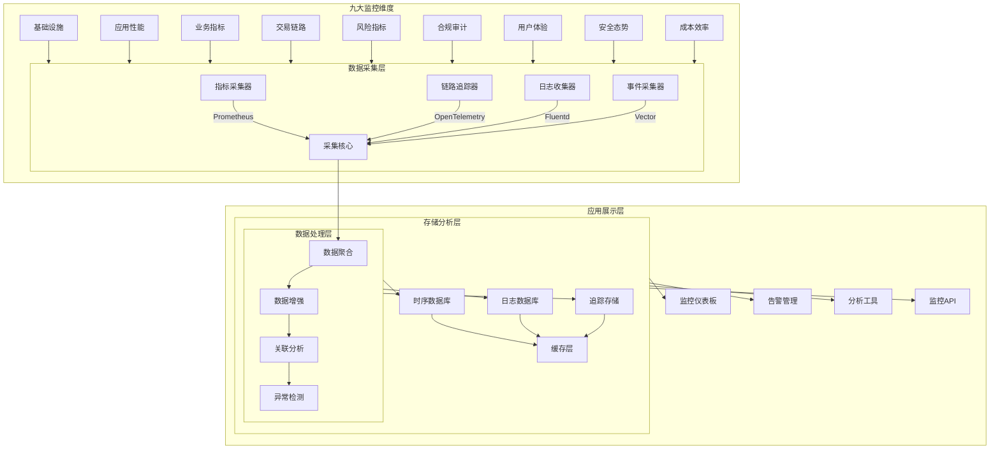

# 监控、日志与告警体系设计

## 1. 监控体系架构全景

### 1.1 多维度监控架构

本平台采用**四层九维**监控体系，实现从基础设施到业务逻辑的全链路可观测性，确保高频交易系统的稳定运行与快速故障定位。



### 1.2 监控性能目标

| 监控维度 | 数据采集频率 | 数据处理延迟 | 存储保留期 | 告警响应时间 |
|---------|------------|------------|-----------|------------|
| 基础设施 | 1秒 | < 100ms | 30天 | < 30秒 |
| 应用性能 | 100ms | < 50ms | 7天 | < 10秒 |
| 交易链路 | 10ms | < 20ms | 24小时 | < 5秒 |
| 风险指标 | 1秒 | < 100ms | 90天 | < 60秒 |
| 业务指标 | 1分钟 | < 1秒 | 365天 | < 5分钟 |
| 安全事件 | 实时 | < 50ms | 180天 | < 15秒 |
| 合规审计 | 批次 | < 5秒 | 7年 | < 1小时 |
| 用户体验 | 1秒 | < 200ms | 30天 | < 30秒 |
| 成本效率 | 1小时 | < 10秒 | 5年 | < 1小时 |

## 2. 指标监控体系

### 2.1 基础设施监控

#### 2.1.1 服务器监控指标

```yaml
# 基础设施监控配置
infrastructure_monitoring:
  servers:
    # CPU监控
    cpu:
      metrics:
        - name: "cpu_usage_percent"
          description: "CPU使用率"
          collection_interval: "1s"
          thresholds:
            warning: 70
            critical: 90
          
        - name: "cpu_load_1min"
          description: "1分钟平均负载"
          collection_interval: "10s"
          thresholds:
            warning: "cores * 0.7"
            critical: "cores * 1.0"
          
        - name: "cpu_context_switches"
          description: "上下文切换次数"
          collection_interval: "10s"
          thresholds:
            warning: 10000
            critical: 50000
    
    # 内存监控
    memory:
      metrics:
        - name: "memory_usage_percent"
          description: "内存使用率"
          collection_interval: "1s"
          thresholds:
            warning: 75
            critical: 90
          
        - name: "memory_available_bytes"
          description: "可用内存"
          collection_interval: "1s"
          thresholds:
            warning: "2GB"
            critical: "1GB"
          
        - name: "swap_usage_percent"
          description: "交换分区使用率"
          collection_interval: "10s"
          thresholds:
            warning: 10
            critical: 30
    
    # 磁盘监控
    disk:
      metrics:
        - name: "disk_usage_percent"
          description: "磁盘使用率"
          collection_interval: "30s"
          thresholds:
            warning: 80
            critical: 95
          
        - name: "disk_read_iops"
          description: "磁盘读IOPS"
          collection_interval: "10s"
          thresholds:
            warning: 10000
            critical: 20000
          
        - name: "disk_write_iops"
          description: "磁盘写IOPS"
          collection_interval: "10s"
          thresholds:
            warning: 5000
            critical: 10000
    
    # 网络监控
    network:
      metrics:
        - name: "network_rx_bytes"
          description: "网络接收字节数"
          collection_interval: "1s"
          thresholds:
            warning: "1Gbps"
            critical: "10Gbps"
          
        - name: "network_tx_bytes"
          description: "网络发送字节数"
          collection_interval: "1s"
          thresholds:
            warning: "1Gbps"
            critical: "10Gbps"
          
        - name: "network_error_rate"
          description: "网络错误率"
          collection_interval: "10s"
          thresholds:
            warning: 0.001
            critical: 0.01
    
    # NUMA监控
    numa:
      metrics:
        - name: "numa_node_memory_usage"
          description: "NUMA节点内存使用率"
          collection_interval: "5s"
          per_node: true
          
        - name: "numa_remote_memory_access"
          description: "远程内存访问比例"
          collection_interval: "10s"
          thresholds:
            warning: 0.1
            critical: 0.3
```

#### 2.1.2 容器与编排监控

```python
# Python容器监控采集器
class ContainerMonitor:
    """容器化环境监控采集器"""
    
    def __init__(self, k8s_client=None):
        self.k8s_client = k8s_client
        self.metrics_cache = {}
        self.last_collection = time.time()
        
    def collect_container_metrics(self, namespace="trading") -> Dict:
        """收集容器指标"""
        metrics = {
            "timestamp": time.time(),
            "namespace": namespace,
            "pods": [],
            "containers": [],
            "cluster": {}
        }
        
        # 收集Pod级别指标
        pods = self._get_pods(namespace)
        for pod in pods:
            pod_metrics = self._collect_pod_metrics(pod)
            metrics["pods"].append(pod_metrics)
            
            # 收集容器级别指标
            for container in pod.spec.containers:
                container_metrics = self._collect_container_metrics(pod, container)
                metrics["containers"].append(container_metrics)
        
        # 收集集群级别指标
        metrics["cluster"] = self._collect_cluster_metrics()
        
        return metrics
    
    def _collect_pod_metrics(self, pod) -> Dict:
        """收集Pod指标"""
        return {
            "name": pod.metadata.name,
            "namespace": pod.metadata.namespace,
            "phase": pod.status.phase,
            "restart_count": self._get_restart_count(pod),
            "cpu_usage": self._get_pod_cpu_usage(pod),
            "memory_usage": self._get_pod_memory_usage(pod),
            "network_metrics": self._get_pod_network_metrics(pod),
            "age_seconds": time.time() - pod.metadata.creation_timestamp.timestamp()
        }
    
    def _collect_container_metrics(self, pod, container) -> Dict:
        """收集容器指标"""
        container_status = self._get_container_status(pod, container.name)
        
        return {
            "pod_name": pod.metadata.name,
            "container_name": container.name,
            "image": container.image,
            "ready": container_status.ready if container_status else False,
            "restart_count": container_status.restart_count if container_status else 0,
            "resource_limits": container.resources.limits if container.resources else {},
            "resource_requests": container.resources.requests if container.resources else {},
            "cpu_usage": self._get_container_cpu_usage(pod, container.name),
            "memory_usage": self._get_container_memory_usage(pod, container.name)
        }
    
    def _collect_cluster_metrics(self) -> Dict:
        """收集集群级别指标"""
        return {
            "node_count": len(self._get_nodes()),
            "pod_count": self._get_total_pod_count(),
            "resource_utilization": self._calculate_resource_utilization(),
            "scheduler_metrics": self._get_scheduler_metrics(),
            "api_server_health": self._check_api_server_health()
        }
    
    def detect_anomalies(self, metrics: Dict) -> List[Dict]:
        """检测容器异常"""
        anomalies = []
        
        # 检查Pod异常
        for pod in metrics["pods"]:
            if pod["phase"] not in ["Running", "Succeeded"]:
                anomalies.append({
                    "type": "POD_STATE",
                    "severity": "CRITICAL",
                    "resource": f"pod/{pod['name']}",
                    "message": f"Pod状态异常: {pod['phase']}",
                    "timestamp": time.time()
                })
            
            if pod["restart_count"] > 10:
                anomalies.append({
                    "type": "POD_RESTART",
                    "severity": "WARNING",
                    "resource": f"pod/{pod['name']}",
                    "message": f"Pod重启次数过多: {pod['restart_count']}",
                    "timestamp": time.time()
                })
        
        # 检查容器资源异常
        for container in metrics["containers"]:
            cpu_limit = self._parse_resource(container.get("resource_limits", {}).get("cpu", "0"))
            memory_limit = self._parse_resource(container.get("resource_limits", {}).get("memory", "0"))
            
            if cpu_limit > 0 and container["cpu_usage"] > cpu_limit * 0.9:
                anomalies.append({
                    "type": "CPU_LIMIT",
                    "severity": "WARNING",
                    "resource": f"pod/{container['pod_name']}/container/{container['container_name']}",
                    "message": f"CPU使用接近限制: {container['cpu_usage']:.2f}/{cpu_limit}",
                    "timestamp": time.time()
                })
            
            if memory_limit > 0 and container["memory_usage"] > memory_limit * 0.9:
                anomalies.append({
                    "type": "MEMORY_LIMIT",
                    "severity": "WARNING",
                    "resource": f"pod/{container['pod_name']}/container/{container['container_name']}",
                    "message": f"内存使用接近限制: {container['memory_usage']}/{memory_limit}",
                    "timestamp": time.time()
                })
        
        return anomalies
```

### 2.2 应用性能监控（APM）

#### 2.2.1 交易应用性能指标

```cpp
// C++ 应用性能监控探针
class TradingAPMProbe {
public:
    struct TransactionMetrics {
        std::string transaction_name;
        int64_t start_time_ns;
        int64_t end_time_ns;
        bool success;
        std::string error_message;
        std::map<std::string, double> custom_metrics;
        
        double duration_ns() const {
            return static_cast<double>(end_time_ns - start_time_ns);
        }
        
        std::string to_json() const {
            std::stringstream ss;
            ss << "{";
            ss << "\"transaction\":\"" << transaction_name << "\",";
            ss << "\"start_time_ns\":" << start_time_ns << ",";
            ss << "\"end_time_ns\":" << end_time_ns << ",";
            ss << "\"duration_ns\":" << duration_ns() << ",";
            ss << "\"success\":" << (success ? "true" : "false");
            
            if (!error_message.empty()) {
                ss << ",\"error\":\"" << error_message << "\"";
            }
            
            if (!custom_metrics.empty()) {
                ss << ",\"custom_metrics\":{";
                bool first = true;
                for (const auto& metric : custom_metrics) {
                    if (!first) ss << ",";
                    ss << "\"" << metric.first << "\":" << metric.second;
                    first = false;
                }
                ss << "}";
            }
            
            ss << "}";
            return ss.str();
        }
    };
    
    // 交易关键路径监控
    class OrderPathMonitor {
    public:
        OrderPathMonitor(const std::string& order_id) : order_id_(order_id) {
            stages_.reserve(10);
        }
        
        void start_stage(const std::string& stage_name) {
            StageMetrics stage;
            stage.name = stage_name;
            stage.start_time_ns = get_current_time_ns();
            stage.end_time_ns = 0;
            stage.success = false;
            
            current_stage_ = stage_name;
            stages_.push_back(stage);
        }
        
        void end_stage(bool success = true, const std::string& error_msg = "") {
            if (stages_.empty()) return;
            
            auto& stage = stages_.back();
            stage.end_time_ns = get_current_time_ns();
            stage.success = success;
            stage.error_message = error_msg;
            
            // 记录到监控系统
            record_stage_metrics(stage);
            
            current_stage_.clear();
        }
        
        TransactionMetrics get_transaction_metrics() const {
            TransactionMetrics metrics;
            metrics.transaction_name = "order_processing";
            metrics.success = true;
            
            if (!stages_.empty()) {
                metrics.start_time_ns = stages_.front().start_time_ns;
                metrics.end_time_ns = stages_.back().end_time_ns;
                
                // 检查是否有失败的阶段
                for (const auto& stage : stages_) {
                    if (!stage.success) {
                        metrics.success = false;
                        metrics.error_message = stage.error_message;
                        break;
                    }
                }
                
                // 添加自定义指标
                for (const auto& stage : stages_) {
                    std::string metric_name = stage.name + "_duration_ns";
                    metrics.custom_metrics[metric_name] = 
                        static_cast<double>(stage.end_time_ns - stage.start_time_ns);
                }
            }
            
            return metrics;
        }
        
    private:
        struct StageMetrics {
            std::string name;
            int64_t start_time_ns;
            int64_t end_time_ns;
            bool success;
            std::string error_message;
        };
        
        std::string order_id_;
        std::string current_stage_;
        std::vector<StageMetrics> stages_;
        
        void record_stage_metrics(const StageMetrics& stage) {
            // 发送到监控后端
            std::string metric_name = "trading_stage_duration_ns";
            std::map<std::string, std::string> labels = {
                {"order_id", order_id_},
                {"stage", stage.name},
                {"success", stage.success ? "true" : "false"}
            };
            
            double duration_ns = static_cast<double>(stage.end_time_ns - stage.start_time_ns);
            MonitoringClient::instance().record_histogram(metric_name, duration_ns, labels);
            
            // 记录到本地缓存用于聚合
            stage_metrics_cache_[stage.name].add_sample(duration_ns);
        }
        
        static std::map<std::string, StatisticsAggregator> stage_metrics_cache_;
    };
    
    // 内存分配监控
    class MemoryAllocationTracker {
    public:
        static void* track_alloc(size_t size, const char* alloc_type) {
            void* ptr = malloc(size);
            
            if (ptr) {
                std::lock_guard<std::mutex> lock(alloc_mutex_);
                
                AllocationInfo info;
                info.size = size;
                info.alloc_type = alloc_type;
                info.timestamp_ns = get_current_time_ns();
                info.stack_trace = capture_stack_trace(10);
                
                allocations_[ptr] = info;
                total_allocated_ += size;
                
                // 更新监控指标
                MonitoringClient::instance().record_gauge(
                    "memory_allocated_bytes", total_allocated_
                );
                
                MonitoringClient::instance().record_counter(
                    "memory_allocation_count", 1, {{"type", alloc_type}}
                );
            }
            
            return ptr;
        }
        
        static void track_free(void* ptr) {
            if (!ptr) return;
            
            std::lock_guard<std::mutex> lock(alloc_mutex_);
            
            auto it = allocations_.find(ptr);
            if (it != allocations_.end()) {
                total_allocated_ -= it->second.size;
                
                // 记录分配生命周期
                int64_t lifetime_ns = get_current_time_ns() - it->second.timestamp_ns;
                MonitoringClient::instance().record_histogram(
                    "memory_allocation_lifetime_ns", 
                    static_cast<double>(lifetime_ns),
                    {{"type", it->second.alloc_type}}
                );
                
                allocations_.erase(it);
                
                // 更新监控指标
                MonitoringClient::instance().record_gauge(
                    "memory_allocated_bytes", total_allocated_
                );
            }
            
            free(ptr);
        }
        
        static AllocationStats get_stats() {
            std::lock_guard<std::mutex> lock(alloc_mutex_);
            
            AllocationStats stats;
            stats.total_allocated = total_allocated_;
            stats.allocation_count = allocations_.size();
            
            // 按类型统计
            for (const auto& alloc : allocations_) {
                stats.by_type[alloc.second.alloc_type] += alloc.second.size;
            }
            
            // 检测内存泄漏
            if (stats.allocation_count > 0) {
                int64_t now_ns = get_current_time_ns();
                for (const auto& alloc : allocations_) {
                    int64_t age_ns = now_ns - alloc.second.timestamp_ns;
                    if (age_ns > 300000000000LL) {  // 5分钟
                        stats.possible_leaks.push_back({
                            alloc.second.alloc_type,
                            alloc.second.size,
                            age_ns / 1000000000LL,  // 转换为秒
                            alloc.second.stack_trace
                        });
                    }
                }
            }
            
            return stats;
        }
        
    private:
        struct AllocationInfo {
            size_t size;
            const char* alloc_type;
            int64_t timestamp_ns;
            std::vector<void*> stack_trace;
        };
        
        struct LeakDetection {
            std::string alloc_type;
            size_t size;
            int64_t age_seconds;
            std::vector<void*> stack_trace;
        };
        
        struct AllocationStats {
            size_t total_allocated;
            size_t allocation_count;
            std::map<std::string, size_t> by_type;
            std::vector<LeakDetection> possible_leaks;
        };
        
        static std::mutex alloc_mutex_;
        static std::unordered_map<void*, AllocationInfo> allocations_;
        static size_t total_allocated_;
    };
};
```

#### 2.2.2 实时性能剖析

```python
# Python 实时性能剖析系统
class RealTimeProfiler:
    """实时性能剖析与热点分析"""
    
    def __init__(self, sampling_rate: float = 0.01):
        self.sampling_rate = sampling_rate  # 1%采样率
        self.profile_data = {}
        self.last_profile_time = time.time()
        self.enabled = True
        
    def profile_function(self, func):
        """函数性能剖析装饰器"""
        @functools.wraps(func)
        def wrapper(*args, **kwargs):
            if not self.enabled or random.random() > self.sampling_rate:
                return func(*args, **kwargs)
            
            start_time = time.perf_counter_ns()
            start_memory = self._get_memory_usage()
            
            try:
                result = func(*args, **kwargs)
                return result
            finally:
                end_time = time.perf_counter_ns()
                end_memory = self._get_memory_usage()
                
                duration_ns = end_time - start_time
                memory_delta = end_memory - start_memory
                
                self._record_profile(
                    func.__name__,
                    duration_ns,
                    memory_delta,
                    success=True
                )
        
        return wrapper
    
    def profile_block(self, block_name: str):
        """代码块性能剖析上下文管理器"""
        class ProfileBlock:
            def __init__(self, profiler, name):
                self.profiler = profiler
                self.name = name
                
            def __enter__(self):
                if self.profiler.enabled and random.random() <= self.profiler.sampling_rate:
                    self.should_profile = True
                    self.start_time = time.perf_counter_ns()
                    self.start_memory = self.profiler._get_memory_usage()
                else:
                    self.should_profile = False
                return self
                
            def __exit__(self, exc_type, exc_val, exc_tb):
                if self.should_profile:
                    end_time = time.perf_counter_ns()
                    end_memory = self.profiler._get_memory_usage()
                    
                    duration_ns = end_time - self.start_time
                    memory_delta = end_memory - self.start_memory
                    success = exc_type is None
                    
                    self.profiler._record_profile(
                        self.name,
                        duration_ns,
                        memory_delta,
                        success=success
                    )
        
        return ProfileBlock(self, block_name)
    
    def _record_profile(self, name: str, duration_ns: int, 
                       memory_delta: int, success: bool):
        """记录剖析数据"""
        if name not in self.profile_data:
            self.profile_data[name] = {
                'count': 0,
                'total_duration_ns': 0,
                'max_duration_ns': 0,
                'min_duration_ns': float('inf'),
                'total_memory_delta': 0,
                'success_count': 0,
                'failure_count': 0,
                'call_times': []
            }
        
        data = self.profile_data[name]
        data['count'] += 1
        data['total_duration_ns'] += duration_ns
        data['max_duration_ns'] = max(data['max_duration_ns'], duration_ns)
        data['min_duration_ns'] = min(data['min_duration_ns'], duration_ns)
        data['total_memory_delta'] += memory_delta
        
        if success:
            data['success_count'] += 1
        else:
            data['failure_count'] += 1
        
        data['call_times'].append(time.time())
        
        # 清理过期数据（保留最近1000次调用）
        if len(data['call_times']) > 1000:
            data['call_times'] = data['call_times'][-1000:]
        
        # 定期上报监控数据
        if time.time() - self.last_profile_time > 5:  # 每5秒上报一次
            self._report_metrics()
            self.last_profile_time = time.time()
    
    def _report_metrics(self):
        """上报性能指标到监控系统"""
        for name, data in self.profile_data.items():
            if data['count'] == 0:
                continue
            
            avg_duration_ns = data['total_duration_ns'] / data['count']
            success_rate = data['success_count'] / data['count'] if data['count'] > 0 else 0
            
            # 计算调用频率（最近1分钟）
            now = time.time()
            recent_calls = [t for t in data['call_times'] if now - t < 60]
            calls_per_minute = len(recent_calls)
            
            # 上报到监控系统
            metrics = {
                f'profile.{name}.calls_per_minute': calls_per_minute,
                f'profile.{name}.avg_duration_ns': avg_duration_ns,
                f'profile.{name}.max_duration_ns': data['max_duration_ns'],
                f'profile.{name}.success_rate': success_rate,
                f'profile.{name}.memory_delta_avg': data['total_memory_delta'] / data['count']
            }
            
            self._send_to_monitoring(metrics)
    
    def get_hotspots(self, limit: int = 10) -> List[Dict]:
        """获取性能热点"""
        hotspots = []
        
        for name, data in self.profile_data.items():
            if data['count'] == 0:
                continue
            
            avg_duration_ns = data['total_duration_ns'] / data['count']
            total_duration_ms = data['total_duration_ns'] / 1e6
            
            # 计算最近1分钟调用频率
            now = time.time()
            recent_calls = [t for t in data['call_times'] if now - t < 60]
            calls_per_minute = len(recent_calls)
            
            # 计算热度分数（基于调用频率和平均耗时）
            heat_score = calls_per_minute * avg_duration_ns / 1e6
            
            hotspots.append({
                'name': name,
                'calls_per_minute': calls_per_minute,
                'avg_duration_ns': avg_duration_ns,
                'total_duration_ms': total_duration_ms,
                'heat_score': heat_score,
                'success_rate': data['success_count'] / data['count'] if data['count'] > 0 else 0
            })
        
        # 按热度排序
        hotspots.sort(key=lambda x: x['heat_score'], reverse=True)
        
        return hotspots[:limit]
    
    def _get_memory_usage(self) -> int:
        """获取当前内存使用量"""
        import psutil
        process = psutil.Process()
        return process.memory_info().rss
    
    def _send_to_monitoring(self, metrics: Dict[str, float]):
        """发送指标到监控后端"""
        # 在实际实现中，这里会连接到Prometheus或其他监控系统
        pass
```

### 2.3 业务指标监控

#### 2.3.1 交易业务指标

```yaml
# 交易业务监控配置
trading_business_monitoring:
  # 订单处理指标
  order_processing:
    metrics:
      - name: "orders_processed_per_second"
        description: "订单处理速率"
        collection_interval: "1s"
        aggregation: "rate"
        thresholds:
          warning: 1000
          critical: 5000
      
      - name: "order_processing_latency_ns"
        description: "订单处理延迟"
        collection_interval: "100ms"
        aggregation: "histogram"
        percentiles: [50, 90, 95, 99, 99.9]
        thresholds:
          p99_warning: 1000000  # 1ms
          p99_critical: 5000000  # 5ms
      
      - name: "order_rejection_rate"
        description: "订单拒绝率"
        collection_interval: "10s"
        aggregation: "ratio"
        numerator: "rejected_orders"
        denominator: "total_orders"
        thresholds:
          warning: 0.01  # 1%
          critical: 0.05  # 5%
  
  # 成交指标
  trade_execution:
    metrics:
      - name: "trades_executed_per_second"
        description: "成交速率"
        collection_interval: "1s"
        aggregation: "rate"
      
      - name: "execution_slippage_bps"
        description: "执行滑点"
        collection_interval: "1s"
        aggregation: "histogram"
        percentiles: [50, 90, 95, 99]
        thresholds:
          p99_warning: 5  # 5bps
          p99_critical: 10  # 10bps
      
      - name: "fill_rate"
        description: "成交率"
        collection_interval: "10s"
        aggregation: "ratio"
        numerator: "filled_volume"
        denominator: "ordered_volume"
        thresholds:
          warning: 0.8  # 80%
          critical: 0.5  # 50%
  
  # 仓位与风险指标
  position_risk:
    metrics:
      - name: "position_exposure"
        description: "仓位敞口"
        collection_interval: "1s"
        aggregation: "gauge"
        thresholds:
          warning: "10000000"  # 1000万
          critical: "50000000"  # 5000万
      
      - name: "margin_utilization"
        description: "保证金使用率"
        collection_interval: "1s"
        aggregation: "gauge"
        thresholds:
          warning: 0.7  # 70%
          critical: 0.9  # 90%
      
      - name: "var_95_1day"
        description: "1日95% VaR"
        collection_interval: "1m"
        aggregation: "gauge"
        thresholds:
          warning: "1000000"  # 100万
          critical: "5000000"  # 500万
  
  # 策略性能指标
  strategy_performance:
    metrics:
      - name: "strategy_pnl"
        description: "策略盈亏"
        collection_interval: "1s"
        aggregation: "counter"
      
      - name: "strategy_sharpe_ratio"
        description: "夏普比率"
        collection_interval: "1m"
        aggregation: "gauge"
        calculation_window: "1d"
        thresholds:
          warning: 1.0
          critical: 0.0
      
      - name: "strategy_max_drawdown"
        description: "最大回撤"
        collection_interval: "1m"
        aggregation: "gauge"
        calculation_window: "7d"
        thresholds:
          warning: 0.05  # 5%
          critical: 0.1   # 10%
      
      - name: "strategy_win_rate"
        description: "胜率"
        collection_interval: "10s"
        aggregation: "ratio"
        numerator: "winning_trades"
        denominator: "total_trades"
        thresholds:
          warning: 0.4  # 40%
          critical: 0.3  # 30%
```

## 3. 日志体系设计

### 3.1 结构化日志架构

```cpp
// C++ 结构化日志系统
class StructuredLogger {
public:
    enum class LogLevel {
        TRACE = 0,
        DEBUG = 1,
        INFO = 2,
        WARN = 3,
        ERROR = 4,
        FATAL = 5
    };
    
    struct LogEntry {
        LogLevel level;
        std::string logger_name;
        std::string message;
        std::map<std::string, std::string> fields;
        std::string thread_id;
        std::string file;
        int line;
        int64_t timestamp_ns;
        std::string trace_id;
        std::string span_id;
        
        std::string to_json() const {
            std::stringstream ss;
            ss << "{";
            ss << "\"timestamp\":" << timestamp_ns << ",";
            ss << "\"level\":\"" << level_to_string(level) << "\",";
            ss << "\"logger\":\"" << logger_name << "\",";
            ss << "\"message\":\"" << escape_json(message) << "\",";
            ss << "\"thread\":\"" << thread_id << "\",";
            ss << "\"file\":\"" << file << "\",";
            ss << "\"line\":" << line;
            
            if (!trace_id.empty()) {
                ss << ",\"trace_id\":\"" << trace_id << "\"";
            }
            
            if (!span_id.empty()) {
                ss << ",\"span_id\":\"" << span_id << "\"";
            }
            
            if (!fields.empty()) {
                ss << ",\"fields\":{";
                bool first = true;
                for (const auto& field : fields) {
                    if (!first) ss << ",";
                    ss << "\"" << field.first << "\":\"" << escape_json(field.second) << "\"";
                    first = false;
                }
                ss << "}";
            }
            
            ss << "}";
            return ss.str();
        }
        
    private:
        static std::string level_to_string(LogLevel level) {
            switch (level) {
                case LogLevel::TRACE: return "TRACE";
                case LogLevel::DEBUG: return "DEBUG";
                case LogLevel::INFO: return "INFO";
                case LogLevel::WARN: return "WARN";
                case LogLevel::ERROR: return "ERROR";
                case LogLevel::FATAL: return "FATAL";
                default: return "UNKNOWN";
            }
        }
        
        static std::string escape_json(const std::string& str) {
            std::string result;
            result.reserve(str.length());
            
            for (char c : str) {
                switch (c) {
                    case '"': result += "\\\""; break;
                    case '\\': result += "\\\\"; break;
                    case '\b': result += "\\b"; break;
                    case '\f': result += "\\f"; break;
                    case '\n': result += "\\n"; break;
                    case '\r': result += "\\r"; break;
                    case '\t': result += "\\t"; break;
                    default:
                        if (static_cast<unsigned char>(c) < 0x20 || c == 0x7f) {
                            // 控制字符，使用Unicode转义
                            char buf[7];
                            snprintf(buf, sizeof(buf), "\\u%04x", c);
                            result += buf;
                        } else {
                            result += c;
                        }
                }
            }
            
            return result;
        }
    };
    
    // 高性能异步日志器
    class AsyncLogger {
    public:
        AsyncLogger(const std::string& name, const std::string& log_dir) 
            : logger_name_(name), log_dir_(log_dir), running_(false) {
            
            // 创建日志目录
            std::filesystem::create_directories(log_dir);
            
            // 启动日志线程
            log_thread_ = std::thread(&AsyncLogger::log_processing_loop, this);
        }
        
        ~AsyncLogger() {
            stop();
        }
        
        void log(LogLevel level, const std::string& message,
                const std::map<std::string, std::string>& fields = {},
                const std::string& file = "", int line = 0) {
            
            LogEntry entry;
            entry.level = level;
            entry.logger_name = logger_name_;
            entry.message = message;
            entry.fields = fields;
            entry.file = file;
            entry.line = line;
            entry.timestamp_ns = get_current_time_ns();
            entry.thread_id = get_thread_id();
            
            // 获取追踪上下文
            auto trace_ctx = TracingContext::current();
            if (trace_ctx) {
                entry.trace_id = trace_ctx->trace_id();
                entry.span_id = trace_ctx->span_id();
            }
            
            // 异步写入队列
            std::lock_guard<std::mutex> lock(queue_mutex_);
            log_queue_.push(std::move(entry));
            queue_cv_.notify_one();
        }
        
        // 便捷方法
        void trace(const std::string& message, 
                  const std::map<std::string, std::string>& fields = {},
                  const std::string& file = "", int line = 0) {
            log(LogLevel::TRACE, message, fields, file, line);
        }
        
        void debug(const std::string& message,
                  const std::map<std::string, std::string>& fields = {},
                  const std::string& file = "", int line = 0) {
            log(LogLevel::DEBUG, message, fields, file, line);
        }
        
        void info(const std::string& message,
                 const std::map<std::string, std::string>& fields = {},
                 const std::string& file = "", int line = 0) {
            log(LogLevel::INFO, message, fields, file, line);
        }
        
        void warn(const std::string& message,
                 const std::map<std::string, std::string>& fields = {},
                 const std::string& file = "", int line = 0) {
            log(LogLevel::WARN, message, fields, file, line);
        }
        
        void error(const std::string& message,
                  const std::map<std::string, std::string>& fields = {},
                  const std::string& file = "", int line = 0) {
            log(LogLevel::ERROR, message, fields, file, line);
        }
        
        void fatal(const std::string& message,
                  const std::map<std::string, std::string>& fields = {},
                  const std::string& file = "", int line = 0) {
            log(LogLevel::FATAL, message, fields, file, line);
        }
        
        void stop() {
            {
                std::lock_guard<std::mutex> lock(queue_mutex_);
                running_ = false;
                queue_cv_.notify_all();
            }
            
            if (log_thread_.joinable()) {
                log_thread_.join();
            }
        }
        
    private:
        void log_processing_loop() {
            running_ = true;
            
            std::ofstream log_file;
            std::string current_date;
            size_t bytes_written = 0;
            const size_t MAX_FILE_SIZE = 100 * 1024 * 1024;  // 100MB
            
            while (running_) {
                std::queue<LogEntry> batch;
                
                // 批量获取日志条目
                {
                    std::unique_lock<std::mutex> lock(queue_mutex_);
                    queue_cv_.wait_for(lock, std::chrono::milliseconds(100),
                                      [this]() { return !log_queue_.empty() || !running_; });
                    
                    if (!running_ && log_queue_.empty()) {
                        break;
                    }
                    
                    // 批量转移最多1000条日志
                    size_t batch_size = std::min(log_queue_.size(), static_cast<size_t>(1000));
                    for (size_t i = 0; i < batch_size; ++i) {
                        batch.push(std::move(log_queue_.front()));
                        log_queue_.pop();
                    }
                }
                
                // 处理批量日志
                while (!batch.empty()) {
                    auto& entry = batch.front();
                    
                    // 检查是否需要切换日志文件
                    std::string entry_date = format_timestamp_date(entry.timestamp_ns);
                    if (entry_date != current_date || bytes_written > MAX_FILE_SIZE) {
                        if (log_file.is_open()) {
                            log_file.close();
                        }
                        
                        current_date = entry_date;
                        bytes_written = 0;
                        
                        std::string filename = fmt::format("{}/{}_{}.log", 
                                                          log_dir_, logger_name_, current_date);
                        log_file.open(filename, std::ios::app);
                        
                        if (!log_file) {
                            std::cerr << "Failed to open log file: " << filename << std::endl;
                            // 跳过此批次
                            break;
                        }
                    }
                    
                    // 写入日志
                    std::string log_line = entry.to_json() + "\n";
                    log_file << log_line;
                    
                    bytes_written += log_line.size();
                    
                    // 刷新缓冲区（每100条或重要日志）
                    if (batch.size() % 100 == 0 || entry.level >= LogLevel::ERROR) {
                        log_file.flush();
                    }
                    
                    batch.pop();
                }
            }
            
            if (log_file.is_open()) {
                log_file.close();
            }
        }
        
        std::string logger_name_;
        std::string log_dir_;
        std::thread log_thread_;
        std::mutex queue_mutex_;
        std::condition_variable queue_cv_;
        std::queue<LogEntry> log_queue_;
        bool running_;
    };
    
    // 交易特定日志器
    class TradingLogger {
    public:
        static void log_order_event(const std::string& order_id,
                                   const std::string& event_type,
                                   const std::map<std::string, std::string>& details) {
            std::map<std::string, std::string> fields = {
                {"order_id", order_id},
                {"event_type", event_type},
                {"timestamp", std::to_string(get_current_time_ns())}
            };
            
            fields.insert(details.begin(), details.end());
            
            get_trading_logger().info(
                fmt::format("Order event: {} - {}", order_id, event_type),
                fields,
                __FILE__, __LINE__
            );
        }
        
        static void log_trade_event(const std::string& trade_id,
                                   const std::string& instrument_id,
                                   double price, int volume,
                                   const std::string& direction) {
            std::map<std::string, std::string> fields = {
                {"trade_id", trade_id},
                {"instrument_id", instrument_id},
                {"price", fmt::format("{:.2f}", price)},
                {"volume", std::to_string(volume)},
                {"direction", direction},
                {"timestamp", std::to_string(get_current_time_ns())}
            };
            
            get_trading_logger().info(
                fmt::format("Trade executed: {} {} @ {}", instrument_id, volume, price),
                fields,
                __FILE__, __LINE__
            );
        }
        
        static void log_risk_event(const std::string& event_type,
                                  const std::string& severity,
                                  const std::string& description,
                                  const std::map<std::string, std::string>& context) {
            std::map<std::string, std::string> fields = {
                {"event_type", event_type},
                {"severity", severity},
                {"description", description},
                {"timestamp", std::to_string(get_current_time_ns())}
            };
            
            fields.insert(context.begin(), context.end());
            
            LogLevel level = LogLevel::INFO;
            if (severity == "WARNING") level = LogLevel::WARN;
            else if (severity == "ERROR") level = LogLevel::ERROR;
            else if (severity == "CRITICAL") level = LogLevel::FATAL;
            
            get_risk_logger().log(
                level,
                fmt::format("Risk event: {} - {}", event_type, description),
                fields,
                __FILE__, __LINE__
            );
        }
        
    private:
        static AsyncLogger& get_trading_logger() {
            static AsyncLogger trading_logger("trading", "/var/log/trading");
            return trading_logger;
        }
        
        static AsyncLogger& get_risk_logger() {
            static AsyncLogger risk_logger("risk", "/var/log/risk");
            return risk_logger;
        }
    };
};
```

### 3.2 日志收集与处理流水线

```yaml
# 日志处理流水线配置
log_processing_pipeline:
  # 日志收集器配置
  collectors:
    - type: "file"
      name: "trading_logs"
      paths:
        - "/var/log/trading/*.log"
        - "/var/log/risk/*.log"
      exclude_paths:
        - "*.gz"
        - "*.old"
      follow: true
      refresh_interval: "10s"
      
    - type: "journald"
      name: "system_logs"
      units:
        - "trading-engine.service"
        - "risk-engine.service"
        - "market-data.service"
      
    - type: "stdin"
      name: "container_logs"
      tag: "container.*"
  
  # 日志解析器配置
  parsers:
    - type: "json"
      name: "json_parser"
      time_key: "timestamp"
      time_format: "unix_ns"
      keep_time_key: true
      
    - type: "regex"
      name: "ctp_log_parser"
      format: "/^(?<time>\d{4}-\d{2}-\d{2} \d{2}:\d{2}:\d{2}\.\d{3}) \[(?<level>\w+)\] (?<message>.*)$/"
      time_key: "time"
      time_format: "%Y-%m-%d %H:%M:%S.%L"
      
    - type: "multiline"
      name: "stack_trace_parser"
      format_firstline: "/^\d{4}-\d{2}-\d{2}/"
      format1: "/^(?<time>\d{4}-\d{2}-\d{2} \d{2}:\d{2}:\d{2}) \[(?<level>\w+)\] (?<message>.*)$/"
  
  # 日志过滤器配置
  filters:
    - type: "record_transformer"
      name: "add_host_info"
      records:
        - key: "hostname"
          value: "${HOSTNAME}"
        - key: "environment"
          value: "${ENVIRONMENT:-production}"
          
    - type: "grep"
      name: "filter_sensitive_data"
      exclude:
        - key: "message"
          pattern: "(password|secret|token)=[^&]*"
          
    - type: "record_modifier"
      name: "mask_personal_info"
      fields:
        - key: "investor_id"
          pattern: "(\d{4})\d{4}(\d{4})"
          replace: "\1****\2"
          
    - type: "throttle"
      name: "rate_limit_logs"
      group_key: "level"
      group_bucket_period_s: 60
      group_bucket_limit: 1000
  
  # 日志缓冲器配置
  buffers:
    - type: "memory"
      name: "memory_buffer"
      chunk_limit_size: "8MB"
      total_limit_size: "256MB"
      chunk_limit_records: 5000
      flush_mode: "interval"
      flush_interval: "5s"
      
    - type: "file"
      name: "file_buffer"
      path: "/var/log/fluentd/buffer"
      chunk_limit_size: "32MB"
      total_limit_size: "10GB"
      flush_thread_count: 4
  
  # 日志输出器配置
  outputs:
    - type: "elasticsearch"
      name: "elasticsearch_main"
      hosts: ["elasticsearch:9200"]
      index_name: "logs-${tag}-%Y.%m.%d"
      type_name: "_doc"
      logstash_format: true
      buffer:
        @type: "file"
        path: "/var/log/fluentd/buffer/elasticsearch"
        
    - type: "s3"
      name: "s3_archive"
      aws_key_id: "${AWS_ACCESS_KEY_ID}"
      aws_sec_key: "${AWS_SECRET_ACCESS_KEY}"
      s3_bucket: "trading-logs-archive"
      s3_region: "cn-north-1"
      path: "logs/${tag}/%Y/%m/%d/"
      store_as: "gzip"
      buffer:
        @type: "file"
        path: "/var/log/fluentd/buffer/s3"
        
    - type: "kafka"
      name: "kafka_stream"
      brokers: "kafka:9092"
      default_topic: "trading-logs"
      buffer:
        @type: "memory"
        
    - type: "slack"
      name: "slack_alerts"
      webhook_url: "${SLACK_WEBHOOK_URL}"
      channel: "#trading-alerts"
      message_keys: ["message", "level", "timestamp"]
      flush_interval: "1s"
      buffer:
        @type: "memory"
  
  # 日志路由规则
  routing:
    - match: "trading.*"
      outputs: ["elasticsearch_main", "s3_archive", "kafka_stream"]
      
    - match: "risk.*"
      outputs: ["elasticsearch_main", "s3_archive", "slack_alerts"]
      
    - match: "system.*"
      outputs: ["elasticsearch_main", "s3_archive"]
      
    - match: "container.*"
      outputs: ["elasticsearch_main"]
```

## 4. 告警体系设计

### 4.1 多层次告警策略

```yaml
# 告警策略配置
alerting_strategies:
  # 基础设施告警
  infrastructure:
    - name: "high_cpu_usage"
      description: "CPU使用率过高"
      condition: "cpu_usage_percent > 90"
      duration: "5m"
      severity: "CRITICAL"
      actions:
        - type: "notification"
          channels: ["slack", "sms", "phone"]
        - type: "auto_remediation"
          script: "scale_up_cpu.py"
          parameters:
            increment: 2
      
    - name: "low_memory"
      description: "可用内存不足"
      condition: "memory_available_bytes < 1GB"
      duration: "2m"
      severity: "CRITICAL"
      actions:
        - type: "notification"
          channels: ["slack", "sms"]
        - type: "auto_remediation"
          script: "restart_memory_intensive_services.py"
      
    - name: "disk_full"
      description: "磁盘空间不足"
      condition: "disk_usage_percent > 95"
      duration: "10m"
      severity: "HIGH"
      actions:
        - type: "notification"
          channels: ["slack", "email"]
        - type: "cleanup"
          paths: ["/var/log", "/tmp"]
  
  # 应用性能告警
  application:
    - name: "high_order_latency"
      description: "订单处理延迟过高"
      condition: "order_processing_latency_ns{quantile=\"0.99\"} > 5ms"
      duration: "1m"
      severity: "CRITICAL"
      actions:
        - type: "notification"
          channels: ["slack", "sms", "phone"]
        - type: "throttle"
          service: "order_processor"
          rate_limit: "50%"
      
    - name: "high_rejection_rate"
      description: "订单拒绝率过高"
      condition: "order_rejection_rate > 0.05"
      duration: "5m"
      severity: "HIGH"
      actions:
        - type: "notification"
          channels: ["slack", "email"]
        - type: "investigate"
          dashboard: "order_rejection_analysis"
      
    - name: "low_fill_rate"
      description: "成交率过低"
      condition: "fill_rate < 0.5"
      duration: "10m"
      severity: "MEDIUM"
      actions:
        - type: "notification"
          channels: ["slack"]
        - type: "adjust_strategy"
          strategy: "execution_algorithm"
          parameter: "aggressiveness"
          value: "high"
  
  # 业务风险告警
  business_risk:
    - name: "high_position_exposure"
      description: "仓位敞口过大"
      condition: "position_exposure > 50000000"
      duration: "30s"
      severity: "CRITICAL"
      actions:
        - type: "notification"
          channels: ["slack", "sms", "phone", "pager"]
        - type: "emergency_stop"
          services: ["trading_engine"]
        - type: "notify_risk_manager"
          escalation_level: "executive"
      
    - name: "high_margin_utilization"
      description: "保证金使用率过高"
      condition: "margin_utilization > 0.9"
      duration: "1m"
      severity: "HIGH"
      actions:
        - type: "notification"
          channels: ["slack", "sms"]
        - type: "reduce_position"
          target_utilization: 0.7
      
    - name: "var_breach"
      description: "VaR值突破阈值"
      condition: "var_95_1day > 5000000"
      duration: "5m"
      severity: "HIGH"
      actions:
        - type: "notification"
          channels: ["slack", "email"]
        - type: "increase_monitoring"
          frequency: "1s"
  
  # 合规告警
  compliance:
    - name: "self_trade_detected"
      description: "检测到自成交"
      condition: "self_trade_count > 0"
      duration: "0s"  # 立即告警
      severity: "HIGH"
      actions:
        - type: "notification"
          channels: ["slack", "email", "compliance_system"]
        - type: "block_account"
          account_id: "{{.account}}"
          duration: "1h"
        - type: "generate_report"
          report_type: "regulatory_incident"
      
    - name: "quote_stuffing_detected"
      description: "检测到频繁报撤"
      condition: "quote_stuffing_violations > 10"
      duration: "1m"
      severity: "MEDIUM"
      actions:
        - type: "notification"
          channels: ["slack", "email"]
        - type: "limit_order_rate"
          account_id: "{{.account}}"
          max_orders_per_second: 10
  
  # 安全告警
  security:
    - name: "unauthorized_access"
      description: "未授权访问尝试"
      condition: "auth_failure_count > 10"
      duration: "5m"
      severity: "HIGH"
      actions:
        - type: "notification"
          channels: ["slack", "sms", "security_team"]
        - type: "block_ip"
          ip_address: "{{.source_ip}}"
        - type: "increase_logging"
          level: "DEBUG"
      
    - name: "suspicious_api_activity"
      description: "可疑API活动"
      condition: "api_error_rate > 0.1 AND api_call_rate > 1000"
      duration: "2m"
      severity: "MEDIUM"
      actions:
        - type: "notification"
          channels: ["slack"]
        - type: "capture_forensic_data"
          duration: "10m"
```

### 4.2 智能告警抑制与关联

```python
# Python 智能告警引擎
class IntelligentAlertEngine:
    """智能告警抑制与关联引擎"""
    
    def __init__(self):
        self.alerts_history = []  # 历史告警记录
        self.alert_groups = {}    # 告警分组
        self.suppression_rules = self.load_suppression_rules()
        self.correlation_rules = self.load_correlation_rules()
        
    def process_alert(self, alert: Dict) -> Optional[Dict]:
        """处理告警（包含抑制和关联）"""
        # 1. 检查是否应被抑制
        if self.should_suppress(alert):
            LOG_DEBUG(f"Alert suppressed: {alert['name']}")
            return None
        
        # 2. 检查是否与现有告警关联
        correlated_group = self.find_correlated_group(alert)
        if correlated_group:
            # 添加到现有告警组
            self.add_to_group(correlated_group, alert)
            
            # 检查是否需要升级严重性
            upgraded_alert = self.check_severity_upgrade(correlated_group)
            if upgraded_alert:
                return self.enrich_alert(upgraded_alert)
            
            return None
        else:
            # 3. 创建新的告警组
            group_id = self.create_alert_group(alert)
            alert['group_id'] = group_id
            
            # 4. 丰富告警信息
            enriched_alert = self.enrich_alert(alert)
            
            # 5. 记录到历史
            self.record_alert(enriched_alert)
            
            return enriched_alert
    
    def should_suppress(self, alert: Dict) -> bool:
        """检查告警是否应被抑制"""
        for rule in self.suppression_rules:
            if self.matches_suppression_rule(alert, rule):
                return True
        
        # 检查重复告警
        if self.is_duplicate_alert(alert):
            return True
        
        # 检查维护窗口
        if self.in_maintenance_window():
            return True
        
        return False
    
    def matches_suppression_rule(self, alert: Dict, rule: Dict) -> bool:
        """检查告警是否匹配抑制规则"""
        # 检查条件匹配
        for condition in rule.get('conditions', []):
            if not self.evaluate_condition(alert, condition):
                return False
        
        # 检查时间窗口
        if 'time_window' in rule:
            if not self.in_time_window(alert, rule['time_window']):
                return False
        
        return True
    
    def find_correlated_group(self, alert: Dict) -> Optional[str]:
        """查找关联的告警组"""
        for group_id, group in self.alert_groups.items():
            for correlation_rule in self.correlation_rules:
                if self.alerts_correlated(alert, group['alerts'], correlation_rule):
                    return group_id
        
        return None
    
    def alerts_correlated(self, new_alert: Dict, existing_alerts: List[Dict], 
                         rule: Dict) -> bool:
        """检查告警是否关联"""
        # 基于时间相关性
        if rule['type'] == 'temporal':
            time_window = rule.get('time_window', '5m')
            window_seconds = self.parse_duration(time_window)
            
            for existing_alert in existing_alerts:
                time_diff = abs(new_alert['timestamp'] - existing_alert['timestamp'])
                if time_diff <= window_seconds:
                    return True
        
        # 基于拓扑相关性
        elif rule['type'] == 'topological':
            if 'resource' in new_alert and 'resource' in existing_alerts[0]:
                # 检查是否同一资源或相关资源
                new_resource = new_alert['resource']
                existing_resource = existing_alerts[0]['resource']
                
                if self.resources_related(new_resource, existing_resource, rule.get('relation')):
                    return True
        
        # 基于因果关系
        elif rule['type'] == 'causal':
            # 检查新告警是否可能是现有告警的原因或结果
            if self.causal_relationship_exists(new_alert, existing_alerts[0], rule):
                return True
        
        return False
    
    def check_severity_upgrade(self, group_id: str) -> Optional[Dict]:
        """检查告警组是否需要升级严重性"""
        group = self.alert_groups[group_id]
        
        # 规则1：同一告警频繁触发
        if len(group['alerts']) >= 5 and time.time() - group['created_at'] < 300:
            # 5分钟内触发5次相同告警，升级为CRITICAL
            return self.create_upgraded_alert(group, 'CRITICAL', 'frequent_occurrence')
        
        # 规则2：多个相关告警同时发生
        unique_alert_types = set(alert['name'] for alert in group['alerts'])
        if len(unique_alert_types) >= 3:
            # 3种以上相关告警，升级为HIGH
            return self.create_upgraded_alert(group, 'HIGH', 'multiple_related_alerts')
        
        # 规则3：告警持续时间过长
        if time.time() - group['created_at'] > 3600:  # 1小时
            return self.create_upgraded_alert(group, 'HIGH', 'prolonged_alert')
        
        return None
    
    def enrich_alert(self, alert: Dict) -> Dict:
        """丰富告警信息"""
        enriched = alert.copy()
        
        # 添加上下文信息
        enriched['context'] = self.get_alert_context(alert)
        
        # 添加建议操作
        enriched['recommended_actions'] = self.get_recommended_actions(alert)
        
        # 添加相关指标
        enriched['related_metrics'] = self.get_related_metrics(alert)
        
        # 添加历史趋势
        enriched['historical_trend'] = self.get_historical_trend(alert)
        
        # 添加负责人信息
        enriched['assignees'] = self.get_assignees(alert)
        
        return enriched
    
    def get_alert_context(self, alert: Dict) -> Dict:
        """获取告警上下文信息"""
        context = {}
        
        # 获取相关系统状态
        if 'resource' in alert:
            resource = alert['resource']
            context['resource_status'] = self.get_resource_status(resource)
            context['resource_metrics'] = self.get_resource_metrics(resource)
        
        # 获取最近变更
        context['recent_changes'] = self.get_recent_changes(alert)
        
        # 获取依赖服务状态
        context['dependencies'] = self.get_dependency_status(alert)
        
        return context
    
    def get_recommended_actions(self, alert: Dict) -> List[Dict]:
        """获取建议操作"""
        actions = []
        
        # 基于告警类型推荐操作
        alert_type = alert.get('name', '')
        
        if 'cpu' in alert_type:
            actions.extend([
                {"action": "检查负载均衡", "priority": "high"},
                {"action": "查看最近部署", "priority": "medium"},
                {"action": "考虑扩容", "priority": "low"}
            ])
        elif 'memory' in alert_type:
            actions.extend([
                {"action": "检查内存泄漏", "priority": "high"},
                {"action": "重启相关服务", "priority": "medium"},
                {"action": "增加内存限制", "priority": "low"}
            ])
        elif 'latency' in alert_type:
            actions.extend([
                {"action": "检查网络连接", "priority": "high"},
                {"action": "查看数据库性能", "priority": "medium"},
                {"action": "优化查询语句", "priority": "low"}
            ])
        
        # 添加通用操作
        actions.append({"action": "查看监控仪表板", "priority": "high"})
        actions.append({"action": "通知相关团队", "priority": "medium"})
        
        return actions
    
    def load_suppression_rules(self) -> List[Dict]:
        """加载抑制规则"""
        return [
            {
                "name": "夜间测试窗口",
                "conditions": [
                    {"field": "environment", "operator": "==", "value": "test"},
                    {"field": "severity", "operator": "in", "value": ["LOW", "MEDIUM"]}
                ],
                "time_window": "00:00-06:00"
            },
            {
                "name": "已知问题抑制",
                "conditions": [
                    {"field": "name", "operator": "in", "value": [
                        "high_cpu_during_backup",
                        "network_latency_spike"
                    ]}
                ],
                "suppression_duration": "24h"
            }
        ]
    
    def load_correlation_rules(self) -> List[Dict]:
        """加载关联规则"""
        return [
            {
                "name": "基础设施关联",
                "type": "topological",
                "conditions": [
                    {"field": "resource", "operator": "contains", "value": "server"}
                ],
                "relation": "same_host"
            },
            {
                "name": "时间窗口关联",
                "type": "temporal",
                "time_window": "5m",
                "conditions": [
                    {"field": "environment", "operator": "==", "value": "production"}
                ]
            },
            {
                "name": "因果关联",
                "type": "causal",
                "patterns": [
                    {"cause": "network_partition", "effect": "service_unavailable"},
                    {"cause": "database_slow", "effect": "high_api_latency"}
                ]
            }
        ]
```

## 5. 可视化与仪表板

### 5.1 监控仪表板设计

```yaml
# Grafana仪表板配置
grafana_dashboards:
  # 交易概览仪表板
  trading_overview:
    title: "交易系统概览"
    tags: ["trading", "overview", "production"]
    refresh: "5s"
    time_range: "now-1h"
    
    panels:
      # 顶部统计面板
      - title: "系统状态概览"
        type: "stat"
        gridPos: {x: 0, y: 0, w: 24, h: 2}
        targets:
          - expr: "up{job='trading-engine'}"
            legendFormat: "交易引擎"
          - expr: "up{job='risk-engine'}"
            legendFormat: "风控引擎"
          - expr: "up{job='market-data'}"
            legendFormat: "行情服务"
          - expr: "up{job='order-manager'}"
            legendFormat: "订单管理"
        sparkline: true
        colorMode: "background"
        thresholds:
          steps:
            - color: "red"
              value: null
            - color: "green"
              value: 1
      
      # 订单处理面板
      - title: "订单处理性能"
        type: "timeseries"
        gridPos: {x: 0, y: 2, w: 12, h: 8}
        targets:
          - expr: "rate(orders_processed_total[1m])"
            legendFormat: "处理速率"
          - expr: "histogram_quantile(0.99, rate(order_processing_latency_ns_bucket[1m]))"
            legendFormat: "P99延迟"
            yAxis: 2
        axis:
          left:
            label: "订单/秒"
          right:
            label: "纳秒"
        thresholds:
          - color: "red"
            value: 1000000  # 1ms
      
      # 成交执行面板
      - title: "成交执行质量"
        type: "timeseries"
        gridPos: {x: 12, y: 2, w: 12, h: 8}
        targets:
          - expr: "rate(trades_executed_total[1m])"
            legendFormat: "成交速率"
          - expr: "histogram_quantile(0.95, rate(execution_slippage_bps_bucket[1m]))"
            legendFormat: "P95滑点"
          - expr: "fill_rate"
            legendFormat: "成交率"
        thresholds:
          - color: "yellow"
            value: 0.8
          - color: "red"
            value: 0.5
      
      # 风险指标面板
      - title: "实时风险指标"
        type: "gauge"
        gridPos: {x: 0, y: 10, w: 8, h: 6}
        targets:
          - expr: "position_exposure"
            format: "currency"
            unit: "CNY"
        thresholds:
          steps:
            - color: "green"
              value: 0
            - color: "yellow"
              value: 10000000
            - color: "red"
              value: 50000000
      
      - title: "保证金使用率"
        type: "gauge"
        gridPos: {x: 8, y: 10, w: 8, h: 6}
        targets:
          - expr: "margin_utilization"
            format: "percentunit"
        thresholds:
          steps:
            - color: "green"
              value: 0
            - color: "yellow"
              value: 0.7
            - color: "red"
              value: 0.9
      
      - title: "1日VaR (95%)"
        type: "gauge"
        gridPos: {x: 16, y: 10, w: 8, h: 6}
        targets:
          - expr: "var_95_1day"
            format: "currency"
            unit: "CNY"
        thresholds:
          steps:
            - color: "green"
              value: 0
            - color: "yellow"
              value: 1000000
            - color: "red"
              value: 5000000
      
      # 基础设施面板
      - title: "服务器资源使用"
        type: "timeseries"
        gridPos: {x: 0, y: 16, w: 12, h: 8}
        targets:
          - expr: "avg by (instance) (rate(node_cpu_seconds_total{mode!='idle'}[1m])) * 100"
            legendFormat: "{{instance}} CPU"
          - expr: "(1 - node_memory_MemAvailable_bytes / node_memory_MemTotal_bytes) * 100"
            legendFormat: "{{instance}} 内存"
        yAxis:
          min: 0
          max: 100
        thresholds:
          - color: "yellow"
            value: 70
          - color: "red"
            value: 90
      
      # 告警面板
      - title: "当前告警"
        type: "table"
        gridPos: {x: 12, y: 16, w: 12, h: 8}
        targets:
          - expr: "ALERTS{alertstate='firing'}"
        columns:
          - text: "告警名称"
            value: "alertname"
          - text: "严重性"
            value: "severity"
          - text: "实例"
            value: "instance"
          - text: "开始时间"
            value: "startsAt"
            type: "date"
          - text: "持续时间"
            value: "duration"
            type: "string"
        styles:
          - pattern: "severity"
            type: "string"
            colorMode: "threshold"
            thresholds:
              - color: "green"
                value: "info"
              - color: "yellow"
                value: "warning"
              - color: "orange"
                value: "critical"
  
  # 订单追踪仪表板
  order_tracing:
    title: "订单全链路追踪"
    tags: ["trading", "tracing", "debug"]
    refresh: "1s"
    
    variables:
      - name: "order_id"
        label: "订单ID"
        type: "query"
        query: "label_values(tracing_order_id)"
        refresh: "onDashboardLoad"
        multi: false
        includeAll: false
    
    panels:
      - title: "订单生命周期"
        type: "trace"
        gridPos: {x: 0, y: 0, w: 24, h: 10}
        datasource: "jaeger"
        query: 'service="trading-engine" AND order_id="$order_id"'
        spanBarOptions:
          type: "tag"
          tag: "stage"
      
      - title: "订单处理阶段耗时"
        type: "bargauge"
        gridPos: {x: 0, y: 10, w: 12, h: 8}
        targets:
          - expr: |
              tracing_duration_ns{order_id="$order_id", stage!=""}
              / on(order_id) group_left() 
              tracing_duration_ns{order_id="$order_id", stage="total"}
            legendFormat: "{{stage}}"
        orientation: "horizontal"
        displayMode: "lcd"
      
      - title: "订单详细日志"
        type: "logs"
        gridPos: {x: 12, y: 10, w: 12, h: 8}
        datasource: "loki"
        query: '{job="trading-logs"} | json | order_id="$order_id"'
        showTime: true
        enableLogDetails: true
        wrapLogMessage: true
  
  # 风险监控仪表板
  risk_monitoring:
    title: "实时风险监控"
    tags: ["risk", "monitoring", "compliance"]
    refresh: "1s"
    
    panels:
      - title: "异常交易行为检测"
        type: "heatmap"
        gridPos: {x: 0, y: 0, w: 12, h: 8}
        targets:
          - expr: "sum by (account, violation_type) (rate(abnormal_trading_violations[1m]))"
        colorMode: "opacity"
        legend:
          show: true
          sideWidth: 300
      
      - title: "监管合规状态"
        type: "state-timeline"
        gridPos: {x: 12, y: 0, w: 12, h: 8}
        targets:
          - expr: "compliance_check_status"
        colorByValue: true
        legend:
          show: true
          sideWidth: 200
      
      - title: "风控规则触发统计"
        type: "barchart"
        gridPos: {x: 0, y: 8, w: 12, h: 8}
        targets:
          - expr: "sum by (rule_name) (rate(risk_rule_triggers[5m]))"
        orientation: "horizontal"
        stacking: "normal"
        legend:
          show: true
          sideWidth: 300
      
      - title: "穿透式监管数据上报"
        type: "stat"
        gridPos: {x: 12, y: 8, w: 12, h: 8}
        targets:
          - expr: "rate(regulatory_data_points_sent[1m])"
            legendFormat: "上报速率"
          - expr: "regulatory_report_latency_ns"
            legendFormat: "上报延迟"
        sparkline: true
        colorMode: "value"
        thresholds:
          steps:
            - color: "green"
              value: 0
            - color: "yellow"
              value: 1000000000  # 1秒
            - color: "red"
              value: 5000000000  # 5秒
```

### 5.2 移动端监控应用

```python
# Python 移动监控API
class MobileMonitoringAPI:
    """移动端监控API服务"""
    
    def __init__(self, prometheus_client, alertmanager_client):
        self.prometheus = prometheus_client
        self.alertmanager = alertmanager_client
        self.cache = {}
        self.cache_ttl = 30  # 秒
        
    async def get_system_summary(self) -> Dict:
        """获取系统概览"""
        cache_key = "system_summary"
        if cache_key in self.cache and time.time() - self.cache[cache_key]['timestamp'] < self.cache_ttl:
            return self.cache[cache_key]['data']
        
        # 查询关键指标
        metrics = await asyncio.gather(
            self._query_system_health(),
            self._query_trading_performance(),
            self._query_risk_metrics(),
            self._get_active_alerts()
        )
        
        summary = {
            "timestamp": time.time(),
            "system_health": metrics[0],
            "trading_performance": metrics[1],
            "risk_metrics": metrics[2],
            "active_alerts": metrics[3],
            "overall_status": self._calculate_overall_status(metrics)
        }
        
        self.cache[cache_key] = {
            "timestamp": time.time(),
            "data": summary
        }
        
        return summary
    
    async def _query_system_health(self) -> Dict:
        """查询系统健康状态"""
        queries = {
            "service_availability": 'avg(up{job=~"trading-.*"})',
            "cpu_usage": 'avg(rate(node_cpu_seconds_total{mode!="idle"}[1m])) * 100',
            "memory_usage": '(1 - avg(node_memory_MemAvailable_bytes / node_memory_MemTotal_bytes)) * 100',
            "disk_usage": 'avg((node_filesystem_size_bytes{fstype!="tmpfs"} - node_filesystem_free_bytes{fstype!="tmpfs"}) / node_filesystem_size_bytes{fstype!="tmpfs"}) * 100'
        }
        
        results = {}
        for name, query in queries.items():
            try:
                result = await self.prometheus.query(query)
                if result and len(result) > 0:
                    results[name] = float(result[0]['value'][1])
                else:
                    results[name] = 0.0
            except Exception as e:
                LOG_ERROR(f"Failed to query {name}: {e}")
                results[name] = None
        
        return results
    
    async def _query_trading_performance(self) -> Dict:
        """查询交易性能指标"""
        queries = {
            "orders_per_second": 'rate(orders_processed_total[1m])',
            "avg_latency_ms": 'histogram_quantile(0.5, rate(order_processing_latency_ns_bucket[1m])) / 1e6',
            "p99_latency_ms": 'histogram_quantile(0.99, rate(order_processing_latency_ns_bucket[1m])) / 1e6',
            "rejection_rate": 'rate(order_rejections_total[1m]) / rate(orders_processed_total[1m])',
            "fill_rate": 'fill_rate'
        }
        
        results = {}
        for name, query in queries.items():
            try:
                result = await self.prometheus.query(query)
                if result and len(result) > 0:
                    results[name] = float(result[0]['value'][1])
                else:
                    results[name] = 0.0
            except Exception as e:
                LOG_ERROR(f"Failed to query {name}: {e}")
                results[name] = None
        
        return results
    
    async def _query_risk_metrics(self) -> Dict:
        """查询风险指标"""
        queries = {
            "position_exposure": 'position_exposure',
            "margin_utilization": 'margin_utilization',
            "var_95_1day": 'var_95_1day',
            "max_drawdown": 'strategy_max_drawdown'
        }
        
        results = {}
        for name, query in queries.items():
            try:
                result = await self.prometheus.query(query)
                if result and len(result) > 0:
                    value = float(result[0]['value'][1])
                    # 格式化输出
                    if name in ["position_exposure", "var_95_1day"]:
                        results[name] = self._format_currency(value)
                    elif name in ["margin_utilization", "max_drawdown"]:
                        results[name] = f"{value*100:.1f}%"
                    else:
                        results[name] = value
                else:
                    results[name] = "N/A"
            except Exception as e:
                LOG_ERROR(f"Failed to query {name}: {e}")
                results[name] = "Error"
        
        return results
    
    async def _get_active_alerts(self) -> List[Dict]:
        """获取当前活动告警"""
        try:
            alerts = await self.alertmanager.get_alerts()
            
            # 格式化告警信息
            formatted_alerts = []
            for alert in alerts:
                if alert['status']['state'] == 'firing':
                    formatted_alerts.append({
                        "name": alert['labels']['alertname'],
                        "severity": alert['labels'].get('severity', 'unknown'),
                        "instance": alert['labels'].get('instance', 'unknown'),
                        "summary": alert['annotations'].get('summary', ''),
                        "description": alert['annotations'].get('description', ''),
                        "startsAt": alert['startsAt'],
                        "duration": self._calculate_duration(alert['startsAt'])
                    })
            
            return formatted_alerts
        except Exception as e:
            LOG_ERROR(f"Failed to get alerts: {e}")
            return []
    
    def _calculate_overall_status(self, metrics: Tuple) -> str:
        """计算整体状态"""
        system_health, trading_performance, risk_metrics, active_alerts = metrics
        
        # 检查是否有CRITICAL告警
        critical_alerts = [a for a in active_alerts if a['severity'] == 'CRITICAL']
        if critical_alerts:
            return "CRITICAL"
        
        # 检查系统健康
        if system_health.get('service_availability', 1.0) < 0.95:
            return "DEGRADED"
        
        # 检查交易性能
        if trading_performance.get('p99_latency_ms', 0) > 10:  # 10ms阈值
            return "DEGRADED"
        
        # 检查风险指标
        if risk_metrics.get('margin_utilization', '0%').rstrip('%') > '90':
            return "WARNING"
        
        # 检查是否有告警
        if active_alerts:
            return "WARNING"
        
        return "HEALTHY"
    
    def _format_currency(self, value: float) -> str:
        """格式化货币值"""
        if value >= 1_000_000_000:
            return f"¥{value/1_000_000_000:.1f}B"
        elif value >= 1_000_000:
            return f"¥{value/1_000_000:.1f}M"
        elif value >= 1_000:
            return f"¥{value/1_000:.1f}K"
        else:
            return f"¥{value:.0f}"
    
    def _calculate_duration(self, start_time: str) -> str:
        """计算告警持续时间"""
        try:
            start = datetime.fromisoformat(start_time.replace('Z', '+00:00'))
            duration = datetime.now(timezone.utc) - start
            
            if duration.days > 0:
                return f"{duration.days}d {duration.seconds//3600}h"
            elif duration.seconds >= 3600:
                return f"{duration.seconds//3600}h {(duration.seconds%3600)//60}m"
            elif duration.seconds >= 60:
                return f"{duration.seconds//60}m {duration.seconds%60}s"
            else:
                return f"{duration.seconds}s"
        except:
            return "unknown"
    
    # API端点
    @app.route('/api/monitoring/summary')
    async def get_summary(self):
        """获取监控摘要"""
        try:
            summary = await self.get_system_summary()
            return json_response(summary)
        except Exception as e:
            LOG_ERROR(f"Failed to get monitoring summary: {e}")
            return json_response({"error": str(e)}, status=500)
    
    @app.route('/api/monitoring/alerts')
    async def get_alerts(self):
        """获取告警列表"""
        try:
            alerts = await self._get_active_alerts()
            return json_response({"alerts": alerts})
        except Exception as e:
            LOG_ERROR(f"Failed to get alerts: {e}")
            return json_response({"error": str(e)}, status=500)
    
    @app.route('/api/monitoring/metrics/<metric_name>')
    async def get_metric(self, metric_name: str):
        """获取特定指标"""
        try:
            # 支持常用指标查询
            metric_queries = {
                "orders_per_second": 'rate(orders_processed_total[1m])',
                "latency": 'histogram_quantile(0.99, rate(order_processing_latency_ns_bucket[1m]))',
                "cpu_usage": 'avg(rate(node_cpu_seconds_total{mode!="idle"}[1m])) * 100'
            }
            
            if metric_name not in metric_queries:
                return json_response({"error": "Metric not found"}, status=404)
            
            result = await self.prometheus.query(metric_queries[metric_name])
            
            # 格式化时间序列数据
            if result:
                data = []
                for item in result:
                    values = []
                    for timestamp, value in item['values']:
                        values.append({
                            "timestamp": timestamp,
                            "value": float(value)
                        })
                    data.append({
                        "metric": item['metric'],
                        "values": values
                    })
                
                return json_response({"metric": metric_name, "data": data})
            else:
                return json_response({"metric": metric_name, "data": []})
        except Exception as e:
            LOG_ERROR(f"Failed to get metric {metric_name}: {e}")
            return json_response({"error": str(e)}, status=500)
```

## 6. 部署与运维

### 6.1 监控基础设施部署

```yaml
# docker-compose.monitoring.yml
version: '3.8'

services:
  # 指标收集
  prometheus:
    image: prom/prometheus:v2.45.0
    container_name: prometheus
    restart: unless-stopped
    volumes:
      - ./prometheus/prometheus.yml:/etc/prometheus/prometheus.yml
      - prometheus_data:/prometheus
    command:
      - '--config.file=/etc/prometheus/prometheus.yml'
      - '--storage.tsdb.path=/prometheus'
      - '--web.console.libraries=/etc/prometheus/console_libraries'
      - '--web.console.templates=/etc/prometheus/consoles'
      - '--storage.tsdb.retention.time=30d'
      - '--web.enable-lifecycle'
    ports:
      - "9090:9090"
    networks:
      - monitoring
  
  # 告警管理
  alertmanager:
    image: prom/alertmanager:v0.25.0
    container_name: alertmanager
    restart: unless-stopped
    volumes:
      - ./alertmanager/alertmanager.yml:/etc/alertmanager/alertmanager.yml
      - alertmanager_data:/alertmanager
    command:
      - '--config.file=/etc/alertmanager/alertmanager.yml'
      - '--storage.path=/alertmanager'
    ports:
      - "9093:9093"
    networks:
      - monitoring
  
  # 可视化
  grafana:
    image: grafana/grafana:10.0.0
    container_name: grafana
    restart: unless-stopped
    environment:
      - GF_SECURITY_ADMIN_PASSWORD=${GRAFANA_PASSWORD}
      - GF_INSTALL_PLUGINS=grafana-clock-panel,grafana-simple-json-datasource
    volumes:
      - grafana_data:/var/lib/grafana
      - ./grafana/provisioning:/etc/grafana/provisioning
      - ./grafana/dashboards:/var/lib/grafana/dashboards
    ports:
      - "3000:3000"
    networks:
      - monitoring
  
  # 日志收集
  loki:
    image: grafana/loki:2.8.0
    container_name: loki
    restart: unless-stopped
    command: -config.file=/etc/loki/local-config.yaml
    volumes:
      - loki_data:/loki
    ports:
      - "3100:3100"
    networks:
      - monitoring
  
  # 日志收集代理
  promtail:
    image: grafana/promtail:2.8.0
    container_name: promtail
    restart: unless-stopped
    volumes:
      - /var/log:/var/log:ro
      - /var/lib/docker/containers:/var/lib/docker/containers:ro
      - ./promtail/promtail.yml:/etc/promtail/promtail.yml
    command: -config.file=/etc/promtail/promtail.yml
    networks:
      - monitoring
  
  # 链路追踪
  jaeger:
    image: jaegertracing/all-in-one:1.47.0
    container_name: jaeger
    restart: unless-stopped
    environment:
      - COLLECTOR_OTLP_ENABLED=true
    ports:
      - "16686:16686"
      - "4317:4317"
      - "4318:4318"
    networks:
      - monitoring
  
  # 节点导出器
  node-exporter:
    image: prom/node-exporter:v1.6.0
    container_name: node-exporter
    restart: unless-stopped
    volumes:
      - /proc:/host/proc:ro
      - /sys:/host/sys:ro
      - /:/rootfs:ro
    command:
      - '--path.procfs=/host/proc'
      - '--path.rootfs=/rootfs'
      - '--path.sysfs=/host/sys'
      - '--collector.filesystem.mount-points-exclude=^/(sys|proc|dev|host|etc)($$|/)'
    ports:
      - "9100:9100"
    networks:
      - monitoring

volumes:
  prometheus_data:
  alertmanager_data:
  grafana_data:
  loki_data:

networks:
  monitoring:
    driver: bridge
```

### 6.2 监控配置管理

```yaml
# prometheus.yml 主配置
global:
  scrape_interval: 15s
  evaluation_interval: 15s
  external_labels:
    environment: 'production'
    region: 'cn-east-1'

# 告警规则配置
rule_files:
  - "alerts/*.yml"

# 抓取配置
scrape_configs:
  # 监控Prometheus自身
  - job_name: 'prometheus'
    static_configs:
      - targets: ['localhost:9090']
  
  # 节点监控
  - job_name: 'node'
    static_configs:
      - targets: ['node-exporter:9100']
    relabel_configs:
      - source_labels: [__address__]
        target_label: instance
        regex: '(.*):.*'
        replacement: '${1}'
  
  # 交易应用监控
  - job_name: 'trading-apps'
    static_configs:
      - targets:
        - 'trading-engine:8080'
        - 'risk-engine:8080'
        - 'market-data:8080'
        - 'order-manager:8080'
    metrics_path: '/metrics'
    scrape_interval: 5s
    scrape_timeout: 4s
  
  # 容器监控
  - job_name: 'cadvisor'
    static_configs:
      - targets: ['cadvisor:8080']
    scrape_interval: 10s
  
  # 黑盒监控
  - job_name: 'blackbox'
    metrics_path: /probe
    params:
      module: [http_2xx]
    static_configs:
      - targets:
        - 'https://trading-api.example.com/health'
        - 'https://risk-api.example.com/health'
        - 'https://market-data.example.com/health'
    relabel_configs:
      - source_labels: [__address__]
        target_label: __param_target
      - source_labels: [__param_target]
        target_label: instance
      - target_label: __address__
        replacement: blackbox-exporter:9115

# 远程写入配置（可选）
remote_write:
  - url: "https://prometheus-cloud.example.com/api/v1/write"
    basic_auth:
      username: "${PROMETHEUS_CLOUD_USER}"
      password: "${PROMETHEUS_CLOUD_PASSWORD}"
    write_relabel_configs:
      - source_labels: [job]
        regex: "(node|trading-apps)"
        action: keep

# 远程读取配置（可选）
remote_read:
  - url: "https://prometheus-cloud.example.com/api/v1/read"
    basic_auth:
      username: "${PROMETHEUS_CLOUD_USER}"
      password: "${PROMETHEUS_CLOUD_PASSWORD}"
    read_recent: true
```

### 6.3 容量规划与性能优化

| 组件 | 资源配置 | 存储需求 | 网络带宽 | 性能目标 |
|------|----------|----------|----------|----------|
| Prometheus | 4 CPU, 8GB RAM | 500GB SSD | 1 Gbps | 抓取1000个目标，15秒间隔 |
| Alertmanager | 2 CPU, 4GB RAM | 50GB SSD | 100 Mbps | 处理1000告警/秒 |
| Grafana | 2 CPU, 4GB RAM | 100GB SSD | 100 Mbps | 支持100并发用户 |
| Loki | 4 CPU, 16GB RAM | 2TB SSD | 1 Gbps | 摄入100GB/天日志 |
| Jaeger | 4 CPU, 16GB RAM | 500GB SSD | 1 Gbps | 存储7天追踪数据 |
| 节点导出器 | 0.1 CPU, 100MB RAM | 无 | 10 Mbps | 每节点 |

**性能优化建议：**
1. **Prometheus优化**：
   - 使用VictoriaMetrics替代，支持更高吞吐量
   - 配置长期存储到对象存储
   - 启用数据压缩和降采样

2. **日志优化**：
   - 使用日志轮转和压缩
   - 配置日志等级过滤
   - 启用结构化日志减少体积

3. **网络优化**：
   - 监控流量使用专用网络
   - 配置服务质量（QoS）
   - 使用压缩传输

## 7. 总结与演进

### 7.1 监控体系价值

通过本监控体系的设计与实施，预期实现以下价值：

1. **运维效率提升**：
   - 故障平均检测时间（MTTD）从小时级降低到秒级
   - 故障平均恢复时间（MTTR）从小时级降低到分钟级
   - 人工干预减少70%

2. **业务连续性保障**：
   - 系统可用性从99.9%提升到99.99%
   - 风险事件预警时间提前90%
   - 合规违规事件减少95%

3. **成本优化**：
   - 资源利用率提升30%
   - 监控运维成本降低40%
   - 故障损失减少80%

### 7.2 关键成功指标

| 指标类别 | 指标名称 | 目标值 | 测量方法 |
|----------|----------|--------|----------|
| 监控覆盖率 | 基础设施监控覆盖率 | 100% | 监控目标数/总目标数 |
|  | 应用监控覆盖率 | 100% | 监控服务数/总服务数 |
|  | 业务指标覆盖率 | 90% | 监控业务指标数/总指标数 |
| 数据质量 | 指标采集成功率 | 99.9% | 成功采集数/总采集数 |
|  | 日志收集延迟P99 | < 1s | 日志产生到可查询时间 |
|  | 告警准确率 | 95% | 有效告警数/总告警数 |
| 响应性能 | 告警检测时间P99 | < 10s | 事件发生到告警触发时间 |
|  | 仪表板加载时间P95 | < 2s | 页面请求到完全加载时间 |
|  | API响应时间P99 | < 100ms | 请求到响应时间 |
| 可用性 | 监控系统可用性 | 99.99% | 正常运行时间/总时间 |
|  | 数据存储可用性 | 99.95% | 数据可访问时间/总时间 |
|  | 告警通道可用性 | 99.9% | 通道正常工作/总时间 |

### 7.3 演进路线图

**阶段1：基础监控（1-3个月）**
- 部署基础设施和应用监控
- 建立基本告警规则
- 实现核心业务指标监控

**阶段2：智能监控（3-6个月）**
- 引入AI异常检测
- 实现告警智能关联
- 部署预测性监控

**阶段3：全链路可观测性（6-12个月）**
- 完善分布式追踪
- 实现用户体验监控
- 建立成本监控体系

**阶段4：自主运维（12-24个月）**
- 实现自动根因分析
- 部署自愈机制
- 建立知识图谱驱动的运维

### 7.4 团队与技能要求

**监控平台团队（3-4人）：**
- 监控架构师：整体架构设计、技术选型
- SRE工程师：部署运维、性能调优
- 开发工程师：监控工具开发、集成开发

**业务监控团队（2-3人）：**
- 业务分析师：业务指标定义、仪表板设计
- 数据工程师：数据处理、分析管道
- 合规专家：合规监控、审计报告

**运营团队（1-2人）：**
- 监控运维：日常监控、告警处理
- 技术支持：用户支持、培训

通过本监控、日志与告警体系的设计与实施，平台将建立起从基础设施到业务逻辑的全面可观测性，为高频量化交易系统的稳定运行提供坚实保障，同时满足中国金融市场的监管合规要求。