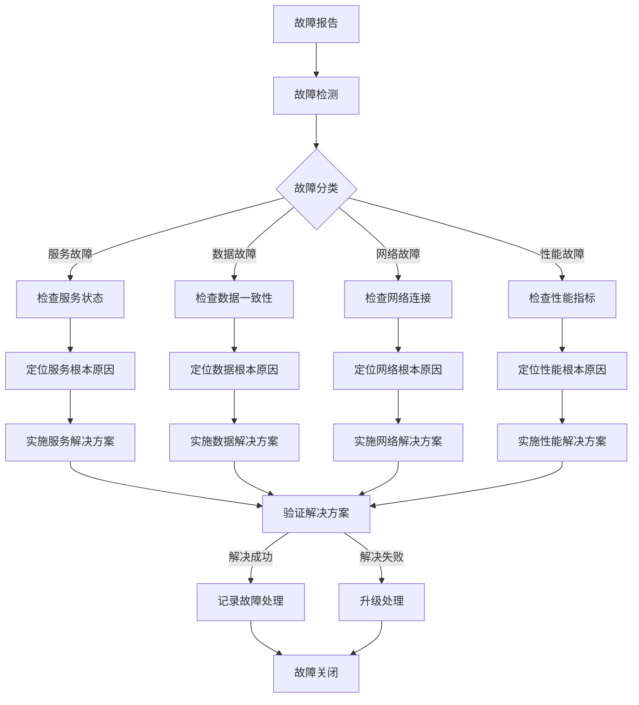
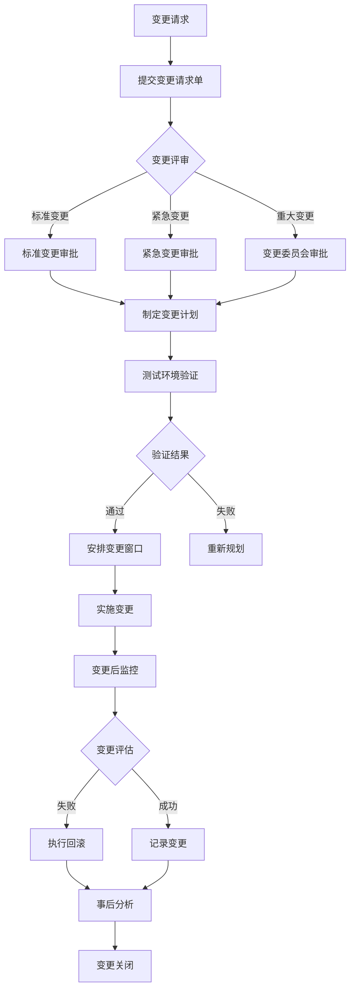

# 运维操作手册

## 概述

本文档提供分钟级持仓期货高频交易平台的运维操作指南，涵盖日常运维、故障排查、性能监控、备份恢复、安全合规和变更管理等全流程运维操作。本手册旨在帮助运维人员高效、安全地管理和维护交易平台，确保系统的高可用性和稳定性。

**核心运维目标：**
- **高可用性：** 确保交易系统7x24小时不间断运行，全年可用性目标99.99%
- **低延迟：** 维持订单处理延迟P99 < 2ms，Tick处理延迟P99 < 1ms
- **数据一致性：** 保证交易数据零丢失，RPO=0，RTO<5分钟
- **安全合规：** 满足金融行业安全监管要求，实现操作可审计

**运维团队职责：**
- 系统监控与告警响应
- 故障排查与恢复
- 性能优化与容量规划
- 备份策略执行与验证
- 安全策略实施与审计
- 变更管理与版本发布

## 1. 日常运维操作指南

### 1.1 服务启动与停止

#### 1.1.1 容器化环境（Kubernetes）

**启动所有服务：**
```bash
# 启动整个交易平台
kubectl apply -f kubernetes/production/ -n trading-production

# 等待所有Pod就绪
kubectl wait --for=condition=ready pod --all -n trading-production --timeout=300s

# 验证服务状态
kubectl get pods -n trading-production -o wide
kubectl get svc -n trading-production
```

**停止所有服务：**
```bash
# 优雅停止交易服务（先停止订单接收）
kubectl scale deployment trading-engine --replicas=0 -n trading-production
kubectl scale deployment risk-engine --replicas=0 -n trading-production

# 等待订单处理完成（约30秒）
sleep 30

# 停止所有服务
kubectl delete -f kubernetes/production/ -n trading-production --wait=true

# 验证停止状态
kubectl get pods -n trading-production | grep -v "No resources found"
```

#### 1.1.2 传统部署环境（Systemd）

**启动服务：**
```bash
# 启动核心交易服务
sudo systemctl start trading-engine.service
sudo systemctl start risk-engine.service
sudo systemctl start market-data.service

# 启用开机自启
sudo systemctl enable trading-engine.service
sudo systemctl enable risk-engine.service

# 检查服务状态
sudo systemctl status trading-engine.service
sudo systemctl status risk-engine.service
```

**停止服务：**
```bash
# 优雅停止服务
sudo systemctl stop trading-engine.service
sudo systemctl stop risk-engine.service

# 禁用开机自启
sudo systemctl disable trading-engine.service
```

### 1.2 健康检查

#### 1.2.1 自动化健康检查脚本

**每日健康检查：**
```bash
#!/bin/bash
# scripts/health/daily-health-check.sh

set -e

echo "=== 交易平台健康检查开始 ==="
echo "检查时间: $(date)"

# 1. 检查服务状态
echo "1. 检查服务状态..."
kubectl get pods -n trading-production -o json | jq -r '.items[] | "\(.metadata.name) \(.status.phase) \(.status.containerStatuses[0].ready)"' | while read pod; do
    name=$(echo $pod | awk '{print $1}')
    phase=$(echo $pod | awk '{print $2}')
    ready=$(echo $pod | awk '{print $3}')
    
    if [ "$phase" != "Running" ] || [ "$ready" != "true" ]; then
        echo "⚠️  异常Pod: $pod"
        exit 1
    else
        echo "✅ $name: $phase, Ready: $ready"
    fi
done

# 2. 检查数据库连接
echo "2. 检查数据库连接..."
pg_isready -h postgres-master.trading-production.svc.cluster.local -p 5432
if [ $? -eq 0 ]; then
    echo "✅ PostgreSQL连接正常"
else
    echo "❌ PostgreSQL连接失败"
    exit 1
fi

# 3. 检查Redis连接
echo "3. 检查Redis连接..."
redis-cli -h redis-master.trading-production.svc.cluster.local -p 6379 ping | grep -q "PONG"
if [ $? -eq 0 ]; then
    echo "✅ Redis连接正常"
else
    echo "❌ Redis连接失败"
    exit 1
fi

# 4. 检查磁盘空间
echo "4. 检查磁盘空间..."
df -h /data | awk 'NR==2 {if ($5 > 85) {print "❌ 磁盘使用率过高: "$5; exit 1} else {print "✅ 磁盘使用率正常: "$5}}'

# 5. 检查网络延迟
echo "5. 检查网络延迟..."
ping -c 3 ctp-front.test.com | tail -1 | awk -F '/' '{if ($4 > 10) {print "❌ 网络延迟过高: "$4"ms"; exit 1} else {print "✅ 网络延迟正常: "$4"ms"}}'

echo "=== 健康检查完成 ==="
```

#### 1.2.2 实时健康监控

**Prometheus健康检查查询：**
```promql
# 服务可用性
up{job="trading-engine"} == 1

# 服务健康状态
trading_engine_health_status{status="healthy"} == 1

# 数据库连接池状态
database_connection_pool_available_connections > 10

# Redis内存使用率
redis_memory_used_bytes / redis_memory_max_bytes < 0.8
```

### 1.3 日志查看与分析

#### 1.3.1 日志查看命令

**实时日志查看：**
```bash
# 查看交易引擎日志
kubectl logs -f deployment/trading-engine -n trading-production --tail=100

# 查看多个Pod的日志
kubectl logs -f -l app=trading-engine -n trading-production --tail=50

# 查看指定时间范围的日志
kubectl logs deployment/trading-engine -n trading-production --since=1h

# 查看错误日志
kubectl logs deployment/trading-engine -n trading-production | grep -i error | tail -20
```

#### 1.3.2 日志分析脚本

**错误日志分析：**
```bash
#!/bin/bash
# scripts/logs/error-log-analyzer.sh

LOG_DIR="/var/log/trading"
ERROR_PATTERNS=(
    "ERROR"
    "Exception"
    "failed"
    "timeout"
    "connection refused"
)

echo "=== 错误日志分析报告 ==="
echo "分析时间: $(date)"
echo "日志目录: $LOG_DIR"

for pattern in "${ERROR_PATTERNS[@]}"; do
    echo ""
    echo "搜索模式: $pattern"
    echo "------------------------"
    
    # 搜索今天日志中的错误
    find $LOG_DIR -name "*.log" -mtime -1 -exec grep -l "$pattern" {} \; | while read logfile; do
        count=$(grep -c "$pattern" "$logfile")
        if [ $count -gt 0 ]; then
            echo "文件: $(basename $logfile)"
            echo "出现次数: $count"
            
            # 显示最近3个匹配行
            grep "$pattern" "$logfile" | tail -3 | sed 's/^/  /'
            echo ""
        fi
    done
done

# 生成错误趋势图
echo "=== 错误趋势统计 ==="
for i in {1..7}; do
    date=$(date -d "$i days ago" +%Y-%m-%d)
    error_count=$(find $LOG_DIR -name "*$date*.log" -exec grep -c "ERROR" {} \; 2>/dev/null | awk '{sum+=$1} END {print sum}')
    echo "$date: ${error_count:-0} 个错误"
done
```

## 2. 故障排查手册

### 2.1 常见问题与解决方案

| 故障现象 | 可能原因 | 诊断步骤 | 解决方案 |
|---------|---------|---------|---------|
| 订单无法提交 | CTP连接断开 | 1. 检查CTP网关状态<br>2. 检查网络连接<br>3. 检查交易会话状态 | 1. 重启CTP连接<br>2. 检查防火墙规则<br>3. 重新登录交易账户 |
| 订单处理延迟高 | 系统负载过高<br>网络延迟增加 | 1. 检查CPU/内存使用率<br>2. 检查网络延迟<br>3. 检查消息队列积压 | 1. 扩容服务实例<br>2. 优化网络路由<br>3. 清理消息队列 |
| 成交回报丢失 | 消息队列故障<br>数据库写入失败 | 1. 检查Kafka消费者状态<br>2. 检查数据库连接<br>3. 检查交易日志 | 1. 重启Kafka消费者<br>2. 修复数据库连接<br>3. 从备份恢复数据 |

#### 2.1.2 数据库故障

```bash
#!/bin/bash
# scripts/troubleshooting/database-troubleshooting.sh

echo "=== 数据库故障诊断 ==="

# 1. 检查数据库服务状态
echo "1. 检查PostgreSQL服务状态..."
systemctl status postgresql-14 || docker ps | grep postgres

# 2. 检查数据库连接
echo "2. 检查数据库连接..."
psql -h localhost -U postgres -c "SELECT 1;" 2>/dev/null || echo "数据库连接失败"

# 3. 检查数据库锁
echo "3. 检查数据库锁..."
psql -h localhost -U postgres -c "
SELECT 
    pg_stat_activity.pid,
    pg_stat_activity.query,
    pg_locks.mode,
    pg_locks.granted
FROM pg_stat_activity
JOIN pg_locks ON pg_stat_activity.pid = pg_locks.pid
WHERE pg_stat_activity.query NOT LIKE '%pg_stat_activity%'
ORDER BY pg_locks.granted, pg_stat_activity.query_start;
"

# 4. 检查数据库性能
echo "4. 检查数据库性能..."
psql -h localhost -U postgres -c "
SELECT 
    schemaname,
    relname,
    seq_scan,
    seq_tup_read,
    idx_scan,
    idx_tup_fetch,
    n_tup_ins,
    n_tup_upd,
    n_tup_del
FROM pg_stat_user_tables
ORDER BY seq_tup_read DESC
LIMIT 10;
"

# 5. 检查表空间使用
echo "5. 检查表空间使用..."
psql -h localhost -U postgres -c "
SELECT 
    schemaname,
    tablename,
    pg_size_pretty(pg_total_relation_size(schemaname||'.'||tablename)) as total_size,
    pg_size_pretty(pg_relation_size(schemaname||'.'||tablename)) as table_size,
    pg_size_pretty(pg_total_relation_size(schemaname||'.'||tablename) - pg_relation_size(schemaname||'.'||tablename)) as index_size
FROM pg_tables
WHERE schemaname NOT IN ('pg_catalog', 'information_schema')
ORDER BY pg_total_relation_size(schemaname||'.'||tablename) DESC
LIMIT 10;
"
```

### 2.2 故障诊断流程图



### 2.3 紧急恢复流程

#### 2.3.1 服务不可用恢复

**紧急恢复检查清单：**
```yaml
# emergency-recovery-checklist.yaml
emergency_recovery:
  phase_1_initial_assessment:
    - task: "确认故障范围"
      commands:
        - "kubectl get pods -n trading-production --field-selector=status.phase!=Running"
        - "curl -f http://trading-engine:8080/health || echo '服务不可用'"
      timeout: "30s"
    
    - task: "检查关键依赖服务"
      commands:
        - "pg_isready -h postgres-master"
        - "redis-cli -h redis-master ping"
        - "kafka-topics --list --bootstrap-server kafka:9092"
      timeout: "60s"
  
  phase_2_containment:
    - task: "停止订单接收"
      commands:
        - "kubectl scale deployment order-gateway --replicas=0 -n trading-production"
        - "curl -X POST http://trading-engine:8080/stop-order-reception"
      timeout: "30s"
    
    - task: "备份当前状态"
      commands:
        - "kubectl get all -n trading-production -o yaml > /backup/emergency/$(date +%Y%m%d_%H%M%S)_k8s_state.yaml"
        - "pg_dump -U postgres trading > /backup/emergency/$(date +%Y%m%d_%H%M%S)_database.sql"
      timeout: "5m"
  
  phase_3_recovery:
    - task: "重启故障服务"
      commands:
        - "kubectl delete pod -l app=trading-engine -n trading-production"
        - "kubectl rollout restart deployment trading-engine -n trading-production"
      timeout: "3m"
    
    - task: "验证服务恢复"
      commands:
        - "kubectl wait --for=condition=ready pod -l app=trading-engine -n trading-production --timeout=180s"
        - "curl -f http://trading-engine:8080/health"
      timeout: "3m"
  
  phase_4_resumption:
    - task: "恢复订单接收"
      commands:
        - "kubectl scale deployment order-gateway --replicas=2 -n trading-production"
        - "curl -X POST http://trading-engine:8080/resume-order-reception"
      timeout: "30s"
    
    - task: "监控恢复后状态"
      commands:
        - "watch -n 1 'kubectl get pods -n trading-production | grep trading-engine'"
        - "curl -s http://trading-engine:8080/metrics | grep order_processing_latency"
      duration: "5m"
```

## 3. 性能监控和调优指南

### 3.1 关键性能指标

#### 3.1.1 交易性能指标

| 指标名称 | 监控目标 | 告警阈值 | 调优建议 |
|---------|---------|---------|---------|
| 订单处理延迟(P99) | < 2ms | > 5ms | 优化算法逻辑，增加处理节点 |
| Tick处理延迟(P99) | < 1ms | > 3ms | 优化内存数据结构，使用SIMD指令 |
| 成交回报延迟 | < 10ms | > 30ms | 优化网络路径，减少序列化开销 |
| 消息队列积压 | < 100 | > 1000 | 增加消费者数量，提高处理能力 |
| 内存使用率 | < 70% | > 85% | 优化内存分配，增加物理内存 |
| CPU使用率 | < 60% | > 80% | 优化算法复杂度，使用CPU亲和性 |

#### 3.1.2 系统性能指标

```yaml
# monitoring/performance-metrics.yaml
performance_metrics:
  trading_engine:
    - name: "order_processing_latency_ns"
      description: "订单处理延迟纳秒"
      type: "histogram"
      buckets: [1000, 5000, 10000, 50000, 100000, 500000, 1000000]
      alert_thresholds:
        p99: 2000000  # 2ms
        p999: 5000000 # 5ms
    
    - name: "tick_processing_latency_ns"
      description: "Tick处理延迟纳秒"
      type: "histogram"
      buckets: [100, 500, 1000, 5000, 10000, 50000, 100000]
      alert_thresholds:
        p99: 1000000  # 1ms
        p999: 3000000 # 3ms
  
  system:
    - name: "cpu_usage_percent"
      description: "CPU使用率百分比"
      type: "gauge"
      alert_thresholds:
        warning: 70
        critical: 85
    
    - name: "memory_usage_bytes"
      description: "内存使用字节数"
      type: "gauge"
      alert_thresholds:
        warning: "0.7 * total_memory"
        critical: "0.85 * total_memory"
    
    - name: "network_latency_ms"
      description: "网络延迟毫秒"
      type: "gauge"
      alert_thresholds:
        warning: 10
        critical: 30
```

### 3.2 性能调优实践

#### 3.2.1 JVM调优（Java服务）

```yaml
# jvm-options.yaml
jvm_options:
  # 内存设置
  heap_memory: "8G"
  max_heap_memory: "16G"
  young_generation: "4G"
  metaspace: "512M"
  max_metaspace: "1G"
  
  # 垃圾回收
  gc_algorithm: "G1"
  max_gc_pause: "20ms"
  initiating_heap_occupancy: "45"
  parallel_gc_threads: "4"
  concurrent_gc_threads: "2"
  
  # 性能优化
  tiered_compilation: true
  compile_threshold: 10000
  biased_locking: false
  use_compressed_oops: true
  
  # 监控
  flight_recorder: true
  flight_recorder_settings: "default"
  heap_dump_on_oom: true
  gc_log: "/var/log/jvm/gc.log"
  
  # 容器感知
  use_container_support: true
  cgroup_memory_limit: "true"
  
  # 完整JVM参数
  full_options: >
    -Xms8g
    -Xmx16g
    -Xmn4g
    -XX:MetaspaceSize=512m
    -XX:MaxMetaspaceSize=1g
    -XX:+UseG1GC
    -XX:MaxGCPauseMillis=20
    -XX:InitiatingHeapOccupancyPercent=45
    -XX:ParallelGCThreads=4
    -XX:ConcGCThreads=2
    -XX:+TieredCompilation
    -XX:CompileThreshold=10000
    -XX:-UseBiasedLocking
    -XX:+UseCompressedOops
    -XX:+FlightRecorder
    -XX:FlightRecorderOptions=defaultrecording=true
    -XX:+HeapDumpOnOutOfMemoryError
    -XX:HeapDumpPath=/var/log/jvm/heapdump.hprof
    -Xlog:gc*:file=/var/log/jvm/gc.log:time:filecount=10,filesize=100M
    -XX:+UseContainerSupport
    -XX:+UseCGroupMemoryLimitForHeap
```

#### 3.2.2 Linux内核调优

```bash
#!/bin/bash
# scripts/performance/linux-tuning.sh

echo "=== Linux内核性能调优 ==="

# 1. 网络性能优化
echo "1. 优化网络性能..."
cat > /etc/sysctl.d/99-trading-performance.conf << 'EOF'
# 网络缓冲区大小
net.core.rmem_max = 134217728
net.core.wmem_max = 134217728
net.ipv4.tcp_rmem = 4096 87380 134217728
net.ipv4.tcp_wmem = 4096 65536 134217728

# 连接队列
net.core.netdev_max_backlog = 300000
net.core.somaxconn = 65535

# TCP优化
net.ipv4.tcp_congestion_control = bbr
net.ipv4.tcp_slow_start_after_idle = 0
net.ipv4.tcp_tw_reuse = 1
net.ipv4.tcp_fin_timeout = 30
net.ipv4.tcp_keepalive_time = 1200
net.ipv4.tcp_keepalive_probes = 5
net.ipv4.tcp_keepalive_intvl = 15

# 减少TCP延迟
net.ipv4.tcp_low_latency = 1
net.ipv4.tcp_no_metrics_save = 1

# 文件描述符限制
fs.file-max = 2097152
fs.nr_open = 2097152
EOF

sysctl -p /etc/sysctl.d/99-trading-performance.conf

# 2. 文件系统优化
echo "2. 优化文件系统..."
# 禁用文件访问时间记录
tune2fs -o noatime,nodiratime /dev/nvme0n1p1 2>/dev/null || true

# 调整I/O调度器（NVMe）
echo none > /sys/block/nvme0n1/queue/scheduler 2>/dev/null || true

# 3. CPU性能优化
echo "3. 优化CPU性能..."
# 设置CPU性能模式
for governor in /sys/devices/system/cpu/cpu*/cpufreq/scaling_governor; do
    echo performance > $governor 2>/dev/null || true
done

# 禁用CPU节能
for state in /sys/devices/system/cpu/cpu*/cpuidle/state*/disable; do
    echo 1 > $state 2>/dev/null || true
done

# 4. 内存优化
echo "4. 优化内存管理..."
# 禁用交换分区（对于低延迟交易）
swapoff -a 2>/dev/null || true

# 调整透明大页
echo never > /sys/kernel/mm/transparent_hugepage/enabled 2>/dev/null || true
echo never > /sys/kernel/mm/transparent_hugepage/defrag 2>/dev/null || true

# 5. 进程限制
echo "5. 调整进程限制..."
cat > /etc/security/limits.d/99-trading.conf << 'EOF'
* soft nofile 1000000
* hard nofile 1000000
* soft nproc 65536
* hard nproc 65536
* soft memlock unlimited
* hard memlock unlimited
EOF

echo "=== 内核调优完成 ==="
```

## 4. 备份和恢复操作流程

### 4.1 备份策略

#### 4.1.1 备份分类与计划

| 备份类型 | 备份对象 | 频率 | 保留时间 | 存储位置 | 恢复时间目标 |
|---------|---------|------|----------|----------|-------------|
| 完全备份 | 数据库全量 | 每日 | 30天 | 对象存储 + 本地 | < 1小时 |
| 增量备份 | 数据库增量 | 每小时 | 7天 | 对象存储 | < 30分钟 |
| 交易日志 | 订单/成交数据 | 每5分钟 | 24小时 | 高性能存储 | < 5分钟 |
| 配置文件 | 系统配置 | 每次变更 | 90天 | Git仓库 + 对象存储 | < 5分钟 |
| 应用镜像 | Docker镜像 | 每次构建 | 180天 | 容器仓库 | < 10分钟 |
| 监控数据 | 指标数据 | 每日 | 365天 | 时序数据库 | < 2小时 |

#### 4.1.2 备份脚本

```bash
#!/bin/bash
# scripts/backup/daily-backup.sh

set -e

BACKUP_DIR="/backup/trading/$(date +%Y%m%d_%H%M%S)"
mkdir -p $BACKUP_DIR

echo "=== 开始每日备份 ==="
echo "备份时间: $(date)"
echo "备份目录: $BACKUP_DIR"

# 1. 备份数据库
echo "1. 备份PostgreSQL数据库..."
pg_dump -h postgres-master -U postgres -d trading \
  --format=custom \
  --compress=9 \
  --file="$BACKUP_DIR/trading_full.dump"

# 2. 备份Redis
echo "2. 备份Redis数据..."
redis-cli -h redis-master --rdb "$BACKUP_DIR/redis.rdb"

# 3. 备份配置文件
echo "3. 备份配置文件..."
tar -czf "$BACKUP_DIR/config.tar.gz" \
  /etc/trading \
  /etc/kubernetes/trading \
  /etc/systemd/system/trading-*.service

# 4. 备份Kubernetes资源
echo "4. 备份Kubernetes资源..."
kubectl get all -n trading-production -o yaml > "$BACKUP_DIR/k8s-resources.yaml"
kubectl get configmaps -n trading-production -o yaml > "$BACKUP_DIR/configmaps.yaml"
kubectl get secrets -n trading-production -o yaml > "$BACKUP_DIR/secrets.yaml"

# 5. 备份交易日志
echo "5. 备份交易日志..."
find /var/log/trading -name "*.log" -mtime -1 -exec tar -rf "$BACKUP_DIR/trading-logs.tar" {} \;

# 6. 计算备份大小
backup_size=$(du -sh $BACKUP_DIR | cut -f1)
echo "备份大小: $backup_size"

# 7. 上传到对象存储
echo "7. 上传到对象存储..."
aws s3 sync $BACKUP_DIR s3://trading-backup/production/$(date +%Y%m%d)/ \
  --storage-class STANDARD_IA \
  --quiet

# 8. 清理旧备份（保留最近7天）
echo "8. 清理旧备份..."
find /backup/trading -type d -mtime +7 -exec rm -rf {} \; 2>/dev/null || true

# 9. 发送备份通知
echo "9. 发送备份通知..."
curl -X POST -H "Content-Type: application/json" \
  -d "{\"backup_type\":\"daily\",\"timestamp\":\"$(date -Iseconds)\",\"size\":\"$backup_size\",\"status\":\"success\"}" \
  https://monitoring.trading.com/api/backup-notification

echo "=== 每日备份完成 ==="
```

### 4.2 恢复操作

#### 4.2.1 数据库恢复流程

```bash
#!/bin/bash
# scripts/recovery/database-recovery.sh

set -e

BACKUP_DATE=${1:-$(date -d "yesterday" +%Y%m%d)}
BACKUP_FILE="trading_full.dump"
S3_PATH="s3://trading-backup/production/$BACKUP_DATE/"

echo "=== 开始数据库恢复 ==="
echo "恢复时间: $(date)"
echo "备份日期: $BACKUP_DATE"
echo "备份路径: $S3_PATH"

# 1. 停止交易服务
echo "1. 停止交易服务..."
kubectl scale deployment trading-engine --replicas=0 -n trading-production
kubectl scale deployment risk-engine --replicas=0 -n trading-production

# 2. 下载备份文件
echo "2. 下载备份文件..."
TEMP_DIR=$(mktemp -d)
aws s3 cp "$S3_PATH$BACKUP_FILE" "$TEMP_DIR/$BACKUP_FILE"

# 3. 停止数据库连接
echo "3. 停止数据库连接..."
psql -h postgres-master -U postgres -c "SELECT pg_terminate_backend(pid) FROM pg_stat_activity WHERE datname = 'trading';"

# 4. 恢复数据库
echo "4. 恢复数据库..."
pg_restore -h postgres-master -U postgres \
  --clean \
  --if-exists \
  --create \
  --verbose \
  "$TEMP_DIR/$BACKUP_FILE"

# 5. 验证数据恢复
echo "5. 验证数据恢复..."
psql -h postgres-master -U postgres -d trading -c "
SELECT 
  'orders' as table_name,
  COUNT(*) as row_count
FROM orders
UNION ALL
SELECT 
  'trades',
  COUNT(*) 
FROM trades
UNION ALL
SELECT 
  'positions',
  COUNT(*) 
FROM positions;
"

# 6. 清理临时文件
echo "6. 清理临时文件..."
rm -rf "$TEMP_DIR"

# 7. 重启交易服务
echo "7. 重启交易服务..."
kubectl scale deployment trading-engine --replicas=2 -n trading-production
kubectl scale deployment risk-engine --replicas=1 -n trading-production

# 8. 验证服务恢复
echo "8. 验证服务恢复..."
sleep 30
kubectl wait --for=condition=ready pod -l app=trading-engine -n trading-production --timeout=120s
curl -f http://trading-engine:8080/health

echo "=== 数据库恢复完成 ==="
```

## 5. 安全和合规操作

### 5.1 访问控制管理

#### 5.1.1 身份认证与授权

**Kubernetes RBAC配置：**
```yaml
# security/rbac.yaml
apiVersion: v1
kind: ServiceAccount
metadata:
  name: trading-engine-sa
  namespace: trading-production
  annotations:
    iam.gke.io/gcp-service-account: trading-engine@project.iam.gserviceaccount.com

---
apiVersion: rbac.authorization.k8s.io/v1
kind: Role
metadata:
  name: trading-engine-role
  namespace: trading-production
rules:
  # Pod操作权限
  - apiGroups: [""]
    resources: ["pods", "pods/log"]
    verbs: ["get", "list", "watch"]
  
  # 配置访问权限
  - apiGroups: [""]
    resources: ["configmaps"]
    verbs: ["get", "list"]
    resourceNames: ["trading-engine-config"]
  
  # 服务发现权限
  - apiGroups: [""]
    resources: ["services", "endpoints"]
    verbs: ["get", "list"]
  
  # 事件查看权限
  - apiGroups: [""]
    resources: ["events"]
    verbs: ["get", "list", "watch"]

---
apiVersion: rbac.authorization.k8s.io/v1
kind: RoleBinding
metadata:
  name: trading-engine-binding
  namespace: trading-production
roleRef:
  apiGroup: rbac.authorization.k8s.io
  kind: Role
  name: trading-engine-role
subjects:
  - kind: ServiceAccount
    name: trading-engine-sa
    namespace: trading-production
```

#### 5.1.2 访问审计日志

**审计日志配置：**
```bash
#!/bin/bash
# scripts/security/access-audit.sh

echo "=== 访问审计日志分析 ==="
echo "分析时间范围: 最近24小时"
echo ""

# 1. SSH登录审计
echo "1. SSH登录记录:"
grep "sshd" /var/log/auth.log | grep -E "(Accepted|Failed)" | tail -20

# 2. Kubernetes API访问审计
echo ""
echo "2. Kubernetes API访问:"
kubectl get events -n trading-production --sort-by='.lastTimestamp' | tail -10

# 3. 数据库访问审计
echo ""
echo "3. 数据库访问记录:"
psql -h postgres-master -U postgres -d trading -c "
SELECT 
    usename,
    client_addr,
    query_start,
    LEFT(query, 100) as query_preview
FROM pg_stat_activity
WHERE query NOT LIKE '%pg_stat_activity%'
    AND query_start > NOW() - INTERVAL '24 hours'
ORDER BY query_start DESC
LIMIT 10;
"

# 4. 文件访问审计
echo ""
echo "4. 关键文件访问记录:"
find /etc/trading -name "*.yaml" -exec ls -la {} \; | head -10

# 5. 生成审计报告
echo ""
echo "5. 生成审计报告..."
cat > /tmp/security-audit-$(date +%Y%m%d).md << 'EOF'
# 安全审计报告
## 报告时间: $(date)

### 1. 访问统计
- SSH成功登录: $(grep "sshd.*Accepted" /var/log/auth.log | wc -l) 次
- SSH失败登录: $(grep "sshd.*Failed" /var/log/auth.log | wc -l) 次
- Kubernetes API调用: $(kubectl get events -n trading-production | wc -l) 次
- 数据库查询: $(psql -h postgres-master -U postgres -d trading -t -c "SELECT COUNT(*) FROM pg_stat_activity WHERE query NOT LIKE '%pg_stat_activity%';") 次

### 2. 异常检测
EOF

echo "审计报告已生成: /tmp/security-audit-$(date +%Y%m%d).md"
```

### 5.2 合规检查

#### 5.2.1 安全基线检查

```bash
#!/bin/bash
# scripts/security/compliance-check.sh

echo "=== 安全合规基线检查 ==="
echo "检查时间: $(date)"
echo ""

# 1. 检查密码策略
echo "1. 密码策略检查..."
grep -E "^PASS_MAX_DAYS|^PASS_MIN_DAYS|^PASS_WARN_AGE" /etc/login.defs

# 2. 检查SSH配置
echo ""
echo "2. SSH配置检查..."
grep -E "^PermitRootLogin|^PasswordAuthentication|^Protocol" /etc/ssh/sshd_config

# 3. 检查防火墙规则
echo ""
echo "3. 防火墙规则检查..."
iptables -L -n | grep -E "(ACCEPT|DROP)" | head -20

# 4. 检查文件权限
echo ""
echo "4. 关键文件权限检查..."
check_files=(
    "/etc/passwd"
    "/etc/shadow"
    "/etc/trading/config.yaml"
    "/var/log/trading"
)

for file in "${check_files[@]}"; do
    if [ -e "$file" ]; then
        perm=$(stat -c "%a %U %G" "$file")
        echo "$file: $perm"
    fi
done

# 5. 检查容器安全
echo ""
echo "5. 容器安全配置检查..."
kubectl get pods -n trading-production -o json | jq -r '.items[] | "\(.metadata.name) \(.spec.containers[].securityContext.runAsNonRoot // "null")"' | while read line; do
    pod=$(echo $line | awk '{print $1}')
    runAsNonRoot=$(echo $line | awk '{print $2}')
    if [ "$runAsNonRoot" != "true" ]; then
        echo "⚠️  $pod: runAsNonRoot=$runAsNonRoot"
    else
        echo "✅ $pod: runAsNonRoot=true"
    fi
done

# 6. 生成合规报告
echo ""
echo "6. 生成合规报告..."
cat > /tmp/compliance-report-$(date +%Y%m%d).md << 'EOF'
# 安全合规检查报告
## 检查时间: $(date)

### 检查结果汇总
| 检查项 | 状态 | 说明 |
|--------|------|------|
| 密码策略 | $(grep "^PASS_MAX_DAYS 90" /etc/login.defs >/dev/null && echo "✅" || echo "❌") | 密码最长使用90天 |
| SSH Root登录 | $(grep "^PermitRootLogin no" /etc/ssh/sshd_config >/dev/null && echo "✅" || echo "❌") | 禁止Root SSH登录 |
| 容器非Root运行 | $(kubectl get pods -n trading-production -o json | jq -r '.items[].spec.containers[].securityContext.runAsNonRoot' | grep -q "true" && echo "✅" || echo "❌") | 容器以非Root用户运行 |

### 建议
1. 定期更新系统补丁
2. 启用双因素认证
3. 定期轮换密钥
4. 实施网络隔离
EOF

echo "合规报告已生成: /tmp/compliance-report-$(date +%Y%m%d).md"
```

## 6. 变更管理流程

### 6.1 变更管理流程



### 6.2 配置更新流程

#### 6.2.1 配置版本管理

```bash
#!/bin/bash
# scripts/change/config-update.sh

set -e

CONFIG_FILE=$1
NEW_VERSION=$2
ENVIRONMENT=${3:-staging}

echo "=== 配置更新流程 ==="
echo "配置文件: $CONFIG_FILE"
echo "新版本: $NEW_VERSION"
echo "环境: $ENVIRONMENT"

# 1. 备份当前配置
echo "1. 备份当前配置..."
BACKUP_DIR="/backup/config/$(date +%Y%m%d_%H%M%S)"
mkdir -p $BACKUP_DIR
cp $CONFIG_FILE "$BACKUP_DIR/$(basename $CONFIG_FILE).bak"

# 2. 验证新配置
echo "2. 验证新配置..."
if [ ! -f "$CONFIG_FILE.$NEW_VERSION" ]; then
    echo "错误: 新配置文件不存在"
    exit 1
fi

# 语法检查
if [[ $CONFIG_FILE == *.yaml ]] || [[ $CONFIG_FILE == *.yml ]]; then
    python3 -c "import yaml; yaml.safe_load(open('$CONFIG_FILE.$NEW_VERSION'))" || {
        echo "错误: YAML语法检查失败"
        exit 1
    }
fi

# 3. 更新配置
echo "3. 更新配置..."
cp "$CONFIG_FILE.$NEW_VERSION" "$CONFIG_FILE"

# 4. 应用配置（环境相关）
echo "4. 应用配置..."
case $ENVIRONMENT in
    staging)
        kubectl apply -f $CONFIG_FILE -n trading-staging
        ;;
    production)
        # 生产环境需要金丝雀发布
        echo "执行金丝雀发布..."
        kubectl apply -f $CONFIG_FILE -n trading-production --dry-run=server
        read -p "确认应用到生产环境? (y/n): " confirm
        if [ "$confirm" = "y" ]; then
            kubectl apply -f $CONFIG_FILE -n trading-production
        else
            echo "已取消"
            exit 0
        fi
        ;;
    *)
        echo "未知环境: $ENVIRONMENT"
        exit 1
        ;;
esac

# 5. 验证配置更新
echo "5. 验证配置更新..."
sleep 5
kubectl get configmap -n trading-$ENVIRONMENT | grep $(basename $CONFIG_FILE .yaml)

# 6. 记录变更
echo "6. 记录变更..."
cat >> /var/log/config-changes.log << 'EOF'
$(date): 配置更新
文件: $CONFIG_FILE
版本: $NEW_VERSION
环境: $ENVIRONMENT
操作者: $(whoami)
哈希: $(md5sum $CONFIG_FILE | cut -d' ' -f1)
EOF

echo "=== 配置更新完成 ==="
```

### 6.3 版本升级与回滚

#### 6.3.1 蓝绿部署升级

```bash
#!/bin/bash
# scripts/change/blue-green-upgrade.sh

set -e

VERSION=$1
SERVICE="trading-engine"

echo "=== 蓝绿部署升级 ==="
echo "服务: $SERVICE"
echo "目标版本: $VERSION"
echo "开始时间: $(date)"

# 1. 部署新版本（绿环境）
echo "1. 部署新版本（绿环境）..."
kubectl apply -f kubernetes/$SERVICE-green-$VERSION.yaml -n trading-production

# 2. 等待新版本就绪
echo "2. 等待新版本就绪..."
kubectl wait --for=condition=ready pod -l app=$SERVICE,color=green -n trading-production --timeout=300s

# 3. 流量切换（10%到新版本）
echo "3. 流量切换（10%到新版本）..."
kubectl apply -f traffic-split-10p.yaml -n trading-production

# 4. 监控新版本性能
echo "4. 监控新版本性能..."
echo "监控10分钟..."
for i in {1..10}; do
    echo "第 $i 分钟监控..."
    kubectl top pods -l app=$SERVICE,color=green -n trading-production
    curl -s http://$SERVICE-green:8080/metrics | grep -E "order_processing_latency|error_rate"
    sleep 60
done

# 5. 逐步增加流量
echo "5. 逐步增加流量..."
for percentage in 25 50 75 100; do
    echo "切换 $percentage% 流量到新版本..."
    kubectl apply -f traffic-split-${percentage}p.yaml -n trading-production
    sleep 300  # 监控5分钟
    
    # 检查错误率
    error_rate=$(curl -s http://$SERVICE-green:8080/metrics | grep "error_rate" | awk '{print $2}')
    if (( $(echo "$error_rate > 0.01" | bc -l) )); then
        echo "错误率过高 ($error_rate)，停止升级"
        exit 1
    fi
done

# 6. 清理旧版本（蓝环境）
echo "6. 清理旧版本（蓝环境）..."
kubectl delete -f kubernetes/$SERVICE-blue.yaml -n trading-production --wait=true

# 7. 更新标签
echo "7. 更新标签..."
kubectl label pods -l app=$SERVICE,color=green color=blue -n trading-production --overwrite

echo "=== 蓝绿部署升级完成 ==="
echo "完成时间: $(date)"
```

#### 6.3.2 快速回滚流程

```bash
#!/bin/bash
# scripts/change/quick-rollback.sh

set -e

SERVICE=$1
ROLLBACK_VERSION=$2

echo "=== 快速回滚 ==="
echo "服务: $SERVICE"
echo "回滚版本: $ROLLBACK_VERSION"
echo "开始时间: $(date)"

# 1. 停止当前服务
echo "1. 停止当前服务..."
kubectl scale deployment $SERVICE --replicas=0 -n trading-production

# 2. 恢复旧版本配置
echo "2. 恢复旧版本配置..."
kubectl apply -f kubernetes/$SERVICE-$ROLLBACK_VERSION.yaml -n trading-production

# 3. 启动旧版本服务
echo "3. 启动旧版本服务..."
kubectl scale deployment $SERVICE --replicas=2 -n trading-production

# 4. 等待服务就绪
echo "4. 等待服务就绪..."
kubectl wait --for=condition=ready pod -l app=$SERVICE -n trading-production --timeout=180s

# 5. 验证服务健康
echo "5. 验证服务健康..."
curl -f http://$SERVICE:8080/health || {
    echo "服务健康检查失败"
    exit 1
}

# 6. 记录回滚
echo "6. 记录回滚..."
cat >> /var/log/rollbacks.log << 'EOF'
$(date): 服务回滚
服务: $SERVICE
回滚版本: $ROLLBACK_VERSION
原因: $3
操作者: $(whoami)
EOF

echo "=== 快速回滚完成 ==="
echo "完成时间: $(date)"
```

## 附录

### A. 运维检查清单

#### 每日检查清单
- [ ] 服务健康状态检查
- [ ] 磁盘空间检查
- [ ] 数据库连接检查
- [ ] 网络延迟检查
- [ ] 错误日志分析
- [ ] 备份状态验证

#### 每周检查清单
- [ ] 安全补丁更新
- [ ] 性能指标分析
- [ ] 容量规划评估
- [ ] 配置备份验证
- [ ] 监控告警规则审查

#### 每月检查清单
- [ ] 灾难恢复演练
- [ ] 安全合规审计
- [ ] 系统架构审查
- [ ] 供应商评估
- [ ] 运维流程优化

### B. 紧急联系人

| 角色 | 姓名 | 电话 | 邮箱 | 备用联系人 |
|------|------|------|------|-----------|
| 运维负责人 | 张工 | 138-XXXX-XXXX | zhang@trading.com | 李工 |
| 系统架构师 | 王工 | 139-XXXX-XXXX | wang@trading.com | 赵工 |
| 网络安全 | 刘工 | 136-XXXX-XXXX | liu@trading.com | 孙工 |
| 数据库管理 | 陈工 | 137-XXXX-XXXX | chen@trading.com | 周工 |
| 交易支持 | 吴工 | 135-XXXX-XXXX | wu@trading.com | 郑工 |

### C. 运维工具列表

| 工具类别 | 工具名称 | 用途 | 访问地址 |
|---------|---------|------|---------|
| 监控系统 | Prometheus | 指标监控 | http://prometheus.trading.com |
| 日志系统 | ELK Stack | 日志分析 | http://kibana.trading.com |
| 追踪系统 | Jaeger | 链路追踪 | http://jaeger.trading.com |
| 告警系统 | Alertmanager | 告警管理 | http://alertmanager.trading.com |
| 配置管理 | Consul | 配置中心 | http://consul.trading.com:8500 |
| 容器编排 | Kubernetes | 容器编排 | http://k8s-dashboard.trading.com |
| 持续集成 | Jenkins | CI/CD | http://jenkins.trading.com |
| 版本控制 | GitLab | 代码仓库 | http://gitlab.trading.com |
| 文档管理 | Confluence | 文档管理 | http://confluence.trading.com |

---

**文档版本：** v1.0  
**最后更新：** 2026-02-10  
**负责人：** 运维团队  
**状态：** 审核通过 - 可用于生产运维  

**关联文档：**
- [07-01-系统部署手册.md](./07-01-系统部署手册.md)
- [04-01-监控、日志与告警体系设计.md](../04-基础设施与运维/04-01-监控、日志与告警体系设计.md)
- [04-02-部署、灾备与持续集成方案.md](../04-基础设施与运维/04-02-部署、灾备与持续集成方案.md)
