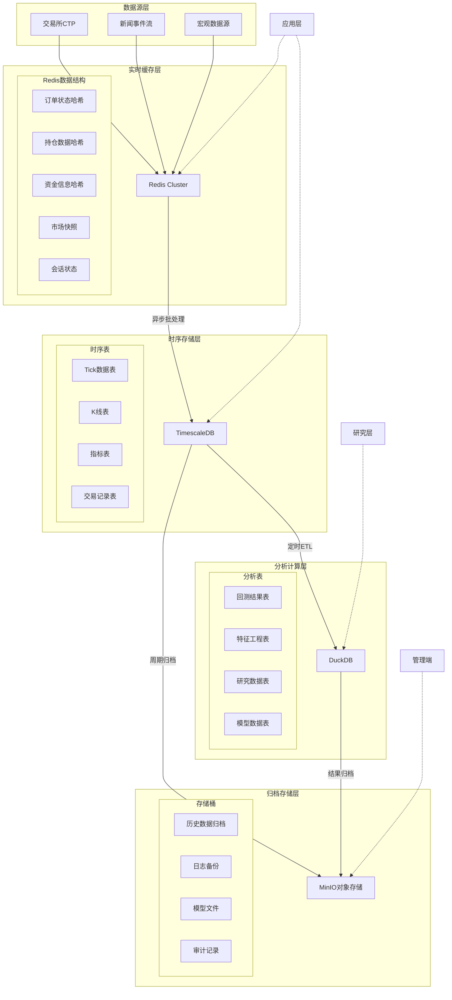
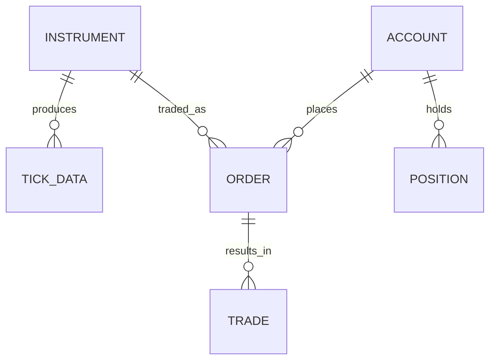

# 数据库设计

## 1. 概述

本文档详细描述分钟级持仓期货高频交易平台的数据库架构设计。基于四层架构中的数据层需求，采用分层存储策略：Redis作为实时缓存层，TimescaleDB作为时序数据存储层，DuckDB作为分析计算层，MinIO作为归档存储层。

**设计目标：**
- 支持Tick级高频数据实时处理与查询
- 满足七维市场状态识别引擎的数据需求
- 实现分层存储与数据生命周期管理
- 保证数据一致性与高可用性
- 优化高频查询与分析性能

**文档结构：**
1. 数据库架构概述 - 分层存储架构与数据流向
2. Redis数据结构设计 - 键命名规范、数据结构、过期策略
3. TimescaleDB表结构设计 - Tick表、K线表、指标表、分区策略
4. 数据迁移和ETL流程 - 实时同步、批量ETL、数据质量检查
5. 备份和恢复策略 - 多级备份、快速恢复、灾备方案
6. 性能优化建议 - 索引设计、查询优化、连接池配置
7. 数据一致性和事务管理 - 一致性保证、事务隔离、并发控制
8. ER图和数据流图 - 实体关系图与完整数据流图
9. 示例命令 - SQL/Redis操作示例
10. 附录 - 配置参数、监控指标、维护脚本

### 1.1 当前代码实现映射（2026-02-10）

已落地（基线版）：
- `IRealtimeCache` + `RedisRealtimeStore`（内存实现），键规范与本文档一致：
  - `trade:order:{order_id}:info`
  - `market:tick:{instrument_id}:latest`
  - `trade:position:{account_id}:{instrument_id}:{LONG|SHORT}`
- `ITimeseriesStore` + `TimescaleEventStore`（内存实现）：
  - 支持 `MarketSnapshot`、`OrderEvent`、`RiskDecision` 追加写入与查询
- client-backed 适配层（为真实网络客户端接入做准备）：
  - `StorageRetryPolicy`：统一重试/退避参数
  - `IRedisHashClient`/`ITimescaleSqlClient`：低层客户端抽象
  - `RedisRealtimeStoreClientAdapter`/`TimescaleEventStoreClientAdapter`：
    - 将领域对象映射为 Redis hash / Timescale row
    - 写入具备重试与退避逻辑
- 连接池与异步写增强：
  - `RedisHashClientPool`/`PooledRedisHashClient`
  - `TimescaleSqlClientPool`/`PooledTimescaleSqlClient`
  - `TimescaleBufferedEventStore`（后台批量刷写 + `Flush()`）
  - `IRedisHashClient`/`ITimescaleSqlClient` 增加 `Ping()` 健康检查接口
- 外部驱动接入框架：
  - `StorageConnectionConfig`：统一承载 Redis/Timescale 连接参数
  - `StorageClientFactory`：按 `in_memory/external` 模式创建 client
  - `allow_inmemory_fallback`：外部驱动不可用时自动降级（可关闭）
  - CMake开关：`QUANT_HFT_ENABLE_REDIS_EXTERNAL` / `QUANT_HFT_ENABLE_TIMESCALE_EXTERNAL`
- Redis 外部客户端（已落地）：
  - `TcpRedisHashClient`（TCP RESP 协议）支持 `PING/HSET/HGETALL`
  - 支持可选 `AUTH`、连接/读超时、协议错误透传
  - `StorageClientFactory` 在 Redis `external` 模式下可直接创建该客户端
- TimescaleDB 外部客户端（已落地）：
  - `LibpqTimescaleSqlClient`（运行时动态加载 `libpq`）
  - 支持 `Ping`、参数化 `InsertRow/QueryRows/QueryAllRows`
  - 标识符白名单校验（防止非法表名/列名）
  - `StorageClientFactory` 在 Timescale `external` 模式下可直接创建该客户端
- DuckDB/MinIO 适配层（已落地，Python）：
  - `DuckDbAnalyticsStore`：行情/订单分析表写入与查询、CSV导出
  - 优先使用 `duckdb` 模块，开发环境支持 sqlite fallback
  - `MinioArchiveStore`：归档对象 `put/get/list`
  - 优先使用 MinIO SDK，开发环境支持本地目录 fallback（bucket/object 布局）
- Data Pipeline 进程拆分（已落地，Python）：
  - `DataPipelineProcess.run_once()/run_loop()` 独立执行 ETL/归档批次
  - 每批次生成 `market_snapshots.csv`、`order_events.csv`、`manifest.json`
  - 通过 `scripts/data_pipeline/run_pipeline.py` 作为独立进程入口运行
- `core_engine` 已接入数据写路径：
  - 行情快照写入 realtime cache + timeseries
  - 订单回报写入 realtime cache（订单/持仓）+ timeseries
  - 风控决策写入 timeseries

下一步（外部依赖版）：
- 完善连接池、SQL批量写入、超时与健康检查
- 增加批量写入、异步刷盘、故障降级和背压控制

## 2. 数据库架构概述

### 2.1 分层存储架构

基于数据访问频率和性能要求，采用四级分层存储架构：

| 存储层级 | 技术选型 | 数据类别 | 存储周期 | 访问延迟 | 容量规划 |
|----------|----------|----------|----------|----------|----------|
| **L1: 实时缓存层** | Redis 7.2 Cluster | 订单状态、持仓、资金、市场快照、会话状态 | 分钟-小时级 | < 1ms | 64-128GB |
| **L2: 时序存储层** | TimescaleDB 2.11 | Tick数据、分钟K线、技术指标、交易记录 | 天-月级 | < 10ms | 1-5TB |
| **L3: 分析计算层** | DuckDB 0.9.0 | 回测数据、研究数据、特征工程、模型训练 | 月-年级 | < 100ms | 500GB-2TB |
| **L4: 归档存储层** | MinIO (S3兼容) | 历史数据归档、日志备份、模型文件、审计记录 | 年-永久 | 秒级 | 10TB+ |

### 2.2 数据流向图



### 2.3 性能指标要求

| 数据操作 | 性能目标 | 监控指标 |
|----------|----------|----------|
| **Redis读写** | P99延迟 < 1ms | redis_command_latency, redis_memory_usage |
| **TimescaleDB写入** | 批量写入吞吐 > 10K rows/sec | timescale_write_throughput, timescale_wal_size |
| **TimescaleDB查询** | 简单查询 < 10ms，复杂查询 < 100ms | timescale_query_latency, timescale_cache_hit_rate |
| **DuckDB分析** | 1GB数据扫描 < 5秒 | duckdb_query_time, duckdb_memory_usage |
| **MinIO传输** | 吞吐 > 500MB/s | minio_throughput, minio_latency |

## 3. Redis数据结构设计

### 3.1 键命名规范

采用统一的键命名规范，确保可读性和可维护性：

```
格式：{系统}:{模块}:{实体}:{ID}:{字段}

系统前缀：
  trade:    交易相关
  market:   市场相关
  risk:     风控相关
  monitor:  监控相关

示例：
  trade:order:{order_id}:status      # 订单状态
  market:tick:{instrument_id}:latest # 最新Tick
  risk:account:{account_id}:balance  # 账户资金
  monitor:engine:{engine_id}:metrics # 引擎指标
```

### 3.2 核心数据结构设计

#### 3.2.1 订单状态管理 (Hash)

```redis
# 订单基本信息哈希
Key: trade:order:{order_id}:info
Value (Hash):
  order_id: {string}          # 订单ID
  client_order_id: {string}   # 客户端订单ID
  instrument_id: {string}     # 合约代码
  direction: {string}         # 买卖方向 (BUY/SELL)
  price: {float}              # 委托价格
  volume: {int}               # 委托数量
  status: {string}            # 订单状态
  insert_time: {timestamp}    # 报单时间
  update_time: {timestamp}    # 最后更新时间
  strategy_id: {string}       # 策略ID
  account_id: {string}        # 账户ID

# 订单成交明细 (List)
Key: trade:order:{order_id}:trades
Value (List of Hash):
  [
    {"trade_id": "T001", "price": 3500.0, "volume": 2, "trade_time": "2026-02-10 09:30:01"},
    {"trade_id": "T002", "price": 3500.5, "volume": 3, "trade_time": "2026-02-10 09:30:02"}
  ]

# 订单状态时间线 (ZSET)
Key: trade:order:{order_id}:timeline
Value (Sorted Set):
  score: timestamp, value: event_json
```

#### 3.2.2 持仓数据管理 (Hash + Sorted Set)

```redis
# 持仓详情哈希
Key: trade:position:{account_id}:{instrument_id}
Value (Hash):
  instrument_id: {string}     # 合约代码
  direction: {string}         # 持仓方向 (LONG/SHORT)
  volume: {int}               # 持仓量
  open_price: {float}         # 开仓均价
  position_cost: {float}      # 持仓成本
  floating_pnl: {float}       # 浮动盈亏
  margin: {float}            # 占用保证金
  open_time: {timestamp}     # 开仓时间
  update_time: {timestamp}   # 最后更新时间

# 账户持仓列表 (Set)
Key: trade:account:{account_id}:positions
Value (Set):
  {instrument_id}:{direction}  # 合约:方向

# 实时持仓排名 (ZSET)
Key: market:position_ranking:{instrument_id}
Value (Sorted Set):
  score: position_volume, value: account_id
```

#### 3.2.3 市场快照缓存 (Hash + Stream)

```redis
# 最新Tick数据哈希
Key: market:tick:{instrument_id}:latest
Value (Hash):
  last_price: {float}         # 最新价
  volume: {int}              # 成交量
  turnover: {float}          # 成交额
  bid_price: {float}         # 买一价
  ask_price: {float}         # 卖一价
  bid_volume: {int}          # 买一量
  ask_volume: {int}          # 卖一量
  update_time: {timestamp}   # 更新时间
  sequence: {int64}          # 序列号

# 订单簿快照 (Hash + List组合)
Key: market:orderbook:{instrument_id}:snapshot
Value (Hash + List):
  # 元数据
  Hash: market:orderbook:{instrument_id}:meta
    timestamp: {timestamp}
    spread: {float}
    depth: {int}
  
  # 买盘列表 (价格从高到低)
  List: market:orderbook:{instrument_id}:bids
    [price:volume, price:volume, ...]
  
  # 卖盘列表 (价格从低到高)
  List: market:orderbook:{instrument_id}:asks
    [price:volume, price:volume, ...]

# Tick数据流 (Redis Stream)
Key: market:tick_stream:{instrument_id}
Value (Stream):
  Entry fields: price, volume, bid, ask, timestamp
```

#### 3.2.4 七维市场状态缓存 (Hash + JSON)

```redis
# 市场状态哈希
Key: market:state:{instrument_id}:current
Value (Hash):
  trend: {json}              # 趋势维度JSON
  volatility: {json}         # 波动率维度JSON
  liquidity: {json}          # 流动性维度JSON
  sentiment: {json}          # 情绪维度JSON
  seasonality: {json}        # 季节性维度JSON
  technical_pattern: {json}  # 技术形态维度JSON
  event_driven: {json}       # 事件驱动维度JSON
  overall_confidence: {float} # 整体置信度
  update_time: {timestamp}   # 更新时间

# 状态历史 (TimeSeries)
Key: market:state_history:{instrument_id}
Value (RedisTimeSeries):
  # 存储各维度时间序列数据
```

### 3.3 过期策略与内存管理

#### 3.3.1 TTL设置策略

| 数据类型 | TTL设置 | 清理策略 | 说明 |
|----------|---------|----------|------|
| 订单状态 | 1小时 | 自动过期 | 订单完成后1小时清理 |
| 市场快照 | 5分钟 | 滑动过期 | 保持最新数据，过期自动删除 |
| 会话状态 | 30分钟 | 心跳续期 | 有活跃连接时续期 |
| 临时缓存 | 10秒-1分钟 | 短时缓存 | 计算结果缓存 |
| 监控数据 | 24小时 | 定时归档 | 每日归档后清理 |

#### 3.3.2 内存优化配置

```yaml
# redis.conf 关键配置
maxmemory: 64gb                    # 最大内存限制
maxmemory-policy: allkeys-lru      # 内存淘汰策略
maxmemory-samples: 10              # 淘汰采样数量
activerehashing: yes               # 主动rehash
hash-max-ziplist-entries: 512      # hash优化
hash-max-ziplist-value: 64         # hash值优化
list-max-ziplist-size: -2          # list优化
zset-max-ziplist-entries: 128      # zset优化
zset-max-ziplist-value: 64         # zset值优化

# Cluster配置
cluster-node-timeout: 15000        # 节点超时时间
cluster-require-full-coverage: no   # 部分失败仍可用
```

## 4. TimescaleDB表结构设计

### 4.1 Tick数据表设计

```sql
-- 创建Tick数据超表
CREATE TABLE tick_data (
    -- 时间分区字段
    timestamp TIMESTAMPTZ NOT NULL,
    
    -- 标识字段
    instrument_id VARCHAR(32) NOT NULL,
    exchange_id VARCHAR(8) NOT NULL,
    
    -- 价格信息
    last_price DECIMAL(18, 4) NOT NULL,
    pre_close_price DECIMAL(18, 4),
    pre_settlement_price DECIMAL(18, 4),
    
    -- 买卖盘信息（JSON存储完整深度）
    bid_prices DECIMAL(18, 4)[],
    bid_volumes INTEGER[],
    ask_prices DECIMAL(18, 4)[],
    ask_volumes INTEGER[],
    
    -- 成交信息
    volume INTEGER NOT NULL,
    turnover DECIMAL(24, 6),
    open_interest INTEGER,
    
    -- 日内统计
    open_price DECIMAL(18, 4),
    high_price DECIMAL(18, 4),
    low_price DECIMAL(18, 4),
    upper_limit_price DECIMAL(18, 4),
    lower_limit_price DECIMAL(18, 4),
    average_price DECIMAL(18, 4),
    
    -- 元数据
    trading_phase VARCHAR(16),
    sequence BIGINT NOT NULL,
    receive_time TIMESTAMPTZ NOT NULL DEFAULT NOW(),
    data_source VARCHAR(16) NOT NULL DEFAULT 'CTP',
    
    -- 主键与索引
    PRIMARY KEY (instrument_id, timestamp, sequence)
);

-- 转换为超表（按天分区）
SELECT create_hypertable(
    'tick_data',
    'timestamp',
    chunk_time_interval => INTERVAL '1 day',
    create_default_indexes => FALSE
);

-- 添加索引
CREATE INDEX idx_tick_instrument_time ON tick_data (instrument_id, timestamp DESC);
CREATE INDEX idx_tick_time ON tick_data (timestamp DESC);
CREATE INDEX idx_tick_sequence ON tick_data (instrument_id, sequence DESC);

-- 压缩配置
ALTER TABLE tick_data SET (
    timescaledb.compress,
    timescaledb.compress_orderby = 'instrument_id, timestamp DESC',
    timescaledb.compress_segmentby = 'instrument_id, exchange_id'
);

-- 保留策略（自动删除90天前数据）
SELECT add_retention_policy('tick_data', INTERVAL '90 days');
```

### 4.2 K线表设计

```sql
-- 创建多周期K线超表
CREATE TABLE kline_data (
    -- 时间字段（K线结束时间）
    timestamp TIMESTAMPTZ NOT NULL,
    
    -- 标识字段
    instrument_id VARCHAR(32) NOT NULL,
    exchange_id VARCHAR(8) NOT NULL,
    period VARCHAR(8) NOT NULL,  -- '1min', '5min', '15min', '1h', '1d'
    
    -- K线四价
    open_price DECIMAL(18, 4) NOT NULL,
    high_price DECIMAL(18, 4) NOT NULL,
    low_price DECIMAL(18, 4) NOT NULL,
    close_price DECIMAL(18, 4) NOT NULL,
    
    -- 成交量信息
    volume INTEGER NOT NULL,
    turnover DECIMAL(24, 6),
    open_interest INTEGER,
    
    -- VWAP（成交量加权平均价）
    vwap DECIMAL(18, 4),
    
    -- 涨跌幅
    change DECIMAL(10, 6),
    change_percent DECIMAL(10, 6),
    
    -- 技术形态标记
    technical_patterns JSONB,
    
    -- 元数据
    quality_score SMALLINT DEFAULT 100,
    update_time TIMESTAMPTZ NOT NULL DEFAULT NOW(),
    
    -- 主键
    PRIMARY KEY (instrument_id, period, timestamp)
);

-- 转换为超表
SELECT create_hypertable(
    'kline_data',
    'timestamp',
    chunk_time_interval => INTERVAL '7 days',
    create_default_indexes => FALSE
);

-- 添加索引
CREATE INDEX idx_kline_instrument_period_time ON kline_data (instrument_id, period, timestamp DESC);
CREATE INDEX idx_kline_period_time ON kline_data (period, timestamp DESC);
CREATE INDEX idx_kline_technical_patterns ON kline_data USING GIN (technical_patterns);
```

### 4.3 技术指标表设计

```sql
-- 创建技术指标超表
CREATE TABLE technical_indicators (
    -- 时间字段
    timestamp TIMESTAMPTZ NOT NULL,
    
    -- 标识字段
    instrument_id VARCHAR(32) NOT NULL,
    indicator_type VARCHAR(32) NOT NULL,
    period VARCHAR(16) NOT NULL,
    
    -- 指标值
    values JSONB NOT NULL,
    signals JSONB,
    confidence DECIMAL(5, 4),
    
    -- 元数据
    calculation_params JSONB,
    update_time TIMESTAMPTZ NOT NULL DEFAULT NOW(),
    
    -- 主键
    PRIMARY KEY (instrument_id, indicator_type, period, timestamp)
);

-- 转换为超表
SELECT create_hypertable(
    'technical_indicators',
    'timestamp',
    chunk_time_interval => INTERVAL '7 days',
    create_default_indexes => FALSE
);

-- 添加索引
CREATE INDEX idx_indicators_instrument_type_time ON technical_indicators (instrument_id, indicator_type, timestamp DESC);
```

### 4.4 交易记录表设计

```sql
-- 创建交易记录超表
CREATE TABLE trade_records (
    -- 时间字段
    trade_time TIMESTAMPTZ NOT NULL,
    insert_time TIMESTAMPTZ NOT NULL DEFAULT NOW(),
    
    -- 交易标识
    trade_id VARCHAR(64) NOT NULL,
    order_id VARCHAR(64) NOT NULL,
    
    -- 合约信息
    instrument_id VARCHAR(32) NOT NULL,
    exchange_id VARCHAR(8) NOT NULL,
    
    -- 交易详情
    direction CHAR(1) NOT NULL,
    offset_flag CHAR(1) NOT NULL,
    hedge_flag CHAR(1) NOT NULL,
    
    price DECIMAL(18, 4) NOT NULL,
    volume INTEGER NOT NULL,
    turnover DECIMAL(24, 6) GENERATED ALWAYS AS (price * volume) STORED,
    
    -- 账户信息
    account_id VARCHAR(32) NOT NULL,
    investor_id VARCHAR(32) NOT NULL,
    strategy_id VARCHAR(32),
    
    -- 主键
    PRIMARY KEY (trade_id, trade_time)
);

-- 转换为超表
SELECT create_hypertable(
    'trade_records',
    'trade_time',
    chunk_time_interval => INTERVAL '1 day',
    create_default_indexes => FALSE
);

-- 添加索引
CREATE INDEX idx_trades_instrument_time ON trade_records (instrument_id, trade_time DESC);
CREATE INDEX idx_trades_order_id ON trade_records (order_id);
```

### 4.5 七维市场状态表设计

```sql
-- 创建市场状态超表
CREATE TABLE market_state (
    -- 时间字段
    timestamp TIMESTAMPTZ NOT NULL,
    insert_time TIMESTAMPTZ NOT NULL DEFAULT NOW(),
    
    -- 标识字段
    instrument_id VARCHAR(32) NOT NULL,
    
    -- 趋势维度
    trend_direction DECIMAL(6, 4),
    trend_strength DECIMAL(6, 4),
    trend_confidence DECIMAL(6, 4),
    
    -- 波动率维度
    volatility_level DECIMAL(6, 4),
    volatility_regime VARCHAR(16),
    regime_confidence DECIMAL(6, 4),
    
    -- 流动性维度
    liquidity_score DECIMAL(6, 4),
    bid_ask_spread DECIMAL(10, 6),
    order_book_depth DECIMAL(6, 4),
    
    -- 情绪维度
    market_sentiment DECIMAL(6, 4),
    news_sentiment DECIMAL(6, 4),
    
    -- 季节性维度
    intraday_factor DECIMAL(6, 4),
    day_of_week_factor DECIMAL(6, 4),
    
    -- 技术形态维度
    technical_patterns JSONB,
    dominant_pattern VARCHAR(32),
    
    -- 事件驱动维度
    event_impact DECIMAL(6, 4),
    active_events JSONB,
    
    -- 综合指标
    overall_confidence DECIMAL(6, 4),
    state_vector FLOAT8[],
    state_hash VARCHAR(64),
    
    -- 主键
    PRIMARY KEY (instrument_id, timestamp)
);

-- 转换为超表
SELECT create_hypertable(
    'market_state',
    'timestamp',
    chunk_time_interval => INTERVAL '1 day',
    create_default_indexes => FALSE
);

-- 添加索引
CREATE INDEX idx_market_state_instrument_time ON market_state (instrument_id, timestamp DESC);
CREATE INDEX idx_market_state_confidence ON market_state (overall_confidence DESC);
```

## 5. 数据迁移和ETL流程

### 5.1 实时数据同步 (Redis → TimescaleDB)

使用异步批处理将Redis中的实时数据同步到TimescaleDB：

```python
# 简化示例
async def sync_tick_data():
    while True:
        # 从Redis Stream读取
        messages = await redis.xread({'market:tick_stream:*': '0'}, count=1000)
        
        batch = []
        for stream, message_list in messages:
            for msg_id, data in message_list:
                tick = parse_tick_data(data)
                batch.append(tick)
        
        # 批量写入TimescaleDB
        if batch:
            await write_batch_to_timescale(batch)
        
        await asyncio.sleep(1)
```

### 5.2 批量ETL流程 (TimescaleDB → DuckDB)

每日执行ETL任务，将TimescaleDB中的数据导出到DuckDB进行分析：

```sql
-- 导出日频数据到Parquet
COPY (
    SELECT * FROM tick_data 
    WHERE timestamp >= '2026-02-10' 
      AND timestamp < '2026-02-11'
) TO 'tick_data_20260210.parquet' WITH (FORMAT PARQUET);

-- 在DuckDB中加载
CREATE TABLE tick_data_analysis AS 
SELECT * FROM read_parquet('tick_data_20260210.parquet');
```

### 5.3 数据质量检查

```sql
-- 完整性检查
SELECT
    instrument_id,
    DATE(timestamp) as date,
    COUNT(*) as tick_count,
    COUNT(DISTINCT sequence) as unique_sequences
FROM tick_data
WHERE timestamp >= CURRENT_DATE - INTERVAL '1 day'
GROUP BY instrument_id, DATE(timestamp)
HAVING COUNT(*) < 10000;  -- 预期最少10000个Tick/天
```

## 6. 备份和恢复策略

### 6.1 多级备份策略

| 备份级别 | 频率 | 保留周期 | 恢复时间目标 |
|----------|------|----------|--------------|
| Redis RDB | 每5分钟 | 7天 | < 5分钟 |
| TimescaleDB逻辑备份 | 每日 | 30天 | < 30分钟 |
| TimescaleDB物理备份 | 每周 | 90天 | < 2小时 |
| 对象存储归档 | 每月 | 7年 | < 24小时 |

### 6.2 灾难恢复流程

1. **恢复Redis**: 从最新RDB文件恢复
2. **恢复TimescaleDB**: 从基础备份 + WAL日志恢复
3. **恢复DuckDB**: 从Parquet文件重新加载
4. **验证数据一致性**: 检查关键数据完整性

## 7. 性能优化建议

### 7.1 索引设计优化

```sql
-- 复合索引
CREATE INDEX idx_tick_instrument_time_sequence 
ON tick_data (instrument_id, timestamp DESC, sequence DESC);

-- 部分索引（只索引活跃数据）
CREATE INDEX idx_tick_recent 
ON tick_data (instrument_id, timestamp DESC) 
WHERE timestamp > NOW() - INTERVAL '7 days';

-- BRIN索引（时间序列）
CREATE INDEX idx_tick_time_brin 
ON tick_data USING BRIN (timestamp);
```

### 7.2 查询性能优化

```sql
-- 使用时间桶函数
SELECT
    time_bucket('5 minutes', timestamp) as bucket,
    instrument_id,
    first(last_price, timestamp) as open,
    max(last_price) as high,
    min(last_price) as low,
    last(last_price, timestamp) as close,
    sum(volume) as volume
FROM tick_data
WHERE timestamp >= NOW() - INTERVAL '1 hour'
GROUP BY bucket, instrument_id;
```

### 7.3 连接池配置

使用PgBouncer管理数据库连接池，配置参数：
- pool_mode: transaction
- default_pool_size: 50
- max_client_conn: 1000
- max_db_connections: 200

## 8. 数据一致性和事务管理

### 8.1 分布式事务管理

使用两阶段提交保证Redis和TimescaleDB之间的一致性：

```python
async def distributed_transaction():
    try:
        # 第一阶段：准备
        redis_prepared = await redis.prepare()
        pg_prepared = await postgres.prepare()
        
        # 第二阶段：提交
        await redis.commit(redis_prepared)
        await postgres.commit(pg_prepared)
    except Exception:
        # 回滚
        await redis.rollback()
        await postgres.rollback()
```

### 8.2 数据一致性检查

```sql
-- 跨存储一致性验证
SELECT 
    '订单状态一致性' as check_name,
    COUNT(*) as mismatch_count
FROM (
    SELECT order_id FROM redis_orders
    EXCEPT
    SELECT order_id FROM pg_orders
) mismatches;
```

## 9. ER图和数据流图

### 9.1 实体关系图 (ER Diagram)



### 9.2 完整数据流图

（参见2.2节数据流向图）

## 10. 示例命令

### 10.1 Redis命令示例

```bash
# 查询订单状态
redis-cli HGET trade:order:ORD001 info

# 更新持仓
redis-cli HSET trade:position:ACC001:rb2410 volume 100 open_price 3500.0

# 获取最新Tick
redis-cli HGETALL market:tick:rb2410:latest
```

### 10.2 TimescaleDB SQL示例

```sql
-- 查询最新Tick
SELECT * FROM tick_data 
WHERE instrument_id = 'rb2410' 
ORDER BY timestamp DESC 
LIMIT 10;

-- 生成分钟K线
SELECT 
    time_bucket('1 minute', timestamp) as minute,
    instrument_id,
    first(last_price, timestamp) as open,
    max(last_price) as high,
    min(last_price) as low,
    last(last_price, timestamp) as close,
    sum(volume) as volume
FROM tick_data
WHERE timestamp >= NOW() - INTERVAL '1 hour'
GROUP BY minute, instrument_id;
```

### 10.3 DuckDB分析示例

```sql
-- 计算移动平均
SELECT
    timestamp,
    close_price,
    AVG(close_price) OVER (ORDER BY timestamp ROWS BETWEEN 19 PRECEDING AND CURRENT ROW) as ma_20
FROM kline_data
WHERE period = '1min';
```

## 11. 附录

### 11.1 配置参数参考

（详细配置参数参见各节示例）

### 11.2 监控指标

- Redis: used_memory, connected_clients, ops_per_sec
- TimescaleDB: query_latency, cache_hit_rate, chunk_count
- DuckDB: memory_usage, query_time, rows_processed

### 11.3 维护脚本

（每日备份、清理、监控脚本示例）

---

**文档版本：** v1.0  
**最后更新：** 2026-02-10  
**负责人：** 数据库架构师  
**状态：** 草案 - 待技术评审  
**关联文档：** 
- [01-01-整体架构图与技术栈选型.md](../01-系统架构设计/01-01-整体架构图与技术栈选型.md)
- [01-02-核心模块划分与职责.md](../01-系统架构设计/01-02-核心模块划分与职责.md)
- [01-03-关键数据流与接口设计.md](../01-系统架构设计/01-03-关键数据流与接口设计.md)

**技术决策记录：**
- 2026-02-10: 确定分层存储架构
- 2026-02-10: 定义Redis数据结构设计
- 2026-02-10: 设计TimescaleDB表结构
- 2026-02-10: 制定备份恢复策略
- 2026-02-10: 确定性能优化方案
