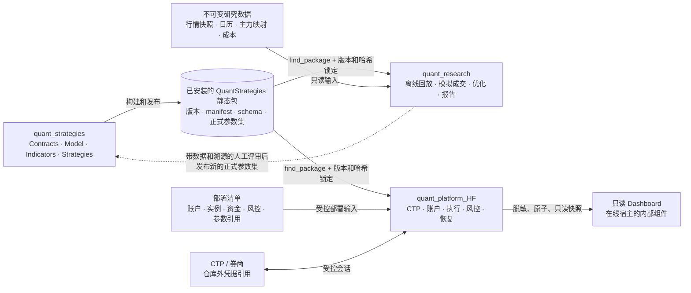

# 三项目架构和使用指南

## 适用范围和结论

本说明面向拆分后的三个独立 Git 项目：`quant_platform_HF`、`quant_strategies` 和
`quant_research`。它说明源码、构建产物、配置和数据应当归属到哪里，以及怎样在不跨越
边界的前提下使用它们。

三个项目不是三个可以相互替代的运行程序：

- `quant_strategies` 是唯一的共享 C++17 算法和参数发布包。
- `quant_research` 是离线研究宿主，负责数据、回放、优化和研究证据。
- `quant_platform_HF` 是在线交易宿主，负责账户、CTP、执行、恢复和只读监控。

本文描述的是拆分后的源码架构和使用流程，不是某一账户、某一服务器或某一策略已经通过
实盘验收的声明。构建、单元测试、回放或 Dashboard 测试成功，均不能替代上线前的账户
对账、恢复、预热、核算政策和下一交易时段验证。

当前源码锁中可见的策略包版本为 `QuantStrategies 1.1.0`，但历史部署和验证材料可能引用
不同的已发布版本。实际操作时必须以目标宿主仓的锁文件、安装包 `manifest.json` 和部署清单
为准；不要从旧部署记录或本文示例推断可用版本。

## 架构和关联图



实线表示受版本或身份约束的构建、数据或运行通道；虚线表示人工评审和发布流程，绝不表示
研究仓可以直接启动在线账户。Dashboard 不是第四个项目：它随 `quant_platform_HF` 交付，
但只能观察经过筛选的快照，不能控制交易进程。

### 责任边界

| 项目 | 唯一拥有的内容 | 消费的输入 | 输出 | 明确不应包含 |
|---|---|---|---|---|
| `quant_strategies` | 公共契约、确定性模型、指标、策略实现、参数 schema、正式参数集、策略状态格式 | 纯配置文本和由宿主注入的时钟、日志、配置读取器 | 可安装静态包、CMake 导出、manifest、schema、参数集 | CTP SDK、账户、数据库、后台工作线程、文件系统副作用、凭据、研究数据 |
| `quant_research` | 数据采集和质量检查、不可变数据快照、回放/模拟成交、优化、滚动验证、研究报告和试验参数 | 锁定的策略包、明确选择的数据、日历、历史映射、成本和试验配置 | 可审计研究产物和待评审候选 | CTP SDK、在线账户连接、在线数据库依赖、部署清单、订单权限 |
| `quant_platform_HF` | CTP 接入、账户串行调度、执行、账户和策略账本、恢复、部署实例、资金/风险限制、运行目录和只读 Dashboard | 锁定的策略包、受控部署清单、CTP/券商回调、仓库外凭据引用 | 订单/撤单请求、交易事实、恢复状态、受身份约束的私有观察快照 | 回测、参数优化、滚动验证、Arrow/Parquet 研究实现、研究数据和 Python 策略运行器 |
| 仓库外受限位置 | 密码、令牌、CTP SDK、运行状态、账户数据和大规模历史数据 | 由有权限的运行或数据流程引用 | 最小权限的文件或环境引用 | Git 历史、YAML 示例、测试日志和公开 Dashboard 输出 |

共享包的四个公开目标是 `Quant::Contracts`、`Quant::Model`、`Quant::Indicators` 和
`Quant::Strategies`。两个宿主只能消费已安装的包，不能通过兄弟仓源码目录、复制代码或
临时 include 路径建立依赖。

## 发布和变更闭环

1. 在 `quant_strategies` 修改算法、指标、schema 或正式参数集后，构建、测试并发布新的
   静态包；安装包的版本和 `manifest.json` 是唯一可消费的身份。
2. `quant_research` 和 `quant_platform_HF` 各自用 `find_package` 消费该包，并核对锁文件、
   manifest 及其列出的每个安装文件的哈希。版本号相同但 manifest 不同也必须失败。
3. 研究仓冻结数据、映射、日历、成本、策略包和试验配置后运行回放。它产生的是候选和
   证据，而不是部署授权。
4. 候选必须经过人工评审，才可在 `quant_strategies` 中形成新的正式参数集，并随新包发布。
   不允许把研究结果直接复制到在线运行目录或自动修改在线账户。
5. 在线部署清单再绑定账户、实例、资金、风险限制、策略发布版本和参数文件哈希。在线
   宿主只接受与其编译时锁定包一致的清单；校验失败时不应绕过哈希或降级为兄弟源码依赖。

这条闭环把“算法版本”和“账户部署”分开：参数变更不应直接改账户配置，账户或资金变更也
不应伪装成策略包变更。

## 通用准备

下文将策略包安装前缀写为 `QS_PREFIX`，版本写为 `QS_VERSION`。使用前先从当前目标宿主的
锁文件取得精确值，并将前缀替换为已验证安装包的根目录，例如：

```bash
QS_PREFIX=/absolute/path/to/quant-strategies-install
QS_VERSION=1.1.0  # 仅当目标宿主的锁文件也是该版本时才可使用
```

不要把本地源码检出目录直接当作 `QS_PREFIX`。宿主需要的是通过 `cmake --install` 或发布包
安装后的 CMake package 和其中的 `manifest.json`。

为使工具链说明跟随各自项目的边界，策略包和研究宿主的详细可执行指南分别维护在
`quant_strategies/docs/usage.md` 与 `quant_research/docs/usage.md`。本文件保留三项目共同
架构，以及在线宿主的操作边界。

## 项目一  quant_strategies 使用指南

### 适用任务

在这里开发和发布确定性策略逻辑、指标、参数 schema、正式参数集及状态兼容性。宿主负责
文件、网络、时间和日志适配；包本身不应读取凭据、连接 CTP 或保存运行状态。

### 构建和发布候选包

前置条件是 CMake 3.20+、GCC 11+、`yaml-cpp`，以及测试所需的 GTest。一次完整的本地
发布候选流程可以使用仓库脚本：

```bash
bash scripts/release.sh /work/build-quant-strategies "$QS_PREFIX"
```

该脚本依次执行依赖边界审计、Release 构建、CTest、安装、仓外消费者构建/运行和 CPack
打包。成功后，供宿主使用的是 `QS_PREFIX` 下的 CMake 导出、静态库、`manifest.json`、
schema、参数集和 proto；不是策略仓的源码目录。

如只需开发循环，可使用：

```bash
cmake -S . -B build -DCMAKE_INSTALL_PREFIX="$QS_PREFIX"
cmake --build build --parallel 4
ctest --test-dir build --output-on-failure
bash scripts/dependency_audit.sh
cmake --install build
```

### 发布前检查

- 算法或指标行为变化必须有回归测试，并提高适当的包版本；不能以不变版本号覆盖旧安装目录。
- 参数 schema、正式参数集和状态格式由本仓唯一拥有。破坏兼容性的状态变更必须让在线宿主
  在恢复前显式拒绝或迁移，不能丢弃带仓状态后自动开仓。
- `dependency_audit.sh` 失败时，不要以宿主适配器、CTP 头文件、文件读写或线程睡眠绕过。
  这通常说明实现应留在宿主，或需要通过注入接口表达。
- 策略包测试只证明局部数值和状态不变量；它不证明某参数可用于 SimNow 或实盘。

## 项目二  quant_research 使用指南

### 适用任务

在这里管理离线行情快照、日历、历史主力映射、费用假设、回测、优化、滚动验证和研究报告。
研究宿主可以使用 Python 做采集、校验、编排和报告，但 C++ 回放不嵌入 Python，也没有
CTP 或在线账户连接。

### 构建和测试

先安装与研究仓锁文件完全匹配的策略包，然后在研究仓运行：

```bash
cmake -S . -B build -DCMAKE_PREFIX_PATH="$QS_PREFIX"
cmake --build build --parallel 4
ctest --test-dir build --output-on-failure
bash scripts/build/dependency_audit.sh --build-dir build
```

需要原生 Parquet 或研究侧数据工具时，遵循研究仓自己的
`quant_research/docs/usage.md`。这些依赖只属于研究环境；不要在在线宿主打开 Arrow 开关，
也不要用 CSV 冒充 Parquet 输入。

### 首次安全运行

先使用仓库提供的明确标记为合成数据的 Bar 样例。输出目录必须是新的目录：

```bash
RUN_DIR=runtime/synthetic_bar_example
python3 scripts/build/create_bar_example.py \
  --strategy-data "$QS_PREFIX/share/quant_strategies/$QS_VERSION" \
  --output "$RUN_DIR"
build/bar_backtest_cli --config "$RUN_DIR/experiment.json"
```

该例子只验证回放机制，不能用于判断策略收益或数据覆盖。真实研究开始前，应冻结并记录：

- 所选产品和实际交割合约，而不是用今天的主力合约补历史；
- 覆盖期间的带日期交易日历和历史主力映射；
- 原始/标准化数据、成本、策略包、schema、参数集和运行配置的哈希；
- 输出目录和 run manifest。已有结果目录不应覆盖写入。

研究结果只能作为候选和证据。若需要推广参数，提交带数据来源、时间范围、成本假设、包版本和
结果说明的评审，然后由 `quant_strategies` 发布正式参数集。不要向在线宿主发送订单、凭据或
直接修改部署清单。

## 项目三  quant_platform_HF 使用指南

### 适用任务

这是在线交易宿主：一个账户一个进程，连接 CTP，执行订单，维护账户实际账和策略经济账，
恢复交易事实，并生成供只读 Dashboard 使用的受限观察快照。它只消费策略包，不包含研究仓
的回测/优化/滚动模块；Arrow/Parquet 研究构建在这里会被明确拒绝。

### 构建和边界验证

先安装目标锁定的策略包，再运行：

```bash
cmake -S . -B build \
  -DQUANT_HFT_BUILD_TESTS=ON \
  -DCMAKE_PREFIX_PATH="$QS_PREFIX"
cmake --build build --parallel
ctest --test-dir build --no-tests=error --output-on-failure
bash scripts/build/dependency_audit.sh --build-dir build
bash scripts/build/repo_purity_check.sh --repo-root .
bash scripts/build/doc_purity_check.sh --repo-root .
bash scripts/build/three_project_boundary_check.sh --build-dir build
```

如果需要真实 CTP SDK，额外在隔离的在线构建中指定
`-DQUANT_HFT_ENABLE_CTP_REAL_API=ON -DCTP_V6711_DIR=/external/sdk/path`。SDK、账户
凭据和运行目录必须留在仓库外；不要把它们复制进示例 YAML、测试或发布包。

### 无副作用的部署清单预检

根据 `configs/deploy/instances.example.yaml` 在受限位置创建部署清单，而不是修改示例文件。
先运行以下检查：

```bash
build/quant_config_cli validate /restricted/deployment.yaml
build/quant_config_cli resolve /restricted/deployment.yaml /review/resolved-deployment.json
build/quant_config_cli list /restricted/deployment.yaml
```

`validate` 和 `list` 不读取凭据内容；`resolve` 会生成一个原先不存在的、无秘密的解析结果，
因此应把输出路径放在评审目录。它们检查账户/实例唯一性、参数 schema、策略包和 manifest
哈希、资金引用及风险绑定，但不等价于已连接柜台或已具备交易许可。

对 SimNow 会话，可以在已经受控配置的主机上运行监督预检：

```bash
QUANT_HFT_DEPLOYMENT_FILE=/restricted/deployment.yaml \
QUANT_HFT_DEPLOYMENT_ACCOUNT=simnow_a \
QUANT_HFT_BIN_DIR="$PWD/build" \
bash scripts/ops/run_account_supervisor.sh --check-only
```

该检查不会连接柜台，但会校验本机主机名、受限凭据引用和会话调度。它不得打印或上传凭据。
若当前账户已有仓位，预检也不应作为手工平仓、撤单或发送测试订单的理由。

### 实际启动的控制点

`quant_config_cli launch` 和不带 `--dry-run` 的 `quant_config_cli supervise` 都是实际启动入口，
不是测试命令。仅当以下条件全部满足时，才应由获授权的运维流程调用它们：

- 目标账户、活动主机、策略包版本、参数集、资金和风险限制已经由部署清单和解析结果复核；
- 凭据文件只由运行用户拥有且权限为 `0600`，其内容只含必要的 CTP 环境变量；
- 恢复、订单/成交/持仓对账、核算政策、会话日历和预热门禁均已通过；
- 运行窗口、回滚方案和既有持仓处理已明确。除非获得明确指示，不强平、不撤单、不发送测试单。

上线命令、systemd 模板、会话监督和回滚步骤应使用本仓发布包及运维文档执行；不要因为本地
构建或 Dashboard 正常而重启正在交易的服务。

### 在线宿主中的只读 Dashboard

Dashboard 是在线宿主的观察组件，不是订单界面。前端本地开发和验证可在
`web/dashboard` 中进行：

```bash
cd web/dashboard
npm ci
npm run build
npm test
npx playwright install chromium
npm run test:e2e
```

生产发布必须经独立的 `dashboard_publish_cli`、认证和最小权限 ACL 完成。发布器只能从选定的
运行根读取身份绑定的私有快照/WAL，再原子写入脱敏的公共 JSON；它不连接 CTP、不下单、不
撤单、不改变交易许可，也不应重启交易进程。数据协议和安装/回滚流程分别见
[`dashboard_data_contract.md`](../ops/dashboard_data_contract.md) 和
[`tencent_dashboard.md`](../ops/tencent_dashboard.md)。

## 验证结果应如何解读

| 检查 | 能证明什么 | 不能证明什么 |
|---|---|---|
| 策略包 CTest、消费者测试、依赖审计 | 包可被独立消费，局部算法和边界检查通过 | 某策略在真实账户可用，或任何历史参数可盈利 |
| 研究 CTest/Pytest、合成 Bar 样例、格式一致性检查 | 回放和数据处理的机械语义可复现 | 数据全覆盖、真实撮合质量、SimNow 或实盘验收 |
| 在线构建、CTest、三项目边界检查和部署清单解析 | 在线源码未重新混入研究模块，锁定包和清单引用可被验证 | CTP 已连接、恢复完成、账户已 Ready 或可安全开仓 |
| Dashboard 前端/发布器测试 | 只读数据协议、页面和最小权限发布逻辑 | 交易进程健康、资金正确性或线上服务已经更新 |

## 变更应放在哪里

| 需要修改的内容 | 应修改的项目 | 后续动作 |
|---|---|---|
| 指标公式、策略行为、参数 schema、正式参数集、策略状态格式 | `quant_strategies` | 发布新包，更新两个宿主的锁和验证记录 |
| 数据采集、日历/映射 QA、模拟成交、回测、优化、滚动验证、研究报告 | `quant_research` | 固化数据和 run manifest；候选经评审后再推广 |
| CTP、账户、部署、资金、在线风控、恢复、运行目录、只读 Dashboard | `quant_platform_HF` | 做受控构建/预检；线上变更另走运维和回滚流程 |
| 密码、token、CTP SDK、真实运行数据 | 仓库外的受限位置 | 仅保存引用和最小必要的审计证据，禁止提交 |

这套划分的核心约束是：共享算法只通过可验证的发布包前进，研究只通过可审计的候选前进，
账户运行只通过受控部署清单前进。任何绕过其中一层的“方便”做法，都会重新把研究、算法和
在线账户耦合回同一个不可审计的系统。
